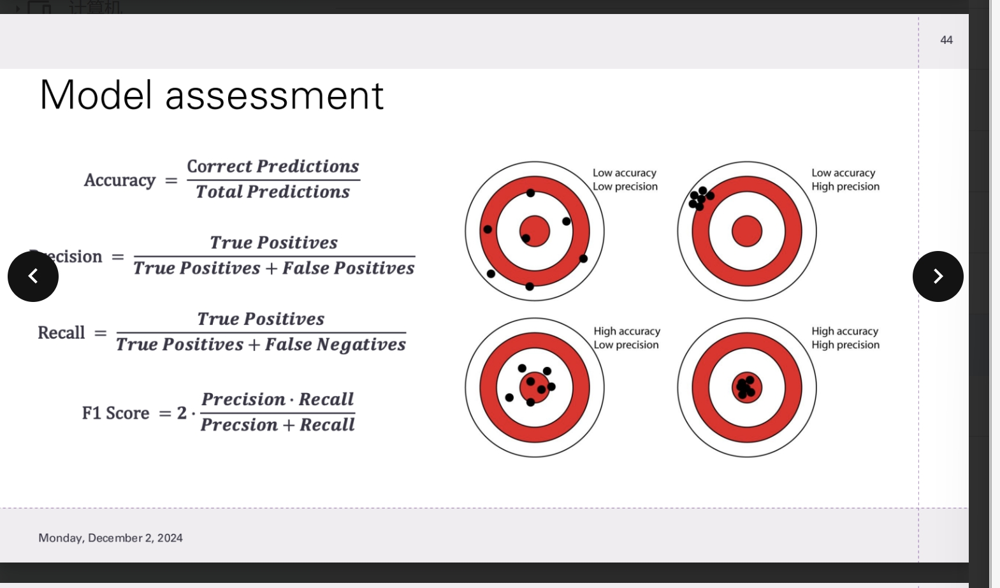

## overview
In machine learning, we use data to train a untrained model, or use a trained model for predictions

### data:
#### discrete data:

Discrete data consists of distinct, separate values, often whole number, that are countable and not continuous

#### continuous data:

a type of quantitative data that can take on any value with a given range. Unlike discrete data, continuous data is not restricted to specific, fixed values

## machine learning

- supervised
- unsupervised
### supervised:
in supervised learning, we use a dataset to learn to predict a target label

the Input is A dataset of labelled exampels ($x_i,y_i$)

the Output is a prediction that is close to the target label

#### linear regression(continous):

$y = mx + c$

$m = \frac{\sum(x_i-\bar{x})(y_i-\bar{y})}{\sum(x_i-\bar{x})^2}$

$c = \bar{y} - m\bullet\bar{x}$

#### logistic regression(discrete)

$p = \frac{1}{1 + e^{-(b_0 + b_1x)}}$

### unsupervised
#### k-clustering

$WCSS = \sum_{i=1}^K\sum_{x\in C_i}||x-\mu_i||^2$

## Preparation of data:

- Data collection
- Data cleaning
- feature engineering
- Normalisation
- Data splitting

### Feature Engineering

THis involves creating new feature from the data that will more accuratly represent patterns and relationships in the dataset

it can help the model make better predictions

Moving averages can smooth out noise, allowing the model to detect momentum changes easier

lagged features (returns from ~5 previous periods) allow us to incorporate time-series dynamics into out model and prediction

### Normalise:

##### Why:

- Improved Algorithm Performance:
	Many machine learning algorithms are sensitive to the scale of features. Features with larger
	scales can dominate the learning process, leading to biased results.
- Faster Convergence:
	Scaling helps gradient-based optimization methods (like in neural networks or logistic
regression) converge faster by making the landscape smoother.
- Distance-based Algorithms:
	Algorithms like K-Means clustering rely on distance metrics (e.g., Euclidean distance).
Normalization ensures that features contribute equally to the distance calculation.
- Prevention of Numerical Instabilities:
	Features with vastly different scales can lead to numerical issues during computation.

##### Types of Normalisation techniquess
- Min-Max Scaler
	Rescales the feature values to a range of [0, 1] or [-1, 1]

- Standardization (Z-Score Normalization):
	Centers the data around 0 with a standard deviation of 1

- Log Transformation:
	Applies a logarithmic function to compress the range of feature values.

- L2 Normalization (Vector Scaling):
	Scales feature vectors so that the Euclidean norm (L2 norm) of the vector is 1.

