---
level: Imperial
---
---

level: Imperial

---

---


level: Imperial


---


---



encrypt_content:



  level: Imperial



  password: Raymond#1234



  username: hg1523



level: Imperial



---



# Data representation:



consider any number to be $d_nd_{n-1}d_{n-2}\dots d_0$







for decimal number we have $\sum_{k=0}^{n}d_k*10^k$



## Binary numbers:



since computers only compute patterns of 0 and 1,to represent data within a computer, we need to code it as binary pattern







for binary we have $\sum_{k=0}^{n}d_k*2$







### converting Decimal to Binary



for example 98







|    | Quotient|Remainder|



|---|---|---|



|98 $\div$ 2| 49| 0|



|49 $\div$ 2| 24| 1|



|24 $\div$ 2| 12| 0|



|12 $\div$ 2| 6 | 0|



| 6 $\div$ 2| 3 | 0|



| 3 $\div$ 2| 1 | 1|



| 1 $\div$ 2| 0 | 1|







$98_{10} = 1100010_2$







## Octal(base 8)



- Used in the past as a more convenient base for representing long binary values



- as $2^3 = 8$, converting 8-based to binary is much more simpler to convert into binary



- - for example: $357_8 = 011,101,111_2$   







## Hexademical(Base 16)



- Used to represent long binary values



- - Preferred over Octal



- - similar to Octal



  - for example: $94_{16} = 1001,0100_2$







## some tables:



$\begin{array}y\text{Hex}     & 0 & 1 & 2 & 3 & 4 & 5 & 6 & 7 & 8 & 9 & A & B & C & D & E & F\\



\hline



\text{Decimal} & 0 & 1 & 2 & 3 & 4 & 5 & 6 & 7 & 8 & 9 & 10 & 11 & 12 & 13 & 14 & 15 \\



\hline



\text{Binary}  & 0 & 1 & 10 & 11 & 100 & 101 & 110 & 111 & 1000 & 1001 & 1010 & 1011 & 1100 & 1101 & 1110 & 1111



\end{array}$







for exmaple $14_{10} = 16_{8} = 24_{5} = 112_{3} = 1110_{2}$







generally:







$\begin{array}{c|c|c}



 & 1\text{byte} = & 8\text{binary digits} = & 2\text{hexadecimal digits}\\



 \hline



 1\text{word} & 2\text{byte} = & 16\text{binary digits} = & 4\text{hexadecimal digits}\\



 \hline



 1\text{long word} & 4\text{byte} = & 32\text{binary digits} = & 8\text{hexadecimal digits}



\end{array}$



## operations



### addition of base n



using base-8 as an example(psydo code)



- Addition $A_R+B_R$



- $While$ digits remain to be added



- - Add currentdigits of A and B



  - $If$ SUM is less than R



  - - $then$ record SUM



  - $Otherwise$



  - - record difference SUM - R



    - add (carry) 1 to the next colum



- $End \text{ }while $







$\begin{array}



\text{} & 5 & 7 & 6_8\\



+& 6 & 3 & 4_8\\



\hline



1& 4 & 3 & 2



\end{array}$







### subtraction of base n



using base-8 as an example(psydo code)







- Addition $A_R-B_R$



- $While$ digits remain to be subtracted



  - $If$ digitof(A)$\ge$digitof(B)



  - - $then$ record A-B



  - $Otherwise$



  - - record (R+A)-B



    - $subtract$ 1 from digits to A's left(or add 1 to digts to B's left)



- $End \text{ }while $



  



$\begin{array}



\text{} & 5 & 7 & 6_8\\



-& 6 & 3 & 4_8\\



\hline



1& 4 & 3 & 2



\end{array}$







### multiplication of base n



using binary as an example







$\begin{array}



aA & \text{} & \text{} & \text{} & 1 & 1 & 1 & 0 & 1\\



B & \text{} & \text{} & \text{} & \text{} & \times & 1 & 1 & 1\\



\text{} & \text{} & 1 & 1 & 1 & 0 & 1 & 1 & 1\\



\text{} & \text{} & \text{} & 1 & 1 & 1 & 0 & 1 & 0\\



\text{} & \text{} & \text{} & \text{} & 1 & 1 & 1 & 0 & 1\\



\hline



\text{Answer} & 1 & 1 & 0 & 0 & 1 & 0 & 1 & 1\\



\text{Carry} & 1 & 10 & 10 & 1 & 1



\end{array}$







### division of base n



using binary as an example







$\frac{\text{dividend}}{\text{divisor}} = \text{quotient} + \frac{\text{remainder}}{\text{divisor}}$







$\begin{array}{l}



\begin{array}{l}



\text{Quotient->}\\



11001\\



\text{}\\



\text{}\\



\text{}\\



\text{}\\



\text{}\\



\text{}\\



\text{}\\



\text{Remainder->}



\end{array} & 



\begin{array}



\text{} & \text{} & \text{} & \text{} & \text{} & 1 & 0 & 1 & 1 & 1\\



\hline



| & 1 & 0 & 0 & 0 & 1 & 1 & 1 & 1 & 1 & 1\\



\text{} &\text{} & 1 & 1 & 0 & 0 & 1\\



\hline



\text{} &\text{} & \text{} & 1 & 0 & 1 & 0 & 1 & 1\\



\text{} &\text{} & \text{} & \text{} & 1 & 1 & 0 & 0 & 1\\



\hline



\text{} &\text{} & \text{} & \text{} & 1 & 0 & 0 & 1 & 0 & 1\\



\text{} &\text{} & \text{} & \text{} & \text{} & 1 & 1 & 0 & 0 & 1\\



\hline



\text{} &\text{} & \text{} & \text{} & \text{} & \text{} & 1 & 1 & 0 & 0 & 1\\



\text{} &\text{} & \text{} & \text{} & \text{} & \text{} & 1 & 1 & 0 & 0 & 1\\



\hline



\text{} &\text{} & \text{} & \text{} & \text{} & \text{} & \text{} & \text{} & \text{} & \text{} & 0



\end{array}



\end{array}$



## Data representation



- In any representation, desirable properties are:



- - Only one bit-pattern per value



  - Equal number of positive and negative values



  - Maximum ranges of values



  - No gaps in the range



  - implemented economically on the hardware



### sign & magnitude option:



- Leftmost("most significant") bit represent the sign of the integer



- Remaining bits to represent its magnitude



- For n-bits $-(2^{n-1} - 1)\le \text{sign + magnitue}\le (2^{n-1}-1)$



- this is costly to implement(we need to compare signs and implement subtractors)







### One's Complement option:



- negative numbers are the complement of the positive numbers



- $-(2^{n-1} - 1)\le \text{one's complement}\le (2^{n-1}-1)$



- Less intuitive but less costly to implement







### Two's Complement option:



- this is achieved by inverting each of the bits and adding 1 to it:



- - -3(0011)$\rightarrow$1100(invert)+1$\rightarrow$ 1101



- $-2^{n-1}\le \text{two's complement}\le 2^{n-1}-1$



- since $X-Y = X+(-Y)$,we do not need to implement an additional subtractor for this



- disadvantage: Onlt one bit pattern for zero(instead of -0 and +0)



#### converting two's complement to decimal



$-b_{n-1}*2^{n-1}+\sum_{k=0}^{n-2}b_k*2^k$







for example







$\begin{aligned}



1011_{two's compliment} &= (-1*8)+(0*4)+(1*2)+(1*1)\\



&= -8+2+1\\



&=-5



\end{aligned}$







### Excess -n option:



- shift the orignal range by n:



- - excess 4:



  - $\begin{array}



  a\text{Stored value} & \text{Actual value}\\



  000 & -4\\



  001 & -3\\



  010 & -2\\



  011 & -1\\



  100 &  0\\



  101 &  1\\



  110 &  2\\



  111 &  3\\



  \end{array}$



### Binary Coded Decimal(BCD)



- representing every digit of a decimal digit with a fixed number of bits,usually four or eight



- easy to understand but uses more memory



- for example:$9876510_{10} = 1001,1000,0111,0110,0101,0001,0000_{BCD}$



### Summary:



|Bit Pattern|0000|0001|0010|0011|0100|0101|0110|0111|1000|1001|1010|1011|1100|1101|1110|1111|



|--|--|--|--|--|--|--|--|--|--|--|--|--|--|--|--|--|



|Unsigned|0|1|2|3|4|5|6|7|8|9|10|11|12|13|14|15|



|Sign+Magnitute|+0|+1|+2|+3|+4|+5|+6|+7|-0|-1|-2|-3|-4|-5|-6|-7|



|1's complement|+0|+1|+2|+3|+4|+5|+6|+7|-7|-6|-5|-4|-3|-2|-1|-0|



|2's complement|+0|+1|+2|+3|+4|+5|+6|+7|+8|-7|-6|-5|-4|-3|-2|-1|



|Excess-8|-8|-7|-6|-5|-4|-3|-2|-1|0|1|2|3|4|5|6|7|



|BCD|0|1|2|3|4|5|6|7|8|9|-|-|-|-|-|-|







## overflow rule:



overflow means that we the result is greater then the storage space, it will omit the first digit







for example(4-bit, two's complement)







$\begin{array}{l}



(-7) & \text{} & 1001\\



+(-6) & \text{} & 1010\\



\hline



(+3) & 1 & 0011



\end{array}$







overflow in addtion and subtraction is only achieved by add to positive or subtracting two negatives



## characters



- characters are mapped to bit patterns



- Common mappings are ASCII and Unicode}$











# Floating Point Numbers



## how it is defined:



$\begin{array}{c}



M \times 10^E & \text{decimal}\\



M \times 2^E & \text{Binary}



\end{array}$







where:



- M is the coefficient(aka. significand, fraction or mantissa),determines the range



- E is the exponent(aka. characteristic),determine precision



- 10(or for binary 2) is the radix(aka. base)







## Real & floating point numbers



| |Mathematical real|floating point number|



|--|--|--|



|Range|$-\infty\dots+\infty$| Finite|



|No.of values|(Uncountably) infinte| Finte|



|Spacing|?|Gap between numbers varies|



|Errors|?| Incorrect results are possible|







## Zones of expressibility:



assume signed 3-digit coefficient and signed 2-digit exponent







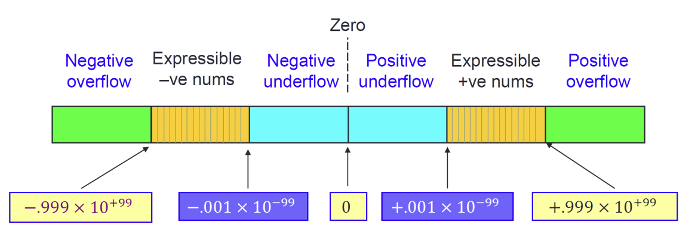







## Normalization:



since floating point numbers can have multiple forms







$\begin{aligned}



0.023 \times 10^4&=0.230\times 10^3\\



&= 2.3\times 10^2\\



&= 0.0023\times 10^5



\end{aligned}$







we normalize the coefficient for base-R to be $ [1,\dots,R]$







eg.







$23.2\times 10^4\longrightarrow_{normalization} 2.32\times 10^5$







$100.01\times 2^1\longrightarrow_{normalization} 1.0001\times 2^3$







## Binary fractions to Decimal fractions:



|Binary|Decimal|



|--|--|



|0.1|0.5|



|0.01|0.25|



|0.101|0.625|







for example: binary value 0.01101







| |$2^{-1}$|$2^{-2}$|$2^{-3}$|$2^{-4}$|$2^{-5}$|



|--|--|-|-|-|-|



|.|0|1|1|0|1|







$\frac{1}{4} + \frac{1}{8} + \frac{1}{32} = \frac{13}{32} = 0.40625$







## Truncation and rounding



For may computations, the result is too large to store







for example:



$(2.3\times 10^1)\times(2.3\times 10^1) = 5.29\times 10^2$







- Truncation:$5.2\times 10^2$(biased error)



- Rounding:$5.3\times 10^3$(unbiased error)







## Comparing floating point values:



floating numbers produce inexact results, therefore, comparing floating point values should account for close results







If we know the desired magnitute and precision of results, we can adjust for closeness(epsilon). For example:







$\begin{array}



aa = b & (b-\epsilon)<a<(b+\epsilon)\\



a = 1 & 1-0.000005 < a < 1+ 0.000005



\end{array}$







## IEEE floating point standard



a comprehensive standard for binary floating point arthmetic







Standard defines



- Format of binary floating point numbers, i.e.how the fields are stored in memory



- Semantics of arthmetic operation



- Rules for error conditions







## Single precision format(32-bit)







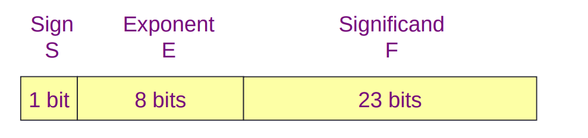







- Coefficient is called the significand in the IEEE standard



- Value represented is $+1.F\times 2^{E-127}$



- The normal bit(the 1.) is omitted from the significand field(a hidden bit)



- Single precision yields 24bits(approx. 7decimal digits of precision)



- Normalised ranges in decimal are approximately$[-10^{-38},-10^{-38}]\cup [10^{38}, 10^{-38}]\cup {0}$







## Exponent field



- In the IEEE standard, exponents are stored as excess values instead of 2's complement















## Double precision format(64-bit)



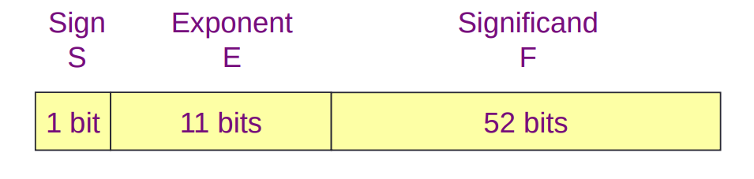







- Value represented is $+1.F\times 2^{E-1023}$



- Double precision yields 53 bits(approx. 16 decimal digits of precision)



- Normalised ranges in decimal are approximately $[-10^{-308},-10^{-308}]\cup [10^{308}, 10^{-308}]\cup {0}$



- Single precision has advantage for using less memory, while Double precision is more precise











     







## conversion to IEEE format



for example 42.6875 in single precision format







  1. convert to binary number: $42.6875 = 101010.1011$



  2. Normalise: $1.010101011\times 2^5$



  3. Significand field is thus $0101\text{ }0101\text{ }1000\text{ }0000\text{ }0000\text{ }0000$



  4. Exponent field is $(5 + 127 = 132): 1000\text{ }0100$



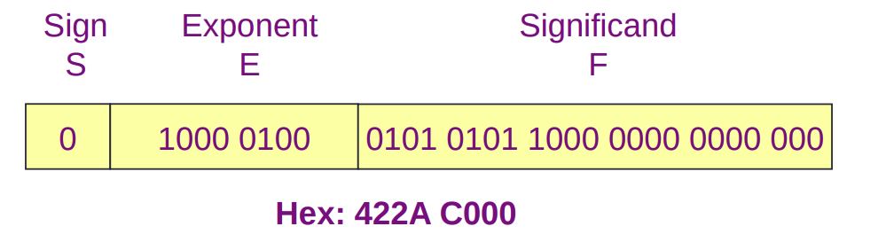























## conversion from IEEE format



example BEC0 0000



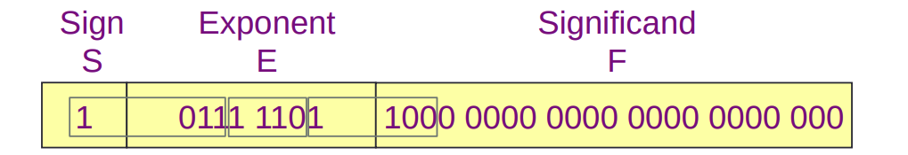







  1. Exponent field : $0111\text{ }1101 = 125$



  2. True binary exponent: $125-127 = -2$



  3. Sigificand field + hidden bit: $1.1000\text{ }0000\text{ }0000\text{ }0000\text{ }0000\text{ }0000$



  4. So unsigned values is $\begin{array}11.1\times 2^{-2} = 0.011 &\text{(binary)}\\=0.25 + 0.125 = 0.375\end{array}$



  5. add sign$-0.375$







## addition



example $42.6875 + 0.375$







|Number|Sign|Exponent|Significand|



|--|--|--|--|



|42.6875|0|1000 0100| 0101 0101 1000 0000 0000 000|



|0.375|0|0111 1101|1000 0000 0000 0000 0000 000|







- To add these numbers, we first make the exponent the same(make the smaller exponent equal to the larger by shifting the significand accordingly)



- Note: must restore hidden bit when carrying out floating point operations



  $\begin{array}a\text{Significand of larger no.} & 1.0101\text{ }0101\text{ }1000\text{ }0000\text{ }0000\\



  \text{Significand of smaller no.} & 1.1000\text{ }0000\text{ }0000\text{ }0000\text{ }0000



  \end{array}$



- Exponents differ by 7 so shift binery point of smaller no.7 places to the left



  $\begin{array}a\text{Significand of larger no.} & 1.0101\text{ }0101\text{ }1000\text{ }0000\text{ }0000\\



  \text{Significand of smaller no.} & 1.1000\text{ }0000\text{ }0000\text{ }0000\text{ }0000\\



  \text{Significand of sum} & 1.0101\text{ }1000\text{ }1000\text{ }0000\text{ }0000\text{ }000



  \end{array}$



- so sum is $1.0101\text{ }1000, 1\times2^5 = 10\text{ }1011.0001=43.0625$







|Number|Sign|Exponent|Significand|



|--|--|--|--|



|42.6875|0|1000 0100| 0101 0101 1000 0000 0000 000|



|0.375|0|0111 1101|1000 0000 0000 0000 0000 000|



|43.0625|0|1000 0100|0101 1000 1000 0000 0000 000|







## Special values:



- IEEE formats can encode five kinds of values:zero, normalizsed numbers, denormalised numbers, infinity and not-a-number(NaNs)



- single precision representations



  



|IEEE value| Sign field| Exponent | Significand | True exponent|



|--|--|--|--|--|



|$\pm 0$|0 or 1| 0 | (all zeros)| |



|$\pm$ denormalised no.| 0 or 1| 0 | Any non-zero bit pattern| -126|



|$\pm$ normalised no.| 0 or 1|1...254| Any bit pattern| -126...127|



|$\pm\infty$|0 or 1| 255 | 0(all zeros)|



|Not-a-number|0 or 1| 255| Any non-zero pattern| |







### Denormalised numbers:



- An all zero exponent is used to represent both zero and denormalised numbers



- An all one exponent is used to represent infinites and Nans



- Means range for normalised numbers is reduced, for single precision the exponent range is $-126...127$ rather than $-127...128$



- Denormalised numbers represent values between the underflow limits and zero, i.e. for single precision we have $\pm 0.F\times 2^{-126}$



- Allows a more gradual shift to zero















# Boolean values



Propositions can be compounded by the means of operators AND, OR and NOT



## Diagrammatic Representation



if (Rain & Bad Weather Forecas) = Take Umbrella



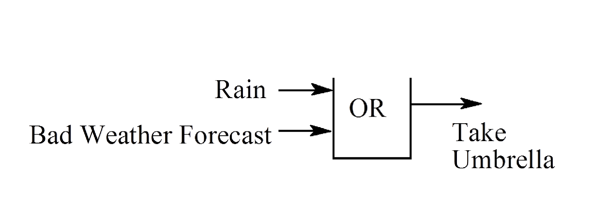



## Truth table



propositions can only take two values, we could list all the possible results







|Raining|Bad Forecast|Umbrella|



|--|--|--|



|False|False|False|



|False|True|True|



|True|False|True|



|True|True|True|







## Boolean Algebra



- the truth values are replace by 0 for False and 1 for True



- Propositions are replaced by variables



- Operators are replaced by symbols: '= Not, += Or $\bullet$=AND







## Boolean Algebra rules:



Associative:



- $(A\bullet B)\bullet C = A\bullet (B\bullet C)$



  



- $(A+B)+C = A+(B+C)$



  



Commutative



- $A\bullet B = B\bullet A$



  



- $A+B = B+A$







Distributive



- $A\bullet (B+C) = A\bullet B + A\bullet C$



  



- $A+(B\bullet C) = (A+B)\bullet (A+C)$



  



Idempotent



- $A\bullet A = A$



  



- $A+A = A$



  



fixed values:



- $A\bullet 0 = 0$



- $A\bullet 1 = A$



- $A + 0 = A$



- $A + 1 = 1$







De Morgan's theorem



- $(A+B)' = A'\bullet B'$



- $(A\bullet B') = A' + B'$



- this also holds true for any number of terms







# boolean functions and gates:



## Schematic representation



- and:$A+B$







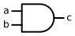



    



- or $A\bullet B$



  



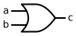



    



- not $A'$







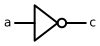



    



- NAND $(A+B)'$







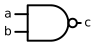



    



- nor $(A\bullet B)'$











    



- xor $(A'\bullet B) + (A\bullet B')$















this is equivalent to 



    



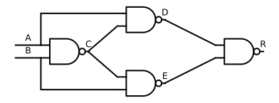



    



- xnor $(A'\bullet B') + (A\bullet B)$











    



# The Canonical forms of Combinational circuits and their minimisation



## Combinational Circuits



The variable on the RHS are not on the LHS







$R = (A+R)$ is not combinational







## Canonical



### Minterms



eg. $R = A\bullet B\bullet C +A\bullet B'\bullet C' + A'\bullet B\bullet C$







### Maxterms



eg. $R = (A'+B+C)\bullet(A'+B'+C')\bullet(A'+B+C)$







### example:



$\begin{array}{|c|c|c|c|c|}



\hline



A & B & C & R & \text{}\\



\hline



0 & 0 & 0 & 0 & \text{Maxterm }A+B+C\\



\hline



0 & 0 & 1 & 0 & \text{Maxterm }A+B+C'\\



\hline



0 & 1 & 0 & 0 & \text{Maxterm }A+B'+C\\



\hline



0 & 1 & 1 & 1 & \text{Minterm }A'\bullet B\bullet C\\



\hline



1 & 0 & 0 & 0 & \text{Maxterm }A'+B+C\\



\hline



1 & 0 & 1 & 1 & \text{Minterm }A\bullet B'\bullet C\\



\hline



1 & 1 & 0 & 1 & \text{Minterm }A\bullet B\bullet C'\\



\hline



1 & 1 & 1 & 1 & \text{Minterm }A\bullet B\bullet C\\



\hline



\end{array}$







## Karnaugh Map



    



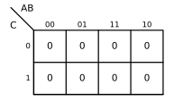







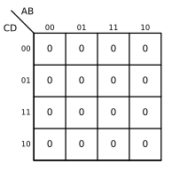







### circles on the karnaugh map







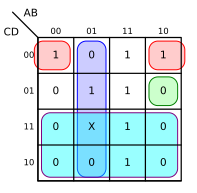



    



### Dont care:



we dont care about the value, can be 1 or 0. represented by X







# Combinatorial Circuit Design



## What to do:



Given a curcuit







- find its truth table



Given a Boolean equation







- simplify it







## Synthesis by Minterms







for example:







$\begin{array}{ccc|c}



A & B & C & R & \text{}\\



0 & 0 & 0 & 0 & \text{Minterms}\\



0 & 1 & 0 & 0 & \text{}\\



0 & 1 & 1 & 1 & \text{Minterms}\\



1 & 0 & 0 & 0 & \text{}\\



1 & 0 & 1 & 1 & \text{Minterms}\\



1 & 1 & 0 & 1 & \text{Minterms}\\



1 & 1 & 1 & 1 & \text{Minterms}



\end{array}\Rightarrow R = \begin{array}aA'\bullet B'\bullet C +\\ A'\bullet B' \bullet C +\\ A \bullet B' \bullet C +\\ A\bullet B \bullet C' +\\ A\bullet B \bullet C\end{array} \Rightarrow R = (A\bullet B)" + (A\bullet B)'\bullet C$







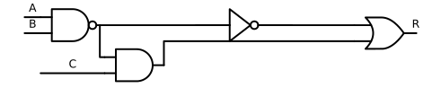



    



similarly, we could also do this in Maxterms







# Time-dependent Behavior of Digital Circuits with Feedback



## A curios circuit:







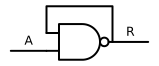



    



model like this has unpredictable behavior, therefore, we must go down to the physical level







## Quasi-Physical Models







- Switch and Delay







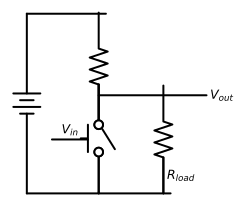



    



- Resistance and Capicitance







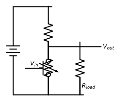







for switch and delay model: this only has a delay in time







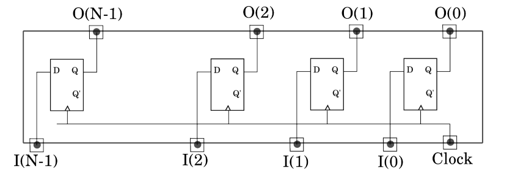







for the resistance capacitance model











it changes smoothly, we no longer have a valid boolean signal when it is changing from 0 to 1







therefore we have







$\begin{array}{c|c}



\text{NOW} & \text{NEXT}\\



\begin{array}



aA & R\\



0 & 0\\



0 & 1\\



1 & 0\\



1 & 1\\



\end{array}



&



\begin{array}



aA & R\\



0 & 1\\



0 & 1\\



1 & 1\\



1 & 0



\end{array}



\end{array}$







the circuit is not stable















# Sequential Circuits and Flip-Flops



## Flip-Flops







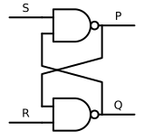







- assume $S = 1$ and $R =1$ $U$ stands for unknown







$\begin{array}{ccc}



\text{ } & t & t + t_d & t + 2t_d \\



S & 1 & 1 & 1\\



R & 1 & 1 & 1\\



P & U & U & U\\



Q & U & U & U



\end{array}$







- assume $S = 0$ and $R = 1$







$\begin{array}{ccc}



\text{ } & t & t + t_d & t + 2t_d \\



S & 0 & 0 & 0\\



R & 1 & 1 & 1\\



P & U & 1 & 1\\



Q & U & U & 0



\end{array}$







we can get 







$\begin{array}{cc|cc}



S & R & P_t & Q_t\\



0 & 0 & 1 & 1\\



0 & 1 & 1 & 0\\



1 & 0 & 0 & 1\\



1 & 1 & U & U



\end{array}$







and







$\begin{array}{c|c|c}



\begin{array}{c}



\text{NOW}\\



\hline



\begin{array}{cc|cc}



S & R & P_t & Q_t\\



1 & 1 & 0 & 0\\



1 & 1 & 0 & 1\\



1 & 1 & 1 & 0\\



1 & 1 & 1 & 1



\end{array}



\end{array}



&



\begin{array}{c}



\text{NEXT}\\



\hline



\begin{array}{cc}



P_{t+1} & Q_{t+1}\\



1 & 1\\



0 & 1\\



1 & 0\\



0 & 0



\end{array}



\end{array}



&



\begin{array}



\text{ }\\



\text{ }\\



\text{Unstable}\\



\text{stable}\\



\text{stable}\\



\text{Unstable}



\end{array}



\end{array}$







because of the time delay in practise, we do not know what the stable state is







## some keywords







- Combinatorial: output is a combination of only inputs



- Sequential: output is a combination of inputs and outputs



- - Asynchronous: the circuit will have correct value after undefined amount of time



- - Synchronous: the circuit will have correct value after defined amount of time







## The D-type Latch(D-type Flip-Flop)



    



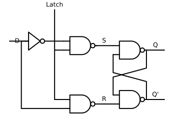







which is equivalent to



    



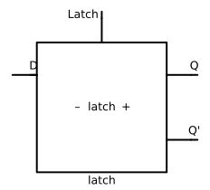



    



for latch, we have







$\begin{array}{cc|cc}



D & \text{Latch} & Q & Q'\\



0 & 0 & 1 & 0\\



0 & 1 & 0 & 0\\



1 & 0 & U & U\\



1 & 1 & 1 & 0



\end{array}$







## Edge Triggering



    



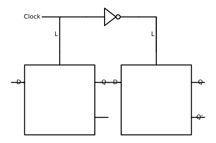







### clocks



the inputs are called clocks and are used to synchronise a sequence of operations that occur at regular intervals







# Synchronous Digital Systems



## D-Q Flip-Flop







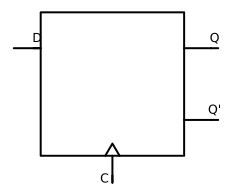







we have 







$\begin{array}



 D & C & Q & Q'\\



 0 & 0 & 1 & 0\\



 0 & 1 & 1 & 0\\



 1 & 0 & 1 & 0\\



 1 & 1 & U & U\\



\end{array}$







the last case is the same as filpflop







## J-K filpflop



    



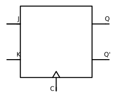















Synchronous Digital circuits have the following properties:







- The ouput only depends on the state that the circuit is in $O_j = G_j(Q_1,Q_2,\dots,Q_n)$



- The next state depends on the current state and the circuit inputs $D_k = F_k(I_1,I_2\dots I_n,Q_1,Q_2,\dots Q_n)$







## Synchronous Binary Counters







this kind of circuit has no input but a clock







example: we want to design a circuit that satisfies











from a Karnaugh Map:







$\begin{array}



\text{NOW} & \text{NEXT}\\



\begin{array}{cc}



Q_1 & Q_2\\



0 & 0\\



0 & 1\\



1 & 0\\



1 & 1



\end{array}



&



\begin{array}{cc}



D_1 & D_2\\



0 & 1\\



1 & 0\\



1 & 1\\



0 & 0\\



\end{array}



\end{array}$







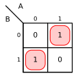



    



the figure above is $D_1 = Q_1'\bullet Q_2 + Q_1\bullet Q_2' = Q_1\oplus Q_2$



    



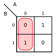







the figure above is $D_2 = Q_2'$







# Finite state machines



## The Mealey Machine



it is the general form of finte state machine















in this picture, the box D-Q is a set of flip-flop that stores the state







## The Moore Machine



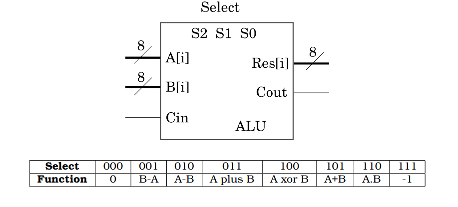











This is usaually safer as the spikes in I are blocked from reaching g







## designing finite state machines



see tutorial 4







# registers



## state registers



like we used flipflops to store the states of a finite state machine, we could also use it to store unsigned integers











note that these flipflops have the same clock, so all the flipflops will be set at one time







## parallel/serial



the difference between parallel and serial register is whether flipflop n-1's output is connected to next filpflop's input















### conversion



or more simply we could add switchs







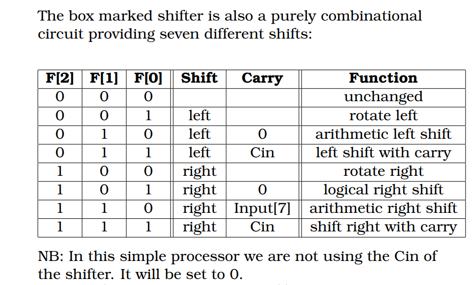







when all the switches are closed, the circuit gives a serial register







when all the switches are open, the circuit gives a parallel register







## multiplexer







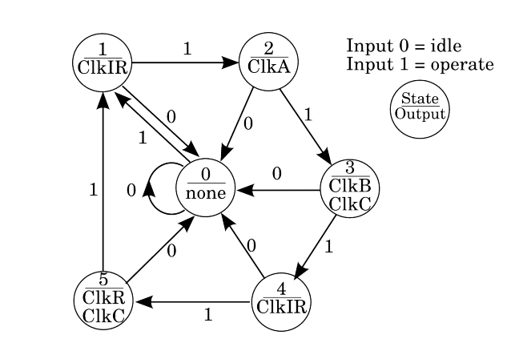







$\begin{array}{c}



\text{Control} & A & B & \text{out}\\



0 & 0 & 0 & 0\\



0 & 1 & 0 & 1\\



0 & 0 & 1 & 0\\



0 & 1 & 1 & 1\\



1 & 0 & 0 & 0\\



1 & 1 & 0 & 0\\



1 & 0 & 1 & 1\\



1 & 1 & 1 & 1



\end{array}$







## Four bit shift register







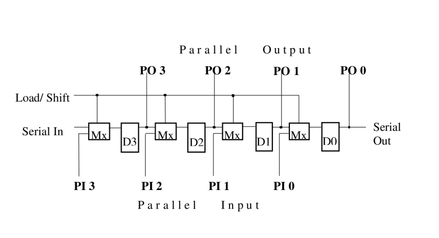







when load/shift is 0, All the PIs do not affect the final result, the circuit forms a serial circuit







when load/shift is 1, the Serial In do not affect the final result, the circuit forms a parallel circuit







## multi function registers:



### Four function shift register 



we want the circuit to have the following function:







$\begin{cases}



\begin{array}{c}



00 & \text{Hold}\\



01 & \text{Shift Right}\\



10 & \text{Shift Left}\\



11 & \text{Parallel Load}



\end{array}



\end{cases}$



we needed a 2bit binary number







#### binary to unary converter







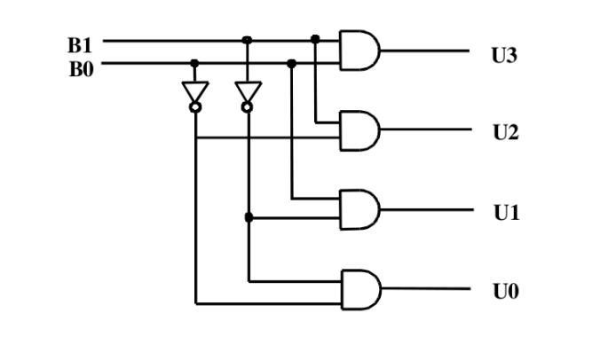







$\begin{array}{cc|cccc}



B1 & B0 & U3 & U2 & U1 & U0\\



0 & 0 & 0 & 0 & 0 & 1\\



0 & 1 & 0 & 0 & 1 & 0\\



1 & 0 & 0 & 1 & 0 & 0\\



1 & 1 & 1 & 0 & 0 & 0



\end{array}$











in this way we can let the function do multiple things







#### four way multiplexer















$\begin{array}{cc|c}



B1 & B0 & \text{out}\\



0 & 0 & A\\



0 & 1 & B\\



1 & 0 & C\\



1 & 1 & D



\end{array}$







#### the shift register







this is really straightforward







we connect the stages as follows















## clock and registers







 in some cases, say we wanted a synchronous circuit to divide by $10^6$, this would require a synchronous counter with $10^6$ state or 20 flipflops, so an alternative we want to do it divide the clock



 



### divide by powers of 2:



just implement multiple structure above







### divide by other numbers







we put an invertor at the second flipflop because $5 = 101_2$







therefore, if we want to divide by 7, we just remove the invertor







# registers, multiplexers,decoders, comparators and What nots.







## registers



as discussed ast lecture,











usually, we denote registers using 







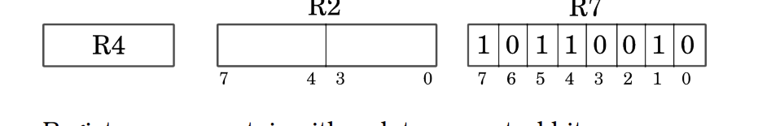







### register transfer



we want our circuit to transfer data from one register to another. or $R_{destination}\leftarrow R_{source}$











we first try to deal with selecting the Source Register







## multiplexer







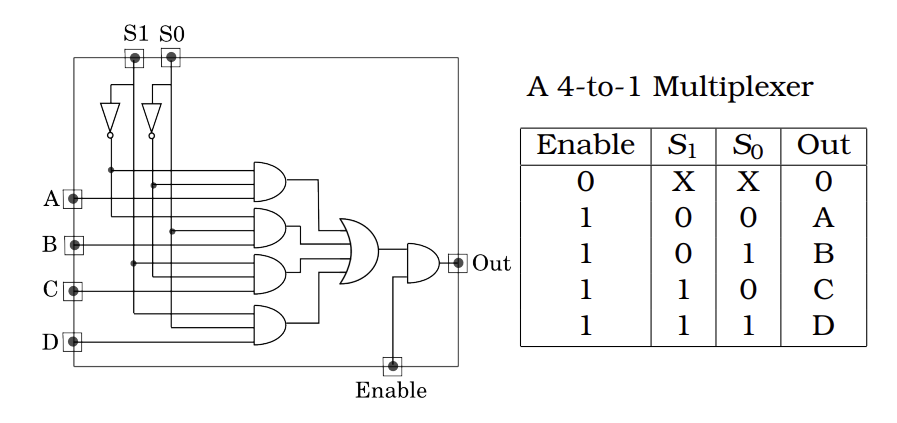



this is the 4-bit multiplexer, we can extend this to 8-bit by 







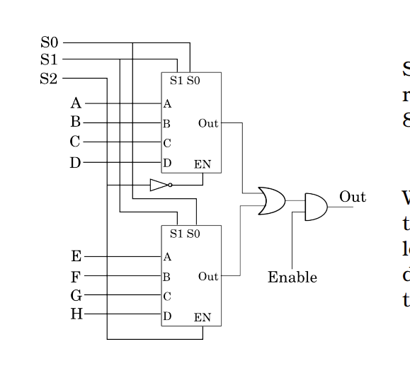







we also have demultiplexer, which is basically inverting the multiplexer







this is actually just a binary-to-unary convertor











extend this











so the final circuit looks like











## comparators



usually the As have $A_1,A_2,A_3\dots$,and same for B, 







but we simplify it to single A and B







a karaugh map does not work here, but we have







$\begin{array}{c|cc}



\text{} & \begin{array}{c}B & \text{}\\0 & 1\end{array}\\



\hline



\begin{array}{l}A & 0\\\text{ } & 1\end{array} & \begin{array}{c}A=B & A<B\\A>B & A+B\end{array}



\end{array}$











we can drop the $A<B$ output











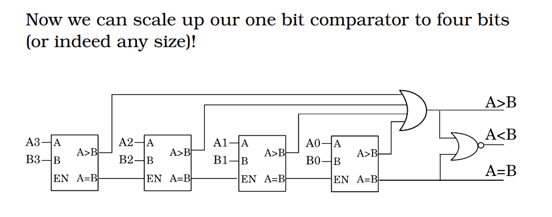







# computer arithmetic:



## addition:



to add binary digit $A$ and $B$, we have the following truth tables







$\begin{array}{cc|cc}



A & B & SUM * CARRY\\



0 & 0 & 0 & 0\\



0 & 1 & 1 & 0\\



1 & 0 & 1 & 0\\



1 & 1 & 0 & 1



\end{array}$







we have 







$SUM = A'\bullet B + A\bullet B' = A\oplus B$







$CARRY = A\bullet B$







so we have the following structure for addition withouth carry(half adder):







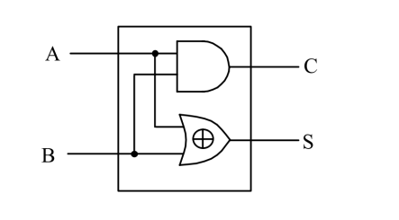







but consider the situation where we have a carry passed from to last addtion







$\begin{array}{ccc|cc}



A & B & C_{in} & SUM & C_{out}\\



0 & 0 & 0 & 0 & 0\\



0 & 0 & 1 & 1 & 0\\



0 & 1 & 0 & 1 & 0\\



0 & 1 & 1 & 0 & 1\\



1 & 0 & 0 & 1 & 0\\



1 & 0 & 1 & 0 & 1\\



1 & 1 & 0 & 0 & 1\\



1 & 1 & 1 & 1 & 1\\



\end{array}$







for sum







$SUM = A\oplus B\oplus C$



    



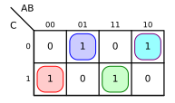







for carry:







$CARRY = C\bullet (A\oplus B) + A\bullet B$



    



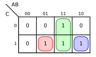







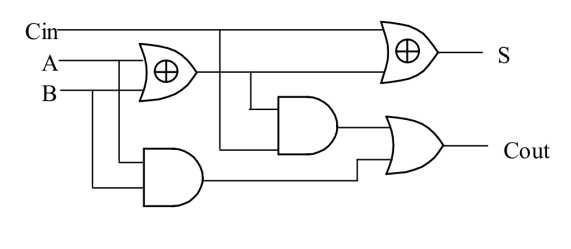







to make the circuit serial, use the structure from last last lecture







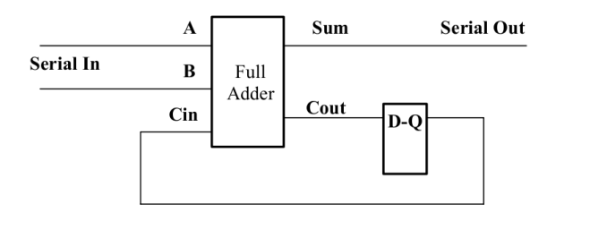



the inputs of the circuit is a stream of bits(serial bitstream adder)







or we could make it like this















notice that we do not have a carry in the first adder, so it is a half adder. the whole circuit is a N-bit full adder







## substraction



this is similar







$\begin{array}{ccc|cc}



A & B & P & DIFFERENCE & BORROW\\



0 & 0 & 0 & 0 & 0\\



0 & 0 & 1 & 1 & 1\\



0 & 1 & 0 & 1 & 1\\



0 & 1 & 1 & 0 & 1\\



1 & 0 & 0 & 1 & 0\\



1 & 0 & 1 & 0 & 0\\



1 & 1 & 0 & 0 & 0\\



1 & 1 & 1 & 1 & 1\\



\end{array}$











actually the difference column in subtraction and the sum column in additioni are the same







so $DIFFERENCE = A\oplus B\oplus P$







for borrow







$BORROW = A'\oplus(B+P) +B\bullet P$



    



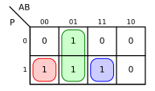







the rest are similar







notice that for the two's complement subtractor, we use the fact that subtracting a number is adding its two's complement















## multiplication:







in binary multiplication:







$A_1A_0\times B_1B_0 = A_1\times B_1\times 2^2 + A_0\times B_1\times 2 + A_1\times B_0\times 2+A_0\times B_0$







since $A_1,A_0,B_1,B_0$ are all binary digits, we can replace the multiplies with ANDs







$A_1A_0\times B_1B_0 = A_1\bullet B_1\times 2^2 + A_1\bullet B_0\times 2^1 + A_0\times B_1\times 2^1+A_0\bullet B_0$







in binary, multiply by $2^n$ means shift n digits







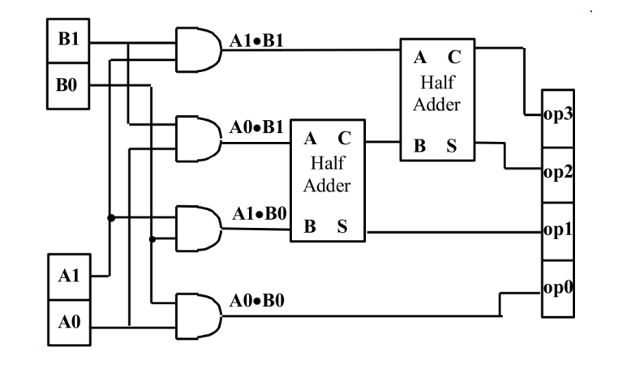







# manual processor



usually a 8-bit processor looks like this:







a processor container the following parts:







1. Registers



- Register to store the input data



- A register to store the result



- A one-bit register to store the carry(may not need)



- A register to store the instruction



2. Arthmetic Circuits



- adder



- shifter











## the ALU











we add a multiplexer in front of the ALU to enable function selection







### 8-bit



similarly, we can extend the ALU to 8-bits















## shifter



the shifter do the following







$\begin{array}



00 & \text{hold}\\



01 & \text{Shift left with carry}\\



10 & \text{Arthmetix shift right}\\



11 & \text{Rotate right}



\end{array}$















## final stuff











## Data path diagram



from the diagram above, we know that the input is 8bits, output 8bits(could be more)















blocks A and B are just simple registers











block C is a one bit register for storing carry







block MPX are multiplexers







block ALU can do a series of functions















block shifter is for providing shifts, this can be customised



















### controller:







we currently want our register to do to following things







$\begin{array}{c}IR7 & IR6 & IR5 & IR4 & IR3 & IR2 & IR1 & IR0\end{array}\\



\begin{array}{l}\text{UN} & \text{} &\text{F/ALU-SHIFT} &\text{}&\text{UN} & \text{S/R} & \text{S/C} & \text{S/A}\end{array}$











bits 0,1,2 controls the multiplexers







bits 3,7 are unused







bits 4,5,6 determine the functions of the ALU







## the execution cycle:



an instruction will take five steps to execute:



- load the IR



- load the A



- load the B and C



- load the IR



- load the RES and C







so it is a finite state machine with the following diagrams







