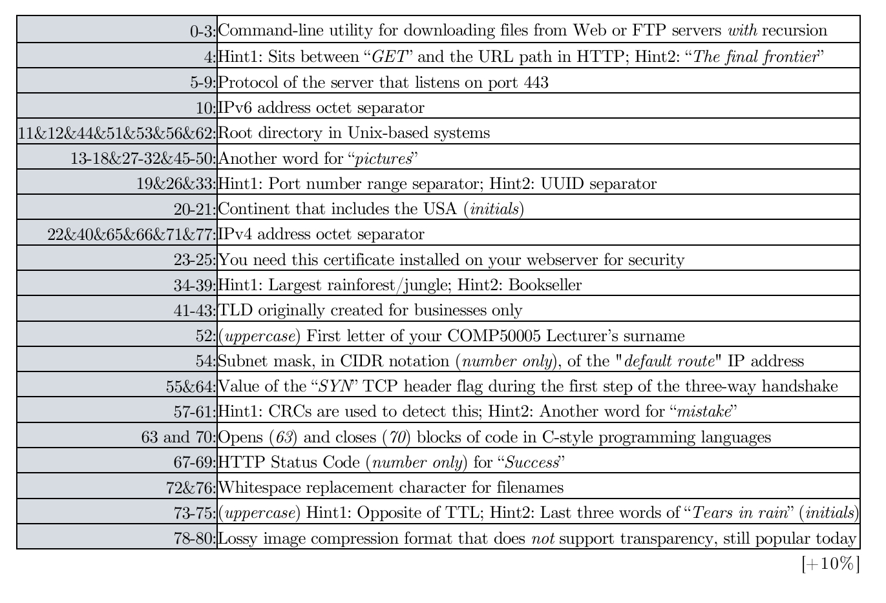

---
level: Imperial
---
---

level: Imperial

---

---


level: Imperial


---


---



encrypt_content:



  level: Imperial



  password: Raymond#1234



  username: hg1523



level: Imperial



---



# Q01







**You wish to transfer a plain-text version of the complete works of Shakespeare (5,638,516B) over the WAN using an 8Mbps connection with RTT≈88ms. Assuming zero packet loss, zero processing and queuing delay, zero overhead from headers/footers, and zero acknowledgements, calculate:**







### i)



**the utilisation of the line, and 







according to the question, we know the following values



- $L = 5638516B  = 45108128b$



- $R = 8Mbps$



- $RTT \approx 88ms$







therefore the utilisation of the line can be calculated with $\frac{\frac{L}{R}}{RTT +\frac{L}{R}} = \frac{\frac{45108128b}{8Mbps}}{88ms + \frac{45108128b}{8Mbps}} = \frac{5.638516s}{5.638516s + 0.088s} \approx 98.5\%$







### ii)



**the theoretical transfer time. (Show your typed calculations – do not scan any handwritten work). [+10%]**







the theoretical transfer time can be calculated with 







$d_{transfer} = \frac{L}{R} = \frac{45108128b}{8Mbps} = 5.638516s$







# Q02







**Retrieve the HTTP status code and headers of this webpage: http://www.example.com/index.html using telnet, and then:**







## i)



**write the telnet command that you used**







`telnet www.example.com 80`



## ii) 



**write the HTTP commands that you used, and**







```



GET /index.html HTML/1.1



Host: www.example.com



```







## iii) 



**copy/paste into your report the headers and status code that were returned by the server. [+10%]**







```



HTTP/1.1 200 OK



Content-Type: text/html



ETag: "84238dfc8092e5d9c0dac8ef93371a07:1736799080.121134"



Last-Modified: Mon, 13 Jan 2025 20:11:20 GMT



Cache-Control: max-age=606



Date: Mon, 17 Feb 2025 16:29:17 GMT



Content-Length: 1256



Connection: close



```







# Q03



## i)







## ii)







in the user experience, Tor is significantly slower the the usual browser I used (Edge) and the onion services is again slower than the normal service







the last document that appeared in the tor inspector is about 10s for the onion, while about 6s for the normal service







### iii)







following the onion documentation page[1]







onion services require more hops than the normal services, which is the major reason why it takes so much more time







but also because of this, onion services can ensure anonymity and bypass the censoring regulations 











[1]: Tor Community: How Do Onion Services Work?_, _Tor Project | How do Onion Services work?_ Available at: https://community.torproject.org/onion-services/overview/ (Accessed: 17 February 2025).







# Q04:







**Solve the following puzzle.Everything is lowercase unless otherwise stated. “&” means it exists multiple times. **















- 0-3: wget



- 4:   (single space)



- 5-9: https



- 10: : (single column)



- 11 & 12 & 44 & 51 & 53 & 56 & 62: / (single backslash)



- 13-18&27-32&45-50: images



- 19 & 26 & 33: - (single dash)



- 20-21: na



- 22 & 40 & 65 & 66 & 71 & 77: . (single dot)



- 23-25: SSL (or TLS)



- 34-39: Amazon



- 41-43: com



- 52: G



- 54: 0



- 55 & 64: 1



- 57-61: error



- 63: {



- 70: }



- 67-69: 200



- 72 & 76: _



- 73 - 75: TTD



- 78-80: JPG







combined, this gives a string of







wget https://images-na.ssl-images-amazon.com/images/G/01/error/{1..200}._TTD_.jpg







# Q05







## i)



**Use an online tool to generate the 8-character CRC-32 hash of your Imperial College username, without any extra characters. In the hash.pdf file, write only the hash that you generated, without any additional characters.**







hg1523 -> 5e548af2







## ii)



**You are now Host_A. You use the SS and CA congestion protocols to send your username to Host_B. When Host_B receives your username in full, it starts a new TCP connection and responds by sending you its CRC-32 hash – as per (i) above. Assume: MSS=1B, ssthresh=3B, zero data loss, no headers/footers – i.e. each exchange only contains your message (but you still need to consider null byte string termination), and that any connection establishment has already been taken care of. Answer for each exchange using the table below.**







- MSS = 1B



- ssthresh = 3B



- others are ignored







- stages:



	- start with SS, W will grow to until ssthresh or 3B, 



	- then will continuous with CA and continuously increase W by 1B







sending hg1523\0 to Host_B:







| Step# | CWND Size | Congestion Protocol | Data  |



| ----- | --------- | ------------------- | ----- |



| 1     | 1B        | SS                  | h     |



| 2     | 2B        | SS                  | g1    |



| 3     | 4B        | SS                  | 523\0 |







sending 5e548af2\0 back to Host_A:







| Step# | CWND Size | Congestion Protocol | Data |



| ----- | --------- | ------------------- | ---- |



| 1     | 1B        | SS                  | 5    |



| 2     | 2B        | SS                  | e5   |



| 3     | 4B        | SS                  | 48af |



| 4     | 5B        | CA                  | 2\0  |











# Q06



**When Sir Tim Berners-Lee invented the WWW, he asked IANA to register the relevant port numbers both for the TCP and the UDP transport protocols. Even though using TCP for HTTPS makes sense, when would you use a UDP-based approach for this protocol instead? Justify your answer and support it with one example.**







UDP is ideal for transferring data that doesn't require extensive validation or protection; instead, it prioritizes transfer speed, making it suitable for fast, stream-like data transmission.







For instance, consider the continuous audio transfer from a microphone during a Zoom meeting. To optimize speed, a sentence like "Hello" can be processed into numerous small segments, each lasting only a few milliseconds. These tiny data packets are so brief that validation becomes unnecessary; even if one segment fails, the overall audio quality remains unaffected. In this scenario, speed is valued with much more priority







Conversely, TCP would need to validate each segment individually, leading to significant delays. Therefore, in such cases, UDP is preferable to TCP. More specifically, UDP-based protocols like QUIC can offer advantages over TCP in terms of performance.



# Q07:







**You have been asked to design an Access Control List for a network simulation, to be applied on a router whose firewall is stateless.**







**Given: Server->192.168.1.44/24, ClientA->192.168.2.44/24, ClientB->192.168.3.44/24. The rules are:**



- **i. ClientA must be able to access the Web server on Server.** 



- **ii. ClientB must be able to access the FTP server on Server.**



- **iii. ClientA must not be able to access the FTP server on Server.** 



- **iv. ClientA and ClientB must be able to play TetriNet with each other. This game only uses TCP port 31457.** 



- **v. ClientA and ClientB must be able to access the DNS server on Server.**



**Based on the above, complete the following table accordingly, without adding any unneeded rules.**







we know that



- HTTP (TCP): Port 80



- HTTPS (TCP): Port 443



- FTP (TCP): Port 21 and port 20



- DNS (UDP): Port 53







given that nothing indicated whether A and B uses http or https, we have to consider both







| Rule# | Src IP(s)                   | Dst IP(s)                   | L4 Protocol(s) | Src Port(s) | Dst Port(s) | Action (Permit/Deny) |



| ----- | --------------------------- | --------------------------- | -------------- | ----------- | ----------- | -------------------- |



| 1     | 192.168.2.44                | 192.168.1.44                | TCP            | *           | 80,443      | Permit               |



| 2     | 192.168.3.44                | 192.168.1.44                | FTP(TCP)       | *           | 20,21       | Permit               |



| 3.    | 192.168.2.44                | 192.168.1.44                | FTP(TCP)       | *           | 20,21       | Deny                 |



| 4.    | {192.168.2.44,192.168.3.44} | {192.168.2.44,192.168.3.44} | TCP            | *           | 31457       | Permit               |



| 5.    | 192.168.2.44                | 192.168.1.44                | DNS(UDP)       | *           | 53          | Permit               |



| 5.    | 192.168.3.44                | 192.168.1.44                | DNS(UDP)       | *           | 53          | Permit               |







# Q08



**A SYN Flood attack was captured on Wireshark and a partial/sample log file was uploaded on the Web: https://www.cloudshark.org/captures/ba85949942a0. Review the available log entries and describe what happened, mentioning the pieces of evidence that you are using as input for each finding. [+10%]**







Several observations indicate a SYN flood attack targeting the server at IP address 192.168.0.1 on port 80.







There is a high concentration of TCP SYN packets sent to 192.168.0.1 within a very short timeframe, with over 40 packets logged in less than a millisecond. This rapid influx of SYN packets is abnormal and consistent with a SYN flood attack. Therefore, It is rather unlikely that the noraml traffic caused this, indicating an attack







The source IP addresses are varied and randomised, suggesting spoofing, which is a tactic commonly used in SYN floods to hide the attacker's identity. For example the packets come from 164.124.33.78 and 38.198.26.9.







All SYN packets target port 80. The absence of ACK packets implies that the attackers did not intend to establish valid connections, leaving the server waiting and exhausting its resources as the unresolved connections become more and more







A few RST packets are present but are outliers and likely unrelated to the main attack. 







The SYN packets display uniform characteristics, such as identical lengths and window sizes (all with window size 16384), suggesting automated packet generation typical in SYN flood attacks.



# Q09



**Research computer network security attacks (n.b., not simply vulnerabilities) that were carried out between Jul 2024 - Jan 2025 only, and identify the most important one. Describe (i) what the attack was about, (ii) who carried it out, (iii) who was affected, (iv) how it was achieved, (v) how it was fixed/addressed (if applicable), (vi) why it was important, and vii) list all the sources you used to obtain this information. [+10%]**







There was an attack on July 16, 2024, it was reported that a significant data breach involving Trello, a project management tool owned by Atlassian, had occured. [1]







The attacker was using the alias emo, who offered that data for sale on the forum.[1][3]







emo created a list of 500 million email addresses and pass it into the Trello API to determine if they were linked to a Trello account. Similar to transmitting a packet with a long set of dictionary to brute-force-ly crack the username and password using burpsuite in a CTF exercise.[3]







The list was then combined with the returned account information to create member profiles for over 15 million users.







In response to the breach, Atlassian confirmed that they had secured the API in January 2024 to prevent unauthorized access. They stated that unauthenticated users could no longer request another user's public information by email [2][3]







This breach is significant due to the vast number of affected users and the potential for misuse of the leaked email addresses. Companies like Slack, Google, Fiverr all use the Trello service, it may leak many important data.







sources:







[1]: L. Abrams, “Email addresses of 15 million Trello users leaked on hacking forum,” Bleeping Computer, July 16, 2024. [Online]. Available: [https://www.bleepingcomputer.com/news/security/email-addresses-of-15-million-trello-users-leaked-on-hacking-forum/](https://www.bleepingcomputer.com/news/security/email-addresses-of-15-million-trello-users-leaked-on-hacking-forum/). [Accessed: Feb. 19, 2025].







[2]: E. Storli, “Setting the record straight about Trello user profile data,” Atlassian Community, Jan. 23, 2024. [Online]. Available: [https://community.atlassian.com/t5/Trello-articles/Setting-the-record-straight-about-Trello-user-profile-data/ba-p/2587253](https://community.atlassian.com/t5/Trello-articles/Setting-the-record-straight-about-Trello-user-profile-data/ba-p/2587253). [Accessed: Feb. 19, 2025].







[3]: D. Riley, “15M email addresses stolen from Atlassian’s Trello shared on hacking forum,” SiliconANGLE, July 17, 2024. [Online]. Available: [https://siliconangle.com/2024/07/17/15m-email-addresses-stolen-atlassians-trello-shared-hacking-forum/](https://siliconangle.com/2024/07/17/15m-email-addresses-stolen-atlassians-trello-shared-hacking-forum/). [Accessed: Feb. 19, 2025].







# Q10







**Finally, you have been asked to design the LAN setup of an IoT R&D Institute. Their organisation has the following departments: HR (10 hosts), Sales (50 hosts), Research (10,000 hosts), Design (60,000 hosts). For each subnet write: i) its usable size, ii) its IP address (as a whole), iii) the IP of its gateway, iv) its broadcast address, and v) its subnet mask in decimal and CIDR. Use contiguous IPv4 address blocks for all subnets. (State any reasonable assumptions).**







Assumptions:







- we use 10.0.0.0/8 as private address space



- each subnet may be design to accommodate the number of host needed plus some additional addresses



- the gateway IP is the first usable IP address



- the broadcast IP is the last usable IP address (with every remaining bit to be 1)



- we exclude the gateway IP and the broadcast IP to avoid conflicts











design:







| Department | Usable size | IP address   | Gateway IP | Broadcast address | subnet mask     | CIDR |



| ---------- | ----------- | ------------ | ---------- | ----------------- | --------------- | ---- |



| HR         | 14          | 10.0.0.0/28  | 10.0.0.1   | 10.0.0.15         | 255.255.255.240 | /28  |



| Sales      | 62          | 10.0.0.16/26 | 10.0.0.17  | 10.0.0.79         | 255.255.255.192 | /26  |



| Research   | 16382       | 10.0.0.80/18 | 10.0.0.81  | 10.0.63.255       | 255.255.192.0   | /18  |



| Design     | 65536       | 10.1.0.0/16  | 10.1.0.1   | 10.1.255.255      | 255.255.0.0     | /16  |



