---
level: Imperial
---
---

level: Imperial

---

---


level: Imperial


---


---



encrypt_content:



  level: Imperial



  password: Raymond#1234



  username: hg1523



level: Imperial



---



Basic Concepts







# outline：







Basic Concepts







- Circuit Switching & Packet Switching



- Protocols & Services



- Connection-oriented & Connectionless



- Latency & Throughput







The OSI Model







The TCP/IP Model











# Internet:







The World Wide Web(WWW)







- based on HTTP (HyperText Transfer Protocol)







# OSI Model







## Application Layer



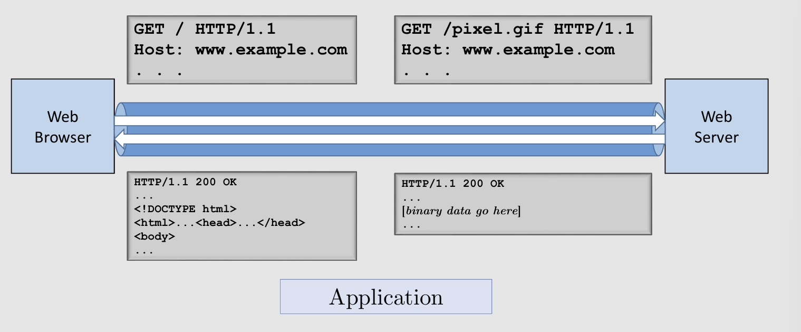







This is the Application Layer







## Transport layer



The Web browser transfer data in packets to the Web Server in the Transport layer







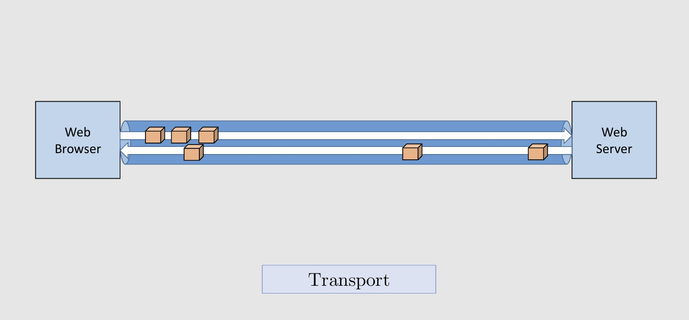







## Network Layer



And in the Network layer, we use IP address to distinguish different Web users







## Data Link layer







Network Interface Controllers(NICs) - We need this to connect to the Internet







The Data Link Layer







## Physical layer







connect to the internet







- all kinds of cables



- Wireless links



- ...







# End Systems:







it is basically a client of the internet, where the internet chain ends







for example







- a Web server



- laptops



- smartphones



- ...











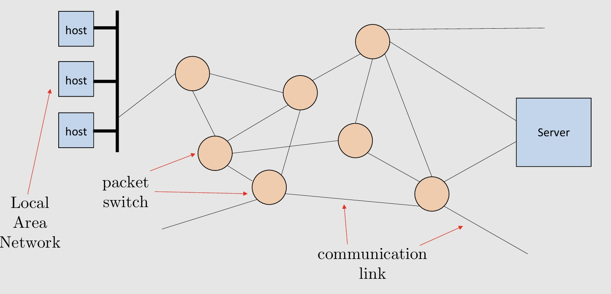







# Terminologies:







Packet switch: the lin-layer switch or a router







Communication link: a connection between packet switches and/or end systems







- all cables and links







Route： sequence of switches that a packet goes through(a path)







Protocol: control the sending and receiving of information to anf from end systems and packet switches







# Packeting Switching







- The Internet is a packet-switched network



- Information is transmitted in packets



- - A packet is a formatted unti of data



- Switchers/Router operate on individual packets



- A switch/router receives packets and forwards them along to other switches or to end systmes



- Every forwarding desicion is taken on the basis of the information contained in the packet







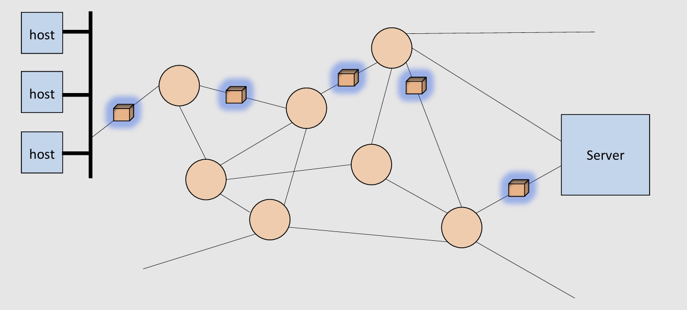







So the communication requires a connection setup phase







- the Network reserves all the necessay resources for that connection (links, buffer, switches, etc.)











- After a successful setup, the communicating systems are connected by a set of links that are dedicated to their connection for the entire duration of the conversation







- When the conversation ends, the network destorys the connection







## Circuit vs. Packet Switching







Circuit switching allows only a limited sharing of communication resources







- once a connection is established, the resources are blocked even though there might be silence periods (inshort, circuit switching is an inefficient way to use the network)







- Packet switching achieves a much better utilisation of network resources (it is designed specifically to share link)







## Communication Protocols:







A protocol is a set of rules







An executable specification







must be unambiguous







must be complete (include actions and/or response for all possible situations and all possible messages)







A network protocol must also define all the necessary message formats







# Internet Protocol:







for example







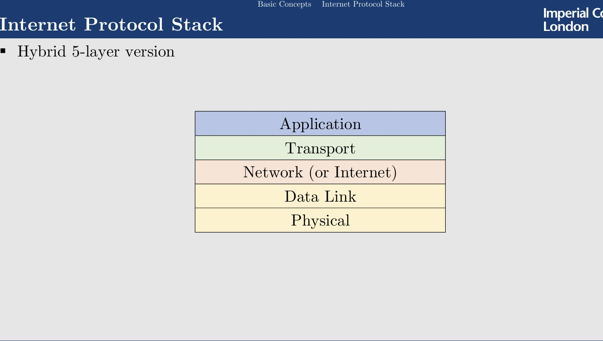







# Internet Protocol Design







Issues:







- Addressing: how to denote the intended recipient



- Error Control: how to detect (and possibly fix transmission errors)



- Flow Control: how to prevent a fast sender from swamping a slow receiver



- Multiplexing / Demultiplexing (how to support multiple communications in parallel)



- Routing: how to route packets to final destination







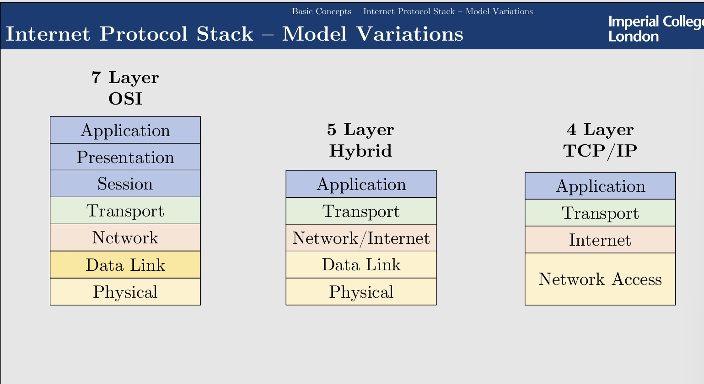







# Service / Protocols







- Service: set of primitives that a layer provides to the layer above it.



- Protocol: set of rules that prescribe that layout and meaning of pacjets,and often the order in which specific packets should be sent







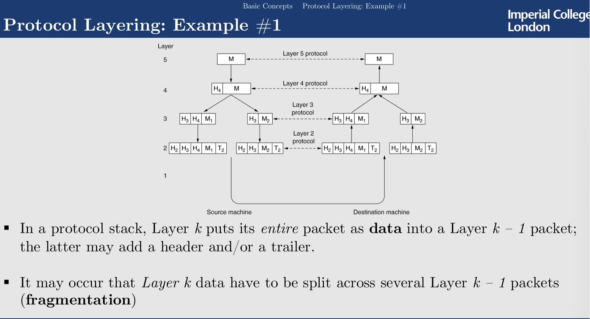







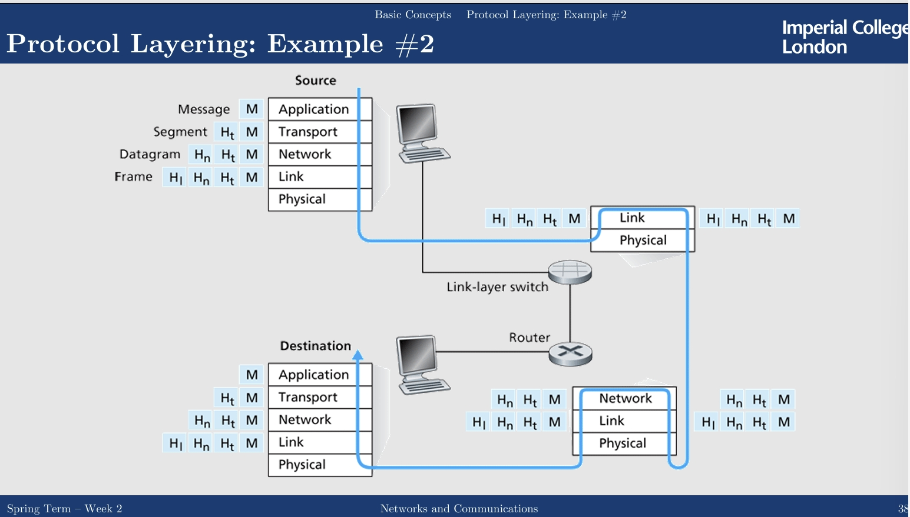







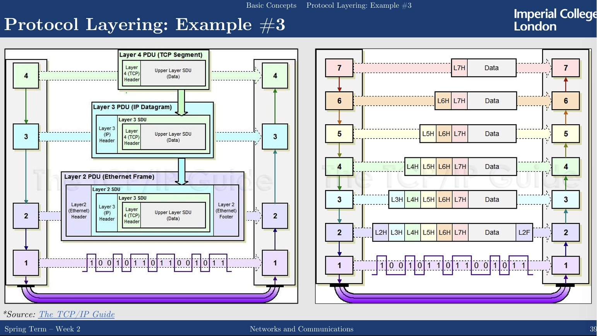







# The Layers







## Application Layers:



Defines applications functionality and message formats







## Transport Layer:







provides the actual network interface to applications







primary concern is reliability







## Network layer:







Describes how routing is to be done







## Data Link Layer:







- detect bit transimission errors: checksum (Cyclic Redundancy Check, add a parity bit to every 7 transimitted bits)



- how a number of computers can share a common channel, Medium Access Control sub-layer(MAC)







## Physical Layer:







Describes the transmission of raw bits, in term of mechanical and electrical issues







# Quantifying Data Transfer







```



when refering to KB







1000 Bytes transfer time= 1 KByte







1024 Bytes = 1 KiByte



```







- Bandwidth: The amount of information that can get into or out of the connection in a time unit



- Thoughput: the amount of information that actually get into（or out of） the connection in a time unit(input throughput is the same as the output throughput)



- Goodput: the amount of useful information that actually get into(or out of) the connection in a time unit, excluding any overhead or reattempts



- Latency: the time it takes for 1 bit to go through the connection(from on end to the other)







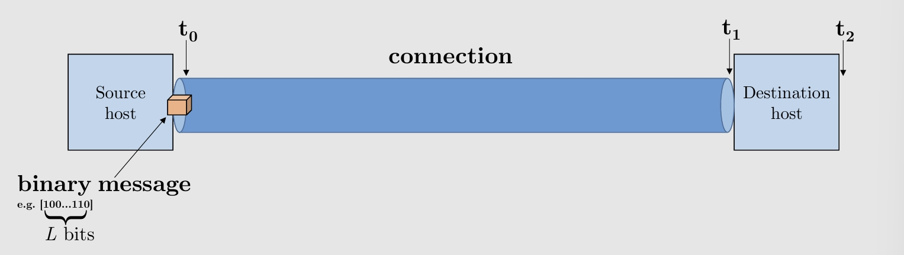







- $t_0$ is the time when the first bit of data, encapulated in a data frame leaves a source node in the network



- $t_1$ is thetime when the first bit of data (in a dataframe) arrives at the desitination node



- $t_1$ is the time when the last bit is fully received by the desitination"







and so we define the following terms



- the latency is $d = t_1 - t_0(sec)$(more generally $\frac{distance}{wave propagation speed}$) (this is the time for the signal to transfer from source to destination), everytime we may follow a different set of hops from the source to the destination, so we cannot get t2 from the source.



- Throughput (link bandwidth): $R = \frac{L}{t_2 - t_1}(bits/sec)$(or, more generally: $\frac{transferred bits}{duration}$) (this denote the speed of the internet, how many bits can we transfer at a time)



- Packetization (transmission delay): $\frac{L}{R} = t_2 - t_1$ (a.k.a. store-and-forward delay)(this is the time the network needs to fully receive the data)



- Transfer time $\Delta = \text{propagation delay}+\text{transmission delay} = d + \frac{L}{R}sec = t_2 - t_0$(the total time it takes from transfer to fully receive)







## Example







Example 1:







- L = 4KB



- d = 500ms



- R = 1MB/s







$\Delta = d + \frac{L}{R} = 500ms + \frac{4KB}{1MB/s} = 500ms + 0.004s = 500s + 4ms = 504ms$







Example 2:







- L = 700MB



- d = 500ms



- R = 1MB/s







$\Delta = d + \frac{L}{R} = 500ms + \frac{700MB}{1MB/s} = 500ms + 700s = 700.5s$







Example 3:







- L = 40GB



- d = 500ms



- R = 1MB/s







$\Delta = d + \frac{L}{R} = 500ms + \frac{40GB}{1MB/s} = 40000.5$







Example 4:







You have aHDD with a large database backup (630GB) which needs to be transferred 



from London to Edinburgh.







Assume it takes you 1 second to take the HDD out of your backpack;



 



Assume your car will get you there in exactly 7 hours;







- L = 630GB



- d = 7h



- $\Delta = 7h(+1sec)$







$R = \frac{L}{\Delta - d} = \frac{630GB}{1sec} = 630GB/s$







## Hops:







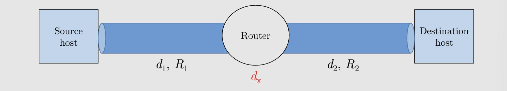







- $d_1,d_2$ is the propagation delay(Latency, L)



- $R_1, R_2$ is the link bandwidth(Throughput, R)



- $L$ is the packet length(in bits)



- $\frac{L}{R}$ is the transmission delay(Packetization)







then we have, note the $d_{end-end}$ is the time needed for Source to Destination







- if $R_1 < R_2$, then $d_{end-end} = d_1 + \frac{L}{R_1} + d_x + d_2$



- if $R_1 \ge R_2$, then $d_{end-end} = d_1 + \frac{L}{R_1} + d_x + d_2$







this is because the overall flow of the data is dominated by the smaller bandwidth







in case1, $R_1, R_2$, so although router to destination can process at a speed of $R_2$, but the input from the router is limited by $R_1$, which is smaller than $R_1$







this is called bottleneck







so $d_{end-end}= d_1 + d_x + d_2 + \frac{L}{\min(R_1,R_2)}$







### $d_x$







this consists of







Processing delay ($d_{proc}$)







- check bit errors



- determine output link



- typically neglibible(<msec)







Queueing delay(d_q)







- time waiting at output link for transmission



- depends on congestion level of router







## Queueing Delay







- R: link bandwidth(bps)



- L: packet length(bits)



- a: average packet arrival rate



- $\frac{La}{R}$: traffic intensity







so







- $\frac{La}{R}\approx 0$: avg. queueing delay small



- $\frac{La}{R}\to 1$: avg. queueing delay large



- $\frac{La}{R} > 1$: more working arriveing than can be serviced, so queueing delay infinite.