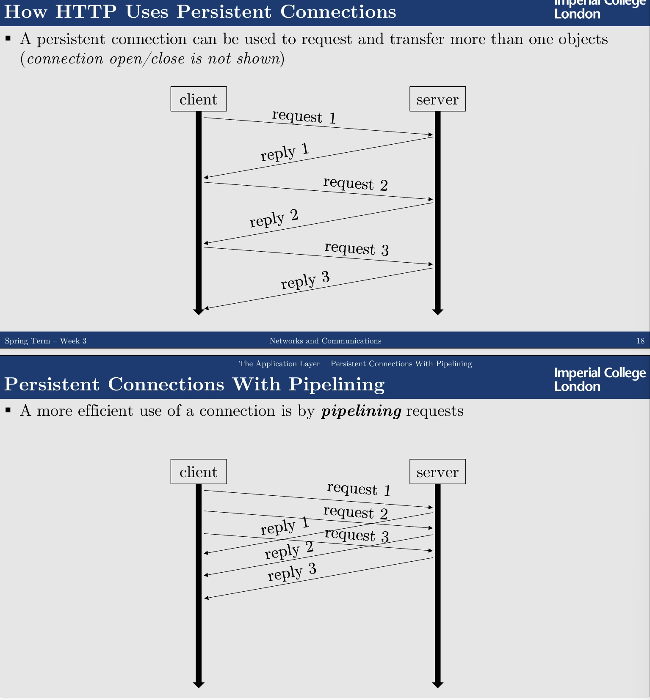
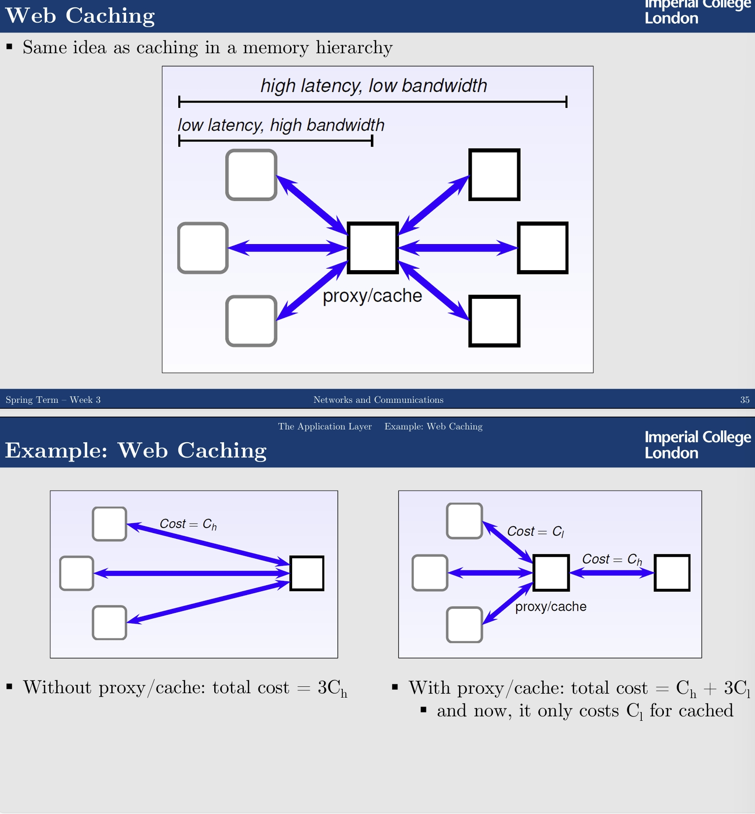
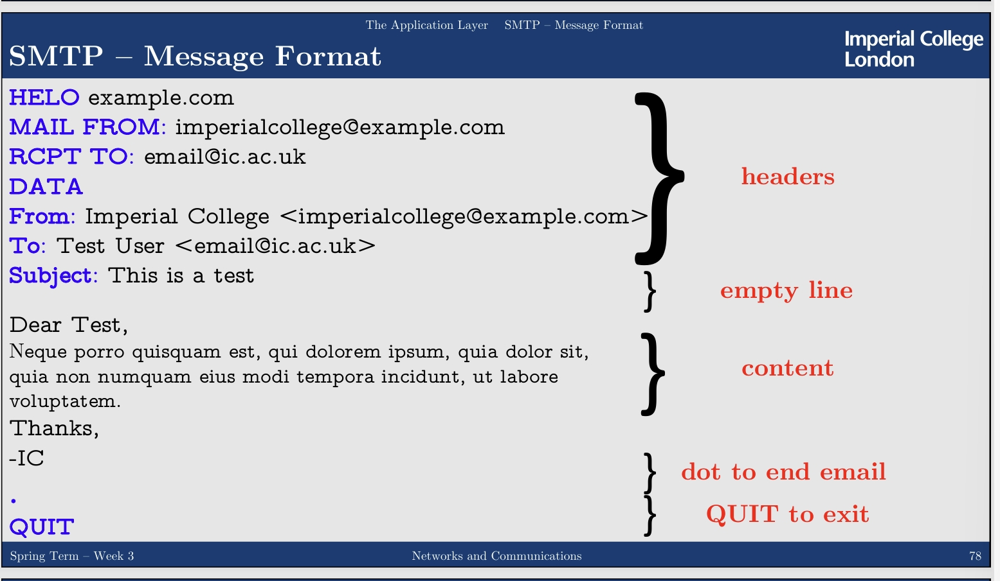

---
encrypt_content:
  level: Imperial
  password: Raymond#1234
  username: hg1523
level: Imperial
---
The Application layer

# End systems:

the end systems have different configurations, the Web should be compatible with every end-system

# Clients / Servers

Client process the initiates the communication

Server is the process that waits to be connected

Some applications have processes that is both a Client and a Serve. This is often called Peer-to-Peer architecture

## Processes and Hosts:

an end system may run multiple programs which run multiple processes

they are distinguished by port numbers (e.g. 8000 for web, 22 for ssh)

## Socket:

the socket is between the actual OS and the applications

## Application Programs:

For Client application

- create a socket by connecting to the server application
- use socket C by reading and writing data into it
- disconnect and destroy the socket

For Server application

- create a socket by connecting to the server application
- use socket C by reading and writing data into it
- disconnect and destroy the socket

## HTTP protocol

HTTP is stateless, it doesnot remember anything befoire the current request

usually use TCP, but also can work UDP

each request is in repsone to one single request

the Request looks like (`telnet www.doc.ic.ac.uk 80`)

```
GET/~kgk/212/index.html HTTP/1.1
Host: www.doc.ic.ac.uk
User-agent: Mozilla/5.0
Accept-Language: en-GB
```

the Response looks like (after `telnet www.doc.ic.ac.uk 80`)

```
HTTP/1.1200 OK
Date: Thu, 26 Jan 2017 16:00:00 GMT
Server: Apache
[…]
Last-Modified: Sat, 21 Jan 2017 20:05:55 GMT
[…]
Accept-Ranges: bytes
Content-Length: 5470
[…]
Content-Type: text/html
[…]
<!DOCTYPE html>
[…]
```

## HTTP and TCP

previously HTTP used one TCP connection per object

HTTP/1.1:

- the connection can be used for multiple requests
- use the Connection: close header to not use a persistent connection

the difference



### Methods

skip, GET, POST, HEAD, PUT, DELETE, OPTIONS

### Headers:

skip

### status code

- 1xx: information
- 2xx: success
- 3xx: redirect
- 4xx: client error
- 5xx: server error

## Web Caching:

set up and intermediate server in the middle of the connection

the procy can cache the memory



use the headers:

- Cache-Control: no-cache: dont cache this in the proxy
- Cahce-Control: max-age=20: set the expiration
- Cache-Control: max-age=20; must-revalidate: must revalidate the object 100s later

### sessions:

like JWT, store a token in the cookie

### Dynamic Web Pages

- Common Gateway Interface: CGI essentially allows to identify a program and the parameters in the URL

- Servlets: the Java-based solution

the webserver contains an instance of Java Virtual Machine


- Alternative: Let webpage incorporate interpretable code and when it is loaded, the embedded script is executed

## IP, Host Names and DNS
### IP:
an end system is identified and addresses by IP address

- 32 bits in IPv4
- 128bits in IPv6

good for computers but not humans

### Host names:

alias for human to remember the IP

we use the DNS to find the IP from the host

www.doc.ic.ac.uk -> 146.169.13.11

for example:

we start from the Top-Level-Domain:

www.imperial.ac.uk

- uk
- ac
- imperial
- www

### DNS Architecture:

Top-level domain servers: .com .edu .org, .uk .tv

### Observations on DNS

DNS can be a bottleneck for some applications

but is a perfect demonstration of end-toend principle

### DNS Caching:

it improves performance

DNS caches the reply for a name n, and if the server erceievs subsequent request for n, it can use the cache

but this can lead to abuse of the cache

### DNS Feautures

it is like a dictionary, a database

TTL = Time to Live

#### DNS Query Types:

- A maps host_name => address
- NS is a query for a name server
- CNAME is a query for a canonical name
- MX is a query for mail exachange

#### DNS Protocol

DNS is a connectionless protocol

- usually run on UDP, but can run on TCP

DNS has query and reply messages

- since connectionless, queries and replies are connected by an identifier

DNS query and replies have the same format

it always only involve two network packets, establishing a TCP connection is wasteful

##### Round Robin DNSL

a host name has a list of IP addresses

each time it use a round robin strategy

### nslookup:

used to find various detials relataing the DNS

nslookup www.imperial.ac.uk gives:

```
Server: 127.0.0.53 
Address: 127.0.0.53#53 

Name: wrpwww.cc.gslb.ic.ac.uk 
Address: 146.179.40.148 
Name: wrpwww.cc.gslb.ic.ac.uk 
Address: 2001:630:12:600:1:2:0:172
```

the first line is the DNS server used

#### non-authoritative:

`nslookup -type=NS imperial.ac.uk` tells us the address of the authoritative DNS server

`nslookup www.imperial.ac.uk ns0.ic.ac.uk` asks the server ns0 (the authoritative DNS) for a reply

### dig:

Domain Information Groper is a tool that queries DNS name servers

`dig www.imperial.ac.uk`

it also enable querying for other DNS records

`dig MX imperial.ax.uk` for mail server

we can also use the host tool with the -v option
## CDN:

we post the content to share on many server

we can do

- push deep: push CDN servers deep into many access networks

- bring home: smaller number of larger clusters in Pops (Points of Presence) near (but not within) access networks

### CDN cluster selection strategy:

pick a good CDN node:

- pick a CDN node geographically cloest to client
- pick a CDN node iwth shortest delay

how CDN get the IP address of the client

- it doesnt
- it only knows the address of the local DNS. This may or may not be fully accurate

we also can give the client a list of several CDN servers and let client decide

## EMails

unlike usual web connections, we use the SMTP protocol

- User agent: the app we use for emails
- Mail servers:
- - Local mail server accept message for remote delivery
- - Remote mail server accept message for local delievry
- - allow user agents to access local mailboxes

### Message Transfer:

DNS also keeps tracks of mailers in MX records

### SMTP:

it uses TCP on port 25

- set up TCP/IP connection between client and server
- client requests server to accept its messages
- server responds, so that client can send

the message format is like



some header:

Basic idea: Don’t describe anything concerning the content of a message; only specify 
the header
- To: e-mail address(es) main destination
- Cc: e-mail address(es) to send copies
- Bcc: e-mail address(es) to send blind copies
- From: name of sender(s)
- Sender: e-mail address sender
- Received: line added by each intermediate transfer agent
- Return-path: return address
- Date: the date and time the message was sent
- Subject: short summary of the message
- Reply-To: E-mail address to which replies should be send

#### Limitations in Security

it is plain text so anyone can read

SMTPS adds encrytion, uses SSL(TLS) encryption

can happen over port 25

#### Limitations in Message Format:

The standard message format has some serious limitations:

- 7bit content
- only text
- essentially good exclusively for English

any content that doe snot fit into the 7-bit character set must be encoded

we can use the MIME(Multiputpose Intenet Mail Extension) specifications

- text/plain
- text/html
- images/jpeg
- multipart/mixed

### POP3:

a user mailbox may be stored on a different machine than the user agent, so we use POP3 (Post Office Protocal)

### IMAP:

POP3 assumes that retrieved mail is deleted at the server

we use IMAP to solve this, but still need to use SMTP

and be unencrypted

### other Internet Applications:

- FTP: file transfer
- SSH: secure shell
- Telent: plain text
- SNMP: enables a system admin to manger their networks
- NFS: Nework file System
- DHCP: allows networked devices to receive an IP address(the reason why vm failed one time)
- IRC(Internet Relay Chat): barely used today