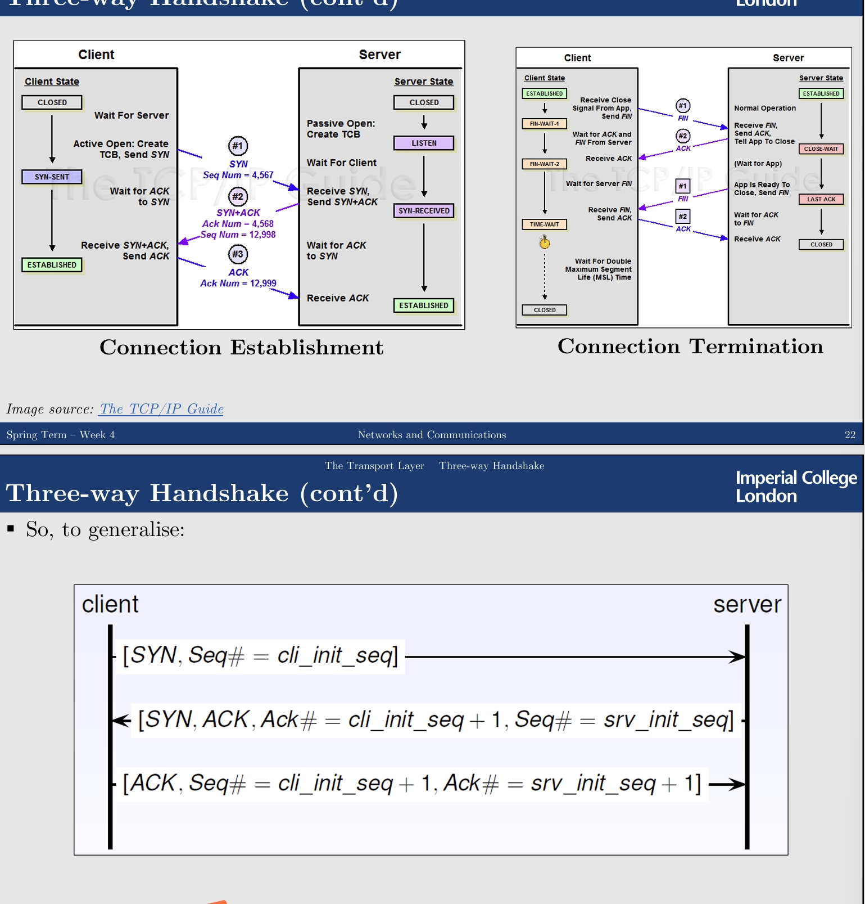
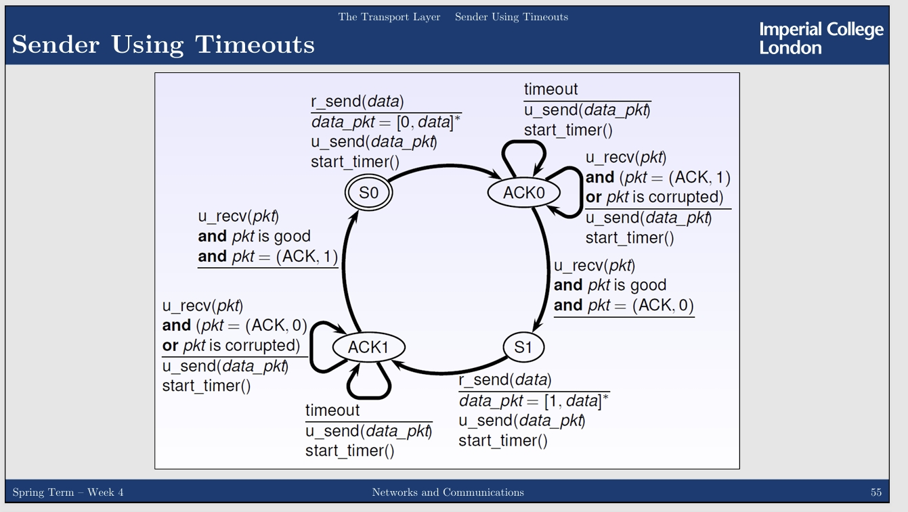

---
encrypt_content:
  level: Imperial
  password: Raymond#1234
  username: hg1523
level: Imperial
---
# Transport Layer

## Transmission Control Protocol (TCP)
- connection-oriented
## User Datagram Protocol
- connection-less

the Transport Layer's TCP data are called segments

Transport Layer's UDP data are called datagrams


## basic assumtpions:
- every host has a unique IP address
- IP has no guarantee on the integrity of data transmission
- IP has no guarantee on the order in which packets are delivered
The other Layer 4 protocols: QUIC, UDP-Lite, DCCP/UDP, SCTP, RSVP/NSIS

# Data Encapusulation:


# Multiplexing/Demultiplexing:

the client host and the server host has multiple connection simultaneously, we classify them with ports

## ports:

each application running on a host is identified by a unique port number
- port numbers are simply cross-platform process identifiers

we identify a socket connection with the following pattern

two pairs of `<IP>:<port> <TCP/UDP>`

finding which application to connect to is beyound th scope of the Transportation layer

but there are some predefined ports

80 for HTTP, 25 for SMTP, 22 for SSH...

the first 1024 ports are reserved

1024 - 49151 are for any user application to use or register

49152 - 65535 are dynamic for clients to use temporily

# TCP:

The Internet's primary transportation protocol

Connection-oriented service:
- the endpoitnes initially shake hands to establish a connection
- not a circuit-switched connection nor a virtual circuit

Full-duplex service:
- both endpoints can send and receive at the same time
## Transportation layer Interface

Consider the Berkeley socket interface, (adopted by all UNIX systems and Windows)

- SOCKET create a new communication endpoint
- BIND attach a local address to a socket
The server binds a transport-level address and a name to the locally created socket for the clients to use
- LISTEN Announce willingness to accept N connections
The server starts listening on this socket, thus tellign the kernel that it will now wait for connections from clients
- ACCEPT Block until some remote client wants to establish a connection
after this step the server can accept of select connections from clients
- CONNECT Attempt to establish a connection
A client connects to the socket; it needs to provide the full transport-level address to successfully locate the socket
- SEND send data over a connection
- RECEIVE receive data over a connection
The client and the server receive on their respective sockets
- CLOSE Release the connection
The connection is now closed

## Connection-Oriented Socket Communication


In Java we use the TCP client as follows:

```java
public class Client { 
	public static void main (String[] args) throws UnknownHostException, IOException{ 
		Socketsocket= new Socket("127.0.0.1", 2259); 
		BufferedReaderin = new BufferedReader(new InputStreamReader (socket.getInputStream())); 
		PrintWriterout = new PrintWriter(new OutputStreamWriter (socket.getOutputStream()), true); 
		out.println(System.console().readLine()); 
		System.out.println(in.readLine()); 
		socket.close(); 
	} 
}
```

- In Socket constructor also implicitly connects the TCP socket to the IP address and port specified
- For UDP, you would need to use the DatagramSokcet class instead
- You can read/write Sockets using the standard operations to access files
to listen on a port

```java
public class Server { 
	public static void main (String[] args) throws IOException{ 
		ServerSocketserverSocket= new ServerSocket(2259); 
		System.out.println("Listening on port 2259..."); 
		while (true) { 
			Socket socket= serverSocket.accept();
			BufferedReaderin = new BufferedReader(new InputStreamReader (socket.getInputStream())); 
			PrintWriterout = new PrintWriter(new OutputStreamWriter (socket.getOutputStream()), true); 
			System.out.println(in.readLine()); 
			out.println(System.console().readLine()); 
			socket.close(); 
		} 
	} 
}
```

basically it is just a cycle reading all the sockets on port 2259


In order to handle multiple clients at the same time, a new thread must be created for each new client connection

## Preliminary Definitions

TCP Segment: "envelop" for TCP data
- TCP data are transmistted within TCP segments
- TCP segments are transmitted within a Network Layer protocol (e.g. IPv4)

Max Segment Size: maximum amount of application data (payload) transmitted in a single segment
- typically related to the MTU of the connection, to avoid network-level fragmentation

Max Transmission Unity (MTU): the larget link-layer frame available to the sender host: include L3 + L4 headers as part of the L2 payload
- Path MTU Discovery(PMTUD): determine the largest link-layer frame that can be sent on all links from the sender host to the receiever host


- **Source and destination ports (16-bit each): application identifiers**
- **Sequence number (32-bit): used to implement reliable data transfer**
- **Acknowledgement number (32-bit): used to implement reliable data transfer**
- Receive window (16-bit): size of the window on the receiever end
- Header length / offset (4-bit): size of the TCP header in 32-bit words
- Optional and variable length options field: may be used to negotiate protocol parameters

- Flags:
- - URG (1-bit): urgent flag, used to inform the receiver that the sender has marked some data as urgent. The location fo this data are marked by the urgent data pointer field
- - **ACK : (1-bit): signals that the value contained in the acknowledgement number represents a valid acknowledgment**
- - PSH : (1-bit): "push" flag. used to solicit the receiver to pass the data to the application immediately
- - RST: (1-bit): used during connection setup and shutdown (abrupt disconnection)
- - **SYN: (1-bit): used during connection setup and shutdown (normal disconnection)**
- - **FIN: (1-bit): used during connection shutdown**
- - **Checksum (16-bit): used to detect transmission errors**

### sequence numbers:

Sequence numbers are associated with butes in the data stream
- not with segments

The sequence number in a TCP segment indicates the sequence number (= the place) of the first byte carried by the segment

When TCP connection is set up, a random Initial Sequence Number (ISN) is decided upon, in order to avoid receiving any leftover segments by mistake

The ISN is used to init the sequence numbers

### acknowledgement numbers

AN acknowledgement number represents the first sequence number not yet seen by the receiver
- TCP acknowledgements can be cumulative
- Typically, TCP implementations acknoweledges every other packet


but also notice that the TCP connnection consist of a full-duplex link
- two streams, two different sequence numbers


### Three-way handshake

- The client sends a TCP segment with the SYN flag set to true and also init the sequence number
- The server responds with another SYN TCP segment, which has the ACK flag set to true, and the first unseen client Sequence number and the initial sequence number for the server
- the client responds with an ACK inclusing the first unseen server Sequence number and the client's new Sequence number
- disconnect is similar, but instead of SYN, we use FIN


# UDP

UDP provides only the two most basic functions of transport protocol
- application identification (multiplexing/demultiplexing)
- integrity check by means of CRC-type checksum

UDP
- no flow control
- no error control
- no retransmissions

UDP datagrams cannot be larger than 64KiB
- 20B IP Header + 8B UDP Header + 65507B data = 65535 Bytes
- usually 500-1000 Byte datagrams are used
- the smaller the packets are, the more likely they are to make it intact
## UDP client & Server

in Java:

```java
public class UDPClient{ 
	public static void main (String[] args) throws IOException{ 
		byte buf[] = System.console().readLine().getBytes(); 
		DatagramPacketpacket = new DatagramPacket(buf, buf.length, InetAddress.getByName("127.0.0.1"), 2259); 
		DatagramSocketsocket = new DatagramSocket(); 
		socket.send(packet); // no connection needed 
		buf= new byte[256]; 
		packet = new DatagramPacket(buf, buf.length); 
		socket.receive(packet); // fingers crossed 
		System.out.println(new String(packet.getData()));
	} 
}

public class UDPServer{ 
	public static void main (String[] args) throws IOException{ 
		DatagramSocketsocket = new DatagramSocket(2259); 
		while (true) { 
			byte buf[] = new byte[256]; 
			DatagramPacketpacket = new DatagramPacket(buf, buf.length); 
			socket.receive(packet); // receive a message from a client 
			String s = new String (packet.getData(), 0, packet.getLength()); 
			System.out.println(s); 
			buf=System.console().readLine().getBytes(); 
			InetAddressclientAddress= packet.getAddress(); 
			intclientPort= packet.getPort(); 
			packet = new DatagramPacket(buf, buf.length, clientAddress, clientPort); 
			socket.send(packet); // respond to the client 
		} 
	} 
}
```


UDP is connection less, we dont need to connect, you just send the message

each datagram packet must carry the full address:port of the recipent


## When UDP:

it does not provide any reliability or flow control

but
- finer Application Level control over what data are sent and when (real-time, Skype, etc.)
- no connection establishment so fater than TCP
- no connection state
- small packet overhead
also
- if request or reply is lost, the client can timeout and try again
- simpler code and fewer messages required


# TCP / UDP

when we care more about reliability, we use TCP

but when we need fast transmission, and the lost of data does not matter, then UDP


TCP is slow, but we can use pre-buffer(send a few Bytes/MegaBytes in advance and store them locally on the client)

# QUIC:

Quick UDP Internet Connections

# Finite State machine:

recall 40001

the TCP Finite State machine:


we can use netstat -a to see the TCP connections on the machine

# Reliable Data Transfer:

I'll skip the FSM part

refer to this


In the TCP/IP model, TCP transmission is reliable, but IP is not

in short, the finite state machine can be reduced to


but also recall this is from


in the TCP/IP model, the reliable-transfer protocol is TCP, and the unreliable network is IP transfer

the rs resemble reliable transmission, the us represent unreliable ones

# Noisy Channel:

sometimes a bit is flipped during transmission, but no packet loss

we can do
- Error detection: the receiver must know when a received packet is corrupted
- Receiver feedback: the receiver must be able to alert the sender that a corrupted packet was received
- Retransmission: the sender must retransmit corrupted packets
## Error Detection

example: we add a Parity bit that is the XOR of all the bits in the message

receiver computes the XOR of all the bits and concludes that there was an error if the result was not the expected

With noisy channel, the FSM becomes this


Sender
- reliably send the data through the protocol and verify it with the protocol, send the error-detection code + data to the receiver
- if the packet the receiver receives is ACK(good), we seend back a ACK code, and accept the packet, else we send back NACK and reject it
- we send back the packet and the transmission for sending back should be ACK or we do nothing

Receiver:

- if the packet the receiver receives is ACK(good), we seend back a ACK code, and accept the packet, else we send back NACK and reject it

but in this protocol, there can be stuff like, the sender and the reciever both didnot get ACK for any transmissions, and the coummnication is not goin to end in this case

## Dealing with bad ACK/NACKS

we can

- make ACK/NACK packets redundant, and assume that the sender cna always figure out the message(Thi sis only good enough for reliable channels that do not lose messages)
- Assume a NACK and simply retransmit the packet (This introduces duplicate packets)

### Dealing with duplicate packets:

The sender adds a sequecne number to each packet so that the receiver can determine whether a packet is a retransmission

we only need to distinguish between the next segment and the retransmission

so one bit is sufficient


For the sender:

- (S0) we first send the data reliably, the the protocol adds a 0 bit and send unreliably
- (ACK0) then the sender recieves the packet from the receiver and if the packet is bad (the receiver didnt get the packet or the ACK is bad), we send it back unreliably until we get a ACK
- (S1) or else, the sender send the packet with sequence number 1
- (ACK1) repeat ACK0
- (S0) send the next packet with sequence number 0

For the sender:
- (R0), we receive the packet, is the packet is good, and the sequnce number is 1 we send a ACK
- (R0), the packet is good, but it is the first contact, we send a ACK and accept the packet
- (R0) the packet is bad, we send a NACK
- (R1) the inverse of R0

so

- sender says: “7: Let’s go watch a movie” 
- receiver hears: “7: Let’s go watch a movie”
- receiver says: “Got it!”
- sender hears: “Got it!” 
- sender says: “8: Let’s meet at 8:00PM” 
- receiver hears: “. . . (noise) . . . ”
- receiver now says: “Got 7” (instead of saying “Please, resend”) 
- sender hears: “Got 7” 
- sender knows that the current message is 8, and therefore repeats: “8: Let’s meet at 8:00PM

we can also only use ACK, so that (ACK,1) corresponds the the previous ACK, and (ACK,0) corresponds tot he previous NACK

## Acknowledgement generation(Receiver)

All the previous data are acked, and the current just arrived with expected sequence number
- Delayed ACK: wait X ms for another in-order segment (timout 500ms) if does not arrive send ACK
- the arrival can be delayed

The current ACK arrives with expected sequence number and another in-order segment waiting for ACK
- Cumulative ACK: indicates that all the previous packet are received 
- we send (1 to 3) wait for the other side to give (4)

Arrival of out of order segment with higher-than-expected sequence number
- Duplicate ACK: immediately send a duplicate ACK
- we send (1 to 3) and 2 is lost, so the other side send 1 and 3, we know 2 is lost
- we continuously ask for 2

Arrival of segment that fills the gap:
- immediate ACK: immediately send ACK if the segment starts at the lower end of the gap

## Timeouts:

so the FSM looks like this:



so the protocol sends data like this:


- a. everything works perfectly
- b. packet loss in sending, so timeout and resend it again
- c. packet loss in ACK, so the sender timeouts and send again
- d.nothing is wrong, but the timeout is smaller than the time it takes to get ACK, so the sender would detect duplicate and resend ACK, the sender will get it and do nothing


the sequence number and the ACK number has to be the same length

the headers combined:


# Congestion

If all the traffic is correctly acknowledged, then the sender assume that there is no congestion

congestion means that the queu of one or more routers between the sender and the receiver overflow
- more segments are dropped

The server assume that the network is congested when it detects segment loss
- time out (no ACK)
- multiple acknowledgements (equivalent to NACK)


## TCP Congestion Protocols

on Linux we can check this with:

`cat /proc/sys/net/ipv4/tcp_congestion_control`

on Windows we can check with 

`netsh interface tcp>sh gl`

includes:
- Tahoe
- Reno
- Vegas
- ...

What we have described so far is the TCP Reno

Another popular implementation is TCP Vegas
- detect congestion before losses
- Imminent packet loss is predicted by observing RTT(Round Trip Time)

A problem with TCP Reno is that flows with small RTTs are advantaged, comparing to the ones with large RTTs, as their window can ggrow faster

TCP CUBIC(the standard of linux) solves this problem by making the window increase as a function of time rather than RTT

other : (skip)

## Congestion window:

The sender maintains a congestion window (W)

this limits the amount of bytes that the sender pushes into the network before it blocks to wait for acknowledgement

$\text{LastByteSend} -\text{LastByteAcked}\le W$

and $W = \min(\text{CongestionWindow}, \text{ReceiverWindow})$

the output rate is roughly $\lambda = \frac{W}{RTT}$

## Congestion Control:

TCP modulates it output rate with
- slow start
- Congestion Avoidance
- Additive Increse and Multiplicative-Decrease
- Reaction to timeout (base on protocol algorithms)

### Slow Start:

the Initial Value of W is MSS (low fro modern networks)

TCP increses its sending rate exponentially for its first phase (W is doubled every RTT)
- Increse W by 1 MSS on every good segment ACK until $W\ge \text{SlowStartThreshold}(ssthresh)$ or until a congestion occurs
- If $W > ssthresh$ use Congestio Avoidance

Initial value of ssthread may be send to an arbitrarily high value, or to the size of the advertised window

## Congestion Avoidance:

TCP increses W linearly in this phase (W is increase by 1 MSS every RTT)

some complex analysis can be found [(28) COMP 50005: Networks and Communications – Ed Discussion](https://edstem.org/us/courses/67155/discussion/6064952)

but lets just remember to equation

$W = W + MSS * \frac{MSS}{W}$

or $\Delta W = MSS*\frac{MSS}{W}$

## Additive Increse / Multiplicative-Decrease

short as AIMD

W is incresed by $\frac{MSS^2}{W}$

and W is reduces by halfing at packet loss

## Reliability and Timeout

TCP provides reliable data transde using a timer to detect lost segments
- timeout without an ACK $\ge$ lost packet $\ge$ retransmission

How long to wait for acknowledgements?

- The time interval must be larger than RTT (to avoid unnecessary retransmissions)
- T should not be too far from RTT (to detect lost segment as quickly as possible)
- TCP sets timeouts using smoothed RTT(SRTT) and RTT time variation(RTTVAR)
- $T = SRTT + 4*RTTVAR$
TCP controls timeout by continously estimating the current RTT

### Fast Retransmit:
three duplicate ACKs are interpreted as one NACK(Fast Retransmit)

timeouts and NACK signal losses, but interprete different things about the status of the network

timeout indicate congestion

three duplicate ACKs (plus the original one give four) suggest that the network is still able to deliver segments along the path

TCP reacts differently to a timeout and triple duplicate ACKs

the reason to wait for three duplicates it that waiting for two more duplicate packets is a good trade-off between triggering a Fast Transmission, when needed, and not retransmitting prematurely(e.g. in case of packet reordering)


## Fast Recovery:

Assuming the current window size id $W = \bar{W}$

on Timeout:

- go back to $W = MSS$
- run slow start until W reaches $\frac{\bar{W}}{2}$ (=ssthreah; inclusive)
- then proceed with Congestion Avoidance
on NACK

- cut W in half W = $\frac{\bar{W}}{2}$(=ssthreah)
- run congestion avoidance, ramping up W linearly
- this is called Fast Recovery


## Sliding Window:

## go-back-n:

The sender transmits multiple segments without waiting for acknowledgement

when the sender has up to W unacknowledged segments in the pipeline
- the FSM gets complex
- we represent the sender's state with its queue of acknowledgements


### Selective Repeat

the sender only retransmit the segments that it suspects were lost or corrupted

# Flow Control / Congestion Control

COngestion Control aims to not overflow the network

Flow control aims to not overflow the receiver

window size of 0 is legal
- it means that no more segments can be send
- ping is allowed (ping is in layer 3)

# Wireless TCP:

when packets are lost, TCP assumes this is caused by congestion and slows down  , but in wire;ess environments, packet are usually lost due to channel reliability issues, which means we should try -harder instead

we can:

- Split TCP connections to distinguish between wired/wireless IP
- Let the base station do at least some retransmissions, but without informing the source (the may break the OSI)


## Network Usage

utilisation Factor: $\frac{\text{how much we actually used the network}}{\text{how much we could have used it}}$

or we can use $U = \frac{L/R}{RTT +L/R} = \frac{d_{trans}}{RTT +d_{trans}}$


- ss
- ca
- Nack(triple ack)
- ca
- timeout
- ss