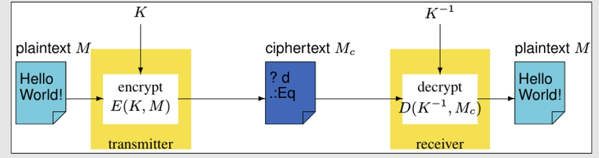

---
encrypt_content:
  level: Imperial
  password: Raymond#1234
  username: hg1523
level: Imperial
---

# H/P/V/A/C

## Hackers:
originally for highly compotent enthusiasts

- What hats: a researcher who informs the company before they go public
- Grey hats: they do not infrom anyone unless they get paid
- Black hats: a malicious individual who abuses the findings to cause harm

## Phreakers:
originally for phone hackers

mostly just hacker now

## Virii(creators)

Creator os computer viruses

some popular virsus
- Ransomware
- Spyware
- Trojans

## Anarchists:

do something in the real world

when peaceful, they are hacktivists

## Crackers:

originallt meant: those who wannabe hackers who use the tool of others to infiltrate systems

then just hackers

not code-crackers

## Others:

DDoSers
- a Distributed Denial of Service attack participant
Spammers/Botters
- mass-senders of unsolicited messages
Warez scene:
- priates today (anything that is uplaod or downloaded illegally)
Cyberbullies
Whistleblowers
- former insiders of companies/organisations
Social Engineers: Phishing/Vishing/Smishing/Catfishing
- spy on companies/organisations, try to confused with fake authority

# FireWalls:

## Network Security Issues:

- Access Control : only certina users can access the resource
- Authentication: Users knows the resouces really is what it ays it is, and vice versa
- Confidentiality: Users limit access to information/resource they own
- Data Integrity: Actions of a user should not be able to affect the overall integrity of a resource
- Non-repudiation: Users cannot deny communication took place

## Security Aspects:

- Access Control
- Security Policy
- Secure Channels
- Monitoring/Logging/Auditing

## Access Control:

use a secure channel with guards

### firewalls

Ensuring that all hosts are secure is a complex process
- Heterogeneous systems => different configurations
- Users/admins can be careless

firewalls control access to the network a security gateway between the internal and external networks
- Application level Gateway
- Circuit Level Gateway
- Packet Filtering
- Hybrid of the above
 can be software and hardware

#### firewall components:

- Application-level gateway: runs on the host; only protects the host
- Proxy server: runs on the network, can protect entire LAN
- Circuit-level gateway: acts liek a non-caching procy, it fully takes over the host's communication with the recipent, and then decides what to allow/block
- Packet Filtering:
- - Stateless: checks source/destination IP addresses and ports
- - Stateful: remembers connections and check contents of current and previous packets

#### open Internet Access:

Anyone who knows the public IP can contact you

##### Access with Proxy:

Proxies can filter incoming / outgoing traffic

Different modes:
- Normal: the client is aware (and needs to be set up)
- Transparent : the client is unaware (the local router takes care of everything)
- Reverse: runs on the receiving side, impersonating servers(CDN load balancing)

#### Bastion Host:

expects to be attacked

performs auditing/logging

it run a trusted/secure OS

administered via a dedicated terminal

#### Stateful inspection firewalls:
Relays connections and maintains connection state

Can also authenticate users

Can drop connections based on destinations, incorrect connection packets, time, volume, etc.

Useful for logging/auditing/monitoring

#### Application-level gateways:

proxy firewalls

can block/filter/report based on app-level msg content

Can scan for data leaks, worms/virsus, etc.

Can scan rewrite data

#### Access Control Lists:

Rules are checked from top to bottom, terminating when a match is found

Deny All at the end as per Principle of Least Privilege

##### Firewall example(with ACL)

all non-well-known server ports on the bastion network can access all hosts on the public net

The DNS server running on host dns and HTTP server running on machine www can be accessed from all other networks

Host dns and www may contact any port on myservl

use iptables to check the rules

#### IDS, IPS, NGFW, UTM

IDS: Intrusion Detection System
- a software that detects intrusions (e.g. identifies a DDoS attack)
- does nothing but stops them
- except inform the system
IPS: Intrusion Prevention System
- software that prevents intrusions (e.g. actively blocks SYN flooders)
- either includes, or works with and IDS
NGFW: Next Generation Firewall
- a (stateful) firewall that came with an IPS/IDS system
- (in addition to ACLmechanisms)
##### DMZ: DeMilitarized Zone

The area betwenn you and the outside world, the neutral zone

External host can only speak directly to your internal host that lie within the DMZ

All other, non-DMZ, hosts are hidden.protected by the fateway/router/firewall

The router uses NAT (Network Address Translation)
- to get the external messages to the correct internal host

If you want to expose an internal host without putting it in the DMZ
- we can use port forwarding

##### Port Forwarding

This lets the router know that packets for certain ports should be forwarded directly to an internal host/port

for example, any packet received at port 12345 of the router's public IP, should be forwarded of the NAT(Network Address translation) based LAN IP host1 at is port 80

So if I access http://yourpublicip:12345, what I am accessing is https://host1:80
- But I am not able to do this directly since host1 is hiding behind the router and thus does not have public IP

this is very useful if we wish to host  (consider vercel, those deployed at vercel is often redirected to another host after deploy)

##### Getting over firewalls

usually most non-standard services are blocked by a firewall

If ssh is allowed, we can use it tunnel through a firewall

if H1 executes ssh -g -N -L 1433:test:1433 user@cpu1

- H1 connects to cpu1 on port 22
- cpu1 connect to test o port 1433
- ssh on Hr provides a service on port 1433 (via 22)

The same applies to Remote Desktops or VNC

One can easily rewrite ones MAC on the software

we could also attempt to spoof an IP address, but a stateful firewall will probably catch it

we could also use a VPN to tunnel around a firewall
- the firewall won'e be able to know what you're doing
- as long as the tunnel is secure (using SSL, Secure Sockets Layer)

However, firewall can learn to block the secured VPN connections because they cannot read them

It may also be against the Acceptable Use policy of the network

##### Security Policy:

- Each company/organisation needs to define its Network/IT Security Policy

- Useful standaard: ISO/IEC 17799:205

for example, a policy should include

- Intranet/Internet access rights
- ALlowed use of software/hardware
- Risk assessments
- Training
- +more

this is usually the rolw of the IT/Network Manager/Director

##### Logging & Auditing

- Linux system keep track of this in /var/log/
- Windows Log in Event Viewer

usually we use the syslog protocol to keep track of the logs
- Linux: syslog-ng

this is used to identify system or network issues

Logs have to be monitored/managed

Anything useful identified by a log audit should be stored permanently

# Cryptography:

Writing something "in code" using a specific algorithm (series of steps) while retaining the ability to retrieve it afterwards (to decode or to decrypt)

## Secure Channels: Encryption:

Assumptions:
- Physical channel is open to attack from the enemy
- Enemy may read and/or alter any bit pattern

- M : Message
- K: Key
- E: Encrypt
- D: Decrypt
- Ciphertext is $M_c = E(K,M)$ which is just encrypting M with K
- Plaintext is $M = D(K^{-1},M_c)$ which is decrypting use $K^{-1}$
- Only certain users should have $K$ and $K^{-1}$

Without $K^{-1}$
- given $M_c$ can only find M by enumerating all possible $K^{-1}$ or brute force attack
- takes a very long time if the domain of $K^{-1}$ is large

Given M and $M_c$
- it should be difficult to obtain/guess the values of $K$ and $K^{-1}$

### Secret key Encryption:

$K = K^{-1}$

this is also called symmetric encryption which is similar to password-protecting a file

$K$ or $K_t$ must be carefully distributed to all hosts who are to access the channel

### Public Key Encryption

$K \neq K^{-1}$

this is also called Asymetric encryption (public-private key pair)

$K_t$ is called the private key of host $H_t$ and is only stored/used by that host

$K_t^{-1}$ is called the public key of host $H_t$ and is freely distributed

Successfully decrypting messages is the same as authenticate the messgae as coming from $H_t$
- as only $H_t$ could have encrypted the message with their corresponding private-key

for Confidentiality:

Encrypting a message with the public-key fo the destination $K_r^{-1}$
- only $H_r$ can decrypt the message

## Authentication and Confidentiality:

- we first Encrypt/sign the message using the private key $M\Rightarrow E(K_t, M)$
- Encrypt the encrypted/signed message using the destination's public key and send it: $E(K_t,M)\Rightarrow E(K_r^{-1},E(K_t, M))$
- Proof that only $H_r$ can read it: $D(K_r,E(K_r^{-1},E(K_t, M))) = E(K_t, M)$ so this still needs $K_t$ to decrypt, but only $H_r$ has $K_t^{-1}$
- Proof that only $H_T$ could have sent it $D(K_t^{-1},E(K_t, M))\Rightarrow M$

## Encryption Comparison

Public Key
- Owner of private-key does not need to disclose its value
- More secure
- Slow encryption/decryption
- Example: RSA

Secret Key
- Owner of secret/private-key needs to disclose it in order to communicate
- Less secure
- Faster encryption/decryption
- Example: AES

## Secure Channel Establishment

we try to obtain the keys used for encryption:

we can require that all hosts must be given all the keys they may need in advance
- it will not scale
- it does not allow new hosts to be added

Solution A: Agree on a new key right there and then
Solution B: Use trusted secure hosts

## Diffie-Hellman key exchange

Secure key exchange, even over a public, unsecured, channel

Key can then be used for encryption by symmetric algorithms

Powerful/large systems can potentially defeat this

Used by SSL (now TLS)

## Example:

Bob and Alice agree on a public value g (generator) and a large prime number p

Bob chooses a secret value b and Alice chooses a secret value a
- (both a and b must be less than p)

They each use their secret value to calculate their public value:
- $x = (g^b\mod p)$ for Bob and $y = (g^a\mod p)$ for Alice
- they exchange these public values

then we use the other public value to calculate the shared secret key:
- Bob: $y^b\mod p = (g^a\mod p)^b\mod p\equiv g^{ab}\mod p$
- Alice $x^a\mod p=(g^b\mod p)^a\mod p \equiv g^{ba}\mod p$
- this result.key can now be used by them to communicate securely

some eavesdropper, cannot guess/derive the shared secret key since she does not know either of the secret values a or b

For example:

a = 4 b = 5, g = 6, p = 97

- Bob: $x = (g^b\mod p) = 6^5\mod 97 = 16$
- Alice: $x = (g^b\mod p) = 6^4\mod 97 = 35$

- Alice $x^a\mod p = 16^4\mod 97 = 61$
- Bob $x^a\mod p = 35^5\mod 97 = 61$

## Kerberos

a user authentication system which knows your password

It also knows the password of the user/resource you want to communicate with

It's Key Distribution Center (KDC) can provide you with a ticket
- allowing you communicate with that user/resource

Tickets expire after a predefined amount of time
- in which case we have to re-login to generate new tickets (like jwt?)

## Hashing

Cryptographic Hash Functions create hashes

 A hash is a fixed size alphanumeric string
 - that is calculated based on a specific input

Proper hash functions always produce the same hash value
- when given the same input

Proper hash functions should not allow you to derive the input
- merely based on the hash value

This can be used for checksum calculations

Websites should be storing your password hash - not the actual password

Rainbow Tables can be used to quickly search for precomputed hash tables

can use salt, or just make the password longer

