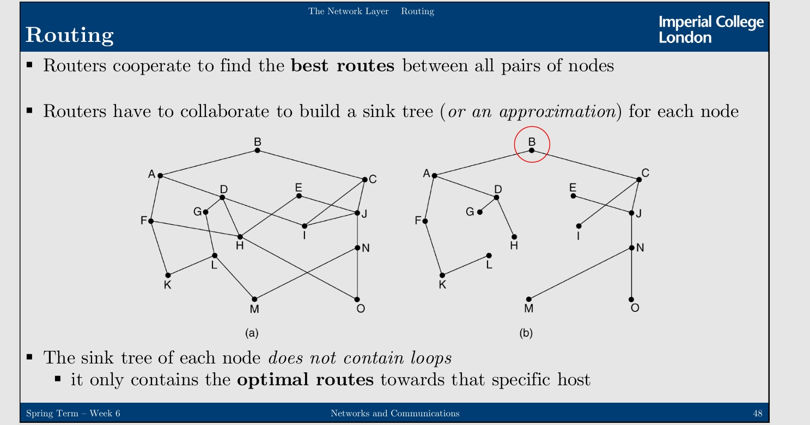
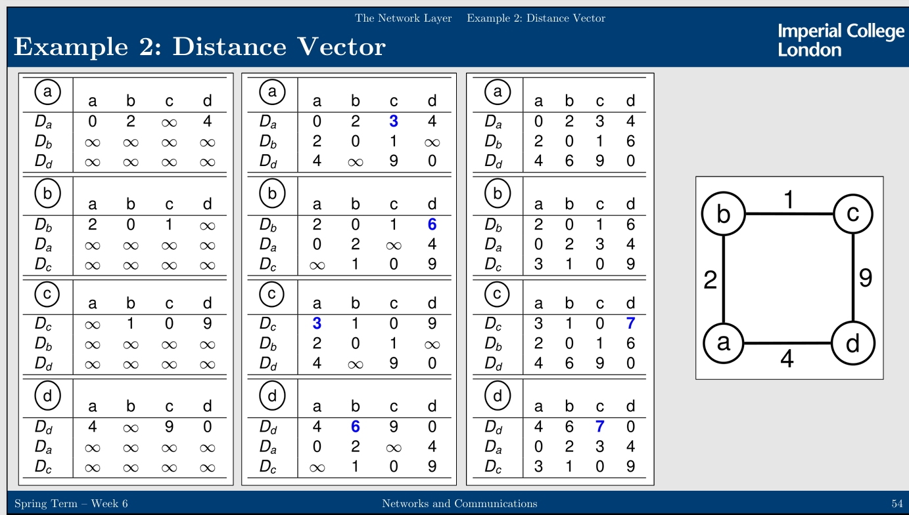

---
level: Imperial
---
---

level: Imperial

---

---


level: Imperial


---


---



encrypt_content:



  level: Imperial



  password: Raymond#1234



  username: hg1523



level: Imperial



---







# Introduction:



The Network Layer:



- also called The Internet Layer







Here lives the Internet Protocols (IP)







Data travel in Datagrams here



- IP Datagrams (we also call them packets)







Data are Fragmented into Packets and a layer 3 Header is added in front of each







These then travel over a series of interconnected networks







## Inter-networking:







- Problem: We have all kinds of networks with different protocol stacks



- Forcing all networks to use the same protocol is not the solution to this



- Solution: Construct gateways that interconnect different kinds of networks







## Network Terminology:







- PAN: Personal Area Network (e.g.your phone connected to your PC in bluetooth)



- LAN: Local Area Network (e.g.your laptop connected to your desktop using a WiFi Access Point)



- Man: Metropolitan Area Network (e.g.the bus stop sign that display the live bus schedules)



- WAN: Wide Area Networks (e.g.the Internet)







## Device Terminology:







- Repeaters (aka Hubs) live at the Physical layer for boosting signals



- Switches and Bridges live at the Data Link Layer to make inter-communications : (decisions are based on MAC addresses)



- Multi-protocol Routers (Gateways) live at the Network Layer for forwarding (and possibly splitting up) packets



	- Decisions are based on IP addresses



	- Transport Layer Gateways and Application Layer Gateways also exist







- In order to connect IP=based networks to each other, you will need a Router acting as the Gateway in-between them



# The Internet:







The internet is a  collection of Autonomous Systems(Ases) connected together by backbones







Designed according to  principles in RFC 1958:



- simple, modular, good design







## Internet model:







An applicaiton offers a data stream to the Transport Layer, using either connection-oriented or connection-less services







The Transport Layer data stream is converted into an IP Datagram for the Network Layer







IP Datagrams are routed through the Internet



- Routers pass datagrams to underlying Data Link layer (e.g. to LANs and WANs)



- Then the cables (Physical Layer)







### Internet Network Layer







- Internet Protocol(IP)



	- datagram format



	- fragmentation



	- addressing



	- packet handling



- Internet Control Message Protocol (ICMP)



     - error reporting



     - signaling



- Dynamic Host Configuration Protocol (DHCP)



	 - address configuration



- Routing: defines paths and creates forwarding tables



	 - defines paths and creates forwarding tables















as we have seen before











### Fragmentation:







- Routers must handle case where the size of input datagram exceeds the Maximum Transmission Unit(MTU) of the output link



	- Identified via Path MTU Discovery(OMTUD)



		- In these cases the IP Datagram needs to be Fragmented



- The destination reassembles fragmented datagrams



	- this is not the intermediate routers



	- mainly to push complexity out of network



	- datagram may have to be fragmented further along the path



- Fragmentation scheme must ensure that destination host:



	- can recognise two fragments of the same original datagram



	- can figure out if and when all fragments were received



- Fragmentation scheme must ensure that intermediate routers can fragment datagram to whatever level necessary



- Let's assume an initial (non-fragmented) datagram format of size X



	- The sender host assign a 16 bit identifier to the datagram (Identification)



	- the fragment offset is set to 0, indicating that this packet contains data starting at position 0 of the original datagram



		- the fragment offset is actually the offset in units of 8 Bytes



		- (then all fragments should be multiples of 8B, except the last one)



		- the fragment offset is 13bits (see diagram of the IP distribution) so between 0 and 2^13 = 8191 units of 8B (possible maximum)



		- but it would be impossible to have 8191 units of 8B in one fragment



			-  the total length is 2^16 = 65536B so 0 to 65535B max



			- the IP header is 20B (also see the diagram above)



			- so 65535 - 20B = 65515B



			- so max is 8189 max possible units of 8B + 3B







for example:















## IPv4 addressing:







32bit addresses -> 4 billion possible addresses







in the form of XXX.XXX.XXX.XXX where each XXX is in the range of 0 - 255







Each IP address associated with interface, not host



- host with more than one interfaces may have more than one IP address







Assignment of  addresses over Internet topology crucial to limit complexity of routing







Key Idea:



- assign addresses with same prefix to interfaces that belong to same organisation (e.g. the IP address groups all addresses on that network)















Network IP addresses managed by nonprofit Internet Corporation for Assigned Names and Number to avoid conflicts







ICANN delegate parts of address space to various regional authorities which give out IP addresses to ISPs and companies







### Subnet Masking:







Problem: Host on the same network must share network address



- may cause single organisation to acquire several classes of addresses which could have to be announced worldwide







Solution: Use a single network address for the entire organisation, and divide internally into subnet addresses and host ids:







so 















Introduces 3-level routing hierachy







- External routers only consider network address and forward the packet to one of the routers of the organisation



- Subnet routers apply the subnet mask, and look up if the destination is on their subnet or if they should forward it to another subnet router



- After host was found, router knows which interface to use to forward packet















### subnet addressing







- All interfaces in same subnet share same address prefix



	- e.g. previously we had:



	- 1.2.3.1.1.-, 123.1.1.-,101.0.1.- and 111.3.3.-







- Network addresses prefix-length notation: address/prefix-length



	- This notation is called Classless Inter-Domain Routing (CIDR)



	- e.g. 123.1.1.0/24, 123.1.1.0/24...



	- 123.1.1.0/24 means that all the address share the leftmost 24 bits with address 123.1.1.0



- Addressing scheme not limited to entire butes:



	- e.g. network address might be 128.138.207.160/27







### Net Mask:







- Network addresses, mask notation: address/mask



- Prefix of length p corresponds to mask



$$M = \overbrace{11\dots1}^{\text{p times}}\text{ }\overbrace{00\dots0}^{\text{32-p times}} {}_{two}$$







for example



- 128.138.207.160/27 = 128.138.207.160/255.255.255.224 ($224 + 2^{32-27} = 256$)



- 192.168.0.3/24 = 192.168.0.3/255.255.255.0 ($0 + 2^{32 -24} = 256$)



- 127.0.0.1/8 = 127.0.0.1/255.0.0.0 ($2^{32 - 8} = 256.256.256$)











### Class Interdomain Routing:







- This any-length prefix scheme also called Class InterDomain Routing (CIDR)







- Use of classes makes addresses scarce resource 



	- $A\to 8, B\to 16, C\to 24$



	- too many class B addresses



- This is important routers outside (sub)-network can ignore specifics of each address within network



	- there may be 64k hosts in 128.138.0.0/16, but they all appear as one network from outside











so we may expect some allocations like this















### Longest-Prefix matching:







- Routers try to match the longest possible prefix







- They bitwise And the IP address with its subnet mask and come up with the network name/address



	- for example 128.138.207.160/255.255.255.224 -> 128.138.207.128



- If they know where this is (based on their forwarding table)



	- they forward the pacjet out of the correct port/interface



- If not, the it depends on the algorithm



## Dynamic Host Configuration Protocol (DHCP)







- Problem: How does a host safely decide on its own IP address?



- SolutionL DHCP



	- each newly-booted machine broadcasts an DHCP DISCOVER packet when it connects



	- DHCP server replies with the assigned IP address



	- DHCP server can either maintain static mappings or assign different addresses each time a host connects



- To prevent hosts from keeping addresses forever, we require periodic refresh (leasing)











## Other special IP address:







- 0.0.0.0/0:



	- the default route (in any other case)



	- this IP is used when no other IPs match



- 0.0.0.0/32(localhost) & 0.0.0.0/8(this network)



	- This host on this network (depends on the interface it is called on)



	- It must not be sent (only used to acquire an IP address)



- 127.0.0.0/8



	- Loopback (this is me again) - but you can send this



	- localhost(127.0.0.1), (consider fastapi example, 127.0.0.1 to only allow local request, 0.0.0.0 to allow all requests)



- 169.254.0.0/16



	- Link Local



	- something went wrong while trying to acquire a proper IP address







## Network Address Translation (NAT)







NAT partially solves the IP address shortage



- it translates a public IP into many private ones, this is also used by home DSL connections between multiple devices



- within a company, every computer gets a unique (local) IP address used for routing internal traffic



- when each packet exits the local network, address translation takes place



Each IP datagram also has a Layer 4 header with the source and destination port



- ports uniquely identify the different network processes running on a host







The following address ranges are declared as "private" to be used in local networks:



- 10.0.0.0 - 10.255.255.255/8 ($2^{24} = 16777216$)



- 172.16.0.0 - 172.31.255.255/12 ($2^{20} = 1048576$)



- 192.168.0.0 - 192.168.255.255/16 ($2^{16} = 65536$)







### NAT example:















1: from port 3345 of 10.0.0.1(local network) trying to reach 128.119.40.186 with port 80







2: it passes the router with address 138.76.29.7 on port 5001 then redirect the request to the desired destination 







3: the request reach the destination and the remote server send the router a packet







4: the packet was redirected to the local network







### NAT Criticism







- NAT violates architectural IP model, which states that every IP address uniquely identifies single machine worldwide



- NAT changes Internet from connectionless to connection oriented network



	- NAT gateway must maintain mapping for each connection



- NAT violates fundamental rule of protocol layering: layer k must not make assumptions about layer k+1



- NAT cannot easily support new transport protocols



- many P2P protocols (BitTorrent for example) require full connectivity among hosts



	- users behind NAT cannot be contacted directly by other peers (they contact the gateway IP)



	- technique exist to circumvent these issue to some extent (e.g. port forarding and TURN relays or NAT punching holes, using third-party servers)



## Interneet Control Message Protocols (ICMP)







- We need to be able to inform hosts and routers when things goes wrong, or to send queries about status information







- ICMP encapsulates control messages in IP packets



	- several message types exists (dest unreachable, time exceed, etc.)



	- Each message is further specified by a code



- ping:



	- querying node sends ICMP type 8 code 0 message to host, which responds with type 0 code 0 ICMP reply



## IPv6:







Current IP not enough







header:







 - Flow label is used to set up pseudo-connection between source and destination



	 - identifies flow for which e.g. bandwidth is reserved



- Expanded addressing



	- 128-bit address



	- anycast address (i.e. single address representing multiple interfaces)



- Simpler header structure



	- reduces processing cost and bandwidth usage



	- support for extension and options provided by next headers



	



### remove from IPv4:



- Fragmentation: IPv6 pushed fragmentation onto end-systems, which is more efficient



- Checksum: the transport protocols and the lower layer protocols already provide error-detection features in the headers







### IPv6:







IPv6 uses 16 byte, or 128 bit addresses







Permits less efficient address allocation since 72% are unassigned







Hexadecimal notation:



- eight groups of four hexadecimal digits



- for example, 2001:630:12:600:1:2:0:10b







IPv4 addresses are still supported















basic idea is to keep the header as simple as possible







fragmentation still supported by source



- routers dont fragment datagrams anymore







### IP Commands:







- The original command for viewing IP-related information has been:



	- ifconfig(Linus) or ipconfig(Windows)



- WIth the arrival of iproute2, new tools were introduced for Linux



- ifconfig => ip address show



	- ip link show (for Layer 2 MAC only)



- netstat (Linux/WIndows): Display network statistics



	- now has a faster version for Linux: ss



- traceroute (Linux) or tracert (WIndows): Find a path to a host



- ping (Linux/Windows): Check your latency with host (if they allow ping)







# Router:







a the back of the Router is the Ethernets, it is for layer2 but the router uses a switch port







it has Interface or (physical) Ports



- (do not confuse this with the Transport Layer ports)







This is the fundamental component of the network layer







(A node in the graph)







Finite set of input/output (physical connections)







## The Network Layer:







- Provides facilities for getting data from a source to a destination



- This may require many hops at intermediate routers along the way (routing)



	- The Data Link Layer moves Frame only within the same (sub) network



- It must know the topology of the network to choose appropriate paths



- Load Balancing among routes is required



- It also has to deal with network heterogenity







### Some terms:







Connection-oriented



- model after the phone system



- acts like a pipe: the sender puts in objects (bits) at one end, and then the receiver takes them out at the other end



Connection-less



- modeled after the postal system (letters)



- each message is routed through the system independent of all the others



Circuit-switched



- Always use the same path, which requires little processing after the original setup



Packet-switched:



- Information is transmitted in packets (formatted units of data)



	- packets are forwarded from on router to the next based on forwarding decisions











## Datagram Networks







Packet switched network



- information is transmitted in discrete units called Datagrams







Connection-less service



- Datagram is a self-contained message



- treated independently by the network



- no connection setup/tear-down phase







Best-effort service:



- no guarantee of anything















Potentially multiple paths for the same source/destination







Potentially asymmetric paths







## Routing:







- Routers cooperate to find the best routes between all pairs of nodes



- Routers have to collaborate to build a sink tree (or an approximate) for each node



the sink tree is like a MST, and each node of the sink tree does not contain loops















### Shortest Path Routing (SPR)







- Dijkstra's Algorithm



	- Labels on arcs represent cost (e.g. delay, hops, etc.)



	- During each step select the newly reachable node with lowest cost then add the edge to that node to the tree built so far







### Distance Vector Routing:







- the previous protocols are static (i.e., they do not take current network load into account)



- We need to consider dynamic protocols



- Distance Vector Routing (DVR)



	- using Bellman-Ford



	- 1. consider costs that direct neighbours are advertising to get packet to destination



	- 2. select neighbour whose advertise cost plus it own cost to get to the neighbour is lowest



	- 3. advertise new cost to other neighbours



The main idea is expressed by the Bellman-Ford equation







$$D'_{u}[v] = \min_{x\in\text{neighbours}(u)}(c(u,) + D_x[v])$$







Find the cost of the least cost path from u to v



- where x is a direct neighbour of u







This will be the minimum sum of 



- the cost between u and x



- and the least cost path between x and v















### the problem:











consider A is down for a while







then in example (a) A propagates fast so this is not a major issue







in example (b) however,  A propagates slowly and all the routers have weight up to infinity, trying to think they know where A is







we can set infinity to the longest acceptable path + 1 (protocol dependent)







## Link State Routing







In 1979, Link State Routing was published to replace DVR







Goals



- Broadcast information about the network



- Each router calculates sink tree to other routers







To achieve this, each router:



1. Discovers direct neighbours and gets their network addresses



2. Calculates cost for sending packet to each neighbour



3. Constructs Link State Advertisement (LSA) packet with all information



4. Sends/Collects that packet to/from all other routers (not just neighbours)



5. Runs Dijkstra's algorithm locally (to find shortest paths)



We need to store information about



- neighbours



- the entire network 



- the routing table we generated











We identify neighbours by sending "HELLO" through each local interface, router on the other end responds with its address







to measure Link Cost, we send "ECHO" packet through each interface, and measure round-trip delay







Problem : do we take local load in to account (i.e. do we measure from the moment the packet is queued, or from when we actually send it on the network?)







Pro: we can choose better routes that take current network conditions into account







Con: may redirect traffic in such a way that the alternative route becomes overloaded















### Comparison DVR vs LSR







|                 | Distance Vector Routing | Link State Routing              |



| --------------- | ----------------------- | ------------------------------- |



| Network         | Local                   | Global                          |



| Computation     | Global                  | Local                           |



| Symchronisation | Gradual                 | Instant (after SPR calculation) |







## Hierarchical Routing:







Problem: No routing algorithm discussed so far can scale



- all of them require each router to know about all others, which is too demanding with respect to memory and processing power



SolutionL Go for suboptimal routes by introducing regions, and separate algorithm for intra-region and inter-region routing



- two or three levels generally sufficient







No optimal routes anymore, we just follow where to go



















## Broadcast Routing







Problem: Send message to (almost) every host the network



- (feasible only LANs or a small WAN)







Send message to each host individually, which is obviously not efficient







Use flood routing?: acceptable, provided that we can limit the flood







A multi-destination approach: by using a list that is sent with the packet?



- router checks destinations and splits list when forwarding it to different interfaces 



- but message must contain all destination somehow







Build sink tree at source and use that for multicast route?



- sink tree must be spanning tree & routers need to agree on trees somehow











Problem: Suppose we dont know the spanning tree, How can we construct the one at low cost?







Solution: exploit information available at each router:







Reverse-path following broadcast:



- every router forward/broadcasts a packet to every adjacent router, except where it came from



- routers accept broadcast packet p originating at router A, only if p arrives on a link that is on a direct (unicast) path between themselves and A



- (also useful in preventing IP spoofing)







However this cannot be used to disseminate LSAs(Link-State Advertisements) since this is a unicast approach to build a spanning tree and LSR relies on broadcasting methods like flooding







it is unicast since everytime every router forwards one packet to every adjacent router, but flooding send multiple at the same time







## Multicast Routing:







Problem: Message should only go to a subset of node, so we need to know when host enters or leaves multicast group







Solution: construct tree at each router



- use a group-is to prune paths to nodes that do not contain members of the group















Question What is the main issue with the suggested multicast solution? -> scalability, we need to maintain a spanning tree per source







Another Solution: Use Core-base-trees:







- single spanning tree per group, with root (core) near the middle of the group



- to send multicast message, host sends it to the core, which performs multicast along tree



- Note: tree may not be optimal for all sources, but it drastically reduces storage and maintenance costs



## Hierarchical routing







Flat network are too simple for many reasons:







- scalability:



	- hundred of millions of host in today's Internet



	- transmitting routing information too expensive



	- forwarding also too expensive



- Administrative autonomy



	- one organisation may want to run distance-vector routing protocol, while another may want to run link-state protocol



	- organisations do not want to expose internal network structure



Today's Internet organised in Autonomous Systems (ASs)



- independent administrative domains



- Gateway routers interconnect autonomous systems







 



## Internet Routing:







Distinction between Routing within a single AS and between different ASes:







- Interior Gateway Protocols (Intra-AS routing) run with in a single AS



	- it determine internal routes:



		- internal routes $\iff$ internal routes



		- external routes $\iff$ internal routes



		- external routes $\iff$ external routes



	- should provide best possible routes (optimal routing)



	- RIP (distance vector) mainly used in old ISPs and small organisations



	- OSPF(link state) used by larger organisations



	- EIGRP (hybrid) created by CISCO for CISCO (originally), now an RFC for all



- Border Gateway Protocol (Inter-AS routing) runs between different ASes



	- Inter-AS routing has to deal with politics



	- BGP is the Internet standard (there is no alternative)















## Hierarchical Routing:







Routers within AS exchange their intra-AS routing information







Gateway routers discover inter-AS routing information since Inter-AS routing information is propagated within AS







Both inter-AS and intra-AS routing informatino used to populate forwarding tables







Destinations with same AS reached as usual







then for x outside AS:



- Inter-AS information used to decide if x reachabke through gateway G x



- Intra-AS information used to decide how to reach Gx within AS



- if x reachable through multiple gateway router Gx, G'x



	- use intra-AS information to detemrine costs of paths to Gx G'x



	- Hot-potato routing: send it through the nearest gatway



### Interior Gateway routing OSPF:







Open Shortest Path First(OSPF)



- Link state routing protocol, replacement for RIP







Requirements:



- Openness: algorithsm publicly available so anyone can implement



- Support for different distance metircs (hops, delays, etc.)



- Dynamic and efficient adaptability to changing topologies



- Support routing based on Type of service(e.g. real-time multimedia traffic)



- Support for load balancing, when a route is heavy used, another one should be selected



- Support for hierarchical rotuing



- Offers security (even though not always perfect)