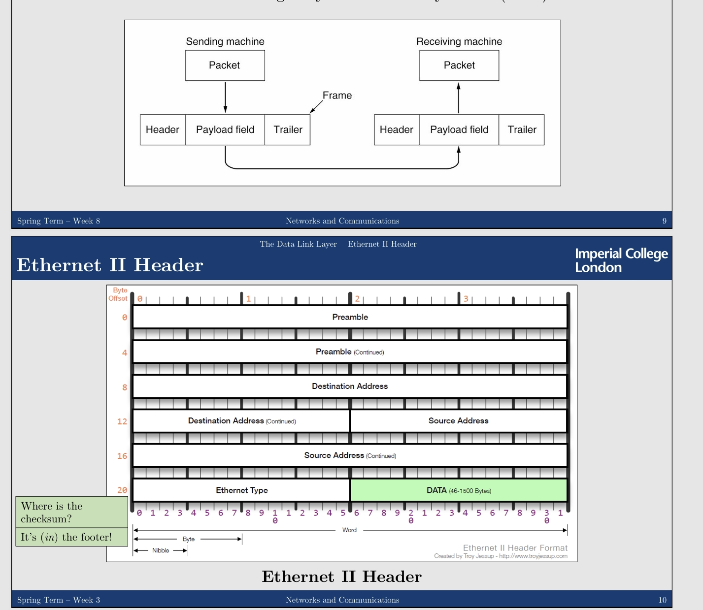
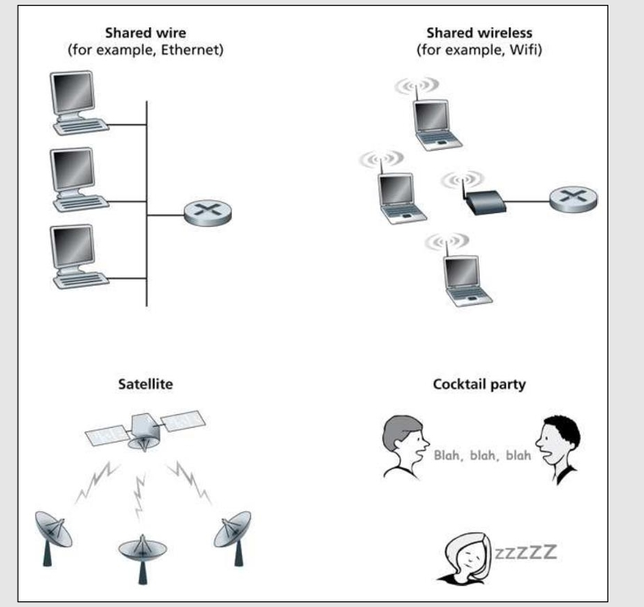
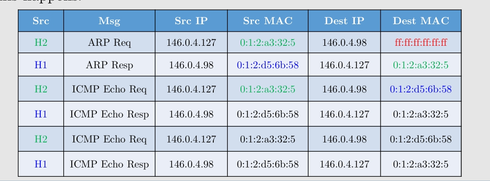

---
encrypt_content:
  level: Imperial
  password: Raymond#1234
  username: hg1523
level: Imperial
---
# Ethernet:
Meant for LAN/MAN/WAN
- Specification introduced in 1980

Made standard by the IEEE

Started using coaxial cable (10BASE5)
- ~2.94 Mbps

## Ethernet cables:
- UTP (unshielded Twisted Pair)
	- Cat 5e/Cat6a/Cat7a/Cat8 (latest)
- other types:
	- STP(Shielded/Screened Twisted Pair)
	- FTP (Foiled Twisted Pair)
	- SFTP (Shielded & Foiled Twisted Pair)
the goal is to protect against ElectroMagnetic Interference

## Ethernet Pinouts
- Straight-through: Media Dependent Interface (MDI)
- Crossover: Media Dependent Interface with Crossover (MDIX)

this uses the 568-B but 568-A is also widely used, the only difference is that hte WhiteOrange/Orange cables are swapped with the WhiteGreen/Green Ones

## Frame:
Core concept of Data Link is the Frame

Provides well-defined interface to Network Layer for sending/receiving packets

Identifies transmission errors using a Cyclic Redundancy Check (CRC) checksum

## IEEE MAC addressing
- Each Network Interface Controller (NIC) conforming to IEEE 802 has a MAC address
- 48 bits written as six colon-separated bytes in hex ($2^{48}$ addresses)
	- `<byte>:<byte>:<byte>:<byte>:<byte>:<byte>`
- OUID is a manufacturer specific -> guarantees uniqueness(the first 24 bits)
- I/G bit decides if "individual" or group addresses 
- U/L bit decides if univerally or locally adminstered

for example: 
- Host 00:90:27:A3:32:05 is individual (unicast) globally unique
- Broadcast address FF:FF:FF:FF:FF:FF is group (multicast) locally adminstered

we can sniff the MAC addresses using the following conditions

# Switch:

Allows us to connect to many devices to the same network (replaced network "Bridges")

THis is not a Router, but a smart repeater (still smarter than a plain hub/repeater)

it only forward messages outof the right port (unless it does not know where)

Its goal is to connect you to other computers
- It remembers which port you MAC is connected to using its Forwarding Information Base(FIB) MAC table

You can connect Hubs or Switches to Switches
- thus connecting many networks together

You may need to set static IP addresses
- if DHCP service is not avaliable

## Switching methods:

Store-and-Forwarding switching
- the whole frame must be received first and it can then be forwarded
	- larger frames take longer to forward, because they need to be received in full
Cut-through Switching
- begin forwarding the frame when you have enough information
	- (i.e. when you know where to forward it)
- less waiting time than store-and-forward
Store-and-Forward enabels the switch to check the frame for errors
- Cut-through does not do this, so the recipient needs to check instead

Bridges usually support Store-and-Forward, and Switches can support both

Other switching methods exist

## Switching Loops

If you wish offer alternative/backup paths
- you may choose to connect the same switch to the same network more than once
	- which will create a Switching Loop (Forwarding Loop)
This can cause broadcast flooding and thhus drown the network in frames

How to resolve this
- Enable Spanning Tree Protocol (STP, IEEE 802.1D) on the switches
	- since replaced by the Rapid Spanning Tree Protocol 
	- this makes the switches maintain a continuously spanning tree withe help of Bridge Protocol Data Units(BPDU)
(recall the spanning trees in graph theory)

# WireLess Access Point

Goes by the name 902.11
- uses 2.4GHz or 5GHz (or 6GHz) of the radio spectrym
- these are open for unlicensed use
This is still not a router, but a wireless repeater

Its goal is to connect you to other computers wirelessly, sometimes used to extend the range of networks

Can also act as a Bridge, connecting you to a wired network

You may need to set static IP address if DHCP service is not avaliable

## Example
in this graph, since a hub broadcasts the data, but a switch does end-to-end transmission, the eavesdropper can only hear 14,15

### Switched Ethernet
Typical Switched Ethernet topology
- Single machine connected to each Switch port
- Avois collisions on networks by separating collision domains
- Ideal(and usually impossible/unaffordable)

### Internetworking Ethernet
Shared medium
- Repeater copies bits to run over another cable length
- Regenerates/boosts the signal to extend the range of the network
- Forwards out of every port

Not really used these days

### Network Topologies

We dont always have Switches and Ethernet available, In the past, computers used to connect to the cable directly

They also tried more than one NICs

The Star topology were usually more successful than the other

### Bus Topology

- Used a main coaxial cable to connect all hosts
- Data travelled up and down this cable, called the "Bus"
- In order to add a new host, a BNC coaxial tee(T) connector/adapter was required
- The cable was cut and reconnected, with and added extension (i.e. the new host)
- At the end of each side of the cable a BNC terminator was added to signify the network ended there
- This is quite popular for a long time
### Ring Topology
- Connected all hosts in a (physical ring)
- Each host need two NICs to achieve this
- Data flowed around and around the ring
- If a link got cur, the network died, unless it was designed to adjust by changing the flow
- Dual-ring was also attempted, for data to flow both ways and also a back in case one ring goes down
	- which meant four NICs and too expensive for large networks
### Token Ring Topology
- Connect ll hosts in a logical ring
- An intermediate device was used to achieve this ,MultiStation Access Unit,(MSAU)
- Data flowed around by passing a token from one host to the next
	-  around and aroung as if this was a Ring Topology
	- When the data made their way back to their original sender, they were removed from the network
- If a host died, the network did not die with it, it just stopped passing the token to the dead host
- This was the predecessor of Switch

#### Listen Mode:

$H_n$ uses single bit buffer to copy input bit stream from $H_{n-1}$ to $H_{n+1}$

$H_n$ keeps copy of any frame addressed to it

#### Transmit Mode:

$H_n$ read sbit stream from $H_{n-1}$ in to memory and transmits frame from its memory to $H_{n+1}$

The whole frame does not need to fit on the ring -> any frame length may be used

#### Token Ring: Token Passing

- Only one host in Tx mode (the sender)
	- Drains off the frame F that it sent and places token T on ring
- Early release mode means token placed on ring before F arrives back
- Until then, all other hosts have to be in listen mode
	- hence no collisions can occur in the network

After sending token, host switches back to listen mode

Host not wanting to transmit can just pass token on 

Switches to transmit mode would:
- Drains off T and send data frame F

#### Token Ring Frames

When there is no frame to be sent, all stations are in Listen mode and only the token goes around the circle

Token consists of
- Start Delimiter
- Access Control
- End Delimiter

- Frame Check Sequence (FCS): The CRC checksum for integrity checks
- Frame Status (FS): Defines whether the address was found and the frame was copied
- InterFrame Gap(IFG): Gap between frames to separate them

#### Token Ring: Claiming the Token

Supports priority scheme:
- Can only claim token if data of priority at least high as token priority
- e.g. $H_2$ has priority 1 data $F_1$ -> can not take priority 2 token $T_2$

#### Token Ring: Reserving the Token

Supports reservation scheme:
- Host in listen mode might have high priority data to send
- Can increase reservation priority
- Token T always generated with priority of reservation bits in F
Priority scheme may cause low priority data to be delayed indefinitely, But guarantees high priority data to be sent quickly -> this makes it good for real-time applications

#### Token Ring: Acknowledgement

Acknowledgements part of the frame
- Frame status(FS) changed by reciever
	- A = 1: destination host is working
	- C = 1: destination host correctly read frame
#### Complexity of Ring Maintainance
- How to handle failure e.g. token loss or multiple tokens?
- Use Frame Control field to generate different control frames:
  - Special Active Monitor Station must take responisblity for generating token and draing orphaned frames
  - Since monitor may fail any host on network must be able to take on this funciton
  - Contention protocols are necessary for decideing who is monitor (leader election)
- This adds significant complexity to token passing, making it less reliable in practice
### Ring Topologies are Bad for LANs

Rings are unreliable: if one of them are broken then total ring failure

Wiring concentrators can be used to avoid single failure to break ring
- Switch out faulty hosts/links

### Fiber Distributed Data Interface(FDDI)

- RIng based network, token passing
- Optical fiber cabling
	- supports data transmission rates over long distances
- Example:
	- Class A hosts attached to both rings
	- Class B hosts attached only to one
- Not really used at the moment

Any faulty class B host will only affect one ring

#### Breaks in Ring/Fault Class A
- Class A hosts may 'short circuit' two rings together
	- Creates new single ring almost twice as long as original
	- All Class A hosts still be connected
- However, Rings can be up to 100km long
	- then FDDi must operate with length up to 200km

### Star Topology
- Eventually most networks started using multiport Bridges
	-  i.e. Switches
- Hosts connect directly to the Switch but there is no token to pass around
	- anyone can communicate with anyone else without waiting for a token (as long as they can agree on a way to avoid talking over each other)
	- imagine it looks like a star (Even wifi networks are based on the Star topology), a concept, rather than a physically start shaped structure
- However
	-  the central device is a Single Point of Failure like the Token Ring Topology
### Other Topologies:
- Line
	- Like a Ring that does not meet at the ends (terrible)
- Tree(Star Bus)
	- A hybrid
- Mesh(Some connected to Some)
	- useful but can be expensive
 - Fully Connected (every to every)
	 - Expensive, and potentially difficult/impossible to manage
### Medium Access Control Sublayer
- The Data Link layer can be divided even further

- IEE 802 standards define the LAN/MAN framework for
	- Media Access Control (MAC) sub-layer
	- Logical Link Control (LLC) sub-layer
- In topologies such as Token Ring, hosts are not expected to transmit at the same time
	- With Ethernet and Star networks however, this is not the case
- Problem:
	- What if the channel is a broadcast channel?
		- Multiple stations can recieve frames sent to channel
		- Multiple concurrent transmissions may lead to frame collisions
- Solution:
	- Need Medium Access Control (MAC) to coordinate channel access
#### Examples of Broadcast Channel

### Medium Access Control:

- Consider a wireless broadcast network
	- Possibility multiple access to channel
		- Two transmitters (radios) want to send at the same time then this leads to interference
	- Medium access control(MAC) describes how to resolve the conflict

- Frame collision: Assume that the two frame overlapping at Rx(recipient) are lost and must be retransmitted
	- Assumption always true in wired LANs
	- Might not be true in wireless networks
		- One transmitter may be stronger than another and thus may prevail (cannot be certain everytime)
### Medium Access Strategies
- No control
	- Simply let stations retransmit after collision
		- Fine if channel utilisation is low
		- Really inefficient if many devices are trying to get their frames into the network at the same time
- Round-robin
	- Stations take turns using the channel
		- Used by token-based MAC systems
		- Only the station with the token may transmit
- Reservations
	- Station need to obtain "channel reservation" before transmitting
		- Used in slotted system
		- Need to manage reservations
### Static Channel Allocation
- TDM and FDM can be used partition channels
- Consider N stations sharing a channel
- Time Division Multiplexing (TDM)
	- Station must wait for its turn to transmit
	- Transmission rate limited R/N, where R is maximum channel rate
- Frequency Division Multiplexing (FDM)
	- Station must use only limited frequency band
	- Bandwidth not fully utilised either: B/N where B is total channel bandwidth (Bad for large N with bursty traffic)
- Solution:
	- For packet data transmission, we want dynamic channel allocation
### Dynamic Channel Alocation: ALOHA protocol

- Simple idea:
	- When station has frame to be transmitted, just sent it
	- When collisions occurs, stations wait random amount of time and retries

- Contention based: stations may broadcast whenever necessary
- Fair channel access: any station has the same probability of transmission
#### Performance of ALOHA
- ALOHA suffers from low channel efficiency
	- Especially if there is much channel contention

- Large vulnerable period
	- New frames can easily destroy old frames being transmitted
#### ALOHA Efficiency

- For example:
	- Load of 50% gives maximum efficiency of 18%, so bad performance
	- only 18% of bandwidth is used for data transmission
	- There is no way of assuring that even this maximum efficiency is reached
#### Better Schemes for Dynamic MAC
- Improving ALOHA:
	- Slotted transmission: Only specific times (slots) when stations may transmit (reduces vulnerable period)
	- Slotted ALOHA
- Be polite - listen for other transmission before sending
	- Carrier sensing: transmission is allowed only when channel is idle
		- Carrier Sense Multiple Access
			- CSMA/CD (Collision Detection) -> Ethernet (IEEE 802.3)
			- CSMA/CA (Colision Avoidance) -> WiFi (IEEE 802.11)
- Generate agreement about what station can transmit next:
	- Token passing: station may only transmit when holding token
	- Token Ring
#### Slotted ALOHA:
- Station only permitted to send frame at start of fixed size slot
	- Assumes time synchronisation between stations

- Fixed slots for transmission reduce vulnerable period
	- Collision only happens with exact overlap -> contention for slot
#### ALOHA Exercise:

**The following sequence of random numbers drawn form 0 to 99 may be used in this question**

**80 33 72 35 51**

**In the questions each box represent 10 seconds and the leftmost box starts at T = 0**

**1. If five separate hosts each want to broadcast a 20 second long packet, and the random numbers is assigned to hosts $H_1$ to $H_2$ in order, shade in the diagram below that period each host transmits for**
(since this is slotted, the transmission only start at the beginning of a slot)
H5: 60 - 80
H4: 40 - 60
H3: 80 - 100 
H2: 40 - 60
H1: 80 - 100

**2. Which host(s) have a collision free broadcast**

only H5

#### Slotted ALOHA Efficiency

- Load of 100% gives maximum efficiency of 36%
- Still not very satisfactory performance
- Same basic problem as ALOHA
#### Carrier sensing:

it involves checking that channel is idle before transmission

consider listening in a chat before speaking something, does not ensure collision-free

#### Collision Detection:
- Station senses channel while transmitting to know that its frame is OK
- Tranmission stops as soon as collision occurs -> collision detection(CD)
	- Add jamming signal to create agreement about collision
- Combine MAC protocol called CSMA/CD
	- Host must transmit for long enough to know that frame is OK
	- Thus minimum frame length is $2\eta$ where $\eta$ is end-to-end propagation delay
#### Back-off when Channel busy
- 1-persistent CSMA
	- Station keeps checking if the channel is free ans then transmits immediately
	- (Ethernet)
- Non-persistent CSMA:
	- If the channel is busy, wait for a random amount of time before checking again and then transmit immediately
- p-persistent CSMA:
	- Station keeps checking if the channel is free and then transmits with probability p (between 1-persistent and Non-persistent)
#### Binary Exponential Back-off:
- Basis of MAC in Ethernet is 1-persistent CSMA/CD
	- To avoid poor performance when network load is high, we use binary exponential back-off
		- Minimum frame length is treated as slot length
- 1. When channel is idle, station may attempt to transmit
- 2. If collision occurs, wait either 0 or 1 slots before attempting to transmit again
- 3. If another collision occurs, waits 0 or 1 or 2 or 3 slots
- 4. After c collisions, choose slot in range 0 to $2^c-1$ for next attempt
- 5. Give up after upper limit of 1023 of range(10 collisions)
(Light Load)

- Probability of collisions occuring is low
	- During transmission, only few hosts wait to transmit
- Probably only few hosts in contention
(heavy load):

- High number of hosts likely to be in contention
	- Waiting only few slots would mean repeated collision very likely
- Binary exponential back-off algorithm quickly adapts to address this issue
#### Problems with CSMA/CD

- it has no notino of authority to transmit
- Collisions are inevitable -> best -effort service
- In worst case, particular station may be delayed indefinitely, which is unfair
	- This is acceptable for many applications, such as office LANs
	- But unacceptable for real-time system (e.g. nuclear power plant control)
		- Time that station waits must have fixed upper bound
		- Bandwidth available to each station must have fixed lower bound
### Medium Access using Token Passing

- Station must posses token in order to transmit
	- Token passed from one station to another (using special token frame)
	- Station with nothing to send -> pass token on immediately
	- Station with frame to send -> sets timer and transmits until timer expires or it has no more data to send
- However, Ethernet won the popularity contest

#### Keeping CSMA/CD: Carrier Extension

- Any frame < 512 bits is extended by the host sending carrier
	- (Minimum Frame Size = 64 octets = 512 bits)
		- 512Mbps / 10Mbps = 0.0000512s = 51.2$\mu$s (as per Classic Ethernet)
- Keep carrier on, to make the frame last enough time (as if it originally was 512 bits)
- Still allows network length to be 200m end-to-end(defined by the standard)
- Really inefficient
#### Keeping CSMA/CD: Frame Bursting

- Short frames need padding to make them long enough
- Allow hosts to send multiple frames
- Several short frames can be used to make one long frame (with carrier in between)
- Better because useful data are transmitted
- Allows us to increase the speed of network with minor (algorithmic) changes
#### Avoid Wired Collisions using Switched Topology

- It is possible to have multiple hosts transmitting simultaneously
- Each channel has at most two stations
- Switch ensures that collisions never occur
	- Buffer frames
	- Transmit when channel available
- Maximum cable length now determined by signal strength
#### Usage of IP addresses and MAC addresses
- IP addresses (Network Layer) specify address of hosts involved in end-to-end communication
	- IP addresses do not (have to) change as packets pass through a router
	- They can use the IP address of any host on the Internet
- MAC addresses (Data Link layer) specify addresses of hosts involved in communication on the same (sub)network
	- MAC addresses (usually) do change as frames pass through routers (as packets)
	- You can only use the MAC addresses of hosts within same subnet
#### Binding IP addresses to MAC addresses
- Addressing host using IP addresses is not udnerstood by NICs
- A host on an Ethernet LAN will only read messages encapsulated in Frames containing that host's hardware MAC address
- Problem: How do we find out the MAC of host given its ip address: using the ARP (address resolution protocol)

#### ARP (Address Resolution Protocol)
- ARP is used to discover network addresses
	- 1. Router: Ask each host on LAN if they have the requested IP address
		- Encapsulated query as ARP message in Data Link frame and broadcasts it
	- 2. Host: Checks if it has the requested address; if so, it sends a reply back with its MAC address
	- 3. Router: Receives ARP message, and (usually) caches the IP address along with the MAC address
		- Forwards the IP datagrams to correct host, encapsulating them in Data Link Frames
- Several optimisations are possible, e.g. caching recent replies, or having each machine broadcast its address when it boots/connects
- Type arp on Linux or arp -a on Windows to see what your computer currently knows/remembers (it does not necessarily store everything)
#### A complete communication (within one subnet)
- host1 => 146.0.4.98 and 0:1:2:d5:6b:58
- host2 => 146.0.4.127 and 0:1:2:a3:32:5
- host2 runs ping 146.0.4.98
Then:

- H2 first send the arp request to IP without knowing the MAC
- H1 replies to H2 by sending arp message with IP and MAC (from now H2 knows the H1 MAC)
- H2 then do the ping (sending multiple packets to H1, with one of then responds)

so the log would look like this:

