---
encrypt_content:
  level: Imperial
  password: Raymond#1234
  username: hg1523
level: Imperial
---
# Outline:
(A brief introduction to the physical Layer)
- Wires
- Signals and Waves
- Connections
- Packet Tracer Simulator
- Java Coding
-
# Introduction
We have now reached the bottom of the OSI model

(or any Internet Stack model for that matter)

This where the cables and their 0s and 1s live

# Media:

- Many types of conmmunication media
- usually divided into
	- wired
	- wireless
- Examples:
	- UTP
	- Radio
# Network layouts
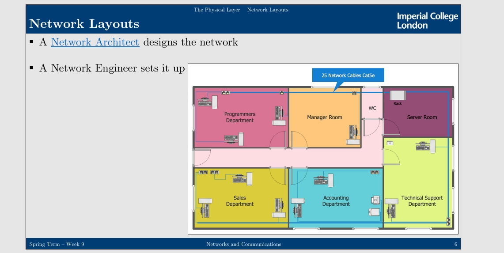
# Patch Panels
- Socket Panel
	- where the cables end up
		- this rarely changes
- Network Switch (Layer 2)
	- to create LANs
		- this can sometimes change
- Private Branch Exchange (PBX)
	- to interlink phone systems
		- IP PBX: supports Internet packets
			- e.g. for VoIP-based telephony
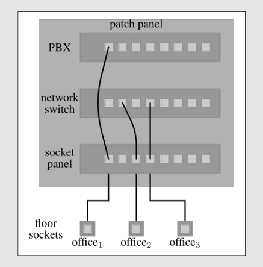
## Transmission Media: Coaxial Cable
- Coaxial cable reduces the problems associated with Twister Pair by placing the two conductors concentrically
- Considerably shielding benefits
	- electromagnetic field mainly between inner and outer conductor
- Supports a wider range of frequencies -> more bandwidth
- Higher cost per meter
	- so UTP wins for every-day users, or mass consumption
- TV cable system still use this
## Transmission Media: Optical Fiber
- Optical Fiber does not suffer from, nor generate, electromagnetic interference (EMI)
- Exploits refraction property light
	- When a light ray passes from one medium to another, it is refracted at the boundary
- Single optical fiber is 2-125 micrometers
- Attenuation is low (=how much signal is lost)
	- i.e. it can be used for long distances
- It has very high bandwidth, in Tbps and Pbps

Cables can be submarine

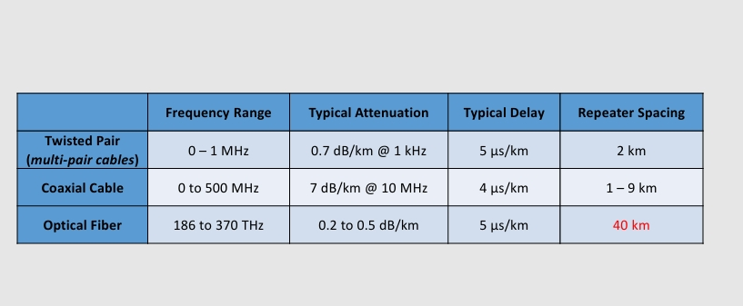
## Wireless Transmission
- Convenient when communication is required without need for wires
- Signal carried in electromagnetic spectrum
- Bidirectional communication by default
- Mostly broadcast medium
	- Good for networking with multiple stations
- Propagation effects by environment
	- Reflection
	- Obstruction by objects
	- Interference
### Transmission Media: Radio:

- Different frequencies have different propagation properties
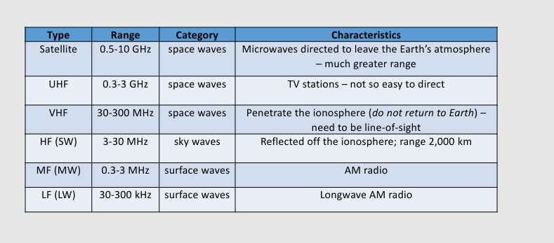

### WiFi(802.11)

- The most popular wireless century (so far)
- It uses bands offcial assigned/approved by:
	- Industrial/Scientific/Medical (ISM)
		- as per ITU (2.4-2.5GHz)
	- Unlicensed National Information Infrastructure (U-NII)
		- as per FCC(4.9-5.9GHz)
unlicensed bands can be prone to interference
# Information representation:
- Analogue:
	- Changes in the information are represented in some analogous manner in a physical property of the channel (A music disk e.g.)
- Digital:
	- Information is represented in a discrete set of states, using some coding scheme (A CD e.g.)
- Binary Digital Channel
	- Digital channel which uses two symbols/states (for 0 and 1)
- Symbol rate per second
	- a.k.a. Baud rate(Bd)
- i.e. How many times per times unit (a symbol can express more than 1 bits)
- Interlinked with bitrate
	- The number of times per time unit that the symbol/waveform can change depends on the medium
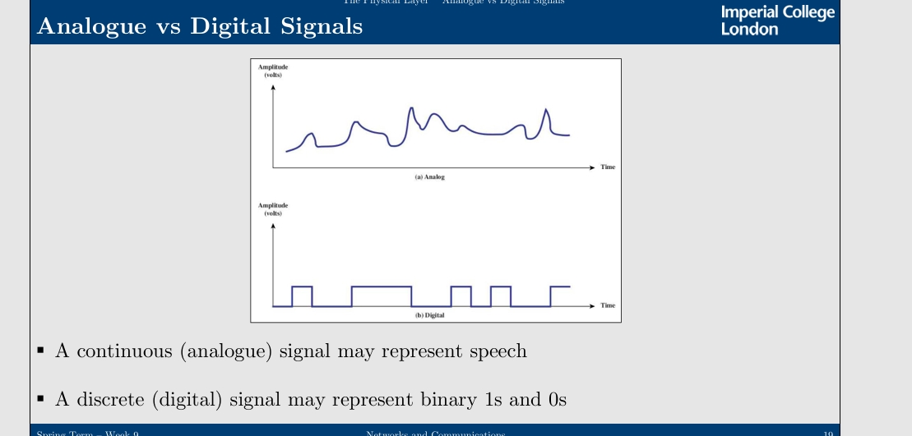

## Implementing one channel using another

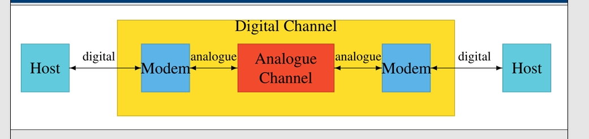
- Digital channel can be implemented by an analogue channel using a modern (modulator-demodulator)
- Analogue channel can be implemented by a digital channel using a codec (coder-decoder)
## Converting Between Analogue and Digital
- a codec and modern will require
	- Digital to Analogue Convertor (DAC)
	- Analogue to Digital Convertor (ADC)
	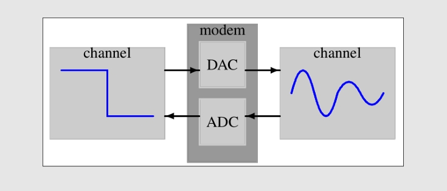
## Properties of Signals
- Waveform: Shape of signal
- Amplitude: Range of values signal varies over
	- maximum value or strength of signal
	- measured as electrical voltage, light brightness, sound pressure, etc.
- Wavelength ($\lambda$): Distance signal travels before repetition
	- i.e. length of single cycle of signal
	- typically measured as distance (e.g. in meters)
- Frequency: Number of repetitions per unit time
	- number of cycles of signal (e.g.) per second
	- typically measured in Hertz (Hz)
- $c = f\lambda$ (c is the speed of light i.e. $3\times 10^8 m/sec$)
## Modulation:
- Problem: How can we encode a (digital) information signal to be transmitted effectively using the bandwidth (i.e. range of frequencies) supported by a channel?
- Solution: Use a modulation scheme
- Transforms information signal into form more suitable for transmission
	- Baseband modulation: Transmit the information signal unmodified
		- for using dedicated lines/media in full
	- Broadband modulation:
		- Use physical carrier signal to encode information signal
		- Modify different features of carrier signal
			- Change amplitude -> high amplitude means 1, low amplitude means 0
			- Use different frequencies to represent different bits
			- Change phase of waveform
### Amplitude Modulation (AM)
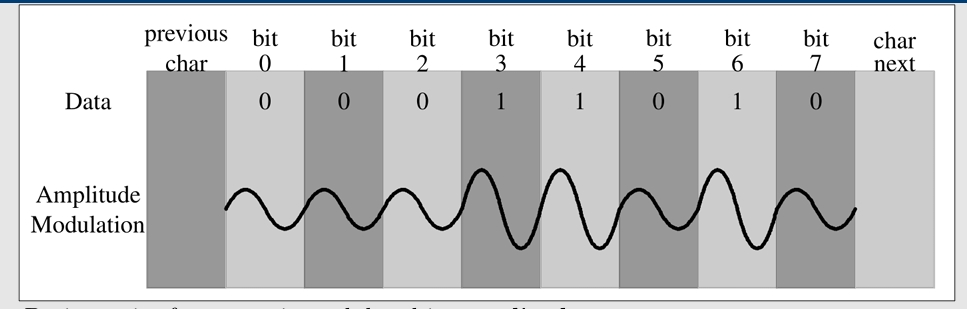
- Basic carrier frequency is modulated in amplitude
	- Higher amplitude = 1
	- Default amplitude = 0
- Also referred to as Amplitude Shift Keying (ASK)
### Frequency Modulation (FM)
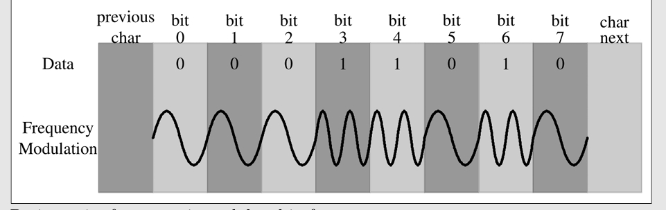
- Basic carrier frequency is modulated in frequency
	- Slight increase in frequency = 1
	- Base frequency = 0
- Also referred to as Frequency Shift Keying (FSK)
### Phase Modulation (PM)
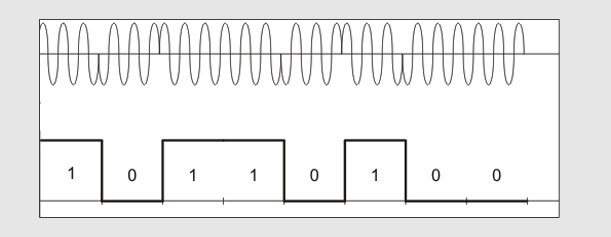
- Basic carrier frequency is modulated in phase
	- Shift in phase ("zero" crossing of waveform) indicate bit
- Also referred to as Phase Shift Keying (PSK)
### More advanced Modulation Techniques

- Question: How can we transmit at a higher data rate?
- Answer
	- Transmit multiple bits per "symbol" in modulation scheme
	- Use combination of modulation schemes to increase number of symbols
		- e.g. alter amplitude and phase at the same time
- Example:
	- Quadrature Phase Shift Keying (QPSK)
	- N-Quandrature Amplitude Modulation (N-QAM)
		- e.g. 4-QAM, 16-QAM, 64-QSM
	- + more
## Beyound 56 Kbps: Digital Subscriber Line(DSL)
- With the V.90 modern standard we managed to reach (on conventional phone lines):
	- 56000bps down stream & 33,000 bps upstream
- However, phone lines are artificially limit to 3000 Hz banwidth
	- Normal voice range from 400 Hz to 3400 Hz
	- no need for other frequencies for voice
- With DSL, we remove this bandwidth filter to the customer
- However, the limiting factor now becomes noise in the line
### Asymmetric DSL (ADSL)
- If a connection has about 1.1MHz of bandwidth
	- Divide bandwidth into 256 channels of 4000Hz each
	- channels 1-5 (4-25KHz) are not used to avoid interference
	- Allocate more channels for download than upload
		- Internet users mostly download
- With V.34 modulation 13.44 Mbps with 224 downstream channels
	- Think of this as QAM-240 operating in parallel across channels
	- Typically  8 Mbps supported more reliably (i.e. the actual speed)
#### ADSL Deployment
- Splitter separates voice band (0 - 4 kHz) from rest
- ADSL modern performs modulation
- DSL Access Multiplexer (DSLAM) recovers bit signal
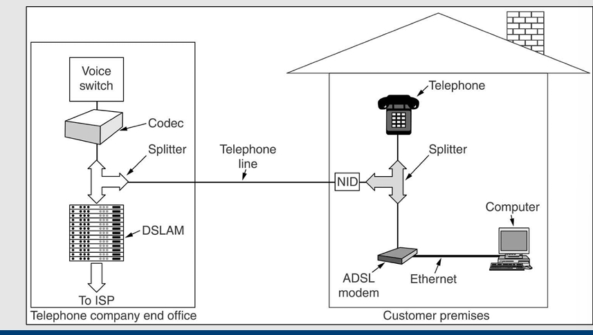

#### ADSL2(+) and VDSL
- Bandwidth of connection expanded to 2.2MHz
	- ADSL2: up to 12 Mbps download rate
	- ADSL2+: up to 24Mbps download rate
		- Uses more bits per symbol
- Bandwidth of connection expanded to 12 MHz
	- VDSL up to 52Mbps download rate
		- Very-high-bit-rate Digital Subscribe Line
- Bandwidth of connection expanded to 30 MHz
	- VDSL2: up to 200 Mbps download rate
		- (This is quite popular at the moment)
		
DSL Download Rate Depends on Cable Length
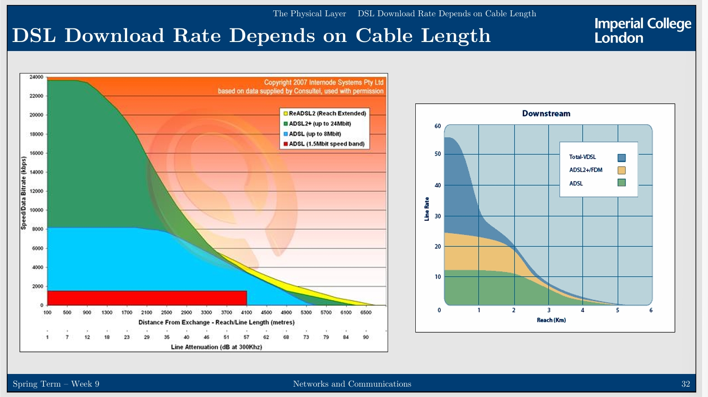

### Rule of thumb:

- we mentioned that $c=f\lambda$ (where $c\approx 3\times 10^8m/sec$)
- Since $c$ is a constant, if we know f we can find $\lambda$ (and vice verse)
- Rule of thumb:
	- when $\lambda$ is in meters and f is in MHz,
	- $\lambda f\approx 300$
- Examples:
	- 100 MHz waves are about 3 meters long
		- 1000 MHz waves are 0.3 meters long
			- 0.1 meter waves have a frequency of 3000 MHz
- Note: in copper or fiber the speed slows to about 2/3 of this (spped-of-light) value
# Network simulation:

## Small Office- Home Office Scnario

- You have been hired by a friend, who works from home, to set up his network.
- He owns 2 Laptops, 1 Desktop, 1 Smartphone, 1 Wireless Printer and 1 Server computer. 
- He wants all his devices to be able to communicate with each other, in order to share access to the printer, as well as the Web server which is running on the Server. 
- He also wants to allow his friends to be able to use his WiFiwhen they visit with their devices. 
- Design a network for this scenario by choosing the right equipment (i.e. networking devices and cables) and setup. a) Decide on the subnets; b)Decide on the equipment; c) Design the network.

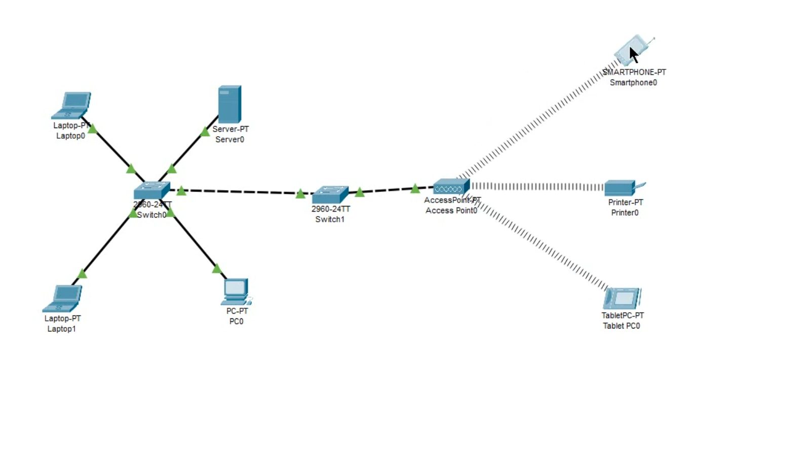

the access point is a wireless switch, and the devices nearby can connect to it, the laptops and Desktops need to connect with wire, while the phones and printer need to be connected wireless-ly, gives the picture above

This is ok in one subnet, but if the printer is in another subnet, we need to set the access list of the access point correctly an do a bit alterations (changing the switch to a router)

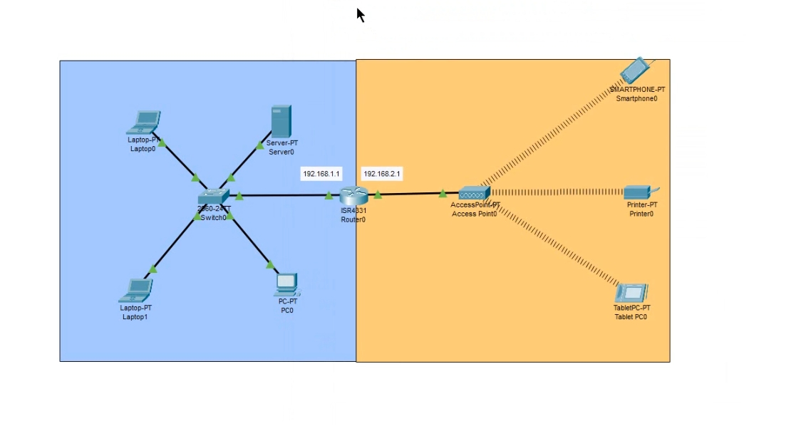

the different colors represent different subnets