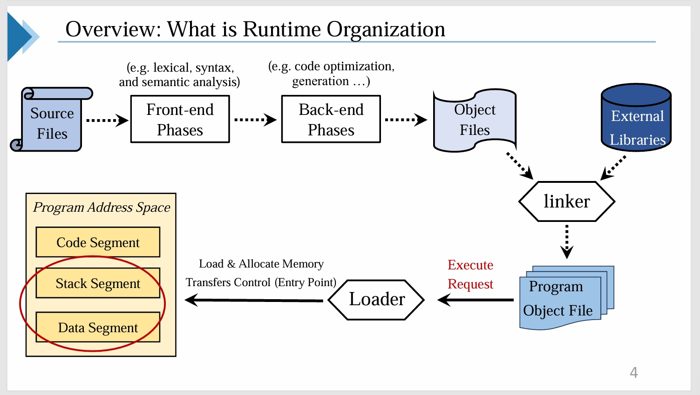
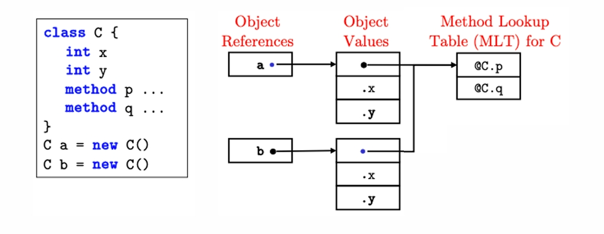
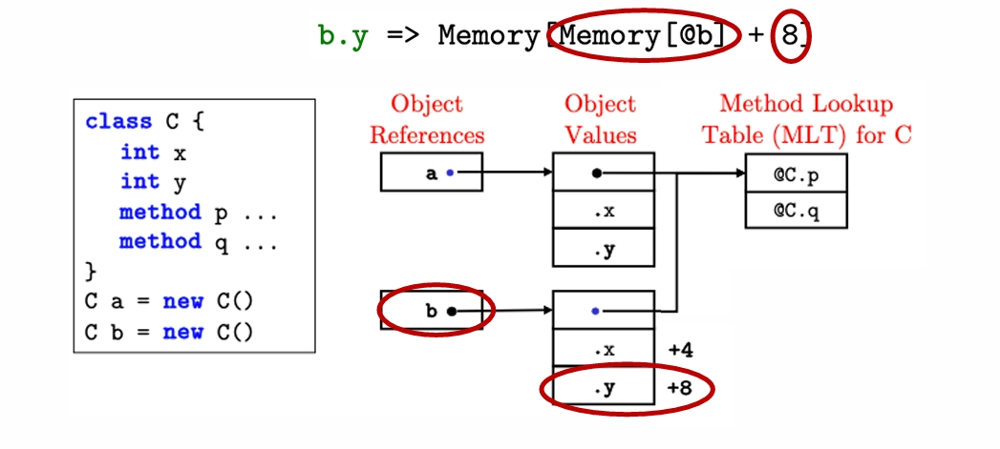
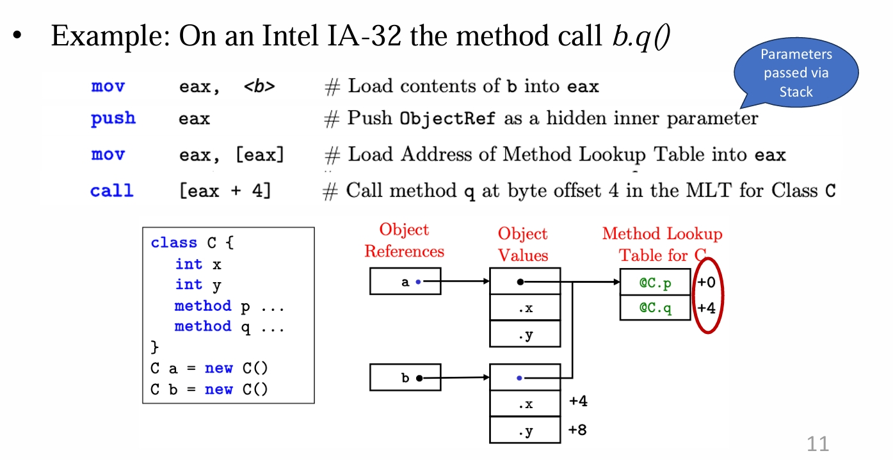
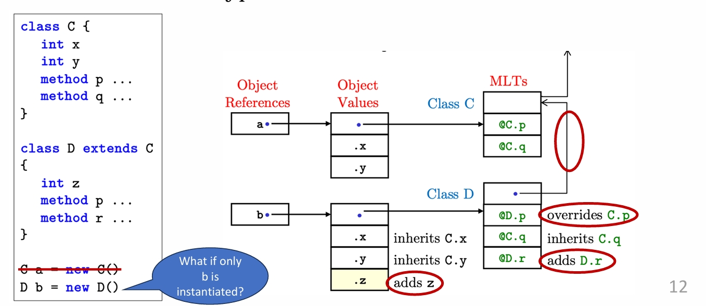
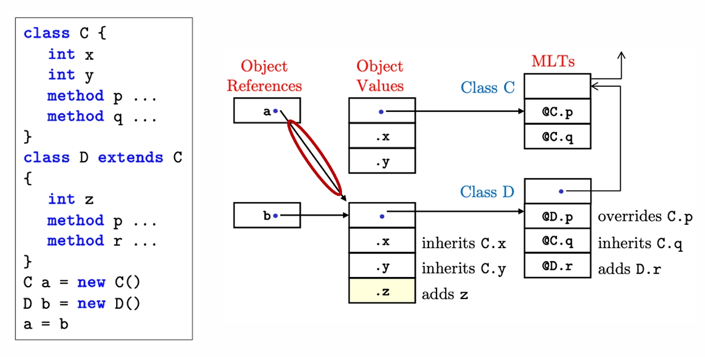
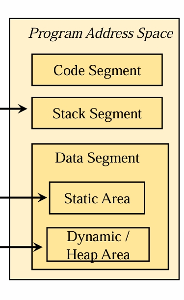
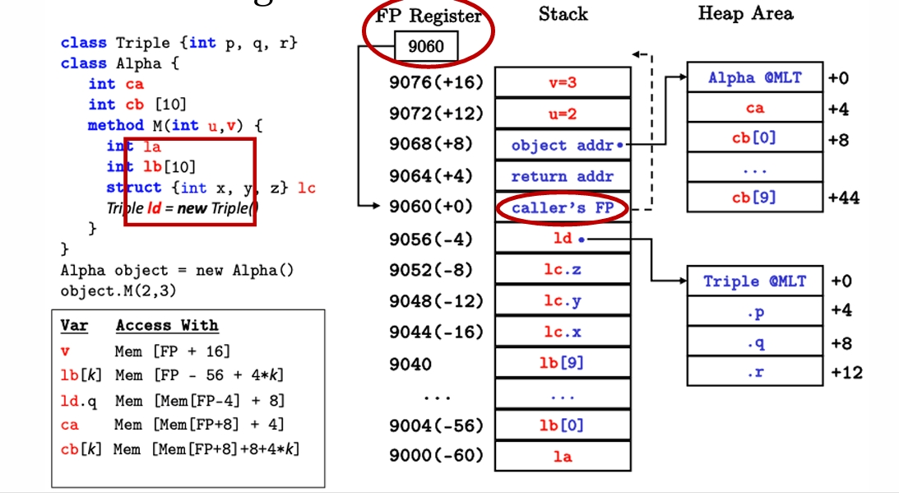
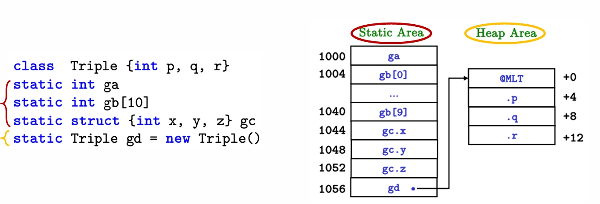
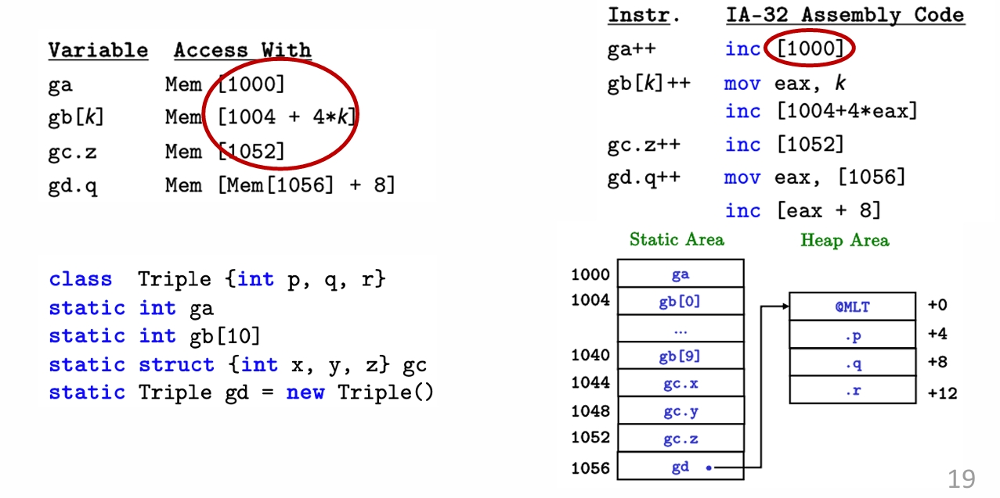

---
level: Imperial
---
---

level: Imperial

---

---


level: Imperial


---


---



encrypt_content:



  level: Imperial



  password: Raymond#1234



  username: hg1523



level: Imperial



---











# Variables:



## Primitive Types:



- Different memory sizes: depends on specific types



- Optimal memory access: align variables to boundaries/bandwidth



- Other emerging data type: Microscaling for deeplearning







| Primitive Type | Typical Sizes(Bytes) | Typical Representation         |



| -------------- | -------------------- | ------------------------------ |



| Boolean        | 1                    | 0 for false, non-zero for True |



| Integer        | 1,2,4,8              | 2's complement                 |



| Real           | 4,8,16               | IEEE floating point            |



| Char           | 1,2                  | 8-but ASCII or 16-bit UNICODE  |



|                |                      |                                |



## Records:



- Data structure with a group of variables (e.g. key-value pair)



- Can be different types and sizes



- Typically allocated consecutively in memory



- Easy for data access (addressing) and memory efficiency



```



Record = (Field1, ..., FieldK, ..., FieldN)



Size(Record) = Size(Field1) + ... + Size(FieldN) # sizes are in bytes



Address(FieldK) = StartAddress(Record) + Size(Field1) + ... + Size(FieldK-1)



```



## Arrays



- A group of variables with the same data type



- Typically allocated consecutively in memory



- Data access: integer expression indexing



```



Array = ElementType[TotalElements] # 0 to TotalElements - 1



Size(Array) = Size(ElementType) * TotalElements



Address(Element K) = StartAddress(Array) + K * Size(ElementType)



```







## Objects:



- More complicated features: methods, inheritance, overriding



- Referenced by a pointer (address pointing to memory location)



- 1. Pointer to MLT (method lookup table) 2. Data fields



- MLT: a list of poitner to different methods











### Data Field Access







- Access bby address offset



```



Object.Field => Memory[Memory[@ObjectRef] + ByteOffsetToField]



```



- Example: If addresses & integers are 4 bytes











### Method Calling



- To call a method(arg1, ..., argN)



```



Class.method(ObjectRef, arg1, ..., argN)



```



- Object reference (ObjectRef) is passed as a hidden parameter



- Translate to



```



CALL Mem[Mem[Mem@ObjectRef]] + [ByteOffsetToEntryInMLT]



```



- Different method callings controlled by address offset



- Example : On an Intel IA-32 the method call b.q()







### Inheritance & Overriding



- Extension of data structure & MLT



- Chained MLTs: type-tests







### Dynamic Binding



Assignment a = b by copying b's object reference to a







#### Java example



```java



class A {



	public int n = 1;



	public int get() { return n; }



}



class B extends A{



	public int n = 2;



	public int get() { return n; }



}



```







```java



class javaprog {



	public static void main (String args[]) {



		A a = new A();



		System.out.println(a.get()); // 1



		System.out.println(a.n); // 1







		B b = new B();



		System.out.println(b.get()); // 2



		System.out.println(b.n); // 2



	}



}



```







it will first try to find the method/attribute in the current class, if not found, then try inheritance







### Java example:







same definition of A and B







```java



class javaprog {



	public static void main(String args[]) {



		B b = new B();



		A a = b;



		System.out.println("a = b");



		System.out.println(a.get()); // 2, for methods it uses runtime type(actual object type)



		System.out.println(a.n); // 1, for fields it use the compile-time type (reference type for field access)



	}



}



```







Field access: compile-time based on the declared type







Look at the last slide, the object a reference is linked to a when we do `A a = b`, we let the reference of a point to b, so the runtime type is B with compile time type A



## Local vs. Global/Static vs. Dynamic Variables







- Local variables



	- Example: `void method() {int x = 10;}`



	- Lifetime: duration of the method call



	- Location: Stack Segment



- Static/Global (C/C++) variables



	- Example (within class): `static int y = 0;`



	- Lifetime: duration of the program



	- Location: Data Segment (Static Area)



- Dynamic variables



	- Example: `Obj z = new Obj();`



	- Lifetime: until garbage collection



	- Location Data Segment (Heap Area)











### Local Variables:



- Access via a Frame Pointer Register (base of stack frame)



- Intel IA-32: EBP register



- all local Variables are stored on the Stack, arrays are stored entirely on the stack, but object fields are stored in the heap











### Global/Static & Dynamic Variables (In details)



- No FP register required: base memory address to access



- Different areas in the data segment







### Global/Static & Dynamic Variables (In details)



- Instruction Translation



