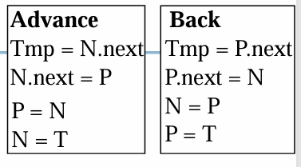
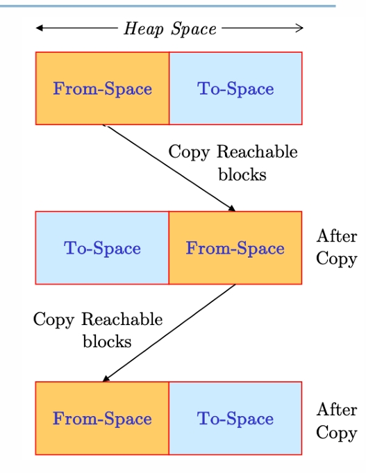

---
level: Imperial
---
---

level: Imperial

---

---


level: Imperial


---


---



encrypt_content:



  level: Imperial



  password: Raymond#1234



  username: hg1523



level: Imperial



---











# Recap: memory Layout for Variables



- Local variables:



	- Example: `void method() {int x = 10;}`



	- Lifetime: duration of method call



	- Location: Stack Segment



- Static/Global(C/C++) variables



	- Examples (within class) `static int y = 0;`



	- Lifetime: duration of the program



	- Location: Data Segment (Static Area)



- Dynamic Variables:



	- Example: `Obj z = new Obj();`



	- Lifetime: until garbage collection



	- Location: Data Segment (heap area)



# Questions last week



- To call a method (arg1, ..., argN) `Class.method(ObjectRef, arg1, ..., argN)`



- Object reference (ObjectRef) is passed as a hidden parameter



- Translate to: `CALL Mem[Mem[@ObjectRef]] + ByteOffsetToEntryInMLT`



- Different method callings controlled by address offset







# Heap Management



- Heap Allocation



	- What: map dynamic variables in the heap area



	- How: call an allocation function



	- Example: new in Java/malloc in C



- Heap De-allocation



	- What: free inactive memory space



	- Explicit: call de-allocator function



		- Risk: Dangling pointers(memory freed too early)



		- Data corruption and security issues



	- Implicit: Garbage Collection



- Heap Compaction



	- Improve memory utilisation/efficiency



	- Address fragmentation problems



	- Three phases to compact:



		- Marks the live block



		- Co-locate 'live' blocks



		- Update pointers to co-located blocks







### (In Details)



- Managed by FreeList (trasitionally)



	- FreeList: a chain of "free" (i.e. unused or returned or garbage collected) memory blocks in heap area



	- Tracking info of each heap block (e.g. sizes)



	- Facilitating block allocation







Example of management algorithm:











- Possible Improvement?



	- Maintain different free lists for different block size => faster allocation



	- For extensible arrays (strings), allocate more in the expectation that array (string) may grow => Trade-off



- Other issues



	- Memory alignment: Some architectures require certain data type to be aligned. For example on the SPARC, 64-bit IEEE values musts be aligned on 64-bit boundaries



	- Negative impact on caching: scattering data in memory that reduces spatial locality



# Garbage Collection (In Detials)



- Main benefits:



	- Avoid issues such as dangling pointers



	- Ease the burden of heap de-allocation



- Requirements of GC



	- Correctness



	- Speed



	- Memory Overheads



- Different GC algorithms (Java 13 have 5 Garbage Collectors)



	- Performance depends on applications



	- Trade-off among different metrics (e.g. latency and memory)



## Reference Counting GC



- Tracking the reference count in housekeeping part



	- Increase if a reference to the block is copied



	- Decrease if a reference to the block is removed











- Disadvantages or issues?



	-  Compiler to generate extra code for pointer manipulation



	- Cannot reclaim cyclic data structure without special techniques







## Mark Sweep GC



- Mark phase: Mark as live, all blocks that are reachable from non-heap



- Sweep phase: Scan all blocks, reclaiming dead blocks and unmarking live blocks



- Batch processing manner for efficiency







- Disadvantage or issues?



	- Runtime overhead



	- Fragmentation: Heap compaction can mitigate



## GC Algorithm3: Pointer-Reversal Marking



- Stackless depth-first traversal



- Via pointers: Previous(P) and Now(N)



- Temporarily modifying pointers for backtracking 











## Two Space GC:







- Split heap area into two spaces



	- From-space and To-space



	- Copy: From-Space exhausted



	- Swap the role of spaces



- Pros:



	- No pointer manipulation



	- Better spatial locality



- Cons:



	- memory consumption/efficiency







## Generational GC:



- Idea: consider the runtime info for GC



- Generation GC: divide the heap into several areas (generations) based on the age of the blocks(objects)



- Adaptively perform different GC algorithms for different areas



## GC summary:



- Performance depends on 



	- Hardware (e.g. memory/core configurations)



	- Workloads



	- Compiler support



- Trade-off among latency, throughout, memory efficiency



- More GC algorithms



	- Serial



	- Parallel



