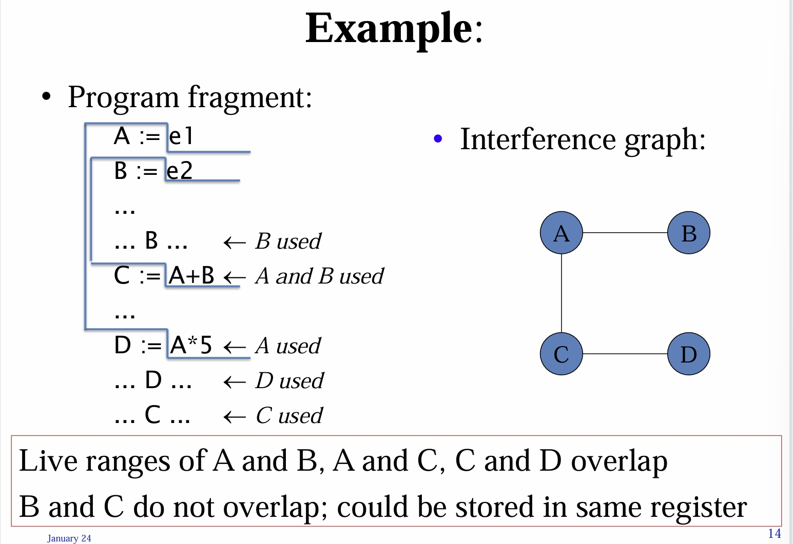
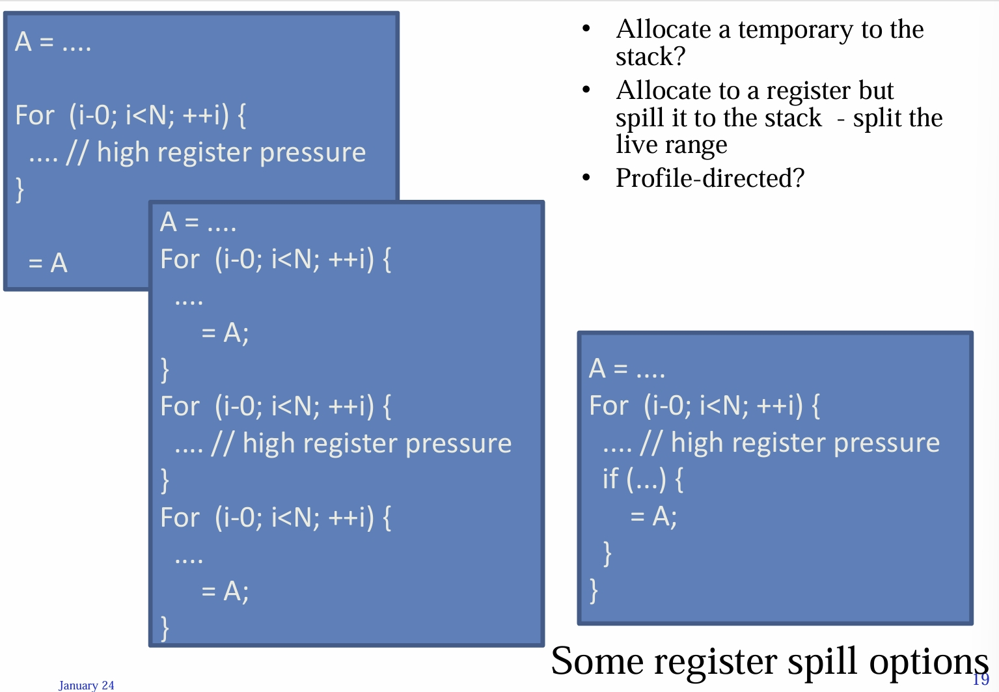

---
encrypt_content:
  level: Imperial
  password: Raymond#1234
  username: hg1523
level: Imperial
---

# Limitations of Sethi-Ullman register allocation scheme

The tree-weighing translator is a typical syntax-directed ("tree walking") translation algorithm: it works well in the terms of its input tree, but fails to exploit the context of the code being generated:
- It makes no attempt to use registers to keep a value from statement to statement
- In particular it does not try to use registers to store variables
- Doesnt handle repeated uses of variable

It is this exploitation of the context of the generated code which distinguishes an  optimising compiler from the straightforward compilers we have considered so far


## Importance of a more sophisticated register allocation:

for example:

```C
void f() { 
	int i, a; 
	for (i=1; i<=10000000; i++) 
		a = a+i; 
}
```
### code from cc  -S
it corresponds to the assembly:

```assembly
	movl #1,a6@(-4) // initialise the i to be 1
	jra L99 // jumps to label L99
L16: 
	movl a6@(-4),d0 // move a to d0
	addl d0,a6@(-8) // a = a + i
	addql #1,a6@(-4) // i = i + 1
L99: 
	cmpl #10000000,a6@(-4) // i < 10000000
	jle L16 // jump to L16
```

in this code, we have 5 instr'ns in loop, 4 memory references, Execution time 16.6 seconds


an optimised version of this would be

```
	moveq #1,d7 // i = 1
L16: 
	addl d7,d6 // a = a + 1
	addql #1,d7 // i = i + 1
	cmpl #10000000,d7 // if i < 1000000
	jle L16 // jump to L 16
```

4 instructions in the loop, no references to main memory

execution time: 8.3s

### x86:

unoptimized

```assembly
	movl $1,-4(%ebp) 
	jmp .L4 
.L5 
	movl -4(%ebp),%eax 
	addl %eax,-8(%ebp) 
	incl -4(%ebp) 
.L4: 
	cmpl $1000000000,-4(%ebp) 
	jle .L5
```
optimized

```assembly
	movl $1,%edx 
.L6: 
	addl %edx,%eax 
	incl %edx 
	cmpl $1000000000,%edx 
	jle .L6
```

## Moore's law:

- micro-processer performance doubles every 18 months

## Common subexpressions:

Example:

```
a1 := b1 + s * k
a2 := b2 + s * k
```

when the common subexpression is known to have the same value, we can write this as

```
t := s * k
a1 := b1 + t
a2 = b2 + t
```

where t is a new temporary variable introduced by the compiler

the weighted tree translations scheme cannot easily arrange for t to be stored in a register

# the smart allocator:

graph coluring:

- Use a simple tree-waling translator to generate an intermediate code in which temporary values are always saved in name locations (this is also referred to as "three address code"; resmebles assembler but with unlimited set of named registers)
- Construct the inference graph: the nodes are the temporary locations, and each pair of nodes is linked by an arc if the values must be stored simultaneously
- Try to colour the nodes, with one colour for each register, so no connected nodes have the same colour

for example:



so imagine, A would be coloured in red, B and C in green, D in red again (of course, not real colours)

so the code

```
A := e1 
B := e2 
... 
... B ... 
C := A+B 
... 
D := A*5 
... D ... 
... C ...
```

can be translated into

```
R1 := e1 
R2 := e2 
... 
... R2 ... 
R2 := R1+R2 
... 
R1 := R1*5 
... R1 ... 
... R2 ...
```

##  implementation:

- Finding the live range is easy in straight-line code
- In code with branching and loops, data flow analysis is needed
- The problem of determining whether a given grpah can be coloured with a given number of colours is NP-Complete
- but this is not such a serious problem as a good fast heuristic is adequate and not hard to invent

## Spilling:

If the attempt to colour the graph using available registers fail, must spill some register:

- i.e. choose an arc in the graph and break it
- i.e. choose a variable whose live range is causing trouble and split its live range
- we can do this by adding code to store it to memory and reload it later
- then redo analysis to update the inference graph and attempt to colouring again; if no success split another live range
- Key: strategy to choose values to spill, Avoid adding spill code to the innermost loop (e.g. prioritise values by their nesting depth), and Split a live range that will enable colouring

for example, here are some options:

