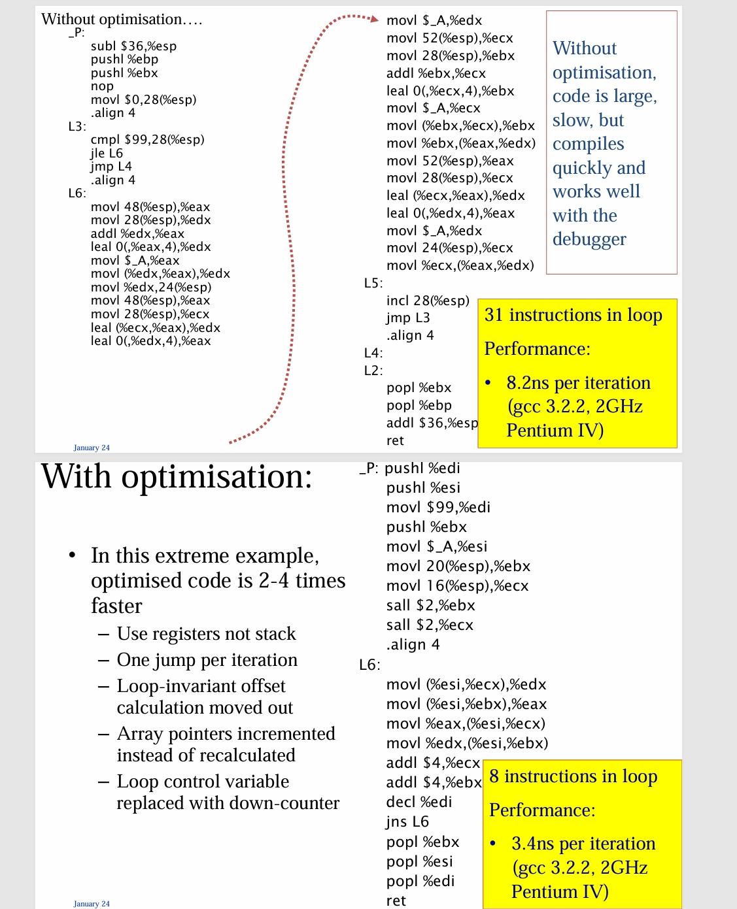
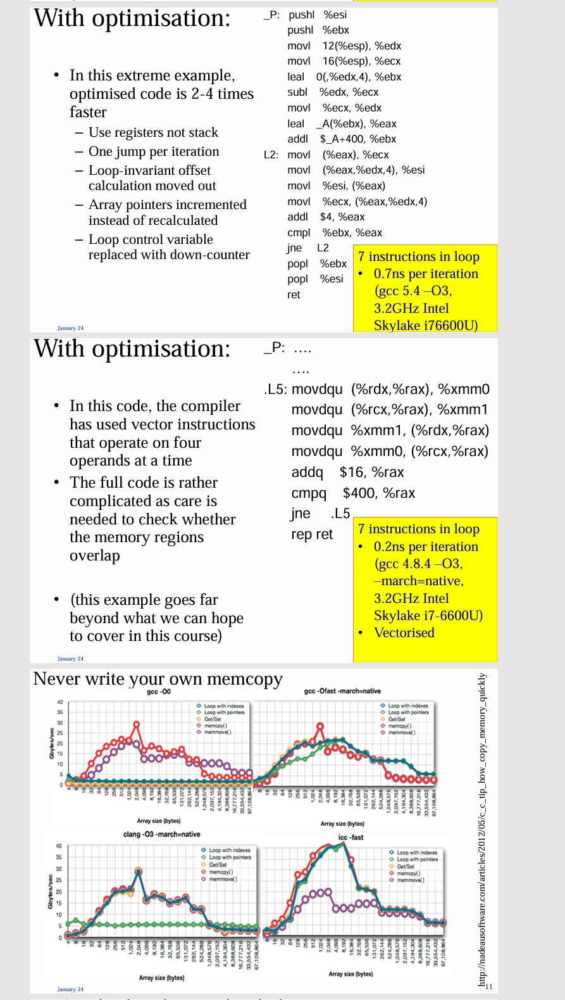
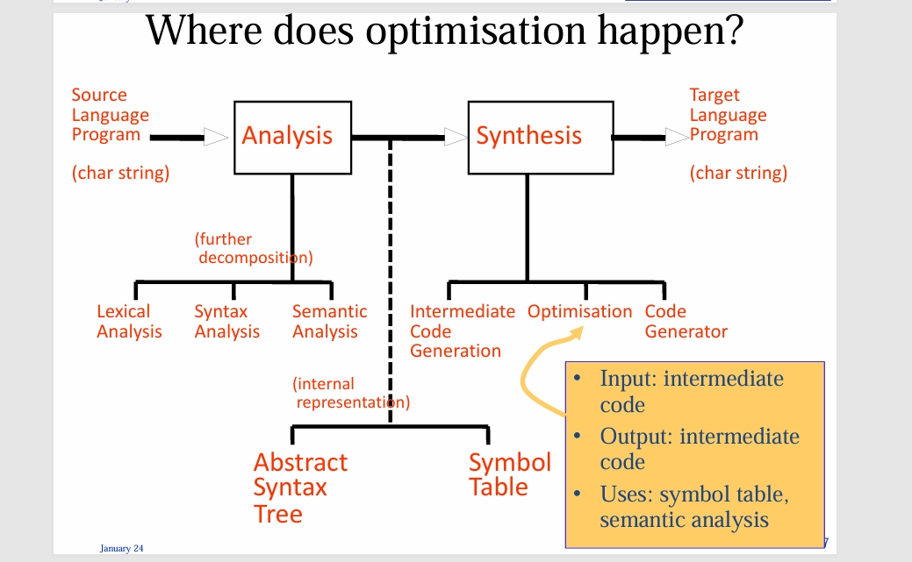

---
level: Imperial
---
---

level: Imperial

---

---


level: Imperial


---


---



encrypt_content:



  level: Imperial



  password: Raymond#1234



  username: hg1523



level: Imperial



---











# overview:







- This introductory course has focused so far on fast, simple techniques which generated code that works reasonably well



- We now briefly look at what optimising compilers do, and how they do it



- Compare 'gcc file.c' v.s. "gcc -O file.c"



- According to the gcc manual page:



	- without -O, the compiler's goal is to reduce the cost of compilation and to make debugging produce the expected results. Statements are independent: if you stop the program with a breakpoints between s, you can then assign a new value to any variable or change the program counter to any other statement in the function and get exactly the results you would expect from the source code



	- Without -O, only variables declared "register" are allocated in registers



# example:



```C



void P(int i, int j) {



	int k, tmp;



	for (k = 0; k < 100; k++) {



		tmp = A[i+k];



		A[i+k] = A[j+k];



		A[j+k] = tmp;



	}



}



```











Examples:



- Use registers not stack



- One jump per iteration



- Loop invariant offset calculation moved out



- Array pointers incremented instead of recalculated



- Loop control variable replaced with down counter







# some principles:



- To generate really good code, need to combine many techniques, including both high-level and low-level



- High-level example: inlining



	- replace a call f(x) with the function body itself



	- Avoids call/return overheads



	- Also creates further opportunities



	- Can we inline virtual method calls x.f(y)? This require static analysis of possible types of x



- Low-level example: instruction scheduling



	- Re-order instructions so processor executes them in parallel



	- To switch order of load A[i] and store A[j], need dependence analysis: could i and j refer to same location?



# peephole optimisation: A simple local technique







- Scan assembly code, replacing obviously inane combinations of instructions (e.g. mov R0 a; mov a R0)



- Easy to implement



```haskell



peep::[Instruciton] -> [Instruction]



peep (Store r1 dest: Load r2 src: rest)



	| src == dest



		= Store r1 dest : (peep (Load r2 r1: rest))



	| otherwise



		= Store r1 dest : (peep (Load r2 src : rest))



```







This is not over, we can consider other combinations according to the code







but there is a phasing ordering problem: in which sequence should optimisation be applied







## Spectrum:



- Peephole optimisation works at instruction level



- The sethi-Ullman weights algorithm: expression level



- Local optimisation works at the level of basic blocks - a sequence of instructions which has a single point of entry and a single point of exit (generally runs quickly and easy to validate)



- Global optimisation works on a while procedure (may have worse-than-linear complexity, eg. O(N^2) where N is the number of instructions, basic blocks or local variables)



- Inter procedural optimisation works on the whole program(rare - hard to avoid excessive compilation time)



# Some loop optimisations



- Loop-invariant code motion



	- An instruction is loop invariant if its operand can only arrive from outside the loop



	- move loop-invariant instructions into loop header



- Detection of induction variables



	- Induction variable is a variable with increases/decreases by a (loop-invariant) constant on each iteration (+, $*$, or loop index)



- Strength reduction: calculate induction variable by incrementing, instead of multiplying other induction variables



- Control variable selection: replace loop control variable with one of the induction variables actually used in the loop











## Intermediate code:



- In our simple compiler, translator traverses AST and produces assembler code directly



- In optimising compiler, translator traverses AST and produces "intermediate code"



- Intermediate code is designed to 



	- Represent all primitive operations necessary to execute the program



	- In a uniform way, easy to analyse and manipulate



	- Independently of target instruction set



- Compiler writers argue, Appel advocates two IRs:



	- Tree: before instruction selection



	- FlowGraph: after instruction selection



- IR uses "temporaries" T0, T1, T2... instead of real registers; after optimisation, use graph colouring to assign temporaries to real registers



# Summary:



- Optimisation consist of analyses and transformations



- Key optimisations include common sub-expression elimination, loop-invariant code motion, induction variable selection, strength reduction, dead code elimination (there are many more)



- Low-level optimisations: instruction selection, instruction scheduling, register allocation



- High-level optimisations: function inlining, loop unrolling - often enable other optimisations



	- The phase ordering problem is the challenge of finding the right order in which to apply optimisations



- Intermediate representations(IRs) are design to make anlyses and optimisations easy



- Compilers successively lower high-level IR to low-level IR



- Optimisation algorithms that work at the function level may have worse-than-linear time complexity



	- But inter-procedural, whole-program("link time") optimisation need to be $O(n)$