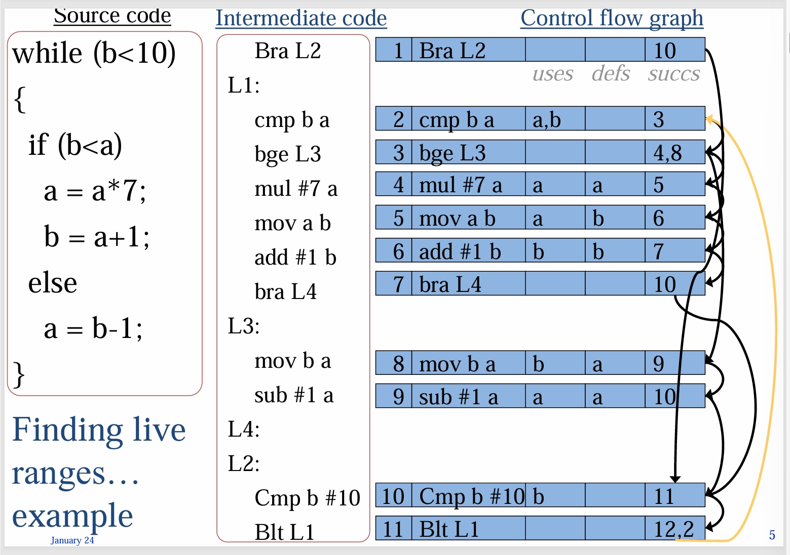
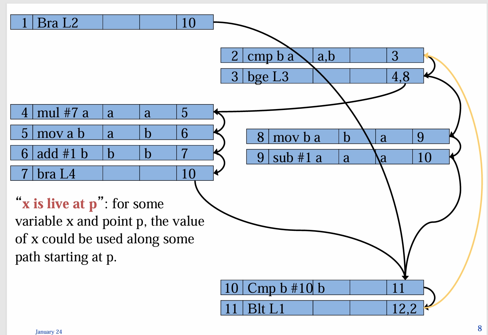
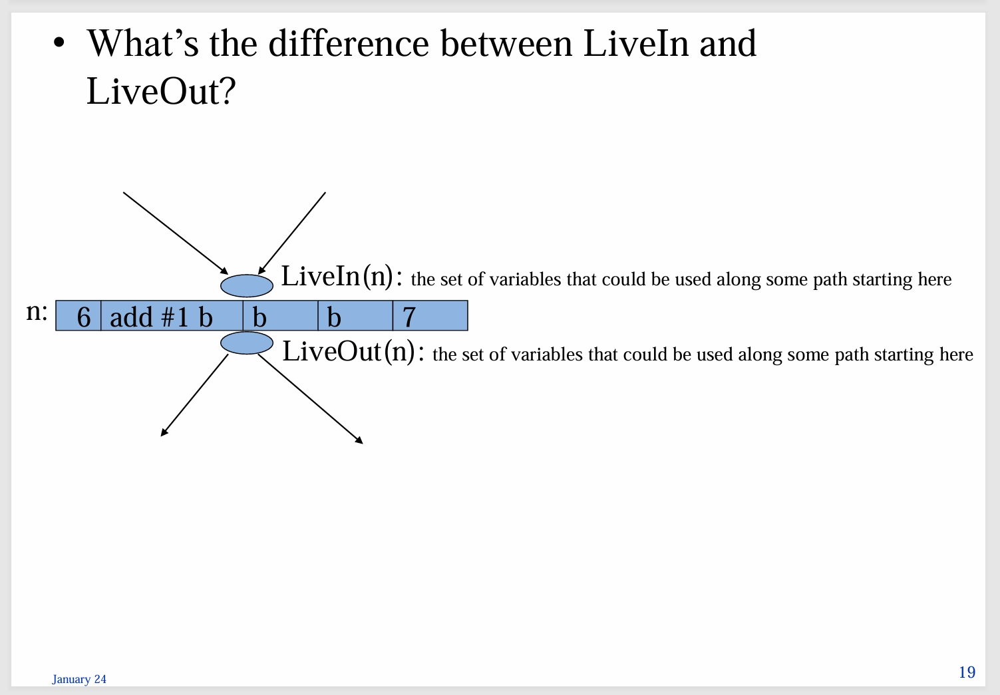
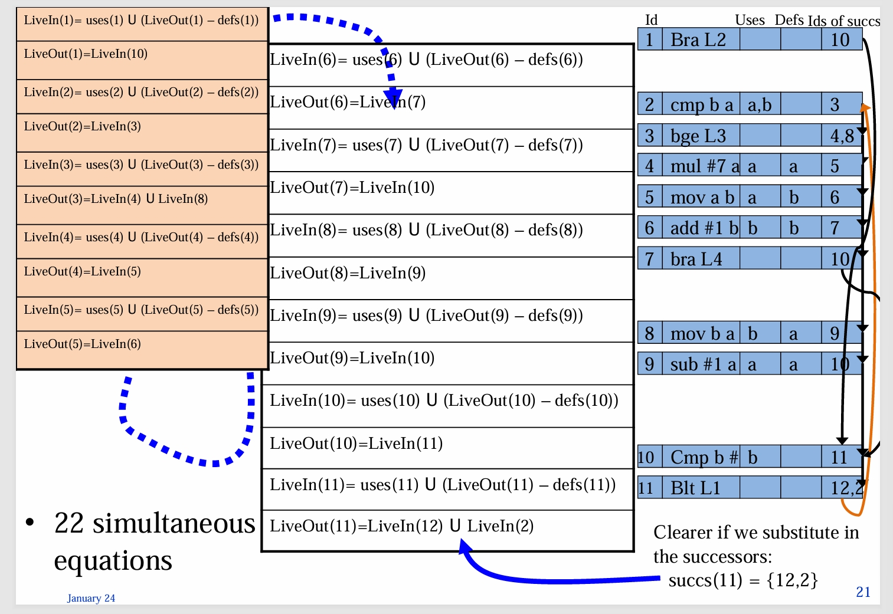
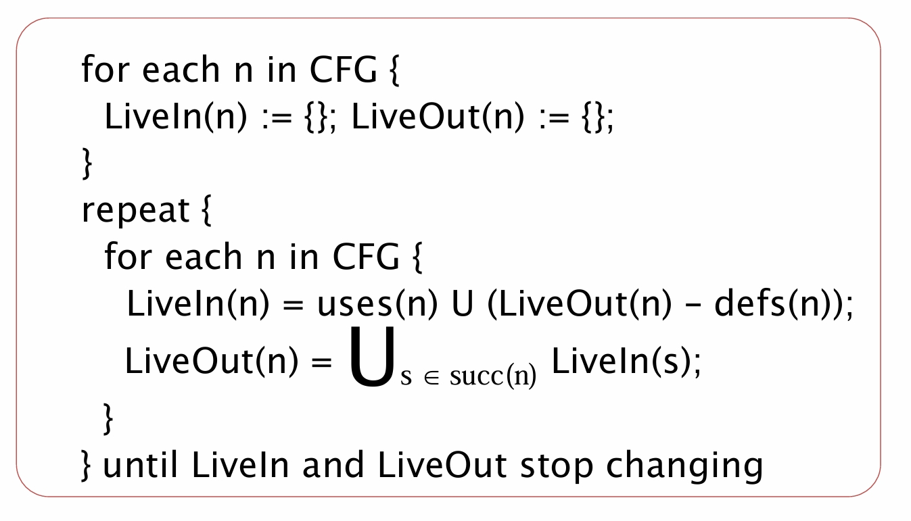
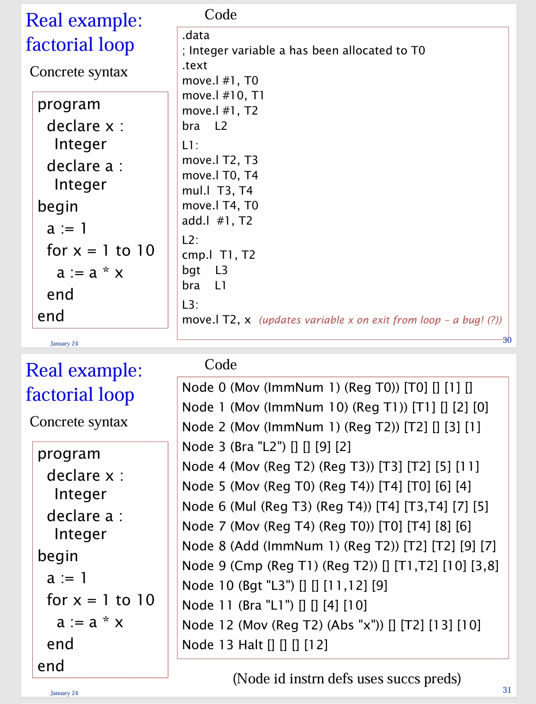
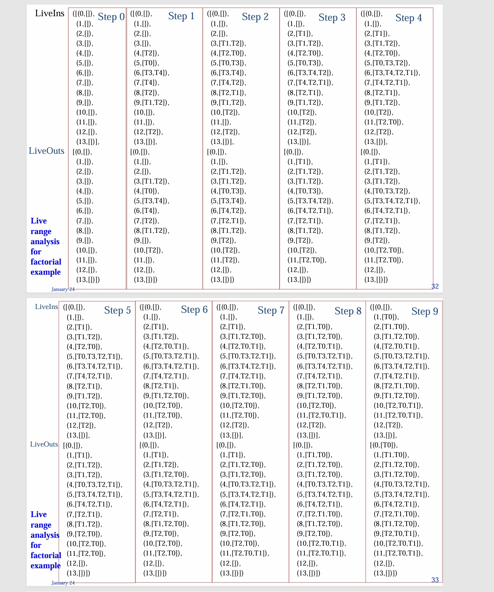
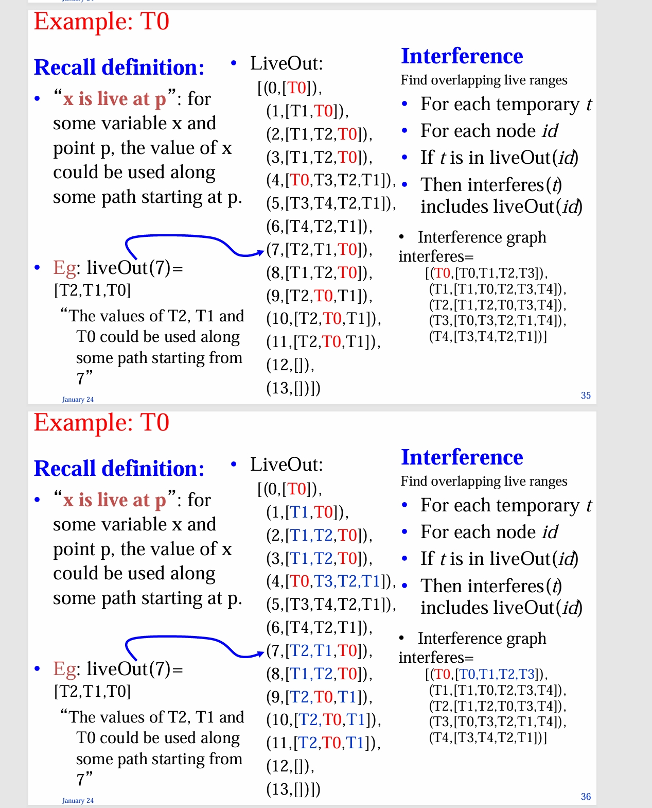
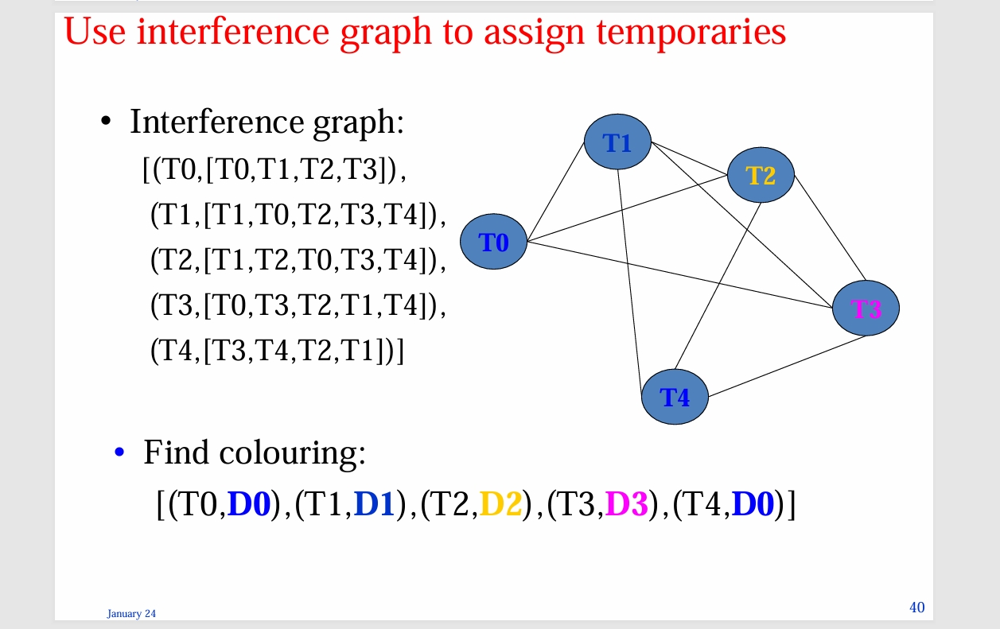
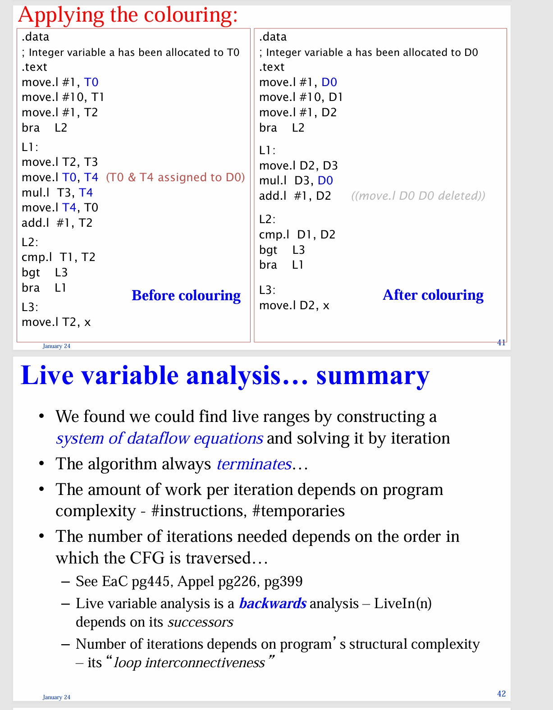

---
encrypt_content:
  level: Imperial
  password: Raymond#1234
  username: hg1523
level: Imperial
---
# Dataflow analysis (DFA)
- Optimisation consists of analysis and transformation
- Analysis: deduce program properties from IR
	- Analyse effect of each instruction
	- Compose these effects to derive information about the entire procedure
- Consider `Add (Reg T0) (Reg T1)`
	- Uses temporaries T0 and T1
	- Kills old definition of T1
	- Generates new definition of T1
- We will see how to do dataflow analysis in order to use this local information to derive global properties
## Example dataflow analysis: live ranges
- Recall graph colouring
- 1. Generate code using temporaries T0 ... instead of registers
- 2. For each temporary Ti, find Ti's "live range" - the set of instructions for which Ti must reside in a register
- 3. If LiveRange(Ti) intersects LiveRange(Tj) they have to be allocated different registers - they interfere
- 4. Assemble the register interference graph (RIG)
- 5. Colour the RIG by assigning real registers to temporaries avoiding interference
- 6. If successful, replace temporaries with registers and generate code
- 7. If graph cannot be coloured, find a temporary to spill to memory, then retry
## Preliminary: build the control flow graph

```haskell
data CFG = ControlFlowGraph [CFGNode]
data CFGNode = Node Id Instruction [Register] [Register] [Id]
-- the first [Register] is the registers which this instruction reads, (uses)
-- second [Register] is the list of registers which this instruction updates (defs)
-- [Id] is the list of node which might be executed next(succ), may have mutiple values when branch is involved

type Id = Int
data Register = D Int | T Int (temporaries before, real after)
buildCFG :: [Instruction] -> CFG
```

Each node of the control flow graph contains an instruction, together with
- nodeDef cfgnode = list of temporaries which this instruction updates
- nodeUses cfgnode = list of temporaries which this instruction reads
- nodeSuccs cfgnode = list of nodes which might be executed next
each line of the following is a individual cfgnode


## Live variable analysis - definition:
- Point: any location between adjacent nodes
- Path a sequence of point $p_1\dots p_ip_{i+1}\dots p_n$ such that $p_{i+1}$ is the immediate successor of $p_i$ in the CFG
- "x is live at p" for some variable x and point p, the value of x could be used along some path starting at p
- we could work this out with a depth-first search - for every variable and for every point. We are looking for a more efficient algorithm, that computes the set of all live variables at every point
use the same example:

- b is live-out from node 1 because it is used in node 10 and there is a path from 1 to 10
- b is live-out from node 2 because it is used in node 8, and exists a path 2 -> 3 -> 8 (although this path may not be taken)
- but notice that b is not live-out from node 4 because node 5 overwrites b's values - the value from node 4 can't reach further
## Dataflow equation for live variable analysis:
Define:
- LiveIn(n): the set of temporaries live immediately before node n
- LiveOut(n): the set of temporaries live immediately after node n
	- $\text{LiveOut}(n) = \underset{s\in\text{succ}(n)}{\cup}\text{LiveIn(s)}$ (The union of the liveIns of all this node's successors)
- A variable is live immediately after node n if it is live before any of n's successors
- A variable is live immediately before node n if:
	- It is live after node n (i.e. some later instruction reads it)
	- Unless it is overwritten by node n OR It is used by node n (i.e. the instruction reads it)
	- $\text{LiveIn}(n) = \text{uses}(n)\cup (\text{LiveOut}(n) - \text{defs}(n))$

- The difference between LiveIn and LiveOut

example:


## Solving the dataflow equations

- We have a system of simultaneous equations for $\text{LiveIn}(n)$ and $\text{LiveOut}(n)$ for each node n
- We can solve them by iterations



## Derive interference graph from live ranges


for example, T0 appears in the LiveOuts of $[T0] [T1, T0], [T1,T2,T0], [T0, T3, T2, T1]...$ but never co-exist with T4, so the interferes of T0 is [(T0, [T0,T1,T2,T3])]

we can then use the interference graph to assign temporaries with the graph colouring algorithm



