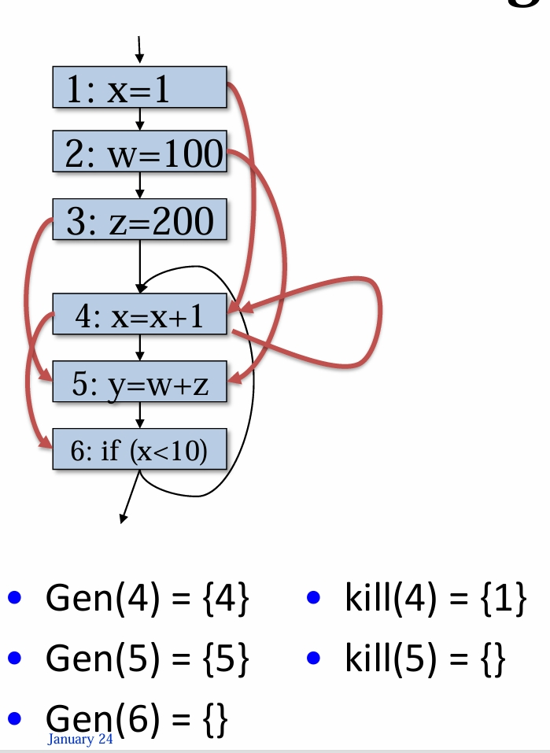
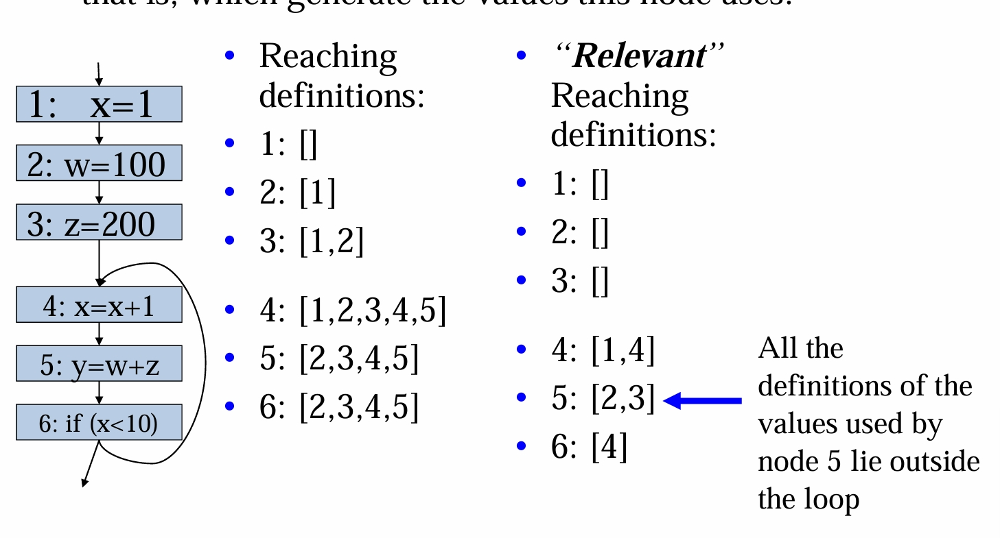

---
encrypt_content:
  level: Imperial
  password: Raymond#1234
  username: hg1523
level: Imperial
---
# Loop invariant code motion:

- Definition:
	- An instruction is loop-invariant if its operand can only arrive from outside the loop (mentioned before in lecture6-part1)
- Objective
	- move ("hoist") loop-invariant instructions out of loop
- Issues:
	- How can we find out whether operands only arrive from outside loop
	- Where should we move loop invariant instructions to?
	- Other pitfalls
## Finding loop invariant instructions
- A CFG node is a definition if it updates a temporary
- In our CFG, an instruction can update at most one temporary t
- Each definition node is labelled with Node id, d: $d: t:=u1\oplus u2$ or simply $d: t:= u1$ ot $d: t:= \text{constant}$ where u1 and u2 are given by the Node's uses field
- This definition is loop invariant if, for each $u_1\in uses(d)$
	- All the definitions of $u_1$ that reach d are outside the loop
	- Or only one definition of $u_i$ reaches d, and that definition is loop invariant
## Finding reaching definitions
- A definition of variable t is a statement which may assign to t
- A definition d reaches a program point p if there exists a path from d to p such that d is not killed along that path
- Consider a CFG node
$n:\quad t:=u1\oplus u2\quad(defs(n) = \{t\},uses(n) = \{u1,u2\})$
Define:
- Gen(n) is the set of definitions generated by node n i.e. $\{n\}$
- Kill(n) is set of all definitions of t, excluding n
- ReachIn(n) is the set of definitions reaching the point before n
- ReachOut(n) is the set of definitions reaching the point after n
## Reaching definitions
- Reaching definitions link each use of a variable back to where its value could have been generated
- Loops and conditional result in multiple reaching definitions
- (In the worst case, the number of reaching definitions could be quite large)
- 
### another data flow analysis:
- Dataflow equations:
$$\begin{aligned}
ReachIn(n) &= \underset{p\in pred(n)}{\cup} ReachOut(p)\\
ReachOut(n) &= Gen(n) \cup (Reach(n) - Kill(n))
\end{aligned}$$
- Many dataflow problems have "gen" and "kill"
- In the case of ReachOut(n):
	- gen(n) is usually just its own id, $\{n\}$
	- But if node n defines no value (eg it's a jump), it will never reach anything - so gen(n) = {}
- Solve in the usual way, 
	- Initialise ReachIn(n) and ReachOut(n) to {}
	- iterate, repeatedly updating ReachIn(n) and ReachOut(n) using definitions above
	- Until convergence
	- At each step, the sets increase in size
### Use reaching definitions to find loop invariant instructions
- Find the set of definitions of variables used by this node
- An instruction is loop invariant if the definitions of all the values it uses are outside the loop
- Example:
```
1 x = 1
2 w = 100
3 z = 200
  Here:
4 x = x + 1
5 y = w + z
6 if (x < 10) goto Here
```

gen(1) = {1}  kill(1) = {4} ReachIn(1) = {}           Reachout(1) = {}       
gen(2) = {2}  kill(2) = {}   ReachIn(2) = {1}            Reachout(2) = {1}
gen(3) = {3}  kill(3) = {}   ReachIn(3) = {1,2}          Reachout(3) = {1,2}
gen(4) = {4}  kill(4) = {1} ReachIn(4) = {1,2,3,4,5}  Reachout(4) = {2,3,4,5}
gen(5) = {5}  kill(5) = {}   ReachIn(5) = {2,3,4,5}    Reachout(5) = {2,3,4,5}
gen(6) = {}    kill(6) = {}   ReachIn(6) = {2,3,4,5}    Reachout(6) = {2,3,4,5}

Reaching definitions is ReachIn

### Use reaching definitions to find loop invariant instructions
- Find the definitions which reach this node which are relevant
	- that is, which generate the values this node uses:

so basically
- if node n is a definition and is in the reaching definition, then it is in the relevant reaching definitions
- for any variable that appear in the instruction, find the instruction which defines it (notice some instructions like 1 have been killed by 4 in, for example, 6)

# Summary:
- We can find loop-invariant instructions
	- We will use this shortly to actually optimise the code
- We used another data flow analysis: "reaching definition"
	- ReachIn and ReachOut are sets of definitions
	- This is a forward analysis