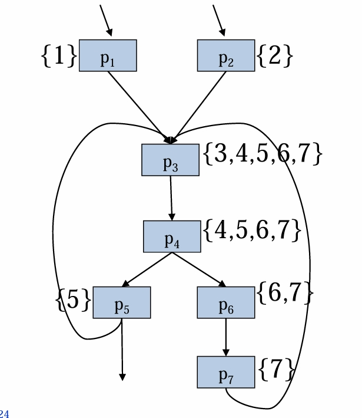

---
encrypt_content:
  level: Imperial
  password: Raymond#1234
  username: hg1523
level: Imperial
---

# Where should we move the loop-invariant instruction to?

- Given control-flow graph, need to find
	-  Where the loops are
	- Where the loop headers are
	- So we can find a place put the loop's loop-invariant instructions
	- Need robust scheme that handles all loops including whatever you do with goto
- We will develop a general framework for finding loops in control-flow graphs
	- We aim to recover the loop structure that came from the source program's looping constructs
	- We do not assume that the source code's structured control flow is preserved - so that we can combine different optimisations without having to track how the CFG was built
- Given control-flow graph, need to find
	- where the loops are
	- where the loop headers are
	- So we can find a place to put the loop's loop-invariant instructions
	- Need robust scheme that handles all loops including whatever you can do with goto
- Definition:
	- A loop in a control flow graph is a set of nodes S including a header node h, with the following properties:
		- From any node S there is a path to h
		- There is a path from h to any node in S
		- There is no edge from any node outside S to any node in S other than h (only one way in)

# Definition: dominator
A node d dominates a node n if every path from the CFG's start node to n must go through d. Every node dominates itself

for example, the left one

p1 is the start node, every path pass through it

for p2, paths can starts with p1 -> p2, or p1 -> p3, so 2 ans 3 could only dominate themselves

p4 is where the branches converge, but the path may end at 2 or 3, therefore it can only dominate 4,5

p5 is an exit node, only dominate itself

## Dominators...
- Finding the nodes dominated by a node d:
	- Consider another node n with predecessors $p_1\dots p_k$
	- If d dominates each one of the $p_i$ then it must dominate n
	- Because:
		- Every path from the start node to n must go through one of the $p_i$
		- And every path from the start node to a $p_i$ must go through d
	- Conversely
		- If d dominates n, it must dominate all the $p_i$
		- Otherwise there would be a path from the start node to n going through the predecessor not dominated by d

# Algorithm for finding dominators
- Let Doms(n) be the set of nodes that dominate n (n is dominated by Doms(n))
- Construct a system of simultaneous set equations:
- $Doms(s) = { s }$ (s = start node)
- $Doms(n) = { n }\cup(\cap_{p\in preds(n)} Doms(p))$ (otherwise) (in other words, which dominators are common to all our pred), as you can see from the previous example
- still solve this system iterately
- Initially Doms(n) start as the set of all nodes in the graph
- Each assignment makes Doms(n) smaller, until it stops changing
# Back edges
- A control flow graph edge from a node n to a node h that dominates n is called a back edge

- For every back edge, there is a corresponding subgraph of the CFG that is a loop (by our definition earlier)
- Definition:
- The natural loop of a backedge (n,h), where h dominates n, is
	- the set of nodes x such that h dominates x and there is a path from x to n not contains h
	- The header of this loop will be h
- For every back edge, there is a corresponding subgraph of the CFG that is a loop (by out definition earlier,  back edges form natural loops in the CFG)

## Multiple loops:
- It is possible for two loops to share the same header
- This example has two back edges (5,3) and (7,3)
- In many cases these two natural loops arise from one source-code loop (see the graph above)
The backedges are p5 -> p3 and p7 -> p3

code -> CFG is a one-way ticket

## nested Loops

- Suppose:
	- A and B are loops with headers a and b, such that $a\neq b$ and b is in A
- Then 
	- The nodes of B must be a proper subset of the nodes of A
	- We say that loop B is nested within A
	- B is the inner loop

the loop with header 8 is the inner loop of loop with header 5

### The Control Tree:

But where should we move the loop invariant instructions to?
- We can't move them to the header
- We want to move them to the nodes preceding the header, But sometimes the header has multiple predecessors

n5 has predecessor n2 and n3 and n5 is the header of the loop 4 5

we insert an pre-header just below the header (basically a label I think)

# Summary:
- Dominators
- Iterative data-flow algorithm for finding dominators
- There is a natural loop for each back edge
- Natural loops, loop header
	- A natural loop has just on entry path, through its header
	- (contrast: a natural loop is a strongly-connected region, but there are strongly connected regions that are not natural loops)
- Natural loops that share the same header have ambiguous source-code structured control flow
- Natural loops with different headers form a loop tree
- We insert a pre-header before the header, to ensure a unique place to move loop-invariant instructions to