---
encrypt_content:
  level: Imperial
  password: Raymond#1234
  username: hg1523
level: Imperial
---

# Which instructions can we move out of a loop?

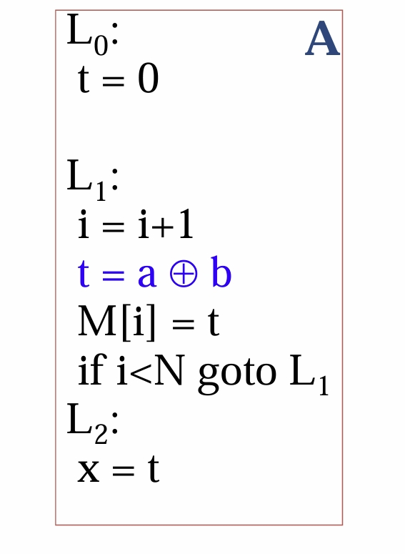
only one definition of t is present in the loop L1 -> goto L1

therefore only t = a + b is loop invariant, we can move it out of the loop

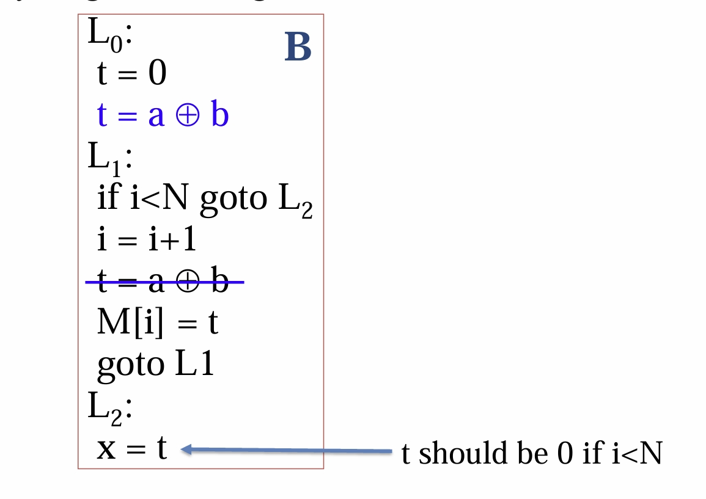

but notice that if the definition is in the loop, there is a possibility that the loop never executes

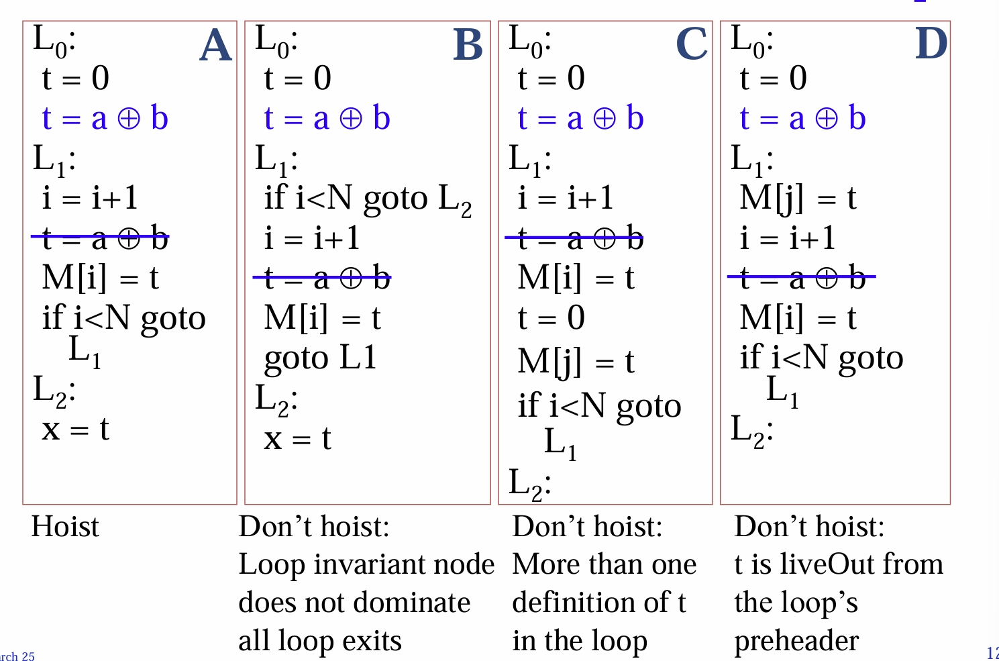

so 

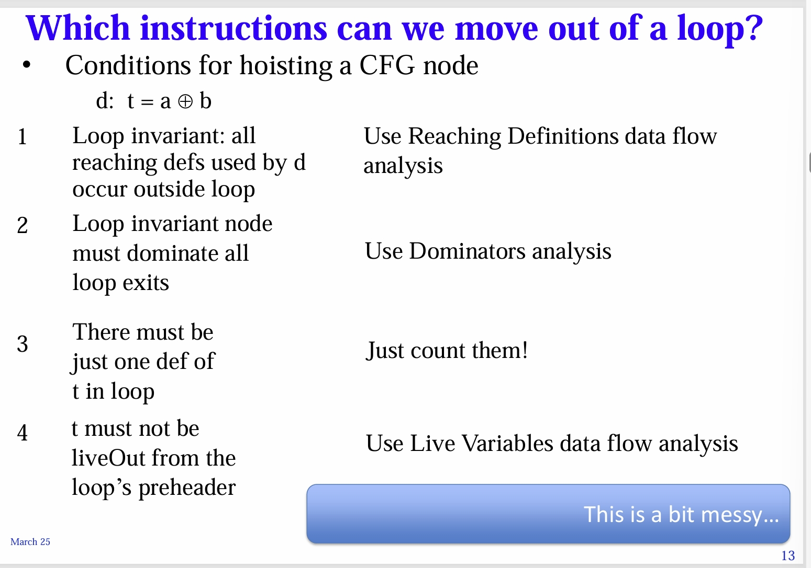


we want to unify all these measures, therefore we introduce SSA

# Static Single Assignment form (SSA)

- SSA is a powerful technique for simplifying many optimisation problems
- Converting the code into SSA, and back to code again is beyond the scope of this course
## Introduce static single assignment
Recall graph colouring for register allocation

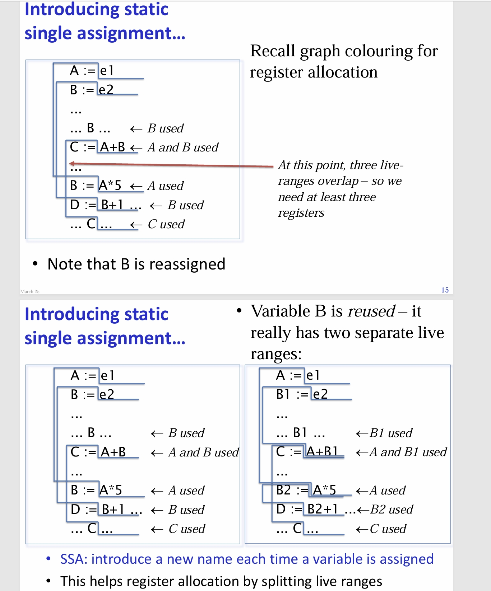

so at every assignment we rename the variable to a new name

we also introduce a control-flow join function $\varphi$


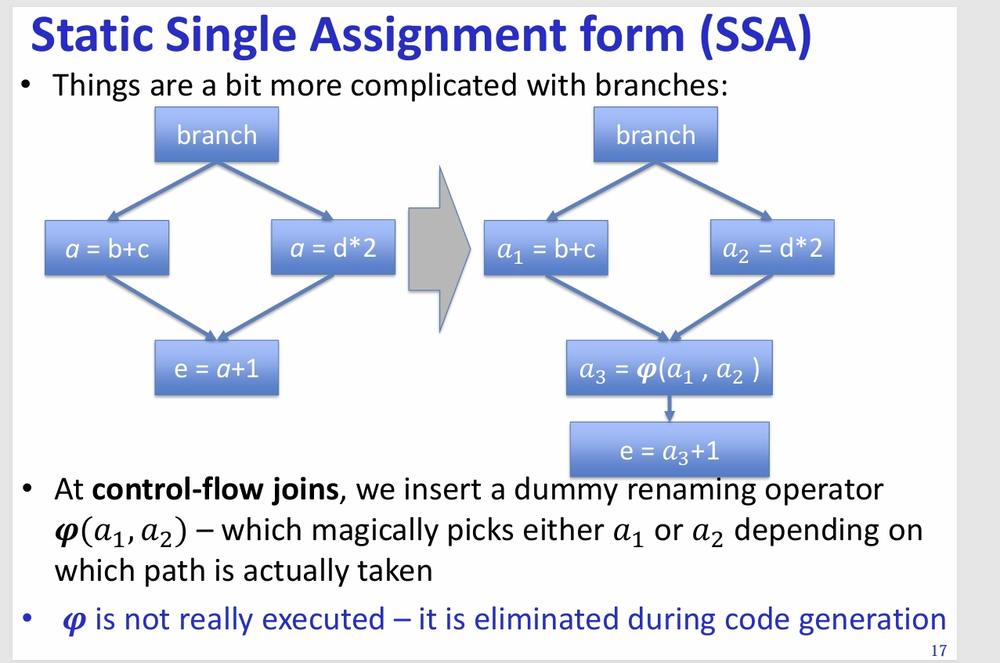

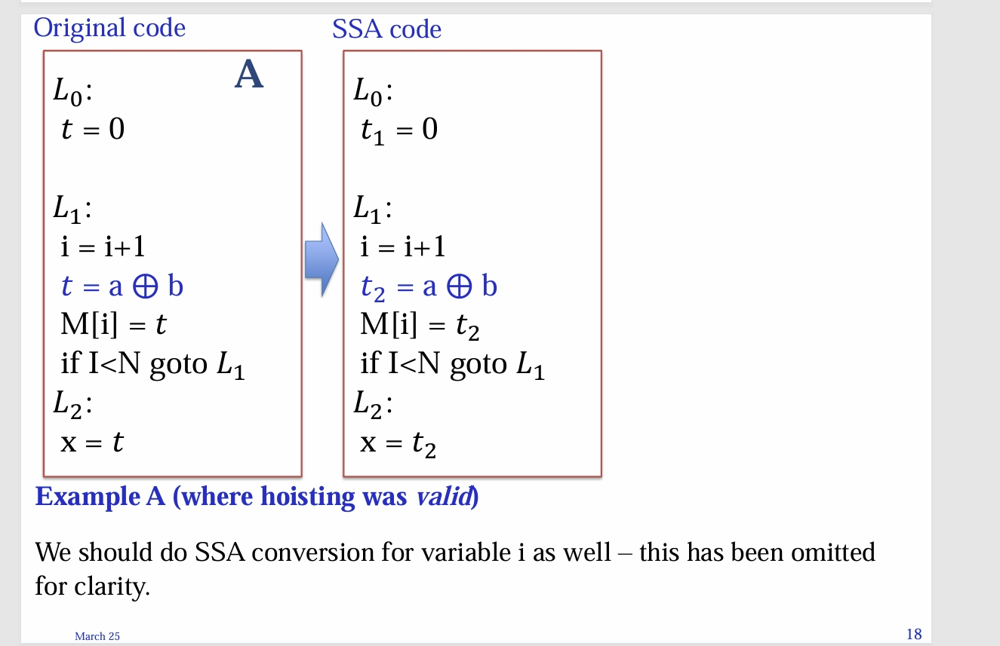

in this code, if we were to extract the t = a + b to L0, then the t = 0 line is killed, therefore, if the loop never executes, it gives a + b instead of 0

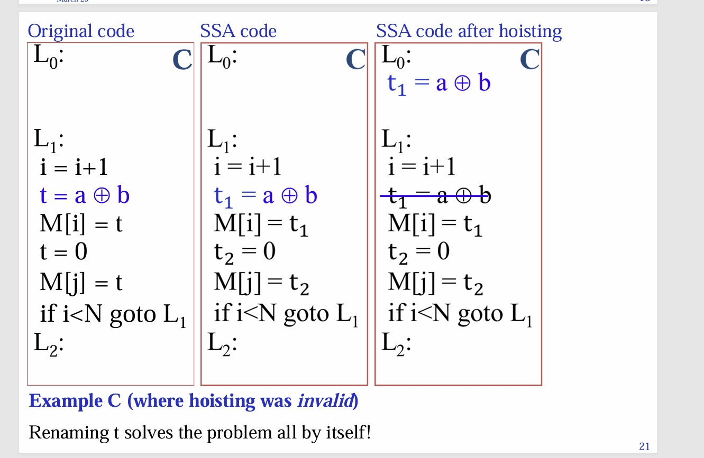
here, extracting the t1 = a + b to the above causes no errors

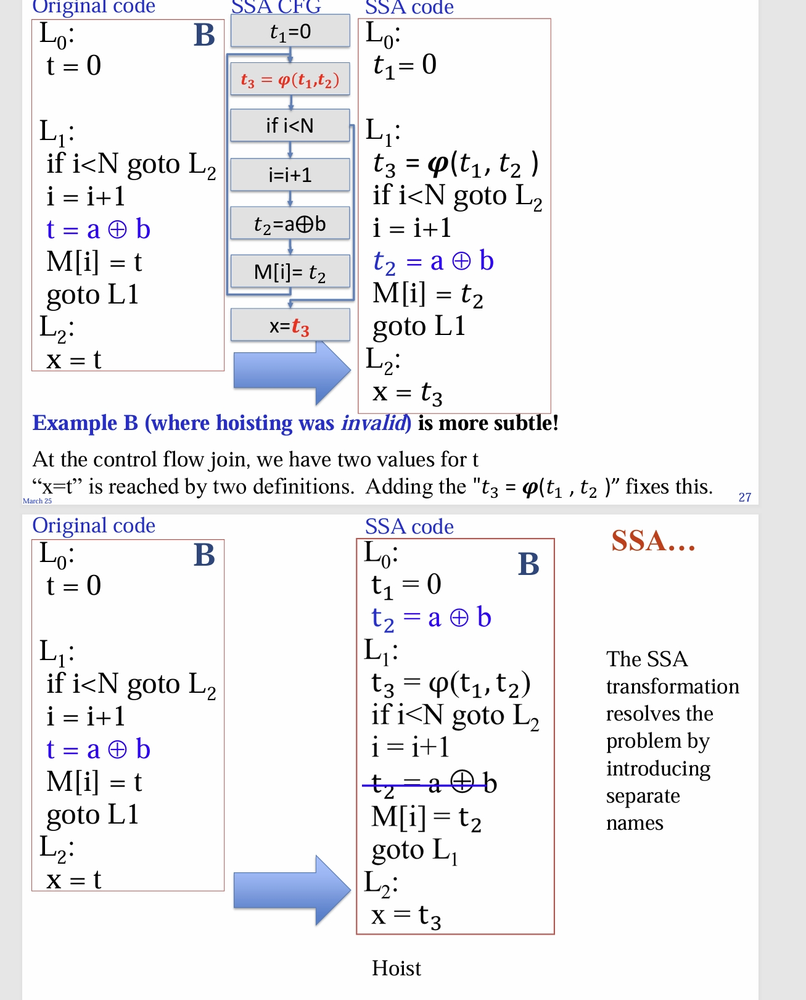
here, since t3 can be either t1 or t2, we add a control-flow combination

(transforming back to code can be tricky, but since it is not in the scope of the course, not included here)

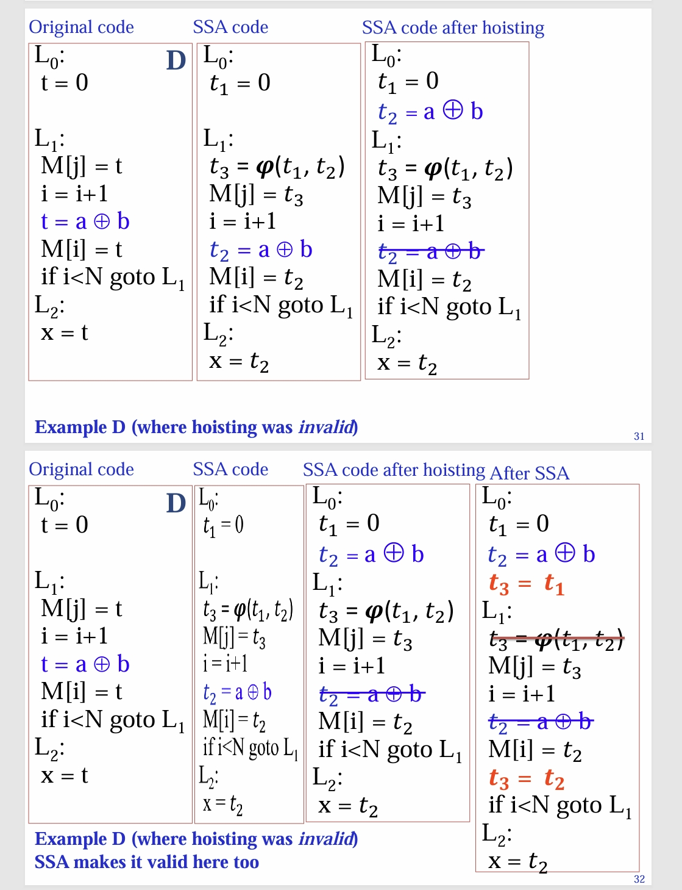

on the 3 -> 4, we reapply SSA

so now:

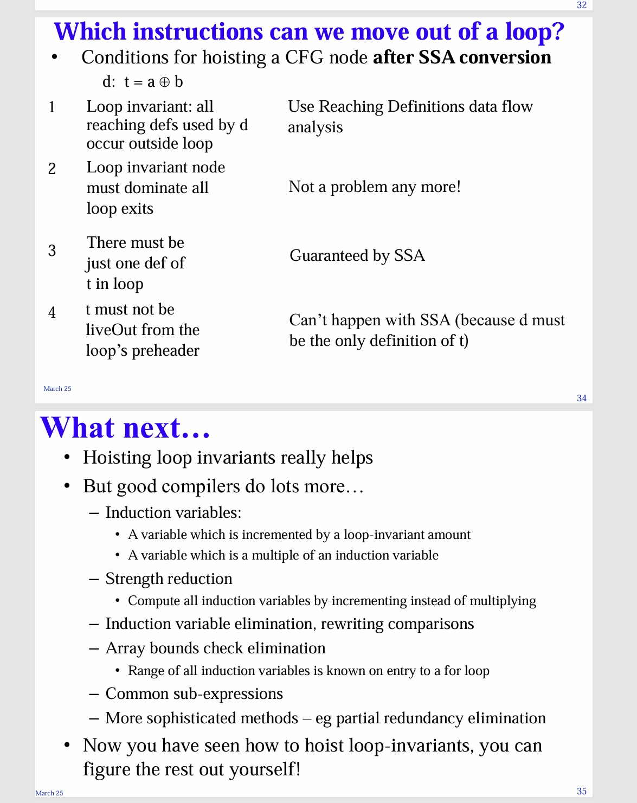

# high-level language optimizations

- "Conventional" optimisations reduce work done at run-time
- "restructuring" compilers improve performance by finding the right order in which to do the computation
- Example 1:
	- Original:

```
For (i = 0; i < N; i++) 
	For (j = 0; j < M; j++)
		A[i,j] = (A[i,j] + A[i-1,j] + A[i+1,j]) * (1/3)
```
- 
	- Parallel implementation:
```
For (i = 0; i < N; i++) 
	ParFor (j = 0; j < M; j++)
		A[i,j] = (A[i,j] + A[i-1,j] + A[i+1,j]) * (1/3)
```
- 
	- Better parallel?


```
ParFor (i = 0; i < N; i++) 
	For (j = 0; j < M; j++)
		A[i,j] = (A[i,j] + A[i-1,j] + A[i+1,j]) * (1/3)

```

- Another example:
	- in matrix transpose, Original
```
for (i = 0; i < N; i++)
	for (j = 0; i < M; j++)
		B[i][j] = A[j][i]
```
- 
	- Cache efficient
```
for (ii = 0; ii < N; ii += IB)
	for (jj = 0; jj < M; jj += JB)
		for (i = ii; i < ii + IB; i++)
			for (j = jj; j < jj + JB; j++)
				B[i][j] = A[j][i]
```

the latter only need to cache IB$*$JB elements, but the first need to cache a whole matrix


# Optimisations for high-level programming languages

some old friends

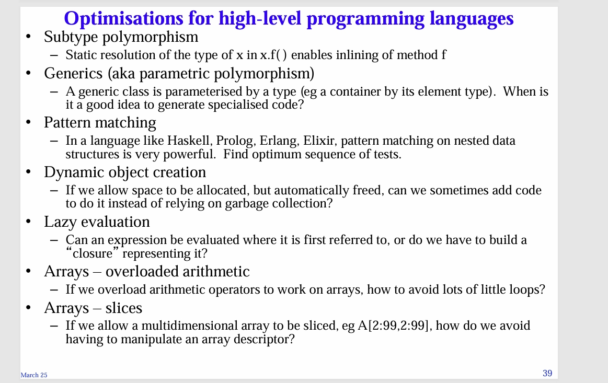
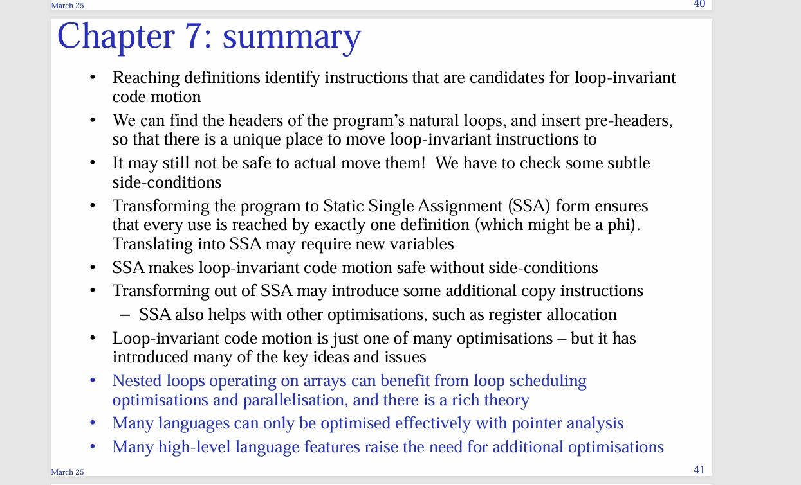