---
encrypt_content:
  level: Imperial
  password: Raymond#1234
  username: hg1523
level: Imperial
---
# Restructuring compilers and parallelising compilers
- The optimisations we have studied so far reduce the number of instruction that need to executed at runtime
- But sometimes we can get a performance improvement by thinking about the order in which loops are executed
- vector instructions
	- So different iteration of a loop are being executed at the same time
- multiple cores:
	- So different iterations of a loop might be assigned to different threads running on different CPUs
- improve cache use:
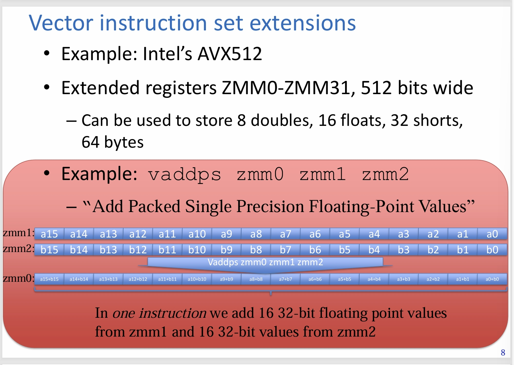


## How do we know a loop is parallel
To use vector instructions, we need to verify that different iterations of the loop are truly parallel

We can see the dependence arrow dont cross iteration boundaries, so we can use vector add

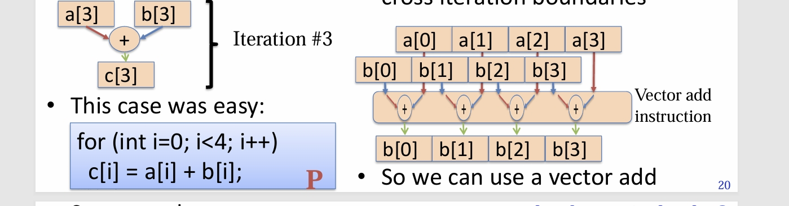
# Determining whether a loop can be executed in parallel
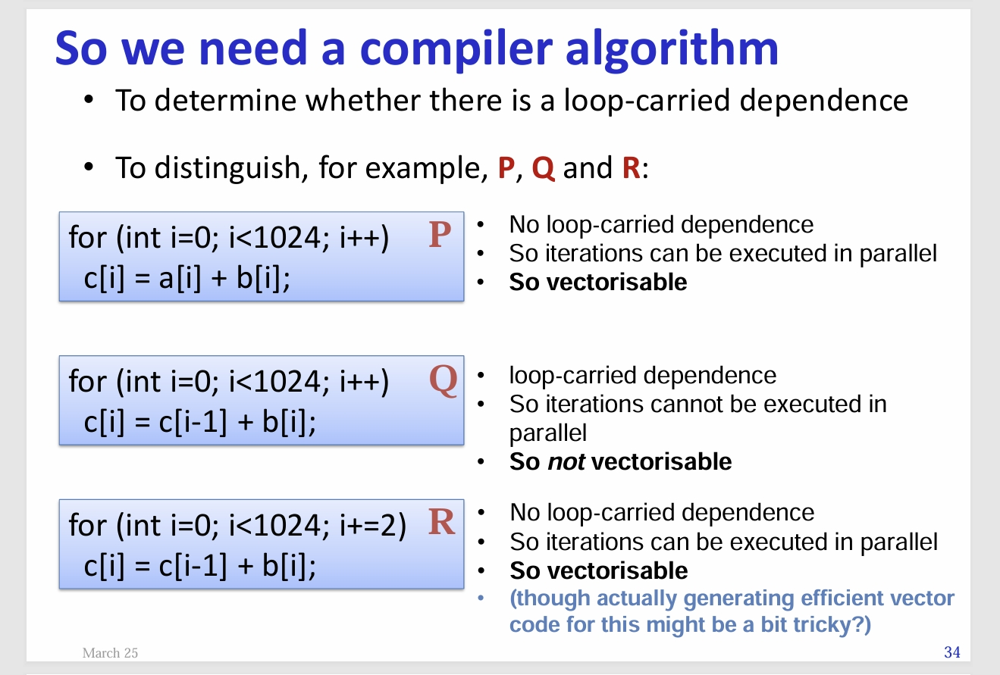
## Health warning:
- Automatic discovery of parallelism has a bad reputation
	- It looks great on simple examples, But real code has complexity that is means it often just doesnt happen
- But in some application domains it can work
- And some programming languages make it easier, maybe
	- Function languages lack anti- and output-dependence (but tend to add higher-order functions and lazy evaluation)
	- Some languages control pointer ownership and aliasing
	- Some programming models discourage explicit loops and explicit element-wise subscripting

## algorithm to determine whether a loop is parallel
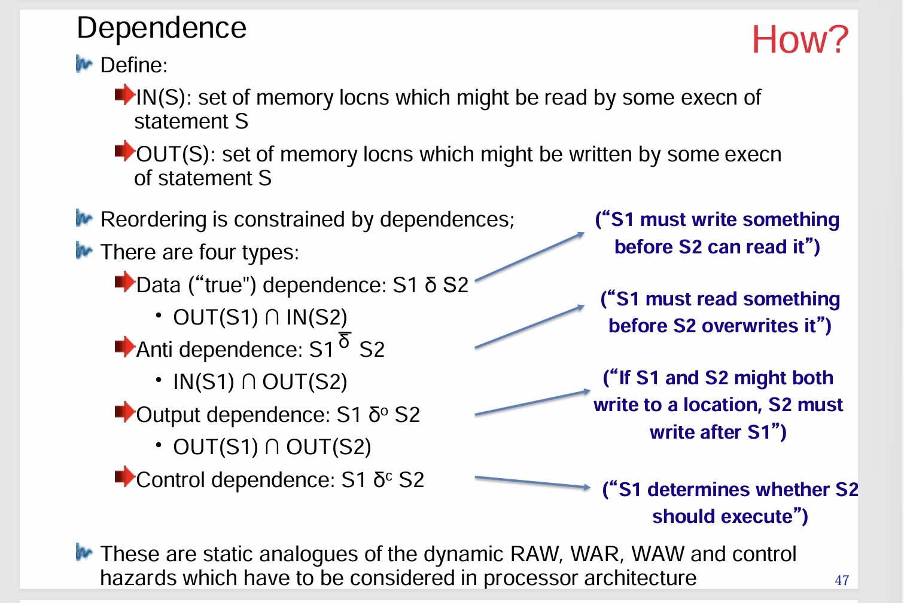
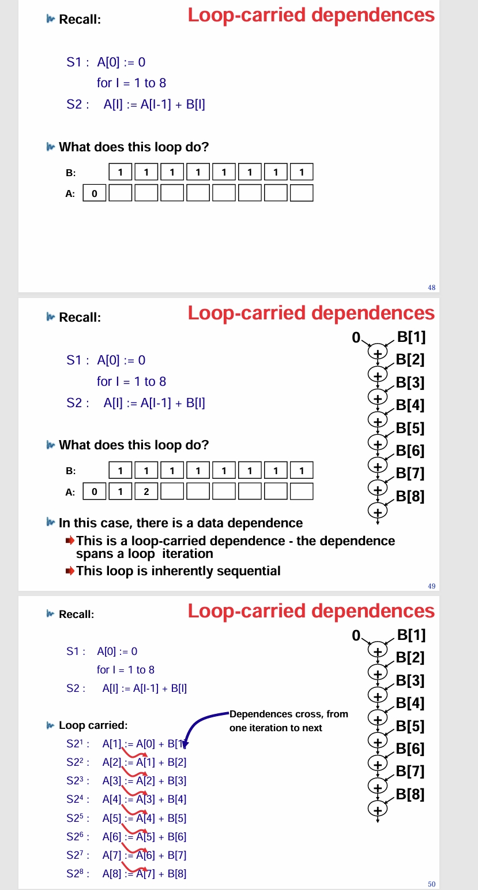

Consider two iterations $I^1$ and $I^2$

A dependence occurs between two statements $S_p$ and $S_q$ (not necessarily distinct) when an assignment in $S_p^{l_1}$  refers to the same location as a use in $S_q^{l_2}$

In the example,

```
S1: A[0] := 0
    for I = 1 to 5
S2:     A[I] := A[I-1] + B[I]
```

The assignment is $A[I^1]:=$

The use is $:= A[I^2-1]$

These refer to the same location when $I^1 = I^2 - 1$

We use the Notation $S_1\delta_{<}S_2$

### definition: The dependence equation

- A dependence occurs 
	- between two statements $S_p$ and $S_q$ (not necessarily distinct)
	- when there exists a pair of loop iteration $I^1$ and $I^2$
	- such that a memory reference is $S_p$ In $I^1$ may refer to the same location as a memory reference in $S_q$ in $I^2$
- ThIs might occur if $S_p$ and $S_q$ refer to some common array A
- Suppose $S_p$ refers to $A[\varphi_p(I)]$ ($\varphi_p(I)$ is some subscript expression involving I)
- Suppose $S_p$ refers to $A[\varphi_q(I)]$
- A dependence of some kind occurs betweeen $S_p$ and $S_q$ if there exists a solution to the equation $\varphi(I^1) = \varphi(I^2)$
- for integer values of $I^1$ and $I^2$ lying within the loop bounds
### Types of dependecne:

- If a solution to the dependence equation exists, a dependence of some kind occurs
- The dependence type depends on what solutions exist
- The solutions consist of a set of pairs $(I^1, I^2)$
- We would appear to have a data dependence if $A[\phi_p(I))]\in OUT(S_p)$ and $A[\phi_q(I)]\in IN(S_q)$
- But we only really have a data dependence if the assignments precede the use, ie
	- $S_p\text{ }\delta_<\text{ }S_q$
	- if, for each solution pair $(I^1, I^2), I^1<I^2$
### Dependence v.s anti-dependence

If the uses precede the assignments, we actually have an anti-dependence, ie $S_p\bar{\delta}_< S_q$ If, for each solution pair $(I^1,I^2),I^1 > I^2$

In this case we do have a constraint on execution order because we may have to read a value before it may be overwritten

And this anti-dependence is loop-carried

Anti-dependences prevent re-ordering, and multi-thread parallelism

If there are some solution pairs $(I^1, I^2)$ with $I^1 < I^2$ and some $I^1 > I^2$, we write $S_p\text{ }\delta_x\text{ }S_q$

This represents that we know we must repect execution ordering, even though the compiler is unable to classify the dependence fully

If, for all solution pairs $(I^1,I^2), I^1 = I^2$, there are dependence within an iteration of the loop, but there are no loop-carried dependencies $S_p\text{ }\delta_=\text{ }S_q$

### Dependence distance
In many common examples, the set of solution pairs is characterised easily
- Definition: dependence distance
	- If, for all solution pairs $(I^1, I^2)$, $I^1 = I^2 - k$
	- then the dependence distance is k
- For example, in the loop we considered earlier
```
S1: A[0] := 0
    for I = 1 to 5
S2:     A[I] := A[I-1] + B[I]
```
We find that $S_2\delta_< S_2$ with dependence distance 1

- (of course there are many cases where the difference is not constant and so the dependence cannot be summarised this way)
### Reuse distance

- When optimising for cache performance, it is sometimes useful to consider the re-use relationship
	- $IN(S_1)\cap IN(S_2)$
- Here there is no dependence - it doesn't matter which read occurs first
- Nonetheless, cache performance can be improved by minimising the reuse distance
- The reuse distance is calculated essentially the same way
- Eg:
```
    for I = 5 to 100
S1:   B[I] := A[I] * 2
S2:   C[I] := A[I - 5] * 10
```
Here we have a loop-carried reuse with distance 5

# Dependence analysis in nested loops

Up to now we have looked at single loops, Now let's generalise to loop "nests"

We begin by considering a very common dependence pattern, called the wavefront

```
    for I1 = 0 to 3 do
		for I2 = 0 to 3 do
S:          A[I1, I2] := A[I_1 - 1, I_2] + A[I_1, I_2 - 1]
```

There are two potential dependencies arising from the three references to A, so two systems of dependence equations to solve:

- Between $A[I_1^1, I_2^1]$ and $A[I_1^2 - 1, I_2^2]$
$$\begin{cases}\begin{aligned}I_1^1 &= I_1^2 - 1\\I_2^1 &= I_2^2\end{aligned}\end{cases}$$

- Between $A[I_1^1, I_2^1]$ and $A[I_1^2, I_2^2 - 1]$
$$\begin{cases}\begin{aligned}I_1^1 &= I_1^2\\I_2^1 &= I_2^2 - 1\end{aligned}\end{cases}$$

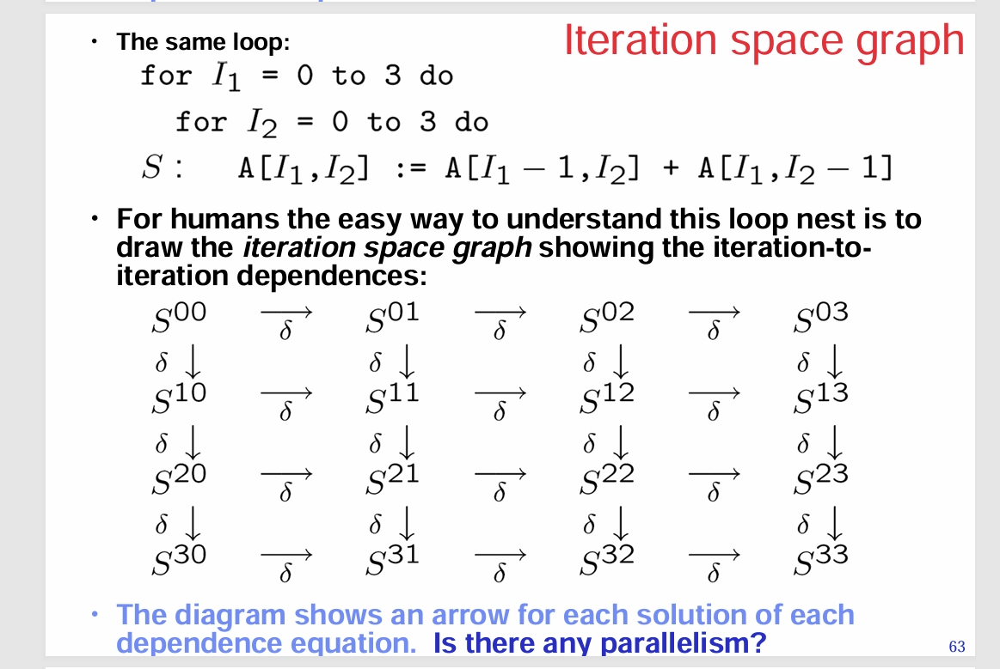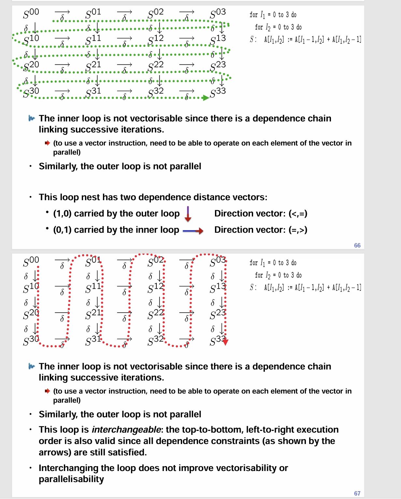

## interchange

not all loops can interchange (change the two loop conditions)

for example:

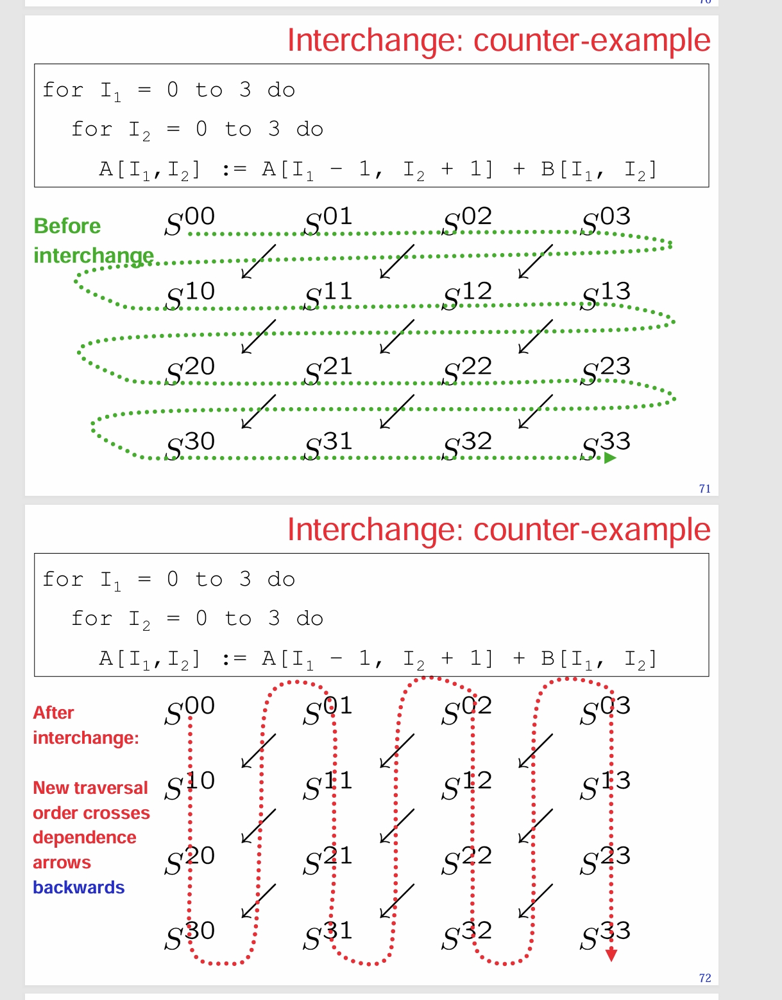

since after the interchange, the order of execution contradicts with the flow of the dependence in some places

- A loop is interchangable if all dependence constraints (as shown by the arrows) are still satisfied by the top-to-bottom, left-to-right execution order
- How can you tell whether a loop can be interchanged?
- Look at its dependence direction vectors:
	- Is there a dependence direction vector with the form (<>)?
	- ie there is a dependence distance vector $(k_1, k_2)$ with $k_1>0$ and $k_2<0$
	- If so, interchange would be invalid since the arrows will be traversed backwards, All other dependence directions are OK
## Skewing
basically including the loop condition variable in the next loop condition

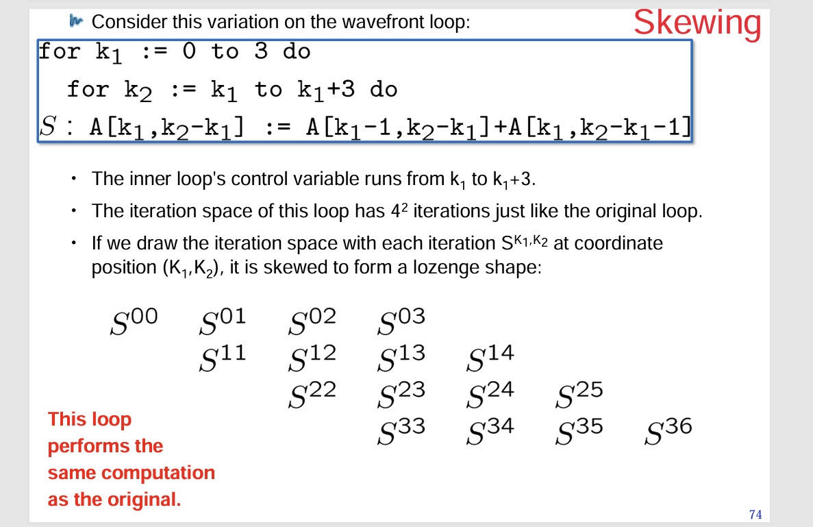
Skewing does not actually change the order which the loop body is executed

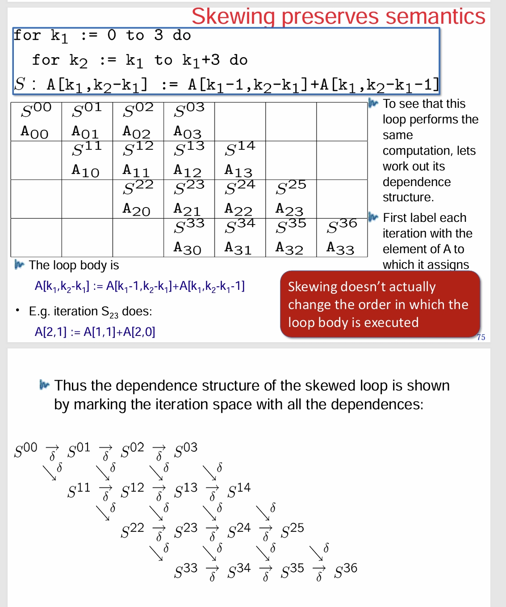
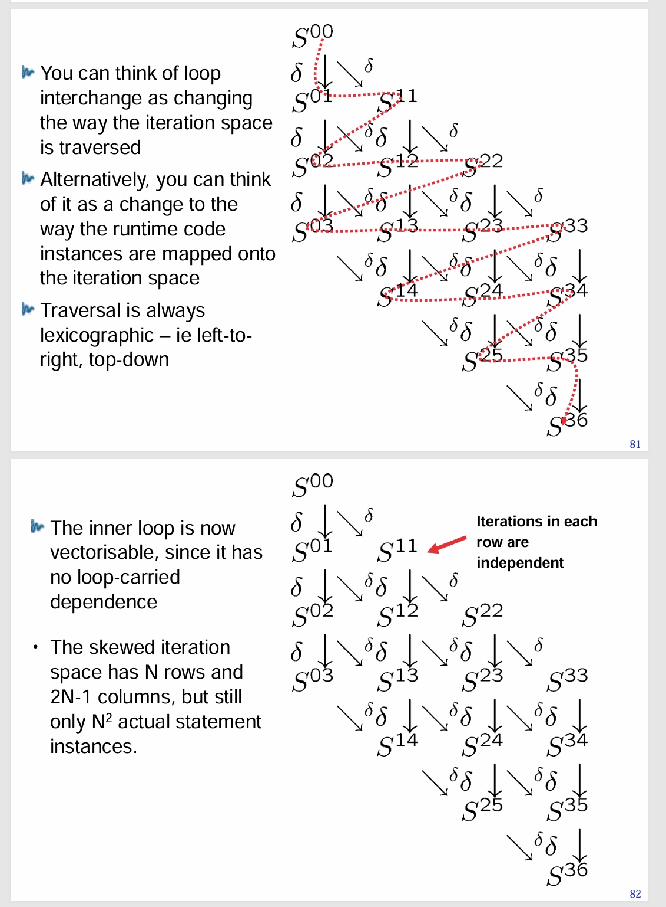
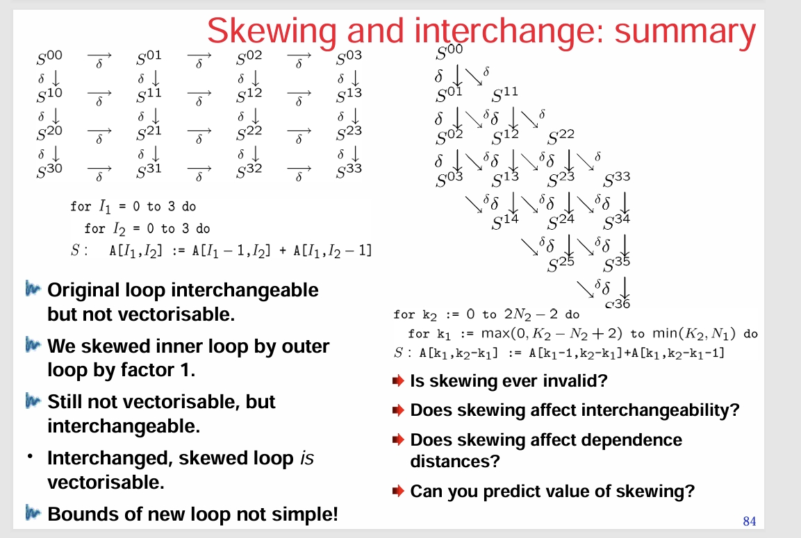

skewing is always valid, it can make interchange (and therefore tiling valid), we cannot predict value of skewing and affect dependence distances

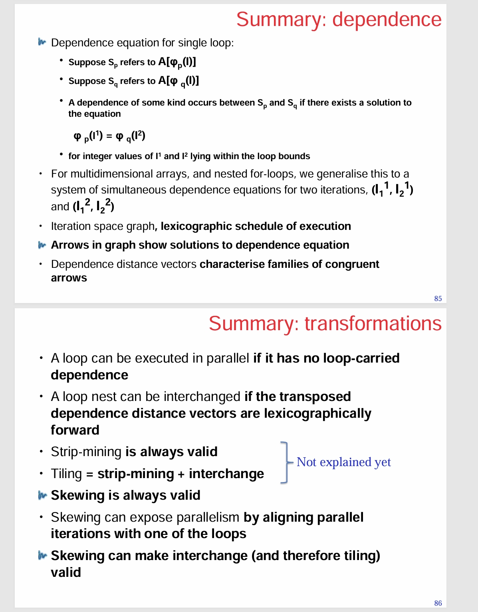