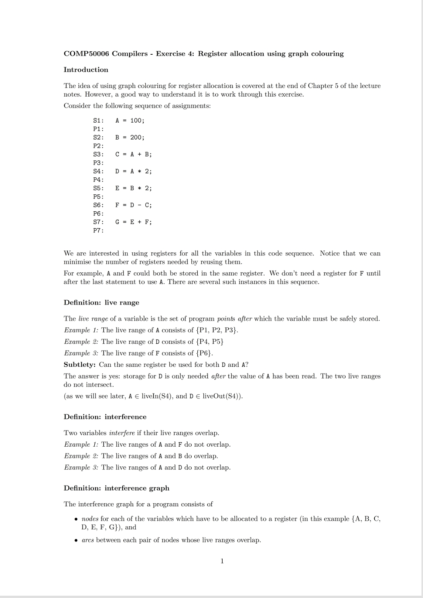
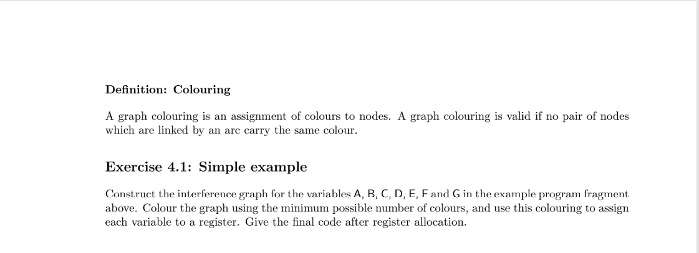
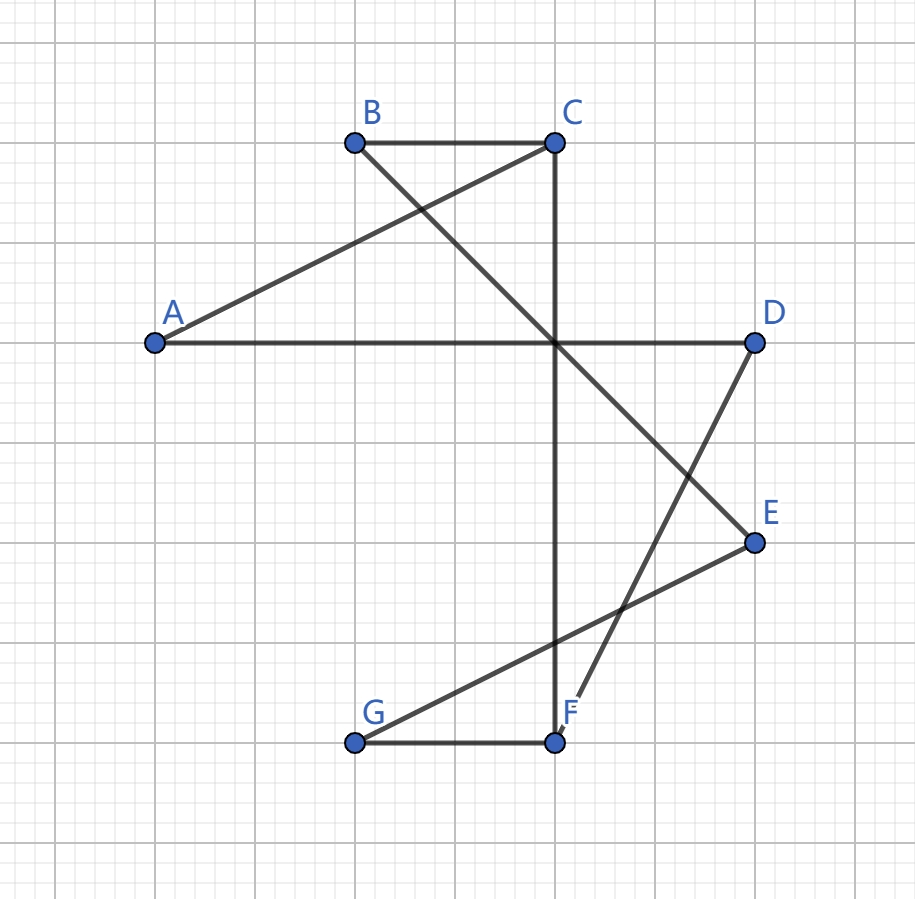
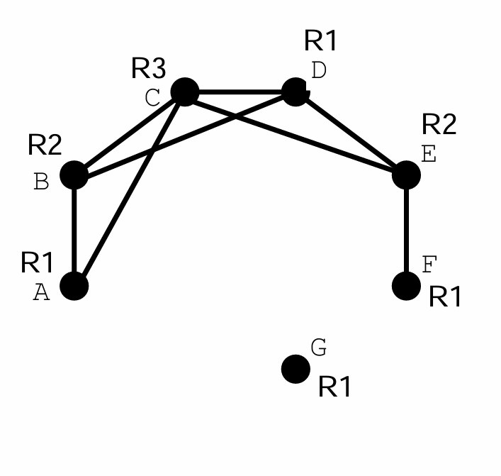
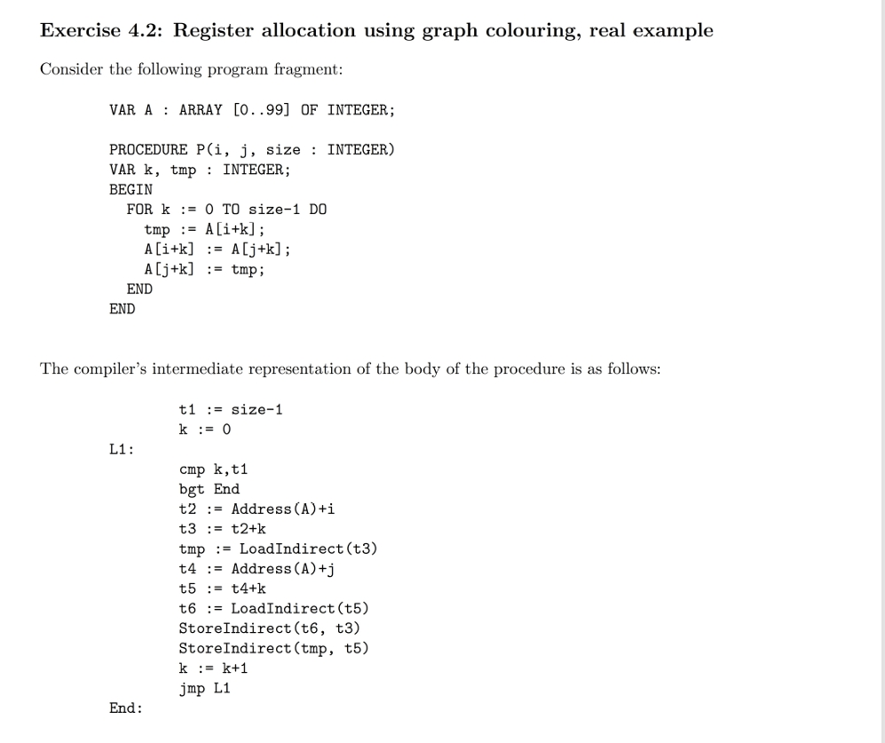
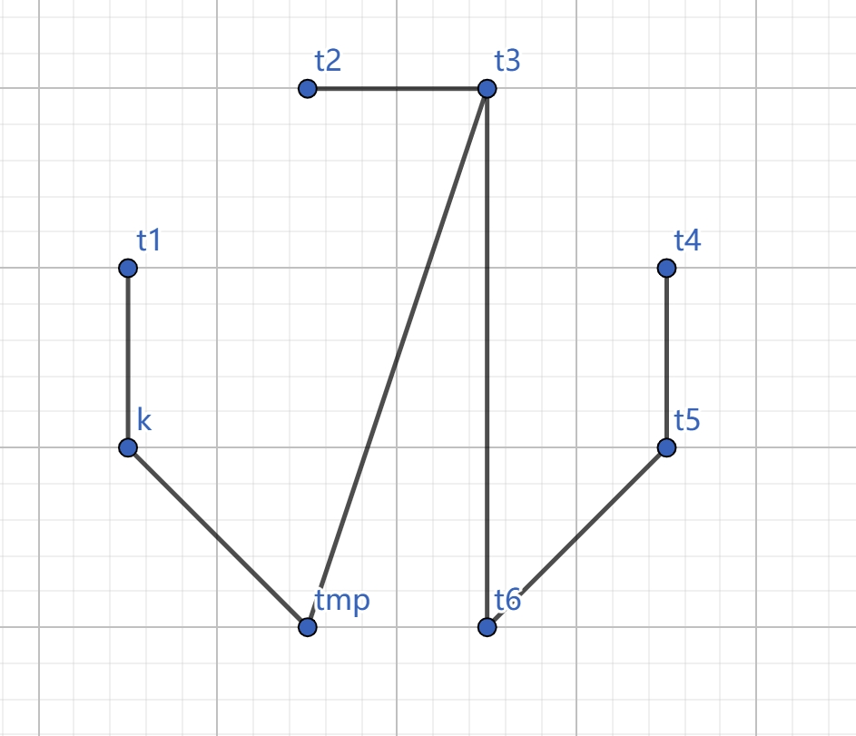
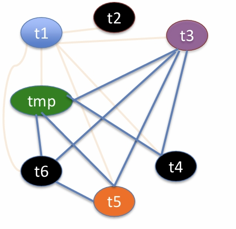

---
level: Imperial
---
---

level: Imperial

---

---


level: Imperial


---


---



encrypt_content:



  level: Imperial



  password: Raymond#1234



  username: hg1523



level: Imperial



---



















 this is wrong since we should also consider the live range that each variable is used, for example:







```



A = 100;   



B = 200;    



C = A + B; // A and B used



D = A * 2; // A used



E = B * 2; // B used



F = D - C; // D and C used



G = E + F; // E and F used



```







so the scope of A is :







```



A



B = 200;



C = A + B;



  = A * 2;



```







therefore we connect AB, AC (in other words, A, B, C must be in 3 different registers)







for B:







```



B



C = A + B;



D = A * 2;



    B * 2;



```







 we connect BA, BC, BD,







  for C:



```



C



D = A * 2



E = B * 2



    D - C



```







therefore we connect CA, CB, CD, CE







and etc.







so finally







and the compile assembly:







```



R1 = 100



R2 = 200



R3 = R1 + R2



R1 = R1 * 2



R2 = R2 * 2



R1 = R1 - R3



R1 = R2 + R1



```



















## 1.



**Construct the register interference graph for the variables $t_1,t_2,t_3,t_4,t_5,t_6,k, tmp$**











this is also wrong, same reason as above







so from the original code, we know i,j,size,k need to coexist with everything







and in t1, it needs to coexist with size  in `t1 := size - 1` and therefore everything







t2 needs to coexist with t1, and therefore everything







t3 needs  to coexist with t4,t5,t6,tmp since the live range is







```



t3



tmp := LoadIndirect(t3)



t4 := Address(A) + j



t5 := t4 + k



t6 := LoadIndirect(t5)



StoreIndirect(t6,t3)



```







t4 coexist with t1 (by condition of t1), t3(by condition of t3), tmp(by condition of t3), k







live range of t5 is







```



t5



t6 := LoadIndirect(t5)



StoreIndirect(t6, t3)



StoreIndirect(tmp, t5)



```







therefore t5 coexist with t6 t3 tmp and t1 (by condition of t1)







then t6 coexist with t1, t3, tmp, t5







so the graph is like:(not including i,j,k size)











## 2.



**Show how the interference graph colouring algorithm can be used to minimise the number of registers needed in this procedure**







so the graph coloring algorithm is done by colouring the interference graph, here is the solution







color1: t1,tmp,t2, t6, t4



color2: k, t3, t5







therefore we only need two registers for this code







## 3.







**What other possible optimisations are possible in this procedure? Write very brief notes on how such optimisations might be implemented**







 