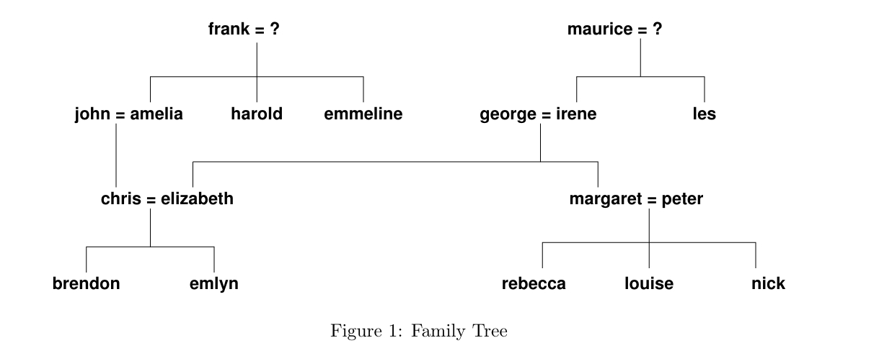

---
level: Imperial
---
---

level: Imperial

---

---


level: Imperial


---


---



encrypt_content:



  level: Imperial



  password: Raymond#1234



  username: hg1523



level: Imperial



---



# Prolog Database







the given program:







```prolog



/*







    File: family.pl - cjh







*/











% child_of(?Child, ?Parent)



%   Child is a child of Parent.



child_of(emmeline, frank). 



child_of(amelia, frank).



child_of(harold, frank).



child_of(chris, amelia).



child_of(chris, john).



child_of(emlyn, chris).



child_of(emlyn, elizabeth).



child_of(brendon, chris).



child_of(brendon, elizabeth). 



child_of(irene, maurice).



child_of(les, maurice).



child_of(elizabeth, irene).



child_of(elizabeth, george).



child_of(margaret, irene).



child_of(margaret, george).



child_of(rebecca, margaret).



child_of(louise, margaret).   



child_of(nick, margaret).



child_of(rebecca, peter).



child_of(louise, peter).



child_of(nick, peter).







male(frank).   



male(harold).



male(chris).



male(john).



male(emlyn).



male(brendon).



male(maurice).



male(les).



male(nick).



male(peter).



male(george).







female(emmeline).



female(amelia).



female(elizabeth).



female(irene).



female(margaret).



female(rebecca).



female(louise).







% end of data



```















## 1. 







**Enter the following queries, finding all the solutions**







```prolog



child_of( peter, irene ).



child_of( peter, emlyn ).



child_of( X, george ).



child_of( george, Y ).



child_of( X, X ).



child_of( X, Y ).



```







so the corresponding answers will be







```



- no







- no







- X = elizabeth, X = margaret







- no







- no







- X = nick, Y = peter and etc.



```







## 2. 







**and further Prolog clauses which define the following predicates**







as a guiding example







```prolog



sister_of(X, Y) :-



  child_of(X, Z),



  child_of(Y, Z),



  X \= Y,



  female(X) .



```







### mother_of(M,X) 







**"M is the mother of X"**







```prolog



mother_of(M, X) :-



  female(M),



  !,



  child_of(M, X).



```







### grandparent_of(GP, X) 







**"GP is a grandparent of X"**







```prolog



grandparent_of(GP, X) :-



  child_of(Y, GP),



  child_of(X, Y).



```







### daughter_of(D, X) 







**"D is a daughter of X"**







```prolog



daughter(D,X) :-



  female(D),



  !,



  child_of(D, X).



```







### uncle_of(Unc, X) 







**"Unc is an uncle of X"**







```prolog



uncle_of(Unc, X) :-



  male(Unc),



  !,



  grandparent(GP, X),



  child_of(Unc, GP).



```







<p style="red">modal answer:</p>







<p style="red">Uncle also include the husband of aunt</p>







```prolog



uncle_of( Uncle, Person) :-



    child_of( Person, Parent),



    sibling_of( Uncle, Parent ),



    male( Uncle ).







uncle_of( Uncle, Person) :-



    child_of( Person, Parent),



    sibling_of( Aunt, Parent ),



    married_to( Uncle, Aunt ),



    male( Uncle ).







sibling_of( Child1, Child2 ) :-



    child_of( Child1, Parent ),



    child_of( Child2, Parent ),



    Child1 \= Child2.







married_to( Spouse1, Spouse2 ) :-



    child_of( Child, Spouse1 ),



    child_of( Child, Spouse2 ),



    Spouse1 \= Spouse2.



```











### niece_of(N,X) 







**"N is an niece of X"**







```prolog



niece_of(N,X) :-



  female(N),



  !,



  child_of(X, Z),



  child_of(Y, Z),



  X \= Y,



  child_of(N, Y)



```







the same but the modal answer uses uncle_of and aunt_of







```prolog



niece_of( Niece, Person) :-



    uncle_of( Person, Niece ),



    female( Niece ).







niece_of( Niece, Person) :-



    aunt_of( Person, Niece ),



    female( Niece ).



```







### great_grandfather_of(Gfx, X) 







**"Gfx is great-grandfather of X"**







```prolog



great_grandfather_od(Gfx, X) :-



  male(Gfx),



  !,



  child_of(GP, Gfx),



  child_of(P, GP),



  child_of(M, P).



```







### ancestor_of(Anc, X) 







**"Anc is an ancestor of X"**







```prolog



ancestor_of(Anc, X) :-



  (



    child_of(X, Anc);



    (



      child_of(A, X),



      ancestor_of(Anc, A)



    )



  ).



  



```



<p style="red">modal answer:</p>







```prolog



ancestor_of( Anc, X) :-



    child_of( X, Anc ).



ancestor_of( Anc, X) :-



    child_of( X, Y ),



    ancestor_of( Anc, Y).



```















## compare == and =







```prolog



?- X == Y, X = Y. %(1)







% and







?- X = Y, X == Y. %(2)



```







the differnet is that = gives the value(unifies both side) while == just compare the value







# Recursion



## 1. 







**An acyclic directed graph is represented by the following facts**







```prolog



arc(a, b).



arc(b, c).



arc(b, d).



arc(c, f).



arc(d, f).



arc(c, e).



arc(f, e).



```







### (a) 







**write two prolog clauses in order to define the predicate path(?X, ?Z) For instance in the given grpah there is a path from b to f,** 







**Your Program should refer only to the path and arc predicates**







```prolog



path(X,Z) :-



  (



    (



      arc(Y,Z),



      arc(Z,Y)



    )



    path(X,Y)



  ),



  (



    (



      arc(Y,X),



      arc(X,Y)



    ),



    path(Y,Z)



  ).



```







<p style="red">modal answer:</p>







```prolog



path( NodeX, NodeZ ) :-



    arc( NodeX, NodeZ ).



path( NodeX, NodeZ ) :-



    arc( NodeX, NodeY ),



    path( NodeY, NodeZ ).



```







### (b)







**Try out your program for the queries:**







#### i. path(b,f)







yes







#### ii. path(b,Z)







Z = d, Z = c, Z = f, Z = e







#### iii.path(X,d)







X = b, X = a







### (c)







**Enter and run queries asking if**







#### i. 







**there is a path from a to f that passes through d**







```prolog



path(a,d),path(d,f).



```







#### ii.







**there is a path of length 3 ending at f (assume each arc has unit length)**







```prolog



arc(X,Y),arc(Y,Z),arc(Z,f).



```







<p style="color:red">note the more efficent way(in the modal answer) becuase of backtracking</p>







```prolog



arc( Z, f ), arc( Y, Z ), arc( X, Y ).



```







#### iii.







**there is a cycle in the graph**







```prolog



path(X,X).



```







## 2. 







**The Peano numbers are 0, s(0), s(s(0)), ... etc. representing 0, 1, 2, ... etc.**







### (a) 







**Write a Prolog program for plus(?X, ?Y, ?Z) which holds when X, Y and Z are Peano numbers satisfying X + Y = Z. Use no predicate other than plus**







```prolog



plus(X, s(Y), Z) :-



  plus(X, Y, W),



  Z = s(W).







plus(s(X), Y, Z) :-



  plus(X, Y, W),



  Z = s(W).







plus(Y, 0, Y).



plus(0, Y, Y).



```







### (b)







**Try out your program for the queries**







#### i.







```prolog



plus(s(0), s(s(0)), Z).



```







Z = s(s(s(0))).







#### ii.







```prolog



plus(s(0), Y, s(s(s(0)))).



```







Y = s(s(0)).







#### iii.







```prolog



plus(X,Y,s(s(s(s(0))))).



```







X = 0, Y = s(s(s(s(0)))).







### (c)







**Write a single rule defining odd(?X) in terms only of plus, where odd(X) expresses that X is an odd number.**







```prolog



odd(s(0)).







odd(s(s(X))) :-



  odd(X).



```







<p style="color:red">As in the modal answer, this logic is also fine</p>







```prolog



% N is odd iff N = 2M + 1 for some M



% N is odd iff N = M + (M + 1) for some M



% So ... 







odd( N ) :-



    plus( M, s(M), N ).



```







## 3. 



**Write a (recursive) program for ones_zero(?X) which holds when X is a list each of whose members, if any, is either 1 or 0**







```prolog



ones_zeros([]).







ones_zeros([H|T]) :-



  (



    H = 0;



    H = 1



  ),



  ones_zeros(T).



```







## 4.







**Write a program for hasdups(?X) which holds when list X contains at least two occurrences of some member. You can use member/2, which is a builf-in predicate in Sicstus Prolog (but not necessary in other prolog implementation).**







```prolog



hasdups([H|T]) :-



  (



    member(T, H);



    hasdups(T)



  ).



```







## 5.







**Write a recursive program for prod(+L, ?P) which takes a non-empty list L of numbers and returns the product P of all the numbers in the list. For example, the query prod([7,2,-3], Prod) returns Prod = -42. Refer only to prod/2 and the built-in predicate is/2**







```prolog



prod([H|T],Prod) :-



  P = H * Prod,



  prod(T, P).







prod([], _).



```







<p style="color:red">this only produces yes/no</p>







```prolog



prod( [N], N ).      % could also test number(N)



prod( [Num|Nums], Prod ) :-



    prod( Nums, TempProd ),



    Prod is Num * TempProd.



```







so we compare three versions







```prolog



% this is incorrect, both logically and grammarically



prod([N], N).







prod([H|T], Prod) :-



  prod(T, P),



  P is H * Prod.



```







is requires the right hand side to be fully evaluated, but P is unknown







```prolog



% this is incorrect, grammarically



prod( [N], N ).      % could also test number(N)



prod( [Num|Nums], Prod ) :-



    prod( Nums, TempProd ),



    Prod = Num * TempProd.



```







= does not take the value in to account, so it will just return yes/no.







```prolog



% correct



prod( [N], N ).      % could also test number(N)



prod( [Num|Nums], Prod ) :-



    prod( Nums, TempProd ),



    Prod is Num * TempProd.



```







## 6. 







**The predicate contains(List1, List2, N) holds when the list List2 is a sublist of the list List1; the first element of List2 occupies position N in List1**







```prolog



contains([a,b,c,a,d,e,f,g], [a,d,e,f,g], N).



%   N = 4



contains([a,b,c,a,d,c,a,b,c], [a,b], N).



%   N = 1



%   N = 7



contains([a,b,c,e,d,f], [c,e,g], N).



%   no



```







**Define contains(+List1, +List2, ?N) in a single rule using append/3 and length/2**







```prolog



contains(L1, L2, N) :-



  append(L2, X, L1),



  length(X, N).



```







<p style="color:red">modal answer</p>







```prolog



contains( List, Sublist, Position ) :-



    append( Sublist, _, Back ),



    append( Front, Back, List ),



    length( [_|Front], Position ).



```







## 7.







**More challenging Write a program add_ploy(+P1, +P2, ?P) to perform polynomial addition, where all the coefficients and powers are integers e.g.**







$(3x^3 + 4x^2 + 5x + 6) + (7x^2 + 5x + 3) = (3x^3 + 11x^2 + 10x + 9)$







**One possible representation of the polynomial is as a list of tuples of the form (C,I) where C is the coefficient of the Ith power of x, and where the pairs are ordered by decreasing powers of x, For example:**







```prolog



add_poly([(3,3),(2,1),(6,0)], [(7,2),(8,1),(15,0)],P).







P = [(3,3),(7,2),(10,1),(21,0)].



```







**You can assume that the tuples representing the two input polynomials are correctly ordered when add_ploy / 3 is called**







**Optional If you want to relax that assumption, you will have to order the tuples of the two input polynomials first. You can write your own ordering program, or use the built-in Sicstus predicate sort/2, Try both**







If not ordered







```



% Base case: If both lists are empty, the result is an empty list.



add_poly([], [], []).







% Base case: If the first list is empty, the result is the second list.



add_poly([], L, L).







% Base case: If the second list is empty, the result is the first list.



add_poly(L, [], L).







% Recursive case: Adding terms with the same index



add_poly([(C1, I1)|H1], [(C2, I2)|H2], [(C, I1)|P]) :-



    I1 = I2, 



    C is C1 + C2, 



    add_poly(H1, H2, P).







% Recursive case: If the index of the first term is greater



add_poly([(C1, I1)|H1], [(C2, I2)|H2], [(C1, I1)|P]) :-



    I1 > I2, 



    add_poly(H1, [(C2, I2)|H2], P).







% Recursive case: If the index of the second term is greater



add_poly([(C1, I1)|H1], [(C2, I2)|H2], [(C2, I2)|P]) :-



    I1 < I2, 



    add_poly([(C1, I1)|H1], H2, P).



```