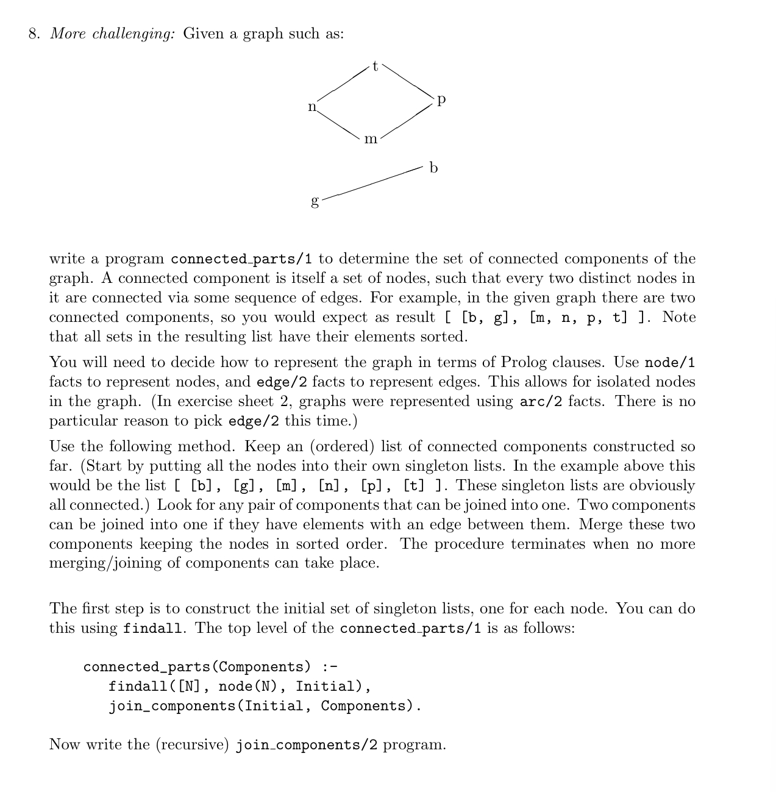

---
encrypt_content:
  level: Imperial
  password: Raymond#1234
  username: hg1523
level: Imperial
---
# 1. 

**Write a program all_members(+X, +Y) which checks whether all memebers of a given list X are members of another given list Y. For example**

```
?- all_members([a,a,d,e], [a,b,c,d,e]).
yes
?- all_members([a,a,d,e], [a,b,c,d]).
no
?- all_members([], []).
yes
```

**To order of the lists, and repetition of members are irrelevant.**

**Use the sicstus built-in predicate member / 2.**

```prolog
all_members([H|T], L) :-
  member(H, L),
  !,
  all_members(T, L).
```

# 2.

**Write a program pairs(+X, ?Y) which given a list X of numbers, constructs a list Y of the same length such that wach member of Y is (U,V) when the corresponding member of X is N and U is N-1 and V is N + 1**

**eg. pairs([1,3,7], Y) produces as result Y = [(0,2),(2,4),(6,8)]**

```prolog
pairs([N|T], [HY|Y]) :-
  HY = (A, B),
  A is N - 1,
  B is N + 1,
  pairs(T, Y).
pairs([], []).
```

# 3

**Write a program arbpairs(+X, ?Y) which, given a list C of numbers, constructs a list Y of the same length such that each member of Y is (N,L) when the corresponding member of X is N and L is either N or 2N.**

**e.g., arbpairs( [2,4], Y ) produces all of the following as possible solutions:**

 Y = [(2,2),(4,4)]
 Y = [(2,4),(4,4)]
 Y = [(2,2),(4,8)]
 Y = [(2,4),(4,8)]

```prolog
arbpairs([N|T], [HY|Y]) :-
  arbpairs(T, Y),
  HY = (A, B),
  A is N,
  (
    B is 2 * N;
    B is N
  ).
arbpairs([], []).
```

modal answer:

```prolog
arbpairs( [], [] ).
arbpairs( [N | List], [(N, N) | Pairs] ) :-
    arbpairs( List, Pairs ). 
arbpairs( [N | List], [(N, TwoN) | Pairs] ) :-
    TwoN is 2 * N,
    arbpairs( List, Pairs ).
```

which basically uses the same logic

# 4

**Write a program replace_wrap/2, which replaces every member X of a list with wrap(X):**

```
?- replace_wrap([a,b,b,c], Res).
Res = [wrap(a), wrap(b), wrap(b), wrap(c)]
```

**Besides the obvious recursive definition try to define replace_wrap/2 using findall/3**

```prolog
replace_wrap(X,Res) :-
  findall(wrap(A), member(A,X), Res).
```

# 5

**Write a program even members( +X, ?Y ) which, given  a list X constructs the list Y consisting of the 2nd, 4th, 6th,... members of the input list X:**

```
?- even_members([a,b,c,d,e,f,g], Res).
Res = [b,d,f]
```

```prolog
even_members(X, Y) :-
    even_members_helper(X, Y, 0).

even_members_helper([], [], _).
even_members_helper([H|T], [H|Y], N) :- 
    N mod 2 =:= 1,
    N1 is N + 1,
    even_members_helper(T, Y, N1).
even_members_helper([_|T], Y, N) :- 
    N mod 2 =:= 0,
    N1 is N + 1,
    even_members_helper(T, Y, N1).
```

actually we can do (as the modal answer)

```prolog
even_members([], []).
even_members([_], []). 
even_members([_,X|Rest], [X|Evens]) :-
  even_members(Rest, Evens).
```

# 6

**Generalise the previous question. Write a program odd_even_members( +X, ?Y, ?Z ) which, given a list X constructs the lists Y and Z consisting of the 1st, 3rd, 5th,... and 2nd, 4th, 6th,... members of the input list X, respectively:**

```prolog
?- odd_even_members([a,b,c,d,e,f,g], Odds, Evens).
Evens = [b,d,f], Odds = [a,c,e,g]
```

```prolog
odd_even([], [], []).
odd_even([X], [X], []).
odd_even([X,Y|Rest], [X|Odds], [Y|Evens]) :-
    odd_even(Rest, Odds, Evens).
```

# 7

**For the purposes of this exercise, suppose that an arithemetic term is defined to be**

- a number
- a term a(X,Y) where X and Y are both arithmetic terms
- a term m(X,Y) where X and Y are both arithmetic terms

**where term a(X,Y) represents X + Y, whilst m(X,Y) represents X+Y**

**Write a program numval (+A, ?V) which, given the arthemtic term A, computes the numerical value V that it represents**

**For example, if A = a(m(3,a(2,5)),a(2,3)) then A represents (3 (2 + 5)) + (2 + 3) and so V = 26.**
 
**The only predicates that you need are numval/2 itself, number/1 and is/2**

```prolog
numval(m(A,B), V) :-
  numval(A,C),
  numval(B,D),
  V is C * D.
numval(a(A,B), V) :-
  numval(A,C),
  numval(B,D),
  V is C + D.
numval(A,V) :-
  number(A),
  V is A. % this can be omitted by changing the predicate numval(A,A)
```

# 8



```prolog
% --------------------  Question 8    connected_parts/1 --------------


% Representation of the graph:
% the nodes are represented by node/1 facts; this allows for the
% representation of graphs with isolated nodes.
% the edges are represented as a pair of nodes.

    node( n ).
    node( t ).
    node( p ).
    node( m ).
    node( g ).
    node( b ).

%  take out the comment on the following fact to test for isolated nodes.

    % node( a ).

    edge( n, t ).
    edge( t, p ).
    edge( n, m ).
    edge( m, p ).
    edge( g, b ).


% This solution keeps a list of components constructed so far
% and looks for any pair that can be joined into one.
% Two components can be joined into one if they have elements
% with an edge between them.
% Procedure terminates when no more reduction/joining can take place.


    connected_parts(Components) :-
       findall([N], node(N), Initial),
       join_components(Initial, Components).
       
    join_components(Now, Now) :-
       \+ join_two_components(Now, _). % a bit inefficient
    join_components(Now, Components) :-
       join_two_components(Now, Reduced),
       join_components(Reduced, Components).


    join_two_components(Now, [Combined|Rest]) :-
       pick_pair(Now, Comp1, Comp2, Rest),
       member(X, Comp1),
       member(Y, Comp2),
       (edge(X, Y) ; edge(Y, X)),
       merge_lists(Comp1, Comp2, Combined).


    pick_pair(List, X, Y, Rest) :-
       select(X, List, Rem),  
       select(Y, Rem, Rest).

% select is provided by Sicstus library(lists) but it is easy.
% It is a generalised version of member/2

    select(X, [X|Y], Y).
    select(X, [U|Y], [U|Z]) :-
       select(X, Y, Z).


% Here is a quick and simple way of merging two (ordered) lists
% sort/2 is a built-in predicate in Prolog.

    merge_lists(Comp1, Comp2, Merged) :-
       append(Comp1, Comp2, Both),
       sort(Both, Merged).  

% Alternatively, write your own merge_lists 
% (cf. add_poly in exercise 2)
       

/* The above could be written more efficiently like this using 'cut':

    join_components(Now, Components) :-
       join_two_components(Now, Reduced), !,   % Note
       join_components(Reduced, Components).
    join_components(Now, Now).


Or alternatively like this (I don't like this):
    
    join_components(Now, Components) :-
       (join_two_components(Now, Reduced)
        ->
           join_components(Reduced, Components)
        ;
           Components = Now
        ).

*/

/* The above can be written slightly more efficiently (tail recursive) 
        
    join_components(Initial, Components) :-
       join_components(go, Initial, Components).
       
    join_components(stop, Now, Now).
    join_components(go, Now, Components) :-
       (join_two_components(Now, Reduced)
        ->
           Next = go
        ;
           Next = stop, Reduced = Now
        ),
        join_components(Next, Reduced, Components).


*/
```