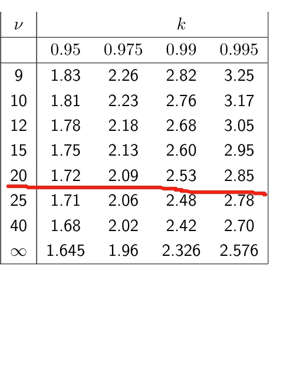

---
level: Imperial
---
---

level: Imperial

---

---


level: Imperial


---


---



encrypt_content:



  level: Imperial



  password: Raymond#1234



  username: hg1523



level: Imperial



---



# 1



## a:



**A random sample of n = 100 observations produced**







$$\sum_{i=1}^nx_i = 120,\sum_{i=1}^nx_i^2 = 550$$



**Assuming the central limit theorem apporximation holds, give a 95% confidence interval for the mean. Interpret and argue why it is justified to use the central limit theorem approximation**







the population variance is unknown, so we need to use the bias constructed variance to construct the confidence interval. Since $n = 100 > 30$ sufficient for the CLT to work







so the CI is







$$[\bar{x} - z\frac{s}{\sqrt{n}}, \bar{x} + z\frac{s}{\sqrt{n}}]$$







$\bar{x} = 1.2,s = \frac{\sum_{i=1}^n{x_i-\bar{x}}^2}{n-1} = \frac{\sum_{i=1}^n{x_i^2} + \sum_{i=1}^n{2\bar{x}x_i} + \sum_{i=1}^n\bar{x}^2}{n-1} = 2.03$







this means if we draw a large number of samples, 95% of their mean will be captured by this interval.







## b.



**A particular gene occur as one of two alleles G and g, with G have frequency $f\in[0,1]$ in the overall population, Testing a random sample of people, you find that $n_1$ people are GG, $n_2$ people are Gg, and $n_3$ people are gg. Derive the maximum likelihood estimator $\hat{f}$ of the parameter f**







we need to derive $L(f)$ the pmf of the joint probability







according to the question, $P(GG) = f^2, P(Gg) = f(1-f),P(gg) = (1-f)^2$







so the MLE is







$$\begin{aligned}



L(f) &= (f^2)^{n_1}(f(1-f))^{n_2}((1-f)^2)^{n_2}\\



l(f) &= (2n_1 + n_2)\log f + (n_2 + 2n_3)\log (1-f)\\



l'(f)&= \frac{2n_1 + n_2}{f} - \frac{n_2+2n_3}{(1-f)}\\



\end{aligned}$$







we let $l'(f) = 0$







then 







$$\begin{aligned}



\frac{2n_1+n_2}{f}&=\frac{n_2+2n_3}{(1-f)}\\



(2n_1+n_2)(1-f) &= (n_2+2n_3)f\\



(2n_1+2n_2+2n_3)f &= 2n_1 +n_2\\



f&=\frac{2n_1+n_2}{2n_1+2n_2+2n_3}



\end{aligned}$$







$\hat{f} = \frac{2n_1+n_2}{2n_1+2n_2+2n_3}$







(conduct a second derivative test and check if it is maximum)







## c



**An internet provider advertises a subscription with the claim that the download of a 2-hour long film from their website would, on average, take only 30 seconds. Before subscribing, you test the claim at a friend's house that is already signed up for the plan by downloading at different times 2-hour long films. For 21 downloads you observe an averge time of 35 seconds, with a bias-corrected sample variance of 25. Conduct a hypothesis test to decide if you can conclude that the advertisement is accurate**







the population mean is unknown, we use the t-test







the null and alternative hypothesis:







$$\begin{aligned}



H_0&:\mu = 30\\



H_1&:\mu\neq 30\\



\end{aligned}$$











the degree of freedom $21 - 1 = 20$







and $t = \frac{\bar{X} - \mu_0}{s_{n-1}/\sqrt{n}} = \frac{35-30}{\sqrt{25}/\sqrt{21}} = 4.58$







so we check the t table 











with degree of freedom 20 and significance level $\alpha = 5\%$, then the rejection region is $(-\infty,-2.09)\cup(2.09,\infty)$. t falls in the range and therefore we reject the null hypothesis and the advertisement is not accurate at significance level of 5%







## d



**It was observed that the lifeline of 195 light-emitting diodes (LEDs) in an office building is distributed as follows, where lifetimes are rounded up to the next integer values**







| lifetime in years | 1   | 2   | 3   | 4   | 5   | 6   |



| ----------------- | --- | --- | --- | --- | --- | --- |



| number of LEDs    | 64  | 44  | 32  | 23  | 20  | 12  |



### (i)



**Assuming that the LED lifetime is modelled by an exponential distribution with unknown parameter $\lambda$, show that the MLE $\hat{\lambda}$ for $\lambda$ is 0.38**







similar to b, the exponential distribution is $p(\lambda) = \lambda e^{-\lambda x}$







$$\begin{aligned}



L(f) &= (\lambda e^{-\lambda})^{64}(\lambda e^{-2\lambda})^{44}(\lambda e^{-3\lambda})^{32}(\lambda e^{-4\lambda})^{23}(\lambda e^{-5\lambda})^{20}(\lambda e^{-6\lambda})\\



&= \lambda^{195}e^{-512\lambda}\\



l(f) &= 195\log\lambda-512\lambda\\



l'(f) &= \frac{195}{\lambda} - 512\\



\end{aligned}$$







therefore $\hat{\lambda} = \frac{195}{512}\approx 0.38$







then do the second derivative test







### (ii)



I dont think chi-square is in the syllabus, but if it does







$$\chi^2 = \sum_{i=1}^k\frac{(O_i - E_i)^2}{E_i}$$







# 2



## a



see tut 1, exactly the same, just make sure to state all equations used and all independence







## b:







### (i)







the definition of the mgf (similar to pgf) is $$G(z) = E\{z^X\} = \sum_{x} = z^xp(x)$$







and assume that $X_1, X_2,\dots, X_n$ are independent, then we have







$$\begin{aligned}G_{S_n}(z) &= E(z^{{\sum_{i=1}^n} X_i}) \\&= E(\prod_{i=1}^nz^{X_i})\\&=E(\prod_{i=1}^nz^{X_i'}) &\text{By independence}\\



&=\prod_{i=1}^nG_{X_i}(z)\end{aligned}$$







this is similar to mgf $E(Z_1Z_2) = E(Z_1)E(Z_2)$ when the two are independent











ii iii iv are easy with i







# c



## (i):







the definition of $P_{XY}(B_X,B_Y)$ is $P_{XY}(X^{-1}(B_X)\cap Y^{-1}B_Y), B_X,B_Y\in\mathbb{R}$







