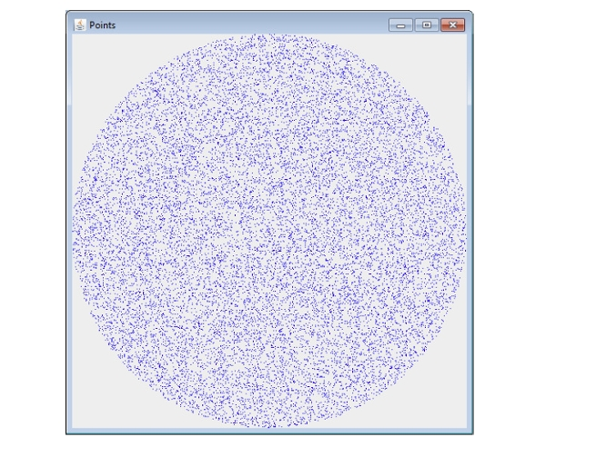

---
level: Imperial
---
---

level: Imperial

---

---


level: Imperial


---


---



encrypt_content:



  level: Imperial



  password: Raymond#1234



  username: hg1523



level: Imperial



---



# 1



**For a random sample of size n from a normal distribution with unknown mean $\mu$ and known variance $\sigma^2$ use the standard numerical table to determine what is the confidence level for each of the following confidence limits for $\mu$**







I will skip this, just notice that if we looked up $\Phi(x) = 0.975$, it means the 95% confidence level since its double-sided







# 2



**A random sample of 64 observations from a simulated population produced the following summary statistics**







$$\begin{aligned}



\sum x_i &= 700\\



\sum(x_i-\bar{x})^2 &= 4238\\



\end{aligned}$$







**find a 95% confidence interval for $\mu$ and interpret this value** 







$\bar{x} = \frac{\sum x_i}{64} = \frac{700}{64}$







$\sigma = \frac{\sum(x_i-\bar{x})^2}{64}=\frac{4238}{64}$







so the confidence interval is $\mu\pm 1.96\frac{\sigma}{\sqrt{n}} = \frac{175}{16}\pm1.96\frac{}{}$







 need to use the bias-corrected sample variance and also the t-student's distribution







when the population (the population, not the sample) std is unknown, we use the t-distribution, similarly, the bias-correction for variance











so $\bar{x} = \frac{\sum_{x_i}}{n}$







$s_{n-1}^2 = \frac{\sum(x_i-\bar{x})^2}{63}=\frac{4238}{63}$







and $t_{63,95\%} = 1.9983$







$\mu = \bar{x}\pm(1.9983\times \frac{s_{n-1}}{\sqrt{n}}) = 10.9375\pm 2.0487$







# 3:



the same, still notice we need to use the bias-correct sample variance and the student-t distribution







# 4:







** the following random sample was selected from a normal distribution**







$7.53, 4.35, 7.66, 7.54, 5.83, 1.92, 3.14, 4.41$







## (a)







**Construct a 90% confidence interval for the population mean**







still remember to use the t-distribution







## (b)







same, with 99%







# 5:







programs not assessed and not examinable, skip







# 6:







same as 5







# 7:







**A popular technique in the simulation of mobile ad-hoc networks is to generate random "waypoints" in a defined geographical region and then arrange for agents to move from their current location to the random waypoint at some specified speed. How would you generate random waypoint in circular region of radius r such that the chosen points are evenly distributed over the region, as illustrated in the diagram below**















sample the x and y coordinates from two normal distribution and normalise it to (1,-1)







the question demanded the sampling to be evenly distributed, we need to use inverse transformation







consider for $0\le x\le r$







then $F(x) = \frac{x^2}{r^2}$ we want this to be a uniform distribution, say U







and inverting this gives $U = \frac{x^2}{r^2}\Rightarrow x = \sqrt{Ur^2}$







# 8.



## (a) 



**The weibull distribution has density and cumulative distribution function (cdf):**







$$\begin{aligned}



f_W(x) &= \frac{\beta x^{\beta -1}e^{(x/a)^\beta}}{\alpha^{\beta}} &\alpha,\beta>0 \text{ and } x\ge 0\\



F_W(x) &= 1 - e^{-(x/a)^{\beta}}\\



\end{aligned}$$







**show how the inverse transform method can be used to sample from a Weibull distribution**







let $U$ denote $U(0,1)$







then 







$$\begin{aligned}



U &= F_W(x) = 1 - e^{-(x/\alpha)^{\beta}}\\



1-U &= e^{-(x/\alpha)^{\beta}}\\



\log (1-U) &= \log e^{-(x/a)^{\beta}}\\



\log(1-U)&= -(x/a)^{\beta}\\



(\log(1-U))^{\frac{1}{\beta}} &= -x/a\\



x &=\alpha (\log(1-U))^{\frac{1}{\beta}}



\end{aligned}$$







## (b)







**Assume you are able to sample a Weibull distribution, e.g. using the method above. Explain how the acceptance-rejection method can be used to sample a Gamma distribution with parameters $\alpha = 2, \beta = 1$ as the dominating function. The Gamma distribution to be sampled has density function given by:**







$$f_G(x) = 4xe^{-2x},x\ge 0$$







**As part of your answer determine a scaling factor, c, that ensures that $cf_W(x)\ge f_G(x)$**







we want to find







$$\begin{aligned}



c &=\max\frac{f_G(x)}{f_W(x)}\\



&= \max\frac{\alpha^{\beta}(4xe^{-2x})}{\beta x^{\beta - 1}e^{-(x/a)^{\beta}}}\\



&=\max\frac{8e^{-2x}}{e^{-\frac{x}{2}}}\\



&=\max 8xe^{-\frac{3}{2}x}



\end{aligned}$$







we take the derivative of this







$8e^{-\frac{3}{2}x}(1-\frac{3}{2}x)$







therefore $x = \frac{2}{3}$







$c = \frac{16}{3e}$







# 10



## (a)







$\int_{0}^{a}f(x)dx = 0.99$







$$\begin{aligned}



\tan^{-1}(a) - \tan^{-1}(0) = \frac{99\pi}{200}\\



\tan^{-1}(a) = \frac{99\pi}{200}



\end{aligned}$$







$a = \tan (\frac{99}{200\pi})$



