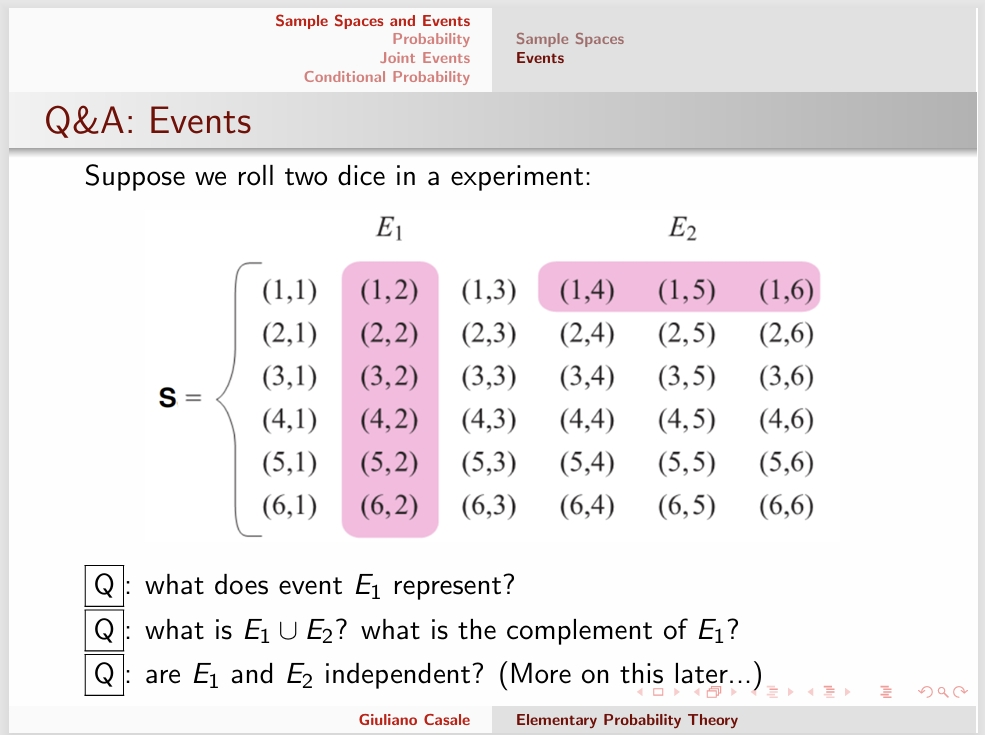

---
level: Imperial
---
---

level: Imperial

---

---


level: Imperial


---


---



encrypt_content:



  level: Imperial



  password: Raymond#1234



  username: hg1523



level: Imperial



---











- $E_1$ represent the event that the second die is 2



- $\varnothing$, the complement of $E_1$ is all the events that the second die is not 2



- are $E_1$ are $E_2$ independent(More on this later), not independent, because $E_1$ implies not $E_2$ 