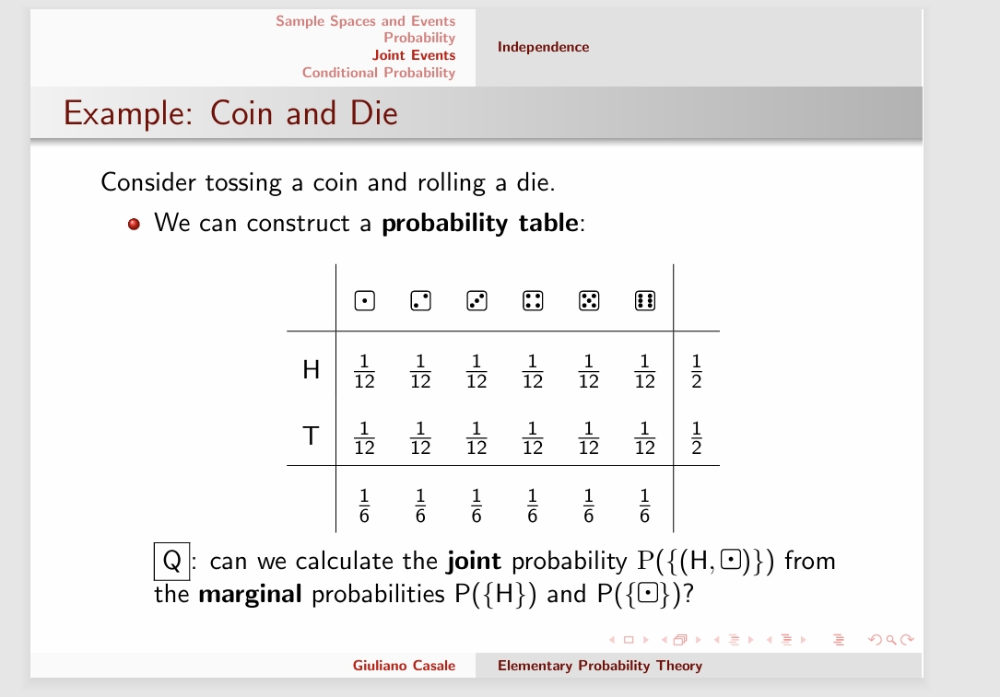

---
encrypt_content:
  level: Imperial
  password: Raymond#1234
  username: hg1523
level: Imperial
---
# Sample Space:

In a random experiment, the Sample space is the set of all possible outcome

example:

- Coin tossing $S = \{H,T\}$

# Event:

An event is any subset of the sample space.

Extreme possible events are $\varnothing$ (the null event) or S.

The singleton subsets of S (those subsets which contain exactly one element form S) ar the elemenary events of S.

Supppose we now performa random experiment, the outcome of which will be a single elemen $s^*\in S$.

Then for any event $E\subset S$, we will say E has occured if and only if $s^*\in E$

If E has not occured, it must be that $s^*\not\in E\iff s^*\in\overline{E}$ $\overline{E}$ can be interpreted as not E.

Notice that the smallest event which will have occurred will be the singleton $\{s^*\}$ For any other event E, E will occur if and only if $\{s^*\}\subset E$

For the sample space S

- the null event never happen
- the universal event S will always occur

## Set operator on events

consider the set of $\{E_1,E_2,...\}$

$\bigcup_{i}E_i = \{s\in S|\exists i\text{ s.t. } s\in E_1\}$ will occur if one of the events occurs

$\bigcap_{i}E_i = \{s\in S|\forall i s\in E_i\}$ will occur only if all of the events occurs

so events are mutually exclusive if $\forall i,j, E_i\cap E_j = \varnothing$ (they are disjoint), then at most one of the events will occur

## $\sigma$-algebra of events

when defining a probability function on S we also simultaneously agree on a collection of subsets of S that we wish to assign a probability to. We generally refer to this set of subsets as $\mathbf{F}$

$\mathbf{F}$ must be

- non-empty $\mathbf{S}\in \mathbf{F}$
- closed under complements $E\in\mathbf{F}\Rightarrow\overline{E}\in\mathbf{F}$
- closed under countable unioni $E_1,E_2...\in\mathbf{F}\Rightarrow \bigcup_i E_i\in\mathbf{F}$

## Axioms of Probability

A probability measure on the pair $(\mathbf{S}, \mathbf{F})$ is a mapping $P:\mathbf{F}\to[0,1]$ satisfyinf the following three axioms for all subsets of S on which it is defined

- $\forall E\in\mathbf{F}, 0\le P(E)\le 1$ (the probability of any event is between 0 and 1)
- $P(\mathbf{S}) = 1$, the probability that the universal event will occur is 1
- Countably additive: For mutually exclusive events $E_1,E_2...\in\mathbf{F}, P(\bigcup_{i}E_i) = \sum_{i}P(E_i)$

so we can derive the following

- $P(\overline{E}) = 1 - P(\overline{E})$ (the probability of the complement of E is 1 - P(E), or they addds up to 1)
- $P(\varnothing) = 0$, (the probability of the null event is 0)
- $P(E\cup F) = P(E) + P(F) - P(E\cap F)$ (proof later)

## Interpreations of Probability:

Classical Interpretation:

- If S is finite the elementary events are equally likely $P(E)=\frac{|E|}{|S|}$, where $|\bullet|$ denotes cardinality
- if extended to the infinte sample space, then we measure probability in proportions

Frequentist Interpretation:

Probability as limiting value of repeating observation s in identical random situations

for example we see 4 heads and 4 tails in a coin toss, then the probability is 0.5

Subjective interpretation: probability as an individual measure of the perceived risk

- How much would you bet in a game that wins one buck

## Independent Events:

Two events are said to be independent if and only if $P(E\cap F) = P(E)P(F)$

more generally, a set of events $\{E_1, E_2,...\}$ are said to be independent if, for any finite subset $\{E_{i_1},E_{i_2},...,E_{i_n}\}$

$P\Bigg(\bigcap_{j=1}^n E_{i_j}\Bigg) = \prod_{j=1}^nP(E_{i_j})$

where $\{i_j|1\le j\le n\}$ is any set of distinct indices

we can use a probability table to displayy the probabilities of a event

### Proposition:

If events E and F are independent, then $\overline{E}$ and F are also independent

since $F  = (E\cap F)\cup(\overline{E}\cap F)$ is a disjoint union

$P(F) = P(E\cap F) + P(\overline{E}\cap F)$

so by axiom 3:

$\begin{aligned}
P(\overline{E}\cap F) &= P(F)-P(E\cap F)\\
&= P(F) - P(E)P(F)\\
&= (1-P(E))P(F)\\
&= P(\overline{E})P(F)
\end{aligned}$

### Proposition:

$P(\overline{E}\cup F) = P(E) + P(F) - P(E\cap F)$

so from set theory

$E\cup F = E\cup (F\cap \overline{E})$

Since E and $F\cap \overline{F}\cap\overline{E}$ are disjoing, by Axiom 3

$\begin{aligned}
P(E\cup F) &= P(E\cup(F\cap\overline{E}))\\
&= P(E) + P(F\cap\overline{E})
\end{aligned}$

$P(E) + P(F\cap \overline{E}) + P(E) = P(F\cap \overline{E})$

## Conditional Probability

For two event E and F in S, where $P(F) \neq 0$, we define the conditional probability of E occuring given that we know F has occured to be

$P(E|F) = \frac{P(E\cap F)}{P(F)}$

if E and F are independent, then

$P(E|F) = \frac{P(E\cap F)}{P(F)} = \frac{P(E)P(F)}{P(F)} = P(E)$

### Conditional Independence:

We can extend the idea of independence of events w.r.t a probability measure P to condition probabilities

- $P(\bullet|F)$ defines a perfectly valid probability measure, obeying the axioms of probability on the restricted sample space F.
- For three events $E_1, E_2, F$, the event pair $E_1$ and $E_2$ are said to be conditionally independent given F if and only if

$P(E_1\cap E_2|F) = P(E_1|F)P(E_2|F)$

### The Law of Total Probability

Consider a set of events $\{F_1, F_2,\dots\}$ which form a partition of S

the for any event $E\subseteq S$ the Law of Total Probability (also called the Partition Rule) state that

$P(E) = \sum_{i}P(E|F_i)P(F_i)$

the Proof:

$E = E\cap S = E\cap \bigcup_i F_i = \bigcup(E\cap F_i)$

So

$P(E) = P\Bigg(\bigcup_i(E\cap F_i)\Bigg)$

by axiom 3, and noting that $\{E\cap F_1,E\cap F_2,\dots\}$ are disjoint since $\{F_1,F_2,\dots\}$ are implies

$P(E) = \sum_i P(E\cap F_i)$

rewrite the gets the Law of Total Probability

note that for any events E and F in S, $\{F,\overline{F}\}$ for example, form a partition of S. then the law of total probability we have

$\begin{aligned}
P(E) &= P(E\cap F) + P(E\cap\overline{F})\\
&= P(E|F)P(F) + P(E|\overline{F})P(\overline{F})
\end{aligned}$

## Bayes Theorem

For two events E and F in S, we have

$P(E\cap F) = P(F)P(E|F)$

Interchanging E and F and noting $E\cap F \equiv F\cap E$

$P(E\cap F) = P(E)P(F|E)$

so Bayes Theorem

$P(E|F) = \frac{P(E)P(F|E)}{P(F)}$