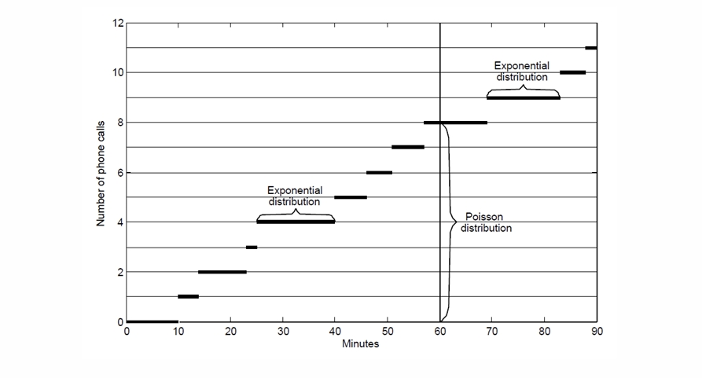

---
level: Imperial
---
---

level: Imperial

---

---


level: Imperial


---


---



encrypt_content:



  level: Imperial



  password: Raymond#1234



  username: hg1523



level: Imperial



---



# Probability Density Functions







we have sample sample S and probability measure P







then the induced probability $P_X(X\le x) = P_X((-\infty, x])) = P(S_x) = F_X(x)$







so we define the random variable to be continuous if $\exists f_x:\mathbb{R}\to\mathbb{R}$ s.t. $F_X(x) = \int_{u = -\infty}^xf_X(u)du$







$f_x$ is referred to as the probability density function (pdf) of X







note that $P_X(a<X\le b) = F_x(b) - F_x(a) = \int_{a}^bf_x(x)dx$







## the probability of any single point is 0:







the definition suggests $P_x(x = b) = 0$ since $\int_b^bf_x(x)dx = 0$







so the probability can be assigned to any elementary event $\{x\}$, $x\in\mathbb{R}$ is zero for a continuous random variable or $P_x(X = x)= P)x(\{x\}) = 0$







therefore, the support for a continuous variable must be uncountable







## pdf as the Derivative of cdf







cdf can be defined as







$F_x(x) = \int_{-\infty}f_x(t)dt$







or in the inverse







$f_x(x) = \frac{d}{dx}F_x(x)$







## properties:







the pdf is always non-negative, since cdf is non-decreasing







so to ensure that a pdf is valid







- $f_x(x) \ge 0\forall x\in\mathbb{R}$



- $\int_{-\infty}^{\infty}f_x(x)dx =1$







the cdf of a continuous random variable X is a non-decreasing function with $F_x(-\infty) = 0, F_x(\infty) = 1$ ans also is continuous







for a continuous variable $\forall x, P(X = x) = 0, F_x(x) = P(X\le x) \equiv P(X< x)$







# Mean, Variance and Quantiles







## $E(X)$







For a continous random variable X, we define the mean or expectation of X to be 







$\mu_x = E_x(x) = \int_{-\infty}^{\infty} xf_x(x)dx$







More generally, for a function of interest of the random variable $g:\mathbb{R}\to\mathbb{R}$







$E_x(g(x)) = \int_{-\infty}^{\infty}g(x)f_x(x)dx$







### $E(X)$ is linear







or $\forall a,b\in\mathbb{R}, E(aX + b) = aE(X) + b$







and 







$E(g(X) +h(X)) = E(g(X)) +E(h(X))$







## $Var(x)$







$\sigma_x^2 = Var_x(x) = E((X - \mu_x)^2) = \int_{-\infty}^{\infty}(x-\mu_x)^2f_x(x) dx$







following the results in the previous lecture







$Var_x(x) = \int_{-\infty}^{\infty}x^2f_x(x)dx -\mu_x^2 = E(X^2)-(E(X))^2$







## Quantiles and percentiles







the lower quantiles, median, upper quantiles are the $\frac{1}{4},\frac{1}{2},\frac{3}{4}$ way through the ordered data







for a continuous random variable X we define the $\alpha-$quantile to be $Q_x(a),0\le \alpha\le 1$, as the least number satisfying $P(X\le Q_x(\alpha))$







$Q_x(\alpha) = F_X^{-1}(\alpha)$







the kth percentile of a distribution is the quantile for $\alpha = \frac{k}{100}$







# Notable Continuous Distributions







## U(a,b)







Uniform distribution







A continous ranodm vairbale X with range (a,b) has a uniform distribution on the interval (a,b) if its pdf is







$f(x) = \begin{cases}\begin{array}{c}\frac{1}{b - a} & a < x < b\\0 & \text{otherwise}\end{array}\end{cases}$







or equivalently, its cdf is







$F(x) = \begin{cases}\begin{array}{c}0 & x\le a\\\frac{x - a}{b - a} & a < x < b\\1 & x\ge b\end{array}\end{cases}$







transforming $U(a,b)$ to $U(0,1)$ gives $Y = a +(b-a)X$







### Mean:







$\begin{aligned}E(X) &= \int_{-\infty}^{\infty}xf(x)dx\\ &= \int_a^b x\frac{1}{b-a}dx\\ &= [\frac{x^2}{2(b-a)}]^b_a\\ &=\frac{b^2-a^2}{2(b-a)} = \frac{a+b}{2}\end{aligned}$







### variance







$Var(x) = E(x^2) - E(x)^2 = \frac{(b-a)^2}{12}$







## Exp($\lambda$)







random variable X with $supp(X) = [0,\infty)$ and pdf $f(x) = \lambda e^{-\lambda x},x\ge 0$







for some $\lambda > 0$







then X is a exponential random variable with a rate parameter $\lambda$ or $X\sim Exp(\lambda)$







cdf: $F(x) = 1 - e^{-\lambda x}$







$E(X) = \frac{1}{\lambda}, Var(x) = \frac{1}{\lambda^2}$







### Memoryless Property of the Exponential:







the complementary cdf is $P(X>x) = e^{\lambda x}$







$P(X>x+s|X>s) = \frac{P(X>x+s)}{P(X>s)} = \frac{e^{\lambda(x+s)}}{e^{-\lambda s}} = e^{\lambda x} = P(X>x)$







so this is oftne used to mdoel the time until occurence of a random event where there is an assumed constat risk or rate ($\lambda$) of the event happening over time







### Proposition:



if events in a random process occur according to a Poisson distribution, then the time between consecutive events has a exponential distribution with parameter $\lambda$











#### proof:







Suppose we have some random event process for which $\forall x> 0$, the number of events occurring in $[0,x],N_x$ follows a Poisson distribution with mean $\lambda x$, i.e. $N_x\sim Poi(\lambda x)$







this process is know as a homogeneous Poissson process.







Let X be the time until the first event of this process occurs







then $\begin{aligned}P(X> x)&\equiv P(N_x = 0)\\&=\frac{(\lambda x)^0e^{-\lambda x}}{0!}\\&=e^{-\lambda x}\end{aligned}$







so $X\sim Exp(\lambda)$







for the next event, let the time between the last event and this event be x_1







$\begin{aligned}P(X>x+x_1|X>x)= P(X> x_1)&\equiv P(N_x = 0)\\&=\frac{(\lambda x)^0e^{-\lambda x}}{0!}\\&=e^{-\lambda x}\end{aligned}$











## The normal distribution $N(\mu,\sigma^2)$







A normal (gaussian) random variable X with range $\mathbb{R}$ has pdf







$f(x) = \frac{1}{\sigma\sqrt{2\pi}}\exp\big\{-\frac{(x - \mu)^2}{2\sigma^2}\big\}$











for some $\mu,\sigma\in\mathbb{R}, \sigma > 0$







Then it can be shown that X has mean $\mu$ and variance $\sigma^2$







we can write $X\sim N(\mu,\sigma^2)$







The cdf of X does not have an analytically tractable form for any $(\mu,\sigma)$ so we can onlt write







$F(x) = \frac{1}{\sigma\sqrt{2\pi}}\int_{-\infty}^x\exp \big\{-\frac{(t-\mu)^2}{2\sigma^2}\big\}dt$







the $\mu$ determine the center, and the $\sigma$ determine the span







the pdf is bell-shaped and the cdf looks like sigmoid







###  Statistical tables







Since the cdf associated with a Normal distribution is not analytically available, numerical integration procedures are used to find approximate probabilities to high accuracy







In particulat, statistical tables contain values of the standard Normal cdf $\Phi(z)$ for a range of values $z\in\mathbb{R}$, and the quantiles $\Phi^{-1}(\alpha)$ for a range of values $\alpha\in (0,1)$







### Linear Transformations of Normal Random Variables







$X\sim N(\mu, \sigma^2)\Rightarrow aX + b\sim N(a\mu + b, a^2\sigma^2), a,b\in\mathbb{R}$







This allows us to standardise any Normal random variable, i.e.







$X\in N(\mu, \sigma^2)\Rightarrow \frac{X - \mu}{\sigma}\sim N(0,1)$







So if $X\sim N(\mu,\sigma^2)$ and we set $Z = \frac{X - \mu}{\sigma}$, then since $\sigma > 0$, for any $x\in\mathbb{R}$







$X\le x\iff \frac{X-\mu}{\sigma}\le \frac{x - \mu}{\sigma}\iff Z\le \frac{x - \mu}{\sigma}$







Therefore we can write the cdf of X in terms of $\Phi$







$\begin{aligned}F_X(x) &= P(X\le x) = P(X\le\frac{x - \mu}{\sigma})\\&=\Phi(\frac{x-\mu}{\sigma})\end{aligned}$







since Normal pdf $\phi$ is symmetric about 0, so $\phi(z) = \phi(-z)$







for the Normal cdf $\Phi$ this means $\Phi(z) = 1 - \Phi(-z)$







### Important Quantiles of $N(0,1)$







we often have to cause to use 97.5% and 99.5% quantiles of $N(0,1)$, given by $\Phi^{-1}(0.975)$ and $\Phi^{-1}(0.995)$ repectively







$\Phi(1.96)\approx 97.5\%$







so 95% probability that a $N(0,1)$ random vairbale will lie in the range [-1.96, 1.96]







similarly $\Phi(2.58) = 99.5\%$











### Lognormal Distribution







$X\sim N(\mu, \sigma^2)$ and consider the transformation $Y = e^X$







- It can be shown that $f_Y(y) = \frac{1}{\sigma y\sqrt{2\pi}\exp\big[-\frac{\{\log(y) - \mu\}^2}{2\sigma^2}\big]}, y> 0$



- Y is said to follow a lognormal distribution







# Moment generating functions







The moment generation function (mgf) $M_x(t)$ of a continuous random varibale X is defined by







$M_x(t) = E(e^{tX}) = \int_{-\infty}^{\infty}e^{tx}f_X(x) dx$







The mgf can also be defined for a discrete random vairbale X as 







$M_X(t) = E_(e^{tX}) = \sum_{x_i\in supp(X)}e^{tx_i}p(x_i)$







### Obtaining moments from the mgf







Assuming differentiation inside the expectation operator (or integral) is valid, the mgf provides an alternative way to obtain moments $E[X^n] = \frac{d^nM_X(t)}{dt^n}|_{t = 0}$







### Characteristic function $\phi_X(t)$







The integral that defines the mgf may not exist. In these case, we may use instead the characteristic function







$\phi_X(t) = M_x(it) = \int_{-\infty}^{\infty}e^{itx}f_x(x)dx$







where $i = \sqrt{-1}$







mgf may not always exist, but the characteristic function always exist







$E[X^n] = i^{-n}\frac{d^n\phi_X(t)}{dt^n}|_{t=0}$







### Product of Independent Random Variables







Consider two independent random variabels $Z_1$ and $Z_2$







setting $Z = (Z_1, Z_2)$ then $E[g(Z)] = E[Z_1Z_2] = E[Z_1]E[Z_2]$







so $E[\prod_{i=1}^n Z_i] = \prod_{i=1}^nE[Z_i]$







### Sum of Independent Random Variables







A consequence of the previous result is tha tht emgf of the sum of independent r.vs. is the product of their mgfs, e.g:







$\begin{aligned}M_{Z_1 + Z_2}(t)&= E(e^{t(Z_1+Z_2)}) = E(e^{tZ_1}e^{tZ_2})\\&= E(e^{tZ_1})E(e^{tZ_2}) = M_{Z_1}(t)M_{Z_2}(t)\end{aligned}$







More generally, for a sum of n independent r.vs. $S_n = \sum_{j=1}^n X_j$ we have then 







$M_{S_n}(t) = \prod_{j=1}^nM_{X_j}(t)$



