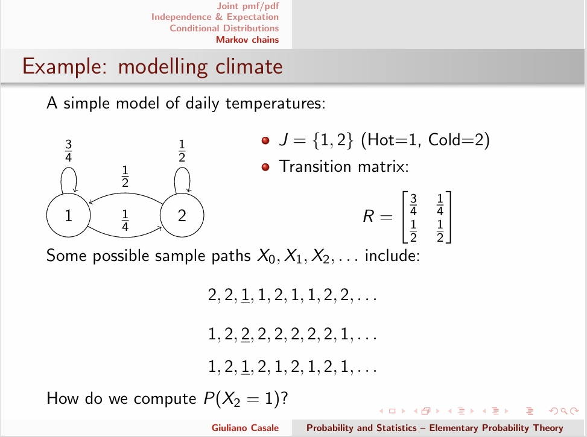

---
encrypt_content:
  level: Imperial
  password: Raymond#1234
  username: hg1523
level: Imperial
---
# Joint Random Variables

we need to combine the outcome of multiple experiments or multiple random variables

## Definitions:

Suppose we have two random variables $X: S\to\mathbb{R}, Y:S\to\mathbb{R}$

where S is the joint sample space, if X and Y are instead define on different experiments with the same sample spaces $S_1 = S_2$, we may set $S = S_1\times S_2$, or a subset thereof, consisting of pairs $s\equiv (s_1, s_2), S_1\in S_1, s_2\in S_2$

A event E is a subset of outcomes $s\in S$ and has an associated probability measure $P(E)$

we may analyze joint r.vs. in terms of a random vector $Z = (X, Y): S \to\mathbb{R}^2$i.e. a mapping $Z(s)\to(X(s), Y(s))$

## Induced probability

- For each pair $(x,y)\in\mathbb{R}^2$ let $S_{xy}\subseteq S$ be the set containing just those elements of S which are mapped by $X$ to numbers no greater than x and by Y to numbers no greater than y i.e. $S_{xy} = \{s\in S|X(s) \le x \text{ and }Y(s)\le y\}$
- The induced probability will now be a function $P_z(Z|le z, Y\le y) = P_z((-\infty, x], (-\infty,y]) = P(S_{x,y})$for $x, y\in \mathbb{R}$
## Joint Cumulative Distribution Function

We can now define the joint cumulative distribution function (joint cdf) as

$F(x,y) = P_z(X\le x, Y\le y), x,y\in\mathbb{R}$

The marginal cdfs for X and Y, i.e. the cdfs for X and Y alone can be easily recovered

$$\begin{aligned}F_X(x)= F(x, \infty) & x\in\mathbb{R}\\
F_Y(y) = F(\infty, y) & y\in\mathbb{R}\end{aligned}$$

## Properties of a joint cdf

For F to be a valid joint cdf, the following conditional must hold:

- $0\le F(x,y)\le 1, \forall x,y\in\mathbb{R}$
- Monotonicity $\forall x_1, x_2, y_1, y_2\in\mathbb{R}$ $x_1< x_2\Rightarrow F(x_1, y_1)\le F(x_2, y_1)$ and $y_1< y_2\Rightarrow F(x_1, y_1)\le F(x_1, y_2)$
- $F(x,-\infty) = F(\infty, y) = 0$ and $F(\infty, \infty) = 1$ $\forall x,y\in\mathbb{R}$

## Interval Probabilities:

Suppose we are interested in whether the random variable pair $Z = (X, Y)$ lie in the interval cross product $(x_1, x_2]\times (y_1, y_2]$ or if $x_1\le X\le x_2$ and $y_1\le Y\le y_2$

$P_z(x_1\lt X\le x_2, Y\le y) = F(x_2,y) - F(x_1, y)$

Hence $P_z(x_1< X\le x_2, y_1<Y\le y_2) = F(x_2, y_2) - F(x_1, y_2) - F(x_2, y_1) + F(x_1, y_1)$

# Joint pmf/pdf

## Joint Pmf:

if X and y are both discrete random bstiables, then we can define the joint pmf by

$p(x,y) = P_z(X = x, Y = y), x, y\in\mathbb{R}$

We can recover the marginal pmfs $p_X$ and $p_Y$ since $\forall x, y\in\mathbb{R}$

$P_X(x) = \sum_yp(x,y)$ and $P_Y(y) = \sum_xp(x,y)$

### properties of the pmf:

for p to be a valid pmf,
- $0\le p(x,y)\le 1, \forall x, y\in\mathbb{R}$
- $\sum_y\sum_xp(x,y) = 1$
these can generalise to n random variables

### Example: Multinomial distribution:

in a sequence of n identical experiments with r possible outcomes, each with probability of $q_i$ and $\sum q_i = 1$ Let $X_i$ be the numbe rof experiements that yield outcome i, then:

$p(n_1,\dots, n_r) = P_z(X_1 = n_1,\dots, X_r = n_r) = \frac{n!}{\prod n_i!} \prod q_i^{n_i}$

since due to independence, a sequence has probability

$\prod q_i^{n_i}$ and $\sum n_i = n$

then the number of sequence that yeild $(n_1,\dots, n_r)$ is

$\Big(\begin{matrix}n\\n_1\end{matrix}\Big)\Big(\begin{matrix}n-n_1\\n_2\end{matrix}\Big)\dots \Big(\begin{matrix}n-\sum_{i=1}^{r-1}n_i\\n_r\end{matrix}\Big)$

### Example: Linearity of expectation:

we prove $E[X+Y] = E[X] + X[Y]$ with joint marginal pmfs

$\begin{aligned}E[X+Y] &= \sum_x\sum_y(x+y)p(x,y)\\&=\sum_x\sum_yxp(x,y) + \sum_x\sum_yyp(x,y)\\&=\sum_x x\sum_yp(x,y) + \sum_yy\sum_xp(x,y)\\&=\sum_xxp_X(x,y) + \sum_xyp_Y(y)\\&= E[X] + E[Y]\end{aligned}$

## Joint PDF:

For f to be a valid pdf:
- $f(x,y)\ge 0,\forall x,y\in\mathbb{R}$
- $\int^{\infty}_{y = -\infty}\int^{\infty}_{x = -\infty}f(x,y) dxdy = 1$
also can be generalised to separete integrals of multiple random variables

### Marginal PDF:

$\begin{aligned}f_X(x) &=\frac{d}{dx}F_X(x)\\&=\frac{dx}{x}F(x,\infty)\\&=\frac{d}{dx}\int_{y = -\infty}^{\infty}\int_{s = -\infty}^{x}f(x,y)dsdy\end{aligned}$

$f_Y(y) = \frac{d}{dy}\int_{x = -\infty}^{\infty}\int_{x=-\infty}^{y}f(x,s)dsdx$

so

$f_X(x) =\int_{y =-\infty}^{\infty}f(x,y) dy$
$f_Y(y) =\int_{x =-\infty}^{\infty}f(x,y) dx$

### Example:

Suppose continuous r.vs. $(X,Y)\in\mathbb{R}^2$ ahve joint pdf

$f(x,y) =\begin{cases}\begin{array}{c}1 & |x| + |y|<\frac{1}{\sqrt{2}}\\0 & \text{otherwise}\end{array}\end{cases}$

Determine the marginal pdfs for X and Y

$f_X(x) = \int_{y = -\infty}^{\infty}f(x,y) dy = \int_{y = \frac{1}{\sqrt{2}}-x}^{\frac{1}{\sqrt{2}}+x}f(x,y)dy = 2x$
 when x > 0
but should be the same for x < 0

# Independence and Expectation:

## Independence of Random Variable:

Two random varibale X and Y are independent if and only if 

$F(x,y) = F_X(x)F_Y(y)\forall x, y$

so this can be

- Discrete case: independence holds if and only if: $p(x,y) = p_X(x)p_Y(y)\forall x, y$
- Continuous case: independence holds if and only if: $f(x,y) = f_X(x)f_Y(y),\forall x, y$

### Example: Independent random variables:

Suppose the lifetime X and the brightness Y of a light bulb are modelled as a continuous random variables and their joint pdf is

$f(x,y) = \lambda_1\lambda_2e^{-\lambda_1x-\lambda_2y}, x, y>0$

then $f(x) = \int_{x=-\infty}^{\infty}\lambda_1\lambda_2e^{-\lambda_1 x-\lambda_2 y}dx = \lambda_2e^{-\lambda_1x}$

$f(y) = \lambda_1 e^{- \lambda_2 y}$

so $f(x)f(y) = f(x,y)$

### Expectation of a function of r.vs $E(g(X,Y))$

Let g be a bivaritate function of the random varibaels X and Y, defined by $g:\mathbb\times\mathbb\to\mathbb{R}$

If X and Y are discrete, we define $E(g(X,Y))$ by $E(g(X,Y)) = \sum_y\sum_xg(x,y)p(x,y)$

If X and Y are jointly continuous, we define $E(g(X,Y))$ by $E(g(X,Y)) = \sum_{y=-\infty}^{\infty}\int_{x=-\infty}^{\infty}g(x,y)f(x,y)$

then from the definition:

if $g(X,Y) = g_1(X) + g_2(Y)$, $E(g_1(X) + g_2(Y)) = E_X(g_1(X)) +E_Y(g_2(Y))$

if $g(X,Y) = g_1(X)g_2(Y)$ and X and Y are independent
$E(g_1(X)g_2(Y)) = E_X(g_1(X))E_Y(g_2(Y))$

In paricular, considering $g(X,Y) = XY$ for independent X, Y we have $E(XY) = E_X(X)E_Y(Y)$

### Covariance:

- For a single r.v X we considered the expectation of $g(X) = (X -\mu_X)(X - \mu_X)$ the variance $\sigma_X^2$
- The bivariate extension of this is the expectation of $g(X,Y)= (X-\mu_X)(Y-\mu_Y)$
- we define the covariance of X and Y by 
$$\begin{aligned}\sigma_{XY}=Cov(X,Y) &=E[(X-\mu_X)(Y - \mu_Y)]\\&=E[XY]-\mu_x\mu_Y \end{aligned}$$
- For independent r.vs. $E[XY] = E_X[X]E_Y[Y]$ so $\sigma_{XY}=0$(this is not a if and only if relationship)

### Correlation:

- Covariance measures how two random variable change in tandem with one another, and so is closely related to the idea of correlation
- the correlation of X and Y is defined by
$$\rho_{XY} = Cor(X,Y) = \frac{\sigma_{XY}}{\sigma_X\sigma_Y}$$
- Unlike the covariance, correlation is invariant to the scal eof the r.vs X and Y
- if independent, then $\rho_{XY} = 0$

### Multivariate Normal distribution:

A random vector $X = (X_1, \dots, X_n)$ with means $\mu = (\mu_1,\dots, \mu_n)$

that has joint pdf

$f_X = \frac{1}{\sqrt{(2\pi)^n\text{ det}\sum}}\exp\Big(-\frac{1}{2}(x-\mu)^T\sum^{-1}(x-\mu)\Big)$

where $\mu = (\mu_1,\dots,\mu_n)$ is the vector of means $X_1, \dots, X_n$ and the covariance matrix $\sum = [Cov(X_i, X_j);1\le i,j\le n]$

$X_1\dots X_n$ need not be independent

# Conditional Distributions

## Conditional pmf

we can now extend the conditional probability for discrete r.vs X,Y, the conditional pmf is defiend as

$P_{X|Y}(x|y) = \frac{p(x,y)}{p_Y(y)}, x,y\in\mathbb{R}$

which is valid for any $P_Y(y)>0$

now Bayes theorem can be recast as

$P_{X|Y}(x|y) = \frac{P_{Y|X}(y|x)P_X(x)}{P_Y(y)}$

### Conditional pdf:

similar:

$f_{Y|X}(y|x) =\frac{f(x,y)}{f_X(x)},x, y\in\mathbb{R}$

X and Y are now independent if and only if

$f_{Y|X}(y|x) = f_Y(y),\forall x,y\in\mathbb{R}$

Bayes theorm may now be rewritten as

$f_{X|Y}(x|y) = \frac{f_{Y|X(y|x)}f_X(x)}{f_Y(y)}$

### Conditional cdfs:

For discrete random variables:

$F_{X|Y}(x|y) = P(X\le x| Y\le y) = \sum_{u=-\infty}^xP_{X|Y}(u|y)$

For continuous random variables

$F_{X|Y}(x|y) = P(X\le x| Y = y) = \int_{u=-\infty}^{x}f_{X|Y}(u|y)du$

Conditional interval probabilities follow from the conditional cdf

$P(a\le X\le b| Y = y) = F_{X|Y}(b|y) -F_{X|Y})(a|y)$

### The law of Total Probability for Joint RVs

Corresponding to computing marignal from joint probabilities

- For discrete random variables:
$$p_X(x) = \sum_yp_{X|Y}(x|y)p_Y(y)$$

- For continuous random variables
$$f_X(x) = \int_{y=-\infty}^{\infty}F_{X|Y}(x|y)f_Y(y)dy$$
Equivalently $F_X(x) = \int_{y = -\infty}^{\infty}F_{X|Y}(x|y)f_Y(y)dy$

### Example: P(X<Y)

Let X, Y be independetn exponential random variables with parameter $\lambda,\mu$ respectively, What is the probability that $X<Y$?

#### Solution1:

We can solve this directly

$$\begin{aligned}
P(X<Y) &=\int_{x<y}f(x,y) dxdy = \int_{y = -\infty}^{\infty}\int_{x = -\infty}^yf(x,y)dxdy\\&=\int_{y =-\infty}^{\infty}\int_{x = -\infty}^yf_X(x)f_Y(y)dxdy\quad(\text{by independence})\\
&= \int_{y = -\infty}^{\infty}F_X(y)f_Y(y)fy = \int_0^{\infty}(1-e^{-\lambda y})\mu e^{\mu y}dy\\
&= 1 - \frac{\mu}{\lambda - \mu} = \frac{\lambda}{\lambda +\mu}
\end{aligned}$$

#### Solution2:

We can also use the Law of Total Probability and is more intuitive to some:

$$\begin{aligned}
P(X<Y) &= \int_{y = -\infty}^{\infty}\int_{x = -\infty}^y f(x,y) dxdy\\
&= \int_{y = -\infty}^{\infty}\int_{x = -\infty}^{\infty}f_{X|Y}(x|y)f_Y(y)dxdy & (\text{by independence})\\
&= \int_{y = -\infty}^{\infty}F_{X|Y}(y|y)f_Y(y)dy\\
&=\int_0^{\infty}(1-e^{-\lambda y})\mu e^{-\mu y}dy\\
&=1 - \frac{\mu}{\lambda +\mu} = \frac{\lambda}{\lambda + \mu}
\end{aligned}$$

### Conditional Expetation $E_{Y|X}(Y|x)$

- For discrete ranodm variables, the conditional expectation of Y given that $X =x$ is:
$$E_{Y|X}(Y|x) = \sum_{y}yp_{Y|X}(y|x)$$
- Similarly, for continuous random variables
$$E_{Y|X}(Y|x) = \int_{y = -\infty}^{\infty}yf_{Y|X}(y|x)dy$$
- the conditional expectation is a function of x but not of the random variable Y

### Expectation of conditional expectation

We can define the random variable

$$W = E_{Y|X}(Y|X)$$

as a function of the r.v. $X:S \to\mathbb{R}$ y $W(s) = E_{Y|X}(Y|x)$ where $X(s) = x$

Then $E_Y(Y) = E_X(E_{Y|X}(Y|X))$

holds for both discrete and continuous random variables

the RHS gives

$$\int_x\int_Yyf_{Y|X}f_X(x)dydx =\int_y\int_xyf(x,y)dxdy = \int_yyf_Y(y)dy$$

# Markov chains
## Discrete-Time Markov Chain (DTMV)

We learned to see a coin tossing sequence

$0,1,0,1,0,1,1,0,1$

as a realizaiton of i.i.d r.vs. $X_0, X_1,\dots$ taking values in $J - supp(X_i) = \{0,1\}$

DTMCS gerneralize this to arbitrary support and dependent r.vs:

- J is called the state space, its elements are the state $j\in J$
- $X_n, n\ge 0$ takes values in J and models the state st itme n
- A sequence $X_0, X_1$ is called a sample apth of the DTMC
THe foal is to calculate $P(X_n = j)$ i.e. the probability that at time n the system reaches state j

## Homogenous DTMCs

STMCs assuem that the following Markov property holds:

$P(X_{n+1} = j_{n+1}|X_n=j_n,\dots, X_1 = j_1, X_0 = j_0) = P(X_{n+1} = j_{n+1} | X_n = j_n)$

i.e. the choice of the next state depends on the current state only.

Leveraging the Markov property , a DTMV specification requires

- An initial probability vector $\pi_0 = [\pi_{0i}]$ i.e. $P(X_0 = i) = \pi_{0i}$
- A transition probability matrix $R = [r_{ij}]$, where 
$$r_{ij} = P(X_{n+1} = j | X_n = i)$$

Remarks:

- each transition probability $r_{ij}$ is independent of the time n.
- slef loops are allows, for instance $r_{ii} = 1$ menas that the DTMC can never leave state i(e.g permanent fault)
- R is a non-negative matirc with rows that sum to 1.0, this is also called a stochastic matric
## Transient analysis of a DTMC:

From a givens tate i, the next state is chosen with probability

$$P(X_{n+1} = j | X_n = i) = P(X_1 = j| X_0 = i) = (R)_{ij} = r _{ij}$$

Similarly, if we condier 2-step probabilities

$$\begin{aligned}P(X_{n+2} =j|X_n = i) &= \sum_{k\in J}P(X_{n+2} | X_{n+1} = k)P(X_{n+1} = k | X_N = i)\\& =\sum_{k\in J} = (R^2)_{ij}\end{aligned}$$
A proof bu induction can then be used to show that in general

$$P(X_n = j | X_0 = i) = (R^n)_{ij}$$
- we knew that $P(X_n = j | X_{n-1} = i) = R_{ij}$
- and $P(X_n = j | X_{n-2} = i) = (R^2)_{ij}$
- $P(X_N = j | X_{n-3} = i) = P(X_N=j |X_{n-2} = i) P(X_{n-2} = j | X_{n-3} = i) = (R^3)_{ij}$

Therefore by the Law od Total Probability 

$$\begin{aligned}
P(X_n = j) &= P(X_n = j | X_0 = i)P(X_0 = i)\\
&= \sum_{i\in J}P(X_0 = i)P(X_n = j | X_0 = i)\\
&= \sum_{i\in J}\pi_0(R^n)_{ij}\\
&= (\pi_0R^n)_j
\end{aligned}$$

so it is the j-th element of the vector $\pi_0R^n$ gives us $P(X_n = j)$

### Example: modeling climate

- If today is cold ($\pi_{02} = 1$) woll it be hot in two days from now?
$$\pi_0R^2 =\begin{bmatrix}0 & 1\end{bmatrix}\begin{bmatrix}0.688 & 0.312\\ 0.625 & 0.375\end{bmatrix} = \begin{bmatrix}\underbrace{0.625}_{P(X_2 = 1)} & 0.375 \end{bmatrix}$$

- what is the long-tem probability of hot and cold days?
$$\lim_{n\to\infty}\pi_0R^n = \begin{bmatrix}\pi_{01} & \pi_{02}\end{bmatrix}\begin{bmatrix}0.667 & 0.333\\0.667 & 0.333\end{bmatrix} = \begin{bmatrix}\frac{2}{3} & \frac{1}{3}\end{bmatrix}$$

#### find $R^N$

after doing Jordon forms, revisit

## Long-term behaviro of a DTMC:

WHiel transient analysis evaluates the detialed dynamics of the DTMC, we may alternativelook at the situations where the DTMV stabiliazes in some sence

Two characterizations are the most common:

- Limiting distribution: a vector $\pi_{\infty}$ such that
$$\pi_{\infty} = \underset{n\to\infty}{\lim}\pi_0R^n$$

- Steady-state(or stationary distribution): a vector $\pi_{\infty}^*$ that is invairant under the DTMC transition matrix R. Namely:
$$P(X_n = j)  = \pi_{\infty j}^*,\forall n\ge 0,\forall j\in J$$

## Existence nad equivalence:

limiting and steady-state distibutions are not always equivalent

For example, starting the DTMV with $\pi_0 = (1,0)$

$$R = \Big(\begin{matrix}0 & 1\\ 1 & 0\end{matrix}\Big)$$

$$\begin{aligned}
\pi_0 & = (0,1)\\
\pi_1 &= (1,0)\\
\vdots &= \vdots\\
\pi_{2n}& = (1,0)\\
\pi_{2n + 1} &=(0,1)\\
\end{aligned}$$

therefore $\pi_{\infty}$ does not exist, however, $\pi_{\infty}^* = (0.5,0.5)$

$\pi_{\infty}$ and $\pi_{\infty}^*$ are the same if R is irreducible and aperiodic
## Uniqueness

- Are limiting and steady-state distributions unique?
- Not always, e.g. consider the following DTMC
$$R = \Bigg(\begin{matrix}0 & 0.5 & 0 & 0.5\\0 & 0.5 & 0.5 & 0\\ 0& 0.5 & 0.5 & 0 & \\0 & 0 & 0 & 1\end{matrix}\Bigg)$$

The limiting distribution exists but it is not unique e.g.

$$\begin{aligned}
\pi_0 = (0,1,0,0) & \Rightarrow\pi_{\infty} = (0,0.5,0.5,0)\\
\pi_0 = (0,0,0,1) & \Rightarrow \pi_{\infty} = (0,0,0,1)\\
\pi_0 = (1,0,0,0) & \Rightarrow \pi_{\infty} = (0,0.25,0.25,0.5)
\end{aligned}$$

## Classification of DTMCS:

- A DTMC is said to be irreducible if the directed graph associated to R is strongly connect. This means that for any pair (i,j), there exists some sample path where, starting in state i, the STMC eventually reaches state j
- A DTMC is said to be aperiodic if none of its states is visited cyclically in a fixed time period

## Uniqueness and existence conditions:

If a DTMC is irreducible and aperiodic, then:

- Limiting and steady-state distribution both exist. They are also unique and identical to eahc other, i.e. $\pi_{\infty} = \pi_{\infty}^*$
- The elements of $\pi_{\infty}$ are all strictly positive
- $\pi_{\infty}$ is the solution of $\pi_{\infty}R = \pi_{\infty}$ subject to $\sum_j\pi_{\infty j} = 1$

Without aperiodicity, an irreducible DTMC has no longer a vlaid limtiting distribtuion $\pi_{\infty}$ however, the steady-state distribution $\pi_{\infty}^*$ exists also in this case and it is the unique positive solution of $\pi_{\infty}^*R = \pi_{\infty}^*$ subject to $\sum_j\pi_{\infty j}^* = 1$

### Example, still the climate example:

The dailt temperatures DTMC is irreducible and aperiodic with $\pi_{\infty} = \pi_0\underset{n\to\infty}{\lim}R^n = (2/3,1/3)$

To see that $\sum_j\pi_{\infty j}  = 1$ is necessary, note that

$$\pi_{\infty}R = \pi_{\infty}\Rightarrow \pi_{\infty}(R-\lambda I) = (0,0)(singular)$$

or for example

$$\pi_{\infty}\begin{bmatrix}\frac{3}{4} & \frac{1}{4}\\\frac{1}{2} & \frac{1}{2}\end{bmatrix} = \pi_{\infty} \Rightarrow \begin{bmatrix}-\frac{1}{4} &\frac{1}{4} \\\frac{1}{2} & -\frac{1}{2}\end{bmatrix} = (0,0)(singular)$$
replace an equation (column) with $\sum_j \pi_{\infty j} = 1$
 we get instead $\pi_{\infty}\begin{bmatrix}-\frac{1}{4} & 1\\\frac{1}{2} & 1\end{bmatrix} = (0,1)\Rightarrow \pi_{\infty} = (\frac{2}{3}, \frac{1}{3})$

