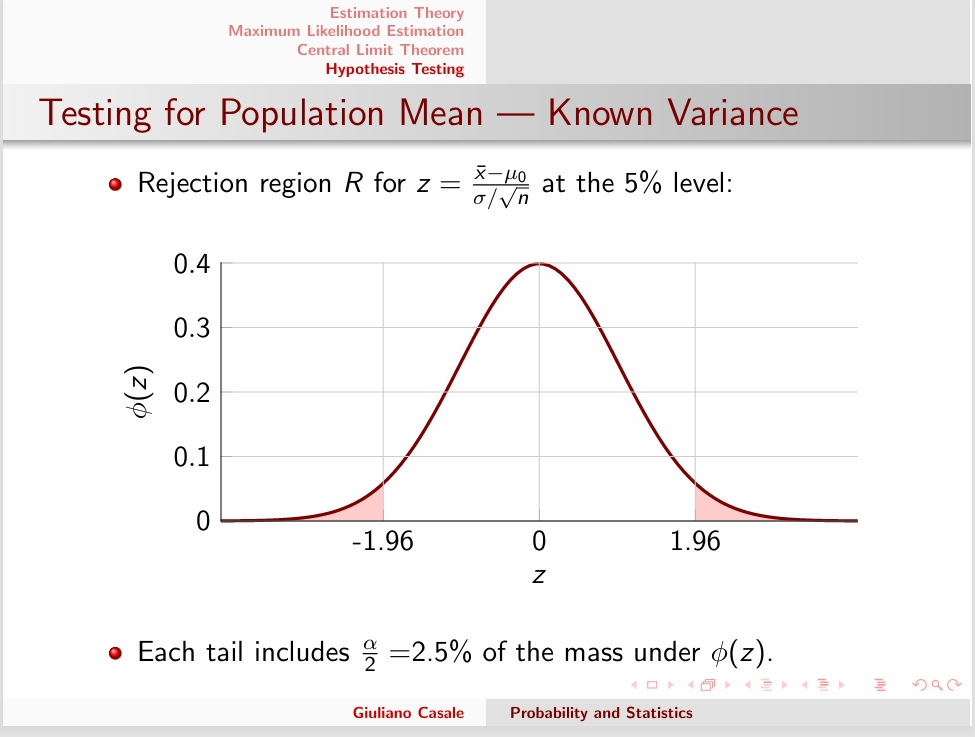
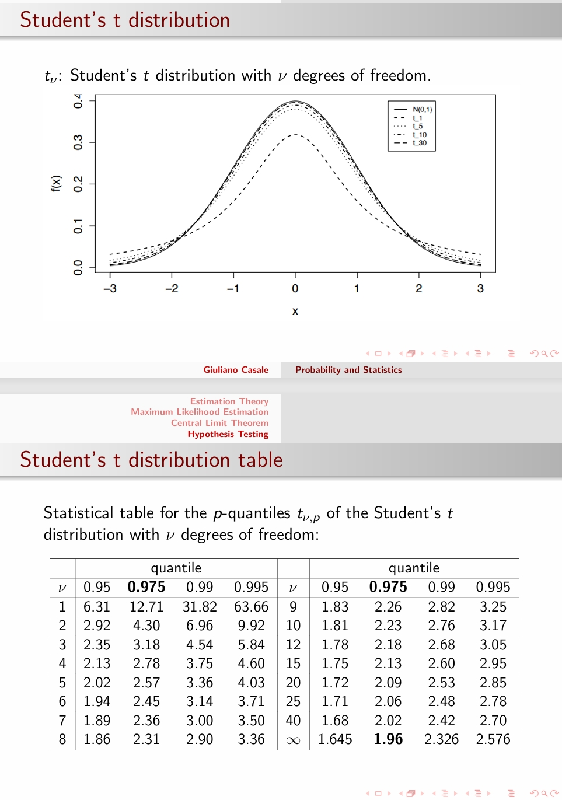
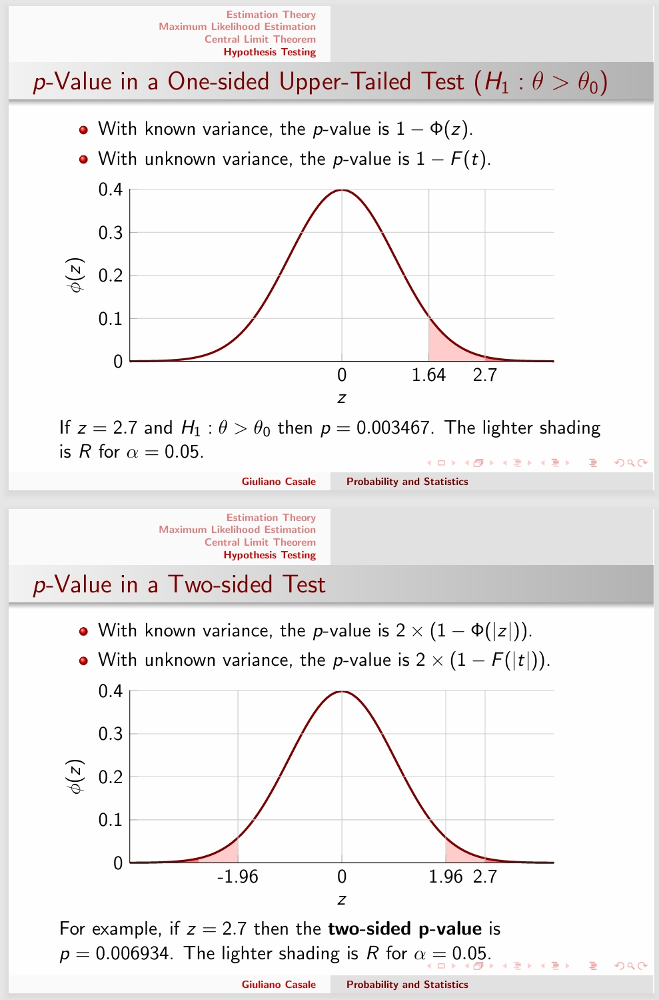

---
encrypt_content:
  level: Imperial
  password: Raymond#1234
  username: hg1523
level: Imperial
---

# Statistics Modelling:

Statistics studies how to infer properties of the distribution underlying data data we observe

it assume the availability of a sample of observations

- A sample is a subset of a population of interest for the study

We focus on parametric statistics, where the population's data follow some distribution, e.g. $Exp(\lambda),N(\mu,\sigma^2)$ etc.

samples will be affected by uncertainty due to the limited sample size and random selection

# Estimation Theory:

## Definitions:

- A sample of data $x = (x_1, x_2,\dots, x_n)$ may be seen as a realisation of a set of random variables $X = (X_1, \dots, X_n)$
- We assume that a single draw $X_i$ follows a distribution $P(\bullet |\theta)$ where $\theta = (\theta_1,\dots, \theta_t)$ are parameters we wish to estimate
- We will assume that our n data point random variables $X$ are independent and identically distributed (i.i.d)
- The last assumption implies that sampling is with replacement, thus any number of samples n may be collected

## Estimator is a Statistic:

- A statistic is a function of the random sample $T = T(X) = T_(X_1, \dots, X_n)$ and is itself a random variable
- If a statistic $T(X)$ is used to approximate parameters in $\theta$, we say that $T$ is an estimator for those parameters
- The realisation $t(x)$ of the estimate for a particular data sample x is called an estimate of the parameters, so we can say $\bar{X} = \frac{S_n}{n} = \sum_{i=1}^n\frac{X_i}{n}$ is the sample mean statistic. Its realisation $\bar{x} = \sum_{i=1}^n \frac{x_i}{n}$ is  an estimate
- we will study the sampling distribution for the statistic $P(T|\theta)\equiv P(T(X)|\theta)$ and its moments later

### Example:
- Consider a sample $(X_1, \dots, X_n)$ where $X_i\sim Exp(\lambda)$ distribution $\forall i$, for which $\lambda$ is unknown
- We can construct estimator for either $\lambda$ or the mean of the distribution $\frac{1}{\lambda}$ or the variance of the distribution $\frac{1}{\lambda^2}$

therefore, we can propose the following as estimators

- the first value we observed $T(X) = X_1$
- or the sample mean $T(X) = \bar{X}$
- the median $T(X) = med(X)$
- ...
to compare them, we need to bias of the estimator

## Bias of Estimator

- We define the bias of an estimator $T$ for a parameter $\theta$ as $bias(T) = E(T|\theta)-\theta$
- so we need to determine the expectation of $T(x)$ based on the sampling distribution.
- If the estimator has zero bias we say it is unbiased
- For example, $\bar{X} =\frac{1}{n}\sum_{i=1}^n X_i$ gives an unbiased estimate of the mean of an exponential distribution ($\mu = \frac{1}{\lambda}$)
- This is true for any distribution: the sample mean $\bar{X}$ is an unbiased estimate for the population mean $\mu$
$$E(\bar{X}) = E\Big(\frac{\sum_{i=1}^nX_i}{n}\Big) = \frac{\sum_{i=1}^nE(X_i)}{n} = \frac{n\mu}{n} = \mu$$

## Sample Variance:

How can we obtain an unbiased estimator for the variance?

Let $X_1, \dots, X_n$ be i.i.d random variables, each with mean $\mu$ and variance $\sigma^2$. We may be tempted to consider the sample variance

$$S^2 = \frac{1}{n}\sum_{i = 1}^n(X_i-\bar{X})^2$$

Unfortunately, it can be shown that this is biased. Only if we know the population mean $\mu$, then $\frac{1}{n}\sum_{i=1}^m(X_i-\mu)^2$ is unbiased for $\sigma^2$

## Bias-Corrected Sample Variance

The random variable $S^2$ define by

$$S^2 = \frac{1}{n-1}\sum_{i=1}^n(X_i-\bar{X})^2$$

is called the bias-corrected sample variance of these data. The $\frac{1}{n-1}$ term, also referred to as Bessel's correction, ensures that S is an unbiased estimator, i.e. $E[S^2] =\sigma^2$

## Proof: Bessel's correction:

We first note the following identity

$$\begin{aligned}\sum_{i=1}^n(X_i\bar{X})^2 &=\sum_{i=1}^n(X-\mu+\mu-\bar{X})^2\\
&=\sum_{i=1}^n(X_i - \mu) + n(\mu-\bar{X})^2 + 2\sum_{i=1}^n(\mu-\bar{X})(X_i-\mu)\\
&=\sum_{i=1}^n(X_i-\mu)+n(\mu -\bar{X})^2 - 2(\mu-\bar{X})(n\bar{X} - n\mu)\\
&=\sum_{i=1}^n(X_i-\mu)^2 + n(\mu-\bar{X})^2- 2n(\mu -\bar{X})^2\\
&=\sum_{i=1}^m(X_i - \mu)^2 + n(\bar{X} - \mu)^2
\end{aligned}$$

so eventually we get $\begin{aligned}E[(n-1)S^2] &= \sum_{i=1}^nE[(X-i-\mu)^2] - nE[(\bar{X}-\mu)^2]\\&=n\sigma^2 - nVar(\bar{X}) = (n-1)\sigma^2\end{aligned}$

where we have used that $Var(\bar{X}) = Var(\frac{S_n}{n}) = \frac{\sigma^2}{n}$

Since n is a scalar, the result implies that for the bis-corrected sample variance $E[S^2] = \sigma^2$

## Efficiency of Estimators

Suppose we have two unbiased estimators for a parameter $\theta$ which we will call $T\equiv T(X)$ and $H\equiv H(X)$

Suppose that we know the corresponding sampling distributions, $P(T|\theta)$ and $P(H|\theta)$, so that we can calculate their variances

We say T is more efficient than H if 
- $\forall\theta\quad Var(T|\theta)\le Var(H|\theta)$
- $\exists\theta\quad Var(T|\theta)<Var(H|\theta)$
If T is more efficient than any other possible estimator we say that T is efficient

### example:

Suppose we have a population with mean $\mu$ and variance $\sigma^2$ Consider two estimators for $\mu$
- the sample mean $T = \bar{X}$
- the first observation in sample $H = X_1$
We have seen that always $E(\bar{X}) = \mu$ and certainly $E(X_1) = \mu$, so both estimators are unbiased.

We also know 

$$Var(\bar{X}) = \frac{\sigma^2}{n}\qquad\text{ and }\qquad Var(X_1) = \sigma^2$$

So for $n\ge 2$

$Var(T)\le Var(H)$

and T is more efficient than H

## Consistency of Estimators

In the last example, the worst aspect of the estimate $H = X_1$ is that it does not improve as n increases

Consistency allows us to recognise behaviours such as this as n grow large

We say T is consistent estimator for the parameter $\theta$ if

$$\forall \epsilon>0, P(|T(X)-\theta|>\epsilon)\to0\text{ as } n\to\infty$$

In other words, all probability mass of the estimator (seen as a random variable) is asymptotically on the value $\theta$

If $T$ is unbiased and the condition $\lim_{n\to\infty} Var(T(X)) = 0$ holds, this is sufficient to show that T is consistent

In the last example, $\bar{X}$ is a consistent estimator of $\mu$, $X_1$ is not, the variance is the same for all n. $\bar{X} + \frac{1}{n}$ is biased but consistent

# Maximum likelihood Estimation

## Example:
We need to build a reliability model for disk drives in a data center. The time to failure follows a exponential distribution, with density $f(x) = \lambda e^{-\lambda x}$ where x is the time to failure.

We record the following failure times for 10 disks, in hours:

$X = (x_i) = (1200,1500,1600,1700,1100,1300,1400,1250,1550,1650)$
### Example: Likelihood for Continuous Random Variables

Idea: We seek for the $\lambda$ value that maximizes the chances of sampling what we observed:

we seek the $\lambda$ that maximizes the joint pdf:

$$\begin{aligned}L(\lambda) &= f(X|\lambda)\\& = f(x_1,\dots, x_{10}|\lambda) \\&=\prod_{i=1}^{10}f(x_i|\lambda) \\&= \prod_{i=1}^{10}\lambda e^{-\lambda x_i}\\
&=\lambda^{10}e^{-\lambda\sum_{i=1}^{n}x_i}\end{aligned}$$

where we used in independence

and we use basic calculus to find the $\lambda$ that maximizes $f(X|\lambda)$

$\frac{dL(\lambda)}{d\lambda} = 10\lambda^9e^{-\lambda\sum_{i=1}^{n}x_i} -\lambda\sum_{i=1}^{n}x_i\lambda^{10}e^{-\lambda\sum_{i=1}^{n}x_i} = 0$

$10e^{-\lambda\sum_{i=1}^{n}x_i} = \lambda^2\sum_{}$

$\hat{\lambda} =\arg\max_{\lambda}L(\lambda)=\frac{10}{\sum_{i=1}^nx_i} = \frac{1}{\bar{X}} = \frac{1}{1425} = 0.0007 \text{failures/h}$

where $\bar{X}$ denotes the observed mean time to failure

### Example: Log-likelihood for continuous distributions

To prove the last result, it is easier to work with the logarithm of $L(\lambda)$ which we refer to as the log-likelihood

$$\ell(\lambda) = \log L(\lambda) = \log\prod_{i=1}^n\lambda e^{-\lambda x_i} = n\log \lambda - \lambda\sum_{i=1}^nx_i$$

Since the logarithm is monotone, we can equivalently maximise $\ell(\lambda)$ instead of $L(\lambda)$. In this case, the maximum is found by setting

$$\ell'(\lambda) = \frac{d}{d\lambda}\ell(\lambda) = \frac{n}{\lambda}-\sum_{i=1}^nx_i = 0$$

this give $\hat{\lambda}= \frac{n}{\sum_{i=1}^nx_i} = \frac{1}{x}$ and since $\ell''(\hat{\lambda})<0$ this is a maximum

## Example: Likelihood for Discrete Distributions

- Let us now assume a discrete setting, where we count every day the number of disks x that fail. The data center has m = 20000 disks
- Over the last d = 100 days, we observe the following data

| x         | 0   | 1   | 2   | 3   | 4   | 5   | 6   | 7   | 8   | 9   | 10  |
| --------- | --- | --- | --- | --- | --- | --- | --- | --- | --- | --- | --- |
| Frequency | 2   | 16  | 35  | 22  | 21  | 3   | 1   | 0   | 0   | 0   | 0   |

Assume that the disks are independent, we treat our dataset as a sample of $Binomial(m,\theta)$ with $p(x|\theta) = \Big(\begin{matrix}m\\x\end{matrix}\Big)\theta^x(1-\theta)^{m-x}$ where $\theta$ is the (daily) failure probability

We want to estimate $\theta$

Idea: again, we seek for the $\theta$ value that maximizes the chances of sampling what we observed

For a discrete distribution, we model this using the joint pmf:

$$L(\theta) = p(x_1, \dots, x_d|\theta) = \prod_{i=1}^d\Big(\begin{matrix}m\\x_i\end{matrix}\Big)\theta^{x_i}(1-\theta)^{m-x_i}$$

where the last passage follows again from independence.

Lastly, we find the $\theta$ that maximizes $L(\theta)$ which is

$$\begin{aligned}\frac{dL(\theta)}{d\theta} =& \frac{d}{d\theta}\theta^{\sum_{i=1}^dx_i}(1-\theta)^{md-\sum_{i=1}^dx_i}\prod_{i=1}^d\Big(\begin{matrix}m\\x_i\end{matrix}\Big)\\
=&\frac{d}{d\theta}\Big(\frac{\theta}{1-\theta}\Big)^{\sum_{i=1}^dx_i}(1-\theta)^{md}C\\
=&\frac{d}{d(1-\theta)}\Big(\frac{\theta}{1-\theta}\Big)^{\sum_{i=1}^dx_i}(1-\theta)^{md}C\\
=&\frac{d}{d\lambda}(\frac{1-\lambda}{\lambda})^{\sum_{i=1}^dx_i}\lambda^{md}C\\
=&\frac{d}{d\frac{1}{\lambda}}(\frac{1}{\lambda} - 1)^{\sum_{i=1}^dx_i}(\frac{1}\lambda)^{-md}\\
=& \frac{d}{da}(a-1)^{\sum_{i=1}^dx_i}a^{-md}\\
=&(\sum_{i=1}^dx_i)(a-1)^{\sum_{i=1}^dx_i - 1}a^{-md} \\
&-md (a-1)^{\sum_{i=1}^dx_i}a^{-md-1}\\
= 0\end{aligned}$$
so 
$$\begin{aligned}md(a-1) &=& (\sum_{i=1}^dx_i)a\\
\frac{a-1}{a} &=& \frac{\sum_{i=1}^dx_i}{md}\\
\frac{-1}{a} &=& \frac{\sum_{i=1}^dx_i-md}{md}\\
\frac{1}{\lambda} &=& \frac{md}{md-\sum_{i=1}^dx_i}\\
\lambda &=& \frac{md-\sum_{i=1}^dx_i}{md}\\
1-\theta &=& \frac{md-\sum_{i=1}^dx_i}{md}\\
\theta &=&\frac{\sum_{i=1}^dx_i}{md}
\end{aligned}$$

$$\hat{\theta}=\arg\max_{\theta}L(\theta) = \frac{1}{d}\frac{\sum_{i=1}^dx_i}{m} = 0.0001285$$

failure probability

## Maximum Likelihood Estimation

- The likelihood function, $L(\theta) = \prod_{i=1}^nf(x_i|\theta)$ is the product of the n pmf/pdf viewed as a function of a parameter $\theta$
- Take the natural log of the likelihood to get the log-likelihood function $\ell'(\hat{\theta}) = \frac{d}{d\theta}\log(L(\hat{\theta})) = 0$
- If hte estimate $\theta$ obtained in step 3 corresponds to a maximum $\frac{d^2}{d\theta^2}\ell(\hat{\theta})<0$ then $\hat{\theta}$ is confirmed as the maximum likelihood estimator (MLE) of $\theta$

## Further remarks on MLE:

- In large sample sizes, the MLE progressively becomes unbiased, efficient and consistent. This can be proved under mild technical assumptions
- In small sample sizes there is no such guarantee and the quality of a MLE can vary, Bayesian parameter estimation is an area of statics that deals with the problem
- For single parameter MLE, if $\theta$ is discrete and $l(\bullet)$ unimodal, then we can run MLE as usual, compare $\lceil\hat{\theta}\rceil$ and $\lfloor\hat{\theta}\rfloor$, and return the one having the largest likelihood. Otherwise, more complex algorithms are required to search for the MLE
- MLE generalizes to multi-parameter distributions. Yet this requires multivariate calculus and the maximisation may give more than one answer if $\ell$ has several peaks (local maxima)
## An alternative to MLE: the method of moments

- In some cases, we may only know statistics of a distribution, such as its sample mean or sample variance.
- In this setting, MLE is not viable but we can still estimate parameters if we have enough sample moments
- This approach, called moment matching (or method of moments), tries to match the true and sample moments.
- For example, in the disk drive reliability model we had
$$\lambda = \frac{1}{E[X]}\qquad\bar{X} = 1425$$

  and matching $E[X] = \bar{X}$ yeilds $\lambda = \frac{1}{\bar{X}} = \frac{1}{1425} = 0.0007$

- This is effective on simple models, but unlike MLE, can suffer biases for more complex distributions
# Central Limit Theorem

## The Theorem:

Let $X_1, X_2,\dots, X_n$ be now n independent and identically distributed (i.i.d.) random variables from any probability distribution with mean $\mu$ and $\sigma^2$ both finite

- We know that $E(S_n) = n\mu$ and $Var(S_n) = n\sigma^2$
- Thus we have $E(S_n-n\mu) = 0$ and $Var(S_n-n\mu) = n\sigma^2$
- Dividing by $\sqrt{n}\sigma$: $E(\frac{S_n-n\mu}{\sqrt{n}\sigma}) = 0, Var(\frac{S_n-n\mu}{\sqrt{n}\sigma})$

The theorem states that 

$$\lim_{n\to\infty}\frac{S_n-n\mu}{\sqrt{n}\sigma}\sim N(0,1)$$

or, dividing the both side with n

$$\lim_{n\to\infty}\frac{S_n-n\mu}{\sqrt{n}\sigma}\sim N(0,1)$$

where $\bar{X} = \frac{S_n}{n} = \frac{\sum_{i=1}^nX_i}{n}$ is the sample mean.

## Implications for the sample mean:

The CLT thus implies that for large but finite n

$$\bar{X}\approx N(\mu,\frac{\sigma^2}{n})$$

- usually $n\ge 30$
- this holds irrespective of the distribution of the $\{X_i\}$ (including discrete random variables)
- If $X_i\sim N(\mu,\sigma^2),\forall i$, the result becomes exact even for finite n, since the sum of independent normal random variables is normally distributed(proof via mgf)

## proof of the CLT:

Given the n i.i.d r.vs $X_1,X_2\dots, X_n$ standardise their sum to get 

$$Z_n = \frac{S_n-n
\mu}{\sqrt{n\sigma^2}} = \frac{\sum_{i=1}^n X_i - n\mu}{\sqrt{n}\sigma} = \sum_{i=1}^n\frac{Y_i}{\sqrt{n}\sigma}$$

where $Y_i = X_i - \mu$ is a shifted version of $X_i$ with zero mean, and we used the fact that $Var(X_i) = Var(Y_i)$

The moment generating function (see lecture 4 mgf)

using the combination of mgf from lecture 4, (see Product of Independent Random Variables)

$$\begin{aligned}
M_{Z_n}(t) &= M_{\sum_{i=1}^n\frac{Y_i}{\sqrt{n}\sigma}}(t)\\
&=\prod_{i=1}^nM_{\frac{Y_i}{\sqrt{n}\sigma}}(t)\\
&=\prod_{i=1}^nE(e^{t\frac{Y_i}{\sqrt{n}\sigma}})\\
&=\prod_{i=1}^nE(e^{\frac{t}{\sqrt{n}\sigma}Y_i})\\
&=\prod_{i=1}^nM_{Y}(\frac{t}{\sqrt{n}\sigma})\\
&=\Big(M_{Y}(\frac{t}{\sqrt{n}\sigma})\Big)^n
\end{aligned}$$
then we expand $M_Y(t)$ at zero using Taylor's theorem

(Maclaurin series)

$M_Y(t) = M_Y(0) + M_Y'(0) + \frac{1}{2}M_Y''(0) + O(t^3) = 1 + \frac{1}{2}\sigma^2 t + O(t^3)$
since (check lecture 4 mgf Obtaining moments from the mgf)

$M_Y'(0) = E_(Y_i) = 0$

$M_Y''(0) = E_(Y_i^2) = \sigma^2 + E(Y_i^2) = \sigma^2$

here, first we use $E[X] = E[X^2]-E[X]^2$ (see lecture 3 variance)

then , since we normalised $Y_i$ so the variance is 0

Plugging the result back into $M_{Z_n}(t)$ we can see that

$$\lim_{n\to+\infty}M_{Z_n}(t) = \Big(M_{Y}(\frac{t}{\sqrt{n}\sigma})\Big)^n=\lim_{n\to+\infty}\Big(1 + \frac{t^2}{2n} + O(n^{\frac{-3}{2}})\Big)^n \toe^{\frac{t^2}{2}}$$

the last step is the definition of e

and this follows the mgf of the standard Normal distribution

### Example:

Consider $X_1, X_2\dots$ are independent Bernoulli(p) discrete random variables taking values 0 or 1

- Then the $\{X_i\}$ has mean $\mu = p$ and variance $\sigma^2 = p(1-p)$
- Thus by definition, for any n,
$$\sum_{i=1}^nX_i\sim Binomial(n,p)$$
which has mean np and variance np(1-p)

by CLT

$$Binomial(n,p)\approx N(n\mu,n\sigma^2)\equiv N(np,np(1-p))$$

# Hypothesis tests:

example:

A company decided to test if a new feature in their app will increase user engagement

- The null hypothesis: there is no difference in user engagement between the two groups
- The Alternative Hypothesis: a difference exists, the new feature increases user engagement
If the result shows much higher engagement than the control group, we reject the null hypothesis and conclude the evidence favours the alternative hypothesis

## Parametric tests:

Suppose again we have a random independence sample $(X_1, \dots, X_n)$ of a random variabel X from an unknown distribution P.

parametric tests typically assume the sample comes from a parametric family $P(\bullet|\theta)$ and test whether we could reasonably assume $\theta = \theta_0$ for some particular value $\theta_0$

following the CLT,  we may set the distribution of the data to be following $X\sim N(\mu,\sigma^2)$

## Hypothesis:

let $H_0$ be the null hypothesis and $H_1$ be the alternative hypothesis,

then usually we test for 

$$H_0: \theta = \theta_0\text{ and }H_1:\theta \neq \theta_0$$

this is a two-sided test

A one sided test is also possible

$$H_0:\theta = \theta_0\text{ and }H_0:\theta <\theta_0$$

or

$$H_0:\theta = \theta_0\text{ and }H_0:\theta >\theta_0$$

the null hypothesis usually use =

## Rejection Region:

to test the validity of $H_0$, we choose a test statistic $T(X)$ of the data for which we can find the distribution under $H_0$

The Rejection region $R\subseteq\mathbb{R}$ is the low probability values of T under the assumption that $H_0$ is true

$$P(T\in R|H_0) =\alpha$$

for some small probability $\alpha$ (say 5%). We call $\alpha$ the significance level of the test

A well  rejection region will have relatively high probability under $H_1$ whilst retaining low probability under $H_0$

We calculate the observed test statistic $t(x)$ for our sample x:

- if $x\in R$ we reject the null hypothesis at the $100\alpha\%$
- if $x\not\in R$ we retain the null hypothesis at the $100\alpha\%$

## Testing for Population Mean - known variance (z-test):

suppose $X_1,\dots, X_n$ are independent $N(\mu,\sigma^2)$ with only $\sigma^2$ known.

We may wish to test $\mu =\mu_0$ for some specific value $\mu_0$

Then we can state our null and alternative hypotheses as

$$H_0:\mu = \mu_0\text{ and }\mu\neq \mu_0$$

Under $H_0:\mu = \mu_0$, we then know both $\mu$ and $\sigma^2$. So for the sample mean $\bar{X}$ we know from the CLT that 

$$Z = \frac{\bar{X}-\mu_0}{\frac{\sigma}{\sqrt{n}}}$$

where $\frac{\sigma}{\sqrt{n}}$ is often called in statistics the standard error

By the CLT, the result also holds approximately when the $X_i$ are not normally distributed

if this z-test statistic takes extreme values from zero, there is evidence to conclude that $H_0$ should be rejected. Otherwise, the data is inconclusive and we need to retain $H_0$

So we may define our rejection region R to be the $100\alpha\%$ tails of the standard normal distribution

$$R = (-\infty,-z_{1-\frac{\alpha}{2}})\cup (z_{1-\frac{\alpha}{2},\infty})$$

we have $P(Z\in R|H_0) = \alpha$

We thus reject $H_0$ at the $100\alpha\%$ significance level exactly when our observed test statistic 

$$z =\frac{\bar{x}-\mu_0}{\frac{\sigma}{\sqrt{\mu}}}$$

## Dealing with unknown variance (t-test)

- As we measure a population (simulated or real), we may not know the real variance, rather we know the bias-corrected variance $S^2$ 

Student's t distribution take an extra parameter of degree of freedom

if the $\sigma^2$ in this example were unknwon, we would have $T = \frac{\bar{X}-\mu_0}{\frac{S}{\sqrt{n}}}\sim t_{n-1}$

which uses the Student's t distribution with n-1 degrees of freedom $t_{n-1}$ and the bias-corrected sample standard deviation S

So for a test of 

$$H_0:\mu = \mu_0\text{ and }H_1:\mu\neq\mu_0$$

at the $\alpha$ level, the rejection region of our observed test statistic 
$$t =\frac{\bar{x} - \mu_0}{\frac{s}{\sqrt{n}}}$$

is then given by $R = (-\infty,-t_{n-1,1-\frac{\alpha}{2}})\cup (t_{n-1,1-\frac{\alpha}{2}},\infty)$

## p-values:

it is important to quantify the statistical significance of a result, in addition to giving a reject/retain outcome.

THe p-value of the data is the probability of obtaining a test statistic at least as extreme as one actually observed assuming $H_0$ is correct

In other words, the p-value is the maximum significance level at which we still reject the null hypothesis $H_0$ for that sample

Thus, if we are given a fixed $\alpha$, the null hypothesis $H_0$ is rejected if the p-value is less than or equal to $\alpha$

Smaller p-values suggest stronger evidence against $H_0$

Other commonly used tests 

- Pair sampled tests
- Chi-squared test
- Kolmogorov-Smirnov test