---
level: Imperial
---
---

level: Imperial

---

---


level: Imperial


---


---



encrypt_content:



  level: Imperial



  password: Raymond#1234



  username: hg1523



level: Imperial



---



# Simulation:







Broadly, there are multiple classes of simulation:



- Monte Carlo: aggregate the results of a series of "one shot" experiments using random numbers



- Discrete time: perform an n-step random state transitions, moving from one state to another in each (discrete step)



- Continuous time: System state is continuously evolved over time as a result of a prescribed dynamics



- Discrete event: System state transitions are triggered by events occurring at discrete points in continuous time







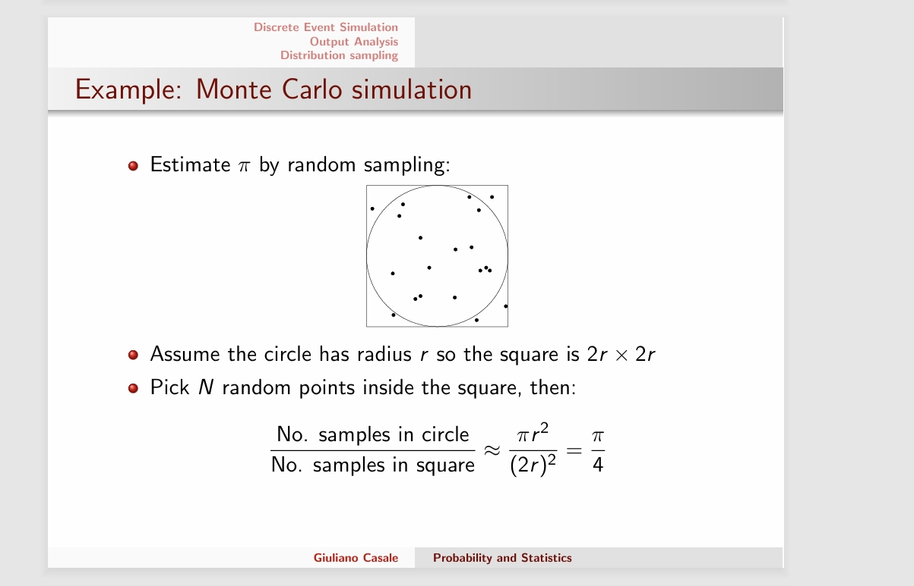







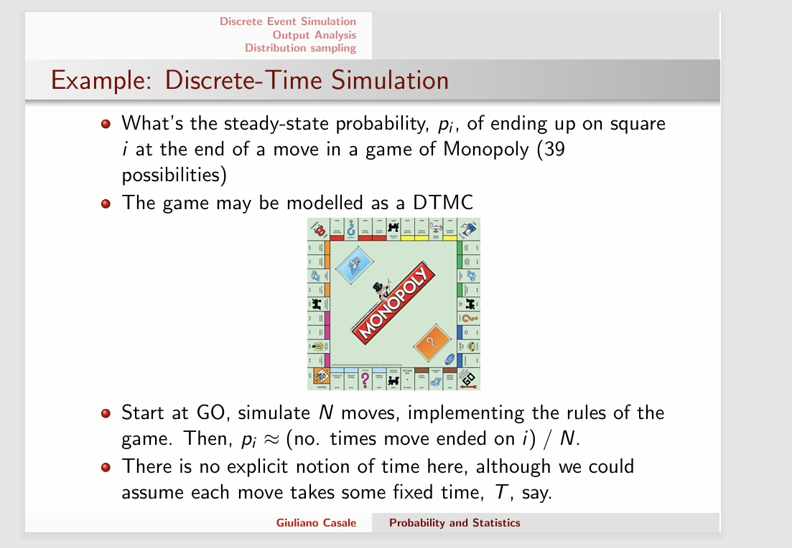



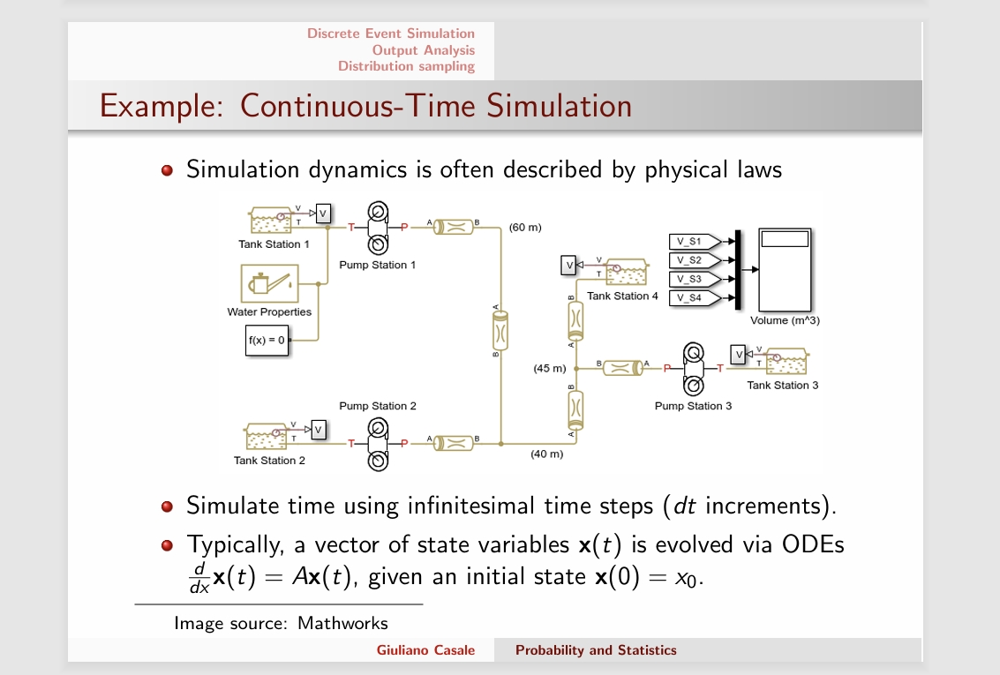







# Discrete Event Simulation(DES)







- A (discrete-event) simulation is a program that generates a random sample path through a state transition system, where time, delays are associated with each state



- There is a single global clock - a virtual time. Not to be confused with elapsed real time



- State transitions are triggered by events which are ordered in time on a virtual timeline, an event 'diary'



- DES involves invoking events in time order, if an event is invoked (occurs, fires, is triggered) at virtual time t, the clock is updated to t and the code for the event



	- Updates the model state



	- Schedules zero or more new future events on the time line



- Note that the state is unchanged between events







# DES:







In practice, DES is absed on a few core design principles



- the virtual time is a floating-point number (call it *now*)



- the state is defined by a set of program variables, which are typically discrete (booleans, integers)



- The timeline is a priority queue of (Event, time) paris, ordered by virtual time - essentially an event diary



- Events are implemented as objects, functions, procedures, methods, etc.



- A scheduler adds new (Event, time) pairs to the diary



- A descheduler similarly removes them from the diary



- Addition measurement variables and code need to be added in order to accumulate performance measures (otherwise there will be no output)







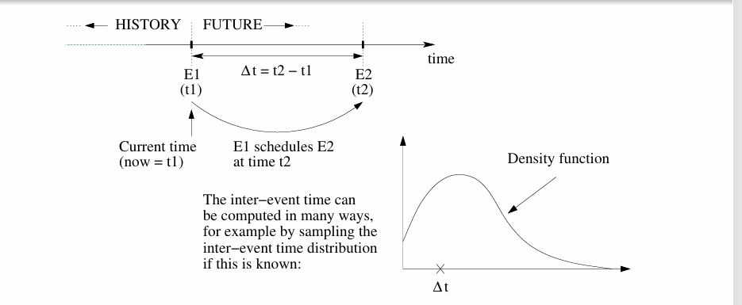







The times between event are r.v.s with an associatied distribution - inter-event times are samples from that distribution







We need to be able to sample these distributions







## Example: A single server FIFO Queue







- Consider a single-server queue with some specific inter-arrival time and service time distribution and a queue with finite capacity N (jobs in the buffer + job in service)



- The simplest model identifies an integer state with each queue population (0,1,2)



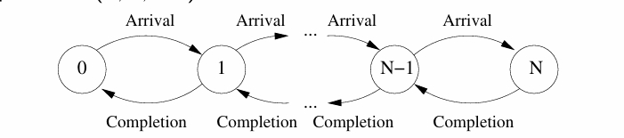



- We require two events (Arrival and Completion)



-  The time line (priority queue) contains arrival and completion events have yet to occur



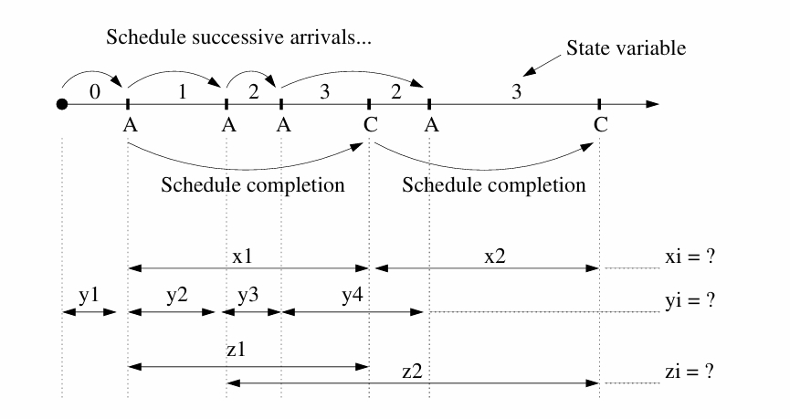







## Design a simulation model



- Identify the entities in the system that have to be modelled



- Identify the model states (program state variables) - these specify where each entity is and what it is doing



- Identify the event types, recalling that each state transition is triggered by an event (note that some events may be parameterisable, e.g. "arrival at location a")



- For each event, specify



	- how it changes the current state



	- what new events need to be scheduled and what old events need to be cancelled (descheduled) when it fires



- Add code to accumulate measurements whilst the simulation executes



- Add code to output results when the program terminates, e.g. after T simulated time units, N occurrences of a specified event, etc.



# Output Analysis







- A non-terminating simulation seeks to model a system at equilibrium, $p_s(t) \to p_s$ as $t\to\infty$



- A terminating simulation models a system over a specified period during which there is no notion of equilibrium



## Output Analysis of steady-state equilibrium



- We focus on non-terminating simulations.



- Assume we are using simulation to estimate some steady-state performance measure, e.g. mean population etc.



- The initial state is typically fixed(all queues empty), so the initial state probability distribution is different to the distribution after some time $t >> 0$, say, and measures take time to settle



- The avoid initialisation bias we must either



	- discard the initialisation transient by resetting the measures after some warm-up time has elapsed



	- Measure for long enough to render any bias insignificant



## Confidence intervals







- Discrete-event simulations are stochastic, so all outputs are random variable and each an observation of some measure $\theta$ of interest



- If $X_i$, $1\le i\le n$, $n\ge 1$ are steady state observations from a simulation then an estimator for $\theta$ is the sample mean



$$\bar{X} = \frac{1}{n}\sum_{i=1}^nX_i$$



- How can we quantify the uncertainty of the $\bar{X}$ estimate?



	- Helpful to decide when to stop the simulation



## Confidence intervals for Mean







- We know by the CLT that $\bar{X} \sim N(\mu,\frac{\sigma^2}{n})$



- Then, if we knew $\sigma^2$, then for large n, since by the CLT



$$P(-1.96\le\frac{\bar{X} - \mu}{\sigma/\sqrt{n}}\le 1.96) = 0.95$$



- In hypothesis testing, we condition on $H_0: \mu = \mu_0$ and study $\bar{X}$ with the last formula, by in simulation we do not know $\mu_0$



- CLT implies that we could generate many intervals



$$\Big[\bar{X} - 1.96\frac{\sigma}{\sqrt{n}},\bar{X} + 1.96\frac{\sigma}{\sqrt{n}}\Big]$$



using different simulations and conclude that with 95% probability we would observed $\mu$ failing in the intervals







This is known as the 95% confidence interval for $\mu$







## Confidence Interval for Mean







For 95% confidence interval for $\mu$ to solve (two-sided estimate)



$$0.975 = \Phi(\frac{\bar{X} -\mu }{\sigma/\sqrt{n}})\text{ to }\Big[\bar{X}-1.96\frac{\sigma}{\sqrt{n}},\bar{X} + 1.96\frac{\sigma}{\sqrt{n}}\Big]$$







More generally, for any desired coverage probability level $1-\alpha$, we can defined the $100(1-\alpha)\%$ confidence interval for $\mu$ by







$$\Big[\bar{X}-x_{1-\frac{\alpha}{2}}\frac{\sigma}{\sqrt{n}},\bar{X}-x_{1-\frac{\alpha}{2}}\frac{\sigma}{\sqrt{n}}\Big]$$



where $z_{\alpha}$ si the $\alpha$ quantile of the standard normal (e.g for 95% confidence interval, we use $\alpha = 0.05$ and hence $z_{0.975}$)







Interpretation: Amongst all the possible intervals







$$\bar{X}\pm z_{1-\frac{\alpha}{2}}\frac{\sigma}{\sqrt{n}}$$







we might have observed $\alpha$% would have contained the unknown true parameter value $\mu$







## Faulty reasoning on confidence intervals







**Wrong assertion**: I collected n observation and created a 95% confidence interval for $\mu$. The probability that the true mean is contained in the confidence interval I created is 95%







**Correct assertion**: I collected n observations and created a 95% confidence interval for $\mu$. This particular interval may or may not contain $\mu$. However, if I were to create many confidence intervals like this one many times over, then approximately 95% of these intervals would cover the true mean $\mu$







## Dealing with unknown variance



- As we measure a population (simulated or real), we may not know the true variance $\sigma^2$, but only the (bias-corrected) sample variance $S^2$



- How do the formulas change in this case? We proceed similarly to what we have seen for hypothesis testing.



- If $n>1$ a $100\alpha\%$ confidence interval estimate for $\theta$ is



$$\bar{X} \pm t_{n-1,1-\frac{\alpha}{2}}\frac{S}{\sqrt{n}}$$







where $t_{v,p}$ is the p-quantile of the Student's t-distribution with v degrees of freedom







## Confidence intervals in simulation







- Looking at a single simulation run, a wider confidence interval suggests more uncertainty, while a narrower confidence interval suggests more precise estimation. This can help us decided if we should stop the simulation or not



- Running n independent replications, possibly in parallel, guarantees independence of the $X_i$



- Another approach is to run the model once, wait for it to warm up and reach approximate equilibrium, then divide the measurement time into batches, with $X_i$ coming from batch i



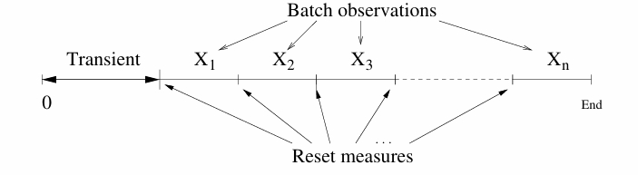







- If each $X_i$ is the sample mean of batch i, this is called the batch means methods



- Yet the $X_i$ may not be independent because the state at the end of the one batch is the same as that at the start of the next



- If the $X_i$ are dependent then we have to take covariance into account to build an exact confidence interval



- If the $X_i$ are dependent, then $Var(\bar{X})\neq\sigma/n$ Instead, it can be shown that



$$Var(\bar{X}) = \frac{\sigma^2}{n} + \frac{1}{n^2}\Big[2\sum_{i=1}^{n-1}\sum_{j=i+1}^n Cov(X_i, X_j)\Big]$$







- If covariances are positive $S^2/n$ becomes an under-estimate of $Var(\bar{X})$ and the computed confidence intervals are narrower than they should be



## Further remarks on confidence intervals:







- Confidence intervals are seldom exact, one such case is if we sample n i.i.d $N(\mu,\sigma^2)$ random variable, since in this case $\bar{X}$ is always normally distributed



- In practice, a computed confidence interval is typically approximate because of one or more of the following:



	- n is small and the $X_i$ are not normally distributed



	- n is "large" but not large enough



	- The $X_i$ are not independent



- The true parameter is not restricted to be a mean. Confidence intervals also apply to arbitrary statistics $T(X)$ as uncertainty measures for estimates



# Distribution Sampling







## The sampling problem



- Simulation depends on the ability to sample various discrete and continuous random distribution e.g. Uniform, Poisson, Exponential, Lognormal, Pareto, ...



- For r.v X with support supp(X), the objective is to define a sampling function



$$U(0,1)\to supp(X)$$



- in terms of X's density/cdf (or pmf/cdf) function







- We look at four commonly used general methods:







## The Inverse Transform method:







- Suppose X is a continuous r.v with cdf $F(x) = P(X\le x)$ and we are trying to sample X



- The inverse transform method iteratively samples a uniform distribution in $[0,1]$ and returns the corresponding quantile



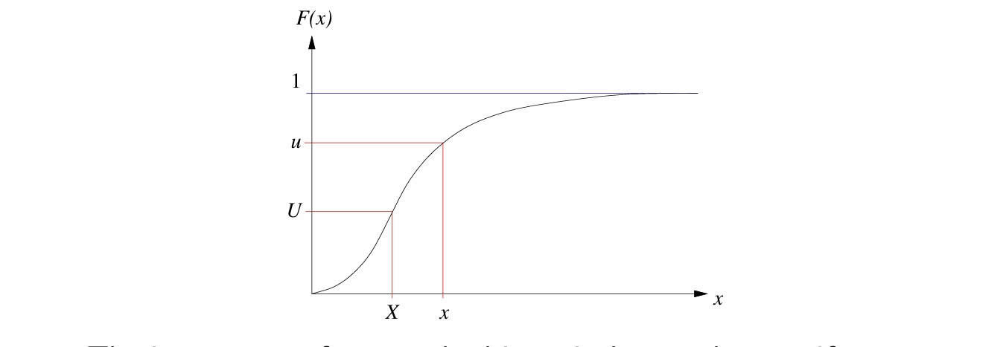



- In the figure, if $u\sim U(0,1)$ and $U\sim U(0,1)$, then we return as samples the U-quantile (X) and the u quantile (x)







### Example:







let $X\sim exp(\lambda)$ then







$$F(x) = 1 - e^{-\lambda x}, x \ge 0$$







Setting $U = F(X)$ and inverting, we get:







$$\begin{aligned}



U &= 1 - e^{-\lambda X}\\



1 - U &= e^{-\lambda X}\\



\log(1-U) &= -\lambda X\\



\frac{-\log (1-U)}{\lambda} &= X



\end{aligned}$$







so if $U\sim U(0,1)$, then $\frac{-\log(1-u)}{\lambda}\sim exp(\lambda)$







Note that we can replace $1-U$ with U since $(1-U)\sim U(0,1)$, namely $-\log(U)/\lambda$







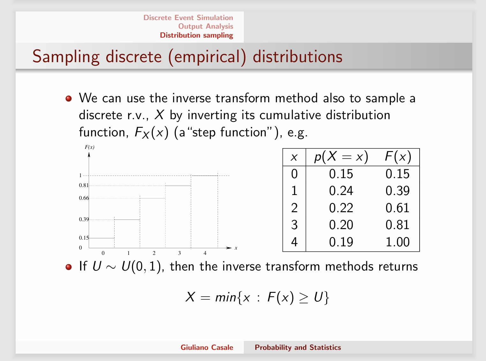







## The Acceptance-Rejection (AR) method:







- If $F(x)$ cannot be explicitly inverted (e.g. normal cdf), we can sometimes work with the corresponding density function $f(x)$



- We choose a density function $g(x)$ easy to sample from



- Now we try to find a constant, c, so that $cg(x) = h(x)$ dominates $f(x)$ for all x:



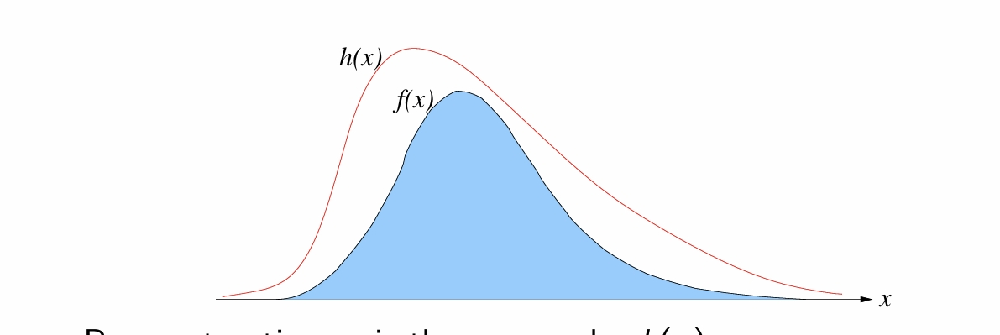











- By construction, c is the area under h(x)



$$c = c\int_xg(x)dx = \int_xh(x)dx$$







- AR algorithm:



	- Let X be a sample from the r.v. whose density function is $g(x)$



	- Generate a $U(0,1)$ sample, U, and let $Y = Uh(x)$



	- If $Y\le f(x)$ i.e. if $U\le\frac{f(X)}{h(X)} = \frac{f(X)}{cg(X)}$ then accept X



- It is a Monte Carlo simulation



- By construction, the samples X and Y define a point that lies under $h(X)$, if $(X,Y)$ lies under $f(X)$ as well as we accept X



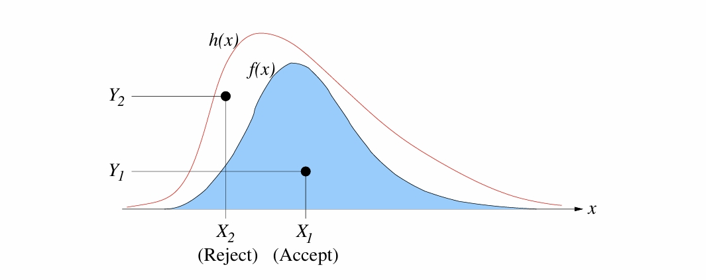



### Example: Half-normal:







- Suppose we wish to sample a standard "half-normal" distribution:



$$f(x) = \frac{2}{\sqrt{2\pi}}e^{\frac{-x^2}{2}}$$



- We arbitrarily choose $g(x) = e^{-x}$ as it is easy to sample



- We need an $h(x) = cg(x)$ that dominates f(x) for $x\ge 0$



- c can be found by computing $\max_x\frac{f(x)}{g(x)}$



$$c = \max_{x\ge 0}\frac{\frac{2}{\sqrt{2\pi}}e^{\frac{-x^2}{2}}}{e^{-x}} = \max_{x\ge 0}\sqrt{\frac{2}{\pi}}e^{x-\frac{x^2}{2}}$$







- By differentiation, this is maximal when $x = 1$, thus $x = \sqrt{\frac{2}{\pi}}e^{\frac{1}{2}} = \sqrt{\frac{2e}{\pi}}$







$$h(x) = \sqrt{\frac{2e}{\pi}}e^{-x}\text{ and }\frac{f(x)}{h(x)} = e^{\frac{-(x-1)^2}{2}}$$







we can notice that $\frac{f(x)}{h(x)}\le 1$, h(x) dominates f(x)







Thus sample X from $0\log(1-U_1)$ (inverse transform method applied to exponenttial distribution, parameter 1) and accept X iff $U_2\le \frac{f(X)}{h(X)} = e^{-(X-1)^2/2}$, where $U_1, U_2\sim U(0,1)$







- The efficiency depends on the number of rejections R before accepting a value of X



- The probability of accpeting X, call it p, is simply the ratio of the areas of the two functions, i.e. $p = \frac{1}{c}$



- Since each sample from $g(x)$ is independent, the number of iteration I required before accepting it as a sample of $f(x)$ is geometrically distributed, i.e. 



$$E(I) = \frac{1}{p} = c$$



	So the expected number of rejections is $R = c - 1$



- Example: For the half-normal (above) $c = \sqrt{\frac{2e}{\pi}} = 1.315$, This equates to $2\times 1.315 = 2.63$ random $U(0,1)$ samples on average per sample (very efficient)



## The Convolution Method



- Some random variable are defined as the sum of two or more independent random variables



- We can sample the individual distributions and sum the results



- Example: An $Erlang(k,\theta)$ random variable, X say, is defined as the sum of k independent exponentially distributed random variables $X_i$, each with rate parameter $\theta$



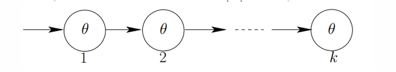







- We can generate $Erlang(k,\theta)$ samples using the sampler for the exponential distribution: if $X_i\sim exp(\theta)$ then



$$X = \sum_{i=1}^k X_i\sim Erlang(k,\theta)$$



- If $U_i\sim U(0,1)$ then $X_i$ is sampled using $-\log\frac{U_i}{\theta}$



- We can save the more expensive log calculation in the summation by turning the sum into a product



$$X = \sum_{i=1}^k-\frac{\log U_i}{\theta} = -\frac{1}{\theta}\log\prod_{i=1}^kU_i$$







## The composition method:







- Consider a discrete RV Y with $supp(Y) = \{1,\dots, n\}$ and a continuous RV X with conditional density $f_i(x)\equiv f(x|Y = i)$



- An application of the Law of Total probability gives 



$$f(x) = w_1f_1(x) + w_2f_2(x) +\dots + w_nf_n(x)$$







	where $w_i = P(Y = i)$ and thus $\sum_{i=1}^n w_i =1$. This is called a mixture distribution



- The Composition Method is a sampler for mixtures



	- Pick i with probability $w_i$ (discrete distribution sampling)



	- Sample from the density $f_i(x)$



- The method applied similarly also to cdfs and pmfs



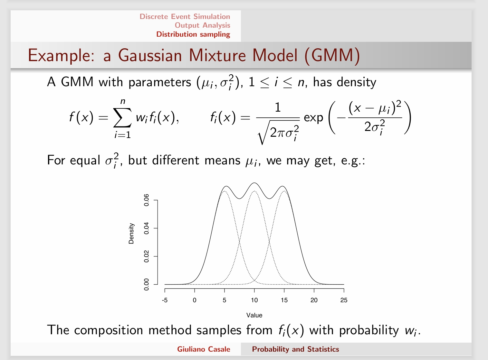