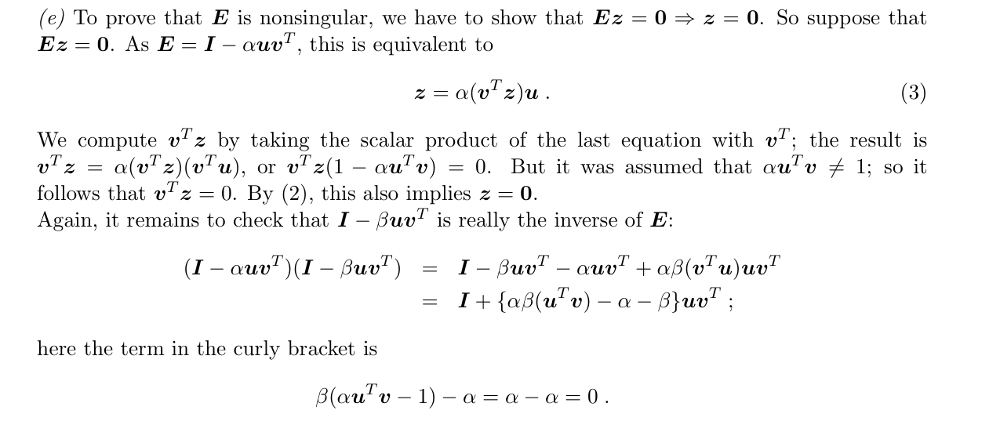

---
level: Imperial
---
---

level: Imperial

---

---


level: Imperial


---


---



encrypt_content:



  level: Imperial



  password: Raymond#1234



  username: hg1523



level: Imperial



---



# Problem 1:







**For $A\in\mathbb{R}^{m\times n}$ the transpose matrix $A^T\in\mathbb{R}^{n\times m}$ is defined by $(A^T)_{ij = A_{ji}}$. Show that for $A\in\mathbb{R}^{m\times n0}$ and $B\in\mathbb{R}^{n\times p}$ we have $(AB)^T = B^TA^T$. (Recall $(AB)_{ij} = \sum_{k=1}^n A_{ik}B_{kj}$)**







by definition: $(AB)_{ij}^T = (AB)_{ji} =\sum_{k=1}^nA_{jk}B_{ki}$







by definition: $(B^TA^T)_{ij} = \sum_{k=1}^n B^T_{ik}A^T_{kj} = \sum_{k=1}^n B_{ki}A_{jk} = (AB)_{ij}^T$







# Problem 2:







**An orthonormal set of vector in a set of normalised vectors (i.e. of Euclidean length 1) that are mutually orthogonal. Check that one of the following two pairs of vectors are orthogonal**







## (a) [2,5,1] and [-3,1,1]







so [2,5,1] * [-3,1,1] = 0, so orthogonal







## (b) [3,5,3,-1] and [4,-2,2,3]







[3,5,3,-1] * [4,-2,2,3] = 5







so not orthogonal







## (c)



Using that pair, construct an orthonormal set $\{v1,v2,v3\}$ such that two of them are multiples of the given pair







$\{[\frac{2}{\sqrt{30}},\frac{5}{\sqrt{30}},\frac{1}{\sqrt{30}}],[-\frac{3}{\sqrt{11}},\frac{1}{\sqrt{11}},\frac{1}{\sqrt{11}}],[-\frac{4}{\sqrt{330}},\frac{5}{\sqrt{330}},-\frac{17}{\sqrt{330}}]\}$







# Problem 3:



## (i) 



**For vector $u,v\in\mathbb{R}$, we define $proj_u(v) = \frac{u\bullet v}{u\bullet u}u$ if $u\neq 0$ and 0 otherwise. Explain geometrically what $proj_u(v)$**







the shadow vector of v on u







## (ii)







**Now suppose we have any (not necessarily orthonormal) basis $\{v_1, v_2, v_3\}$ for $\mathbb{R}^3$. Let**







**$u_1 = v_1, u_2 = v_2-proj_{u_1}(v_2), u_s = v_3 - proj_{u_1}(v_2) - proj_{u_2}(v_3)$**







**and put $w_i = u_i/||u_i||$ for i = 1,2,3. Check that $\{w_i: i = 1,2,3\}$ is an orthonormal basis for $\mathbb{R}^3$**







first, $w_i$ are normlised







$proj_{u_1}(v_2)$ is the shadow of $v_2$ on $u_1$, so $u_2\perp u_1$







same for the other two







### (iii)







How cna we extend this method to get an orthonormal basis of $\mathbb{R}^m$ starting from any basis $\{v_1, v_2,\dots, v_m\}$ for $\mathbb{R}^m$ (this is called the Gram-Schmidt method)







starting from $v_1$







the new vector for the orthogonal set is (assume index k)







$u_k = v_k - \sum_{i = 1}^{k - 1}proj_{u_i}(v_k)$







# Problem 4:







**Matrix representation of linear maps: Let $f: \mathbb{R}^2 \to \mathbb{R}^2$ be a linear map and let $e_1, e_2$ be a basis for $\mathbb{R}^2$. Suppose**







**$f(e_1) = 5e_1 - 6e_2,f(e_2) = e_2 + 3e_1$**







## (a)







**Find the matrix A representing f with respect to the basis $e_1, e_2$**







$A = \begin{bmatrix}5 & 3\\ -6 & 1\end{bmatrix}$







## (b)







**If $v\in\mathbb{R}^2$ is given by $v = 2e_1 - e_2$. Find f(v) and check that the matric A representing f correctly computes the coordinates of $f(v)$ with respect to basis $e_1, e_2$**







$f(v) = Av = \begin{bmatrix}5 & 3\\-6 & 1\end{bmatrix} * \begin{bmatrix}2\\-1\end{bmatrix} = \begin{bmatrix}7\\-13\end{bmatrix}$







## (c)



**suppose now we have a new basis $d_1, d_2$ given by**







**$d_1 = e_1 - e_2, d_2 = e_1 + e_2$**







**Find the matrix representing f in the new basis $d_1, d_2$**







$ \begin{bmatrix}1 & -1\\1 & 1\end{bmatrix} * \begin{bmatrix}5 & -6//3 & 1\end{bmatrix}= \begin{bmatrix}2 & -7\\8 & -5\end{bmatrix}$







this is now d in base e, since we need to convert it to in base d







so $B * \begin{bmatrix}1 & -1\\1 & 1\end{bmatrix} = \begin{bmatrix}2 & -7\\8 & -5\end{bmatrix}$







$B = \begin{bmatrix}2 & -7\\8 & -5\end{bmatrix} * \begin{bmatrix}1/2 & 1/2\\-1/2 & 1/2\end{bmatrix} = \begin{bmatrix}-9/2 & -5/2 \\ 13/2 & 3/2\end{bmatrix}$







then take the transpose







# Problem 5:







**Suppose $f: \mathbb{R}^n\to\mathbb{R}^n$ is a linear map. Define the map $f^*:\mathbb{R}^m\to \mathbb{R^n}$ as follows. For a $v\in\mathbb{R}^m$, the vector $f^*(v)$ is sepecified by its scalar product by an arbitrary $u\in\mathbb{R}^n$ as $u\bullet (f^*(v)) = v \bullet (f^*(u))$**







## (1) 



**show that $f^*$ is well-defined and is a linear map**







for $f^*(a + b)$







$u \bullet (f^*(a+b)) = (a+b)\bullet (f(u)) = a\bullet (f(u)) + b\bullet (f(u)) = u\bullet (f^*(a)) + u\bullet(f^*(b))$







similar for times







## (2) 



**If with repect to some orthonormal basis for $\mathbb{R}^n$ and some orthonormal basis for $\mathbb{R}^m$ the map f is represented by $A\in\mathbb{R}^{m\times n}$, find th matrix respresenting $f^*$ with respect to the two basis**







assume $f*(v) = Bv, f(v) = Av$







then $u^TBv = v^TAu$ but notice that $v^TAu$ is a scalar so $v^TAu = (v^TAu)^T = (u^TA^Tv)$







$B = A^T$







# Problem 6:







**Matrix Multiplciation is not commutative: that is, $Ab\neq BA$ in general. As an illustration, prove that a square $2\times 2$ matrix A satisfying $AX = XA$ for every $2\times 2$matrix X must be a multiple of the unit matrix $I_2$ In other words, prove $A\in\mathbb{R}^{2\times 2}$ and $AX = XA\forall X\in\mathbb{R}^{2\times 2}\iff \exists \lambda\in\mathbb{R}{ s.t. }A = \lambda I_2$**







if $AX = XA$, then $AXA^{-1} = XAA^{-1} = X$







let $X = \begin{bmatrix}0 & 1\\0 & 0\end{bmatrix}$







and $A = \begin{bmatrix}a & b\\c & d\end{bmatrix}$







then $AX = \begin{bmatrix}0 & a\\0 & c\end{bmatrix}$







$XA = \begin{bmatrix}b & d\\0 & 0\end{bmatrix}$







so $a = d, b = c = 0$







so $A = aI_2$







so $\exists \lambda\in\mathbb{R}, A = \lambda I_2$











# Problem 7:







## (i) 



**Using the definition of the angle between two vectors, prove the cosine theorm of trigonometry**







$||u-v||_2^2 = ||u||_2^2 + ||v||_2^2 - 2||u||_2||v||_2\cos\phi$







**for all $u, v\neq 0$ where $\phi$ is the angle between u and v. Which theorem is the special case $\phi=\frac{\pi}{2}$**







$\cos\phi = \frac{u\bullet v}{||u||_2*||v||_2}$







$(u-v)^2 = u^2 - 2uv + v^2 = ||u||_2^2 + ||v||_2^2 - 2||u||_2||v||_2\cos\phi$







## (ii)



**From (i) and the fact that the sum of angles in a triangle is equal to $\pi$, deduce**







I'll skip this, just construct a triangle with the and angle and other desired properties, but sound pretty, recursively



### (a)



$\cos(\frac{\pi}{3}) = \frac{1}{2}$















### (b)



$\cos(\frac{\pi}{2}) = \frac{1}{2}\sqrt{2}$







# Problem 8







**In 2 dimensions, the $l_p$ norm of a vector $x=(x_1,x_2)$ is given by**







$||x||_p = (|x_1|^p +|x_2|^p)^{1/p}$ for $1\le p<\infty$, $||x||_{\infty} =\max\{|x_1|,|x_2|\}$







**Sketch the surface of constant $l_p$ norm of 1,**







$C_p :=\{x\in\mathbb{R}^2: ||x||_p = 1\}$







**for $p = 1,2,\infty$ in a rectangular coordinate system**







- $l_1$ is a diamond with vertice (0,1)(1,0),(0,-1)(-1,0)



- $l_2$ is a circle, of course



- $l_{\infty}$ is a square with vertice (1,1)(1,-1)(-1,-1)(-1,1)







# Problem 9







**Let A and B be two matrices**







$A = \begin{bmatrix}-3 & 0 & 4\\1 & 2 & 3\end{bmatrix},B = \begin{bmatrix}-9 & 2 & 3\\-4 & 8 & 6\\1 & 5 & 7\end{bmatrix}$



**Determine $||A||_1,||A||_{\infty}$ and $||B||_1, ||B||_{\infty}$**







- $||A||_1 = \max_{j}||A_j||_1 = 7$



- $||A||_{\infty} = ||A^T||_1 = 7$



- $||B||_1 = \max_j||B_j||_1 = 16$



- $||B||_{\infty} = ||B^T||_1 = 18$







# Problem 10







By following the four steps below, with the notaitons as in notes, show that for any matrix $A\in\mathbb{R}^{m\times n}$ we havbe:







$||A||_1 = \underset{x\neq 0}{\max}\frac{||Ax|_1|}{||x||_1} = \underset{||x||_1 = 1}{\max}||Ax||_1$







- Assume that $A=(a_ij)$. Show that for all $x\in\mathbb{R}^n: ||Ax||_1\le\sum_{j=1}^n(\sum_{i=1}^m|a_ij|)|x_j|$



- Deduce that $||Ax||_i\le ||A||_1||x||_1$ for all $x\in\mathbb{R}^n$ and that $\frac{||Ax||_1|}{||x||_1}\le ||A||_1$ for all nonzero vectors $x\in\mathbb{R}^n$



- Find some nonzero vector $x\in\mathbb{R}^n$ such that $\frac{||Ax||_1}{||A||_1}$and deduce the first equality iunthe problem



- deduce the second equality







## (1)



$||Ax||_1 = \underset{j}{\max}|(Ax)_j|$



assume this value is $\sum_{i=0}^{m}|a_{ij}x_{j}| = \sum_{i=0}^{m}|a_{ij}||x_{j}|  = |x_j|\sum_{i=0}^{m}|a_{ij}|$







then $||Ax||_1 \le |x_j|\sum_{i=0}^{m}|a_{ij}| + C \le \sum_{j=1}^n(\sum_{i=1}^m|a_ij|)|x_j|$







## (2)



$||Ax||_1 =\underset{j}{\max}|(Ax)_j|\le \sum_jx_j\underset{j}{\max}|A_j| = \sum_jx_j||A||_1 = ||A||_1||x||_1$







## (3)



 take x so that $x_k = 1$ and $|x|_1 = 1$ where $A_k$ is the maximum column







$||A||_1||x||_1 = ||A||_1\sum_{j}x_j\ge ||Ax||_1$







## (4)



For the second equality, we let $y = \frac{x}{||x||_1}$ for $x\neq 0$







then y is normalised to be $||y||_1 = 1$







then $||Ay||_1 = \max_{}\frac{||Ax||_1}{||x||_1}$







when $||x||_1 = 1, x = y$







the equality is satisfied







# Problem 11



**Which of the following sets of vectors are linearly independent**







## (a) 



[1,5],[2,3]







$A = \begin{bmatrix}1&2\\5 & 3\end{bmatrix}$







we do elementary row operations on the matrix, which gives







$A =  \begin{bmatrix}1&2\\5 & 3\end{bmatrix} = \begin{bmatrix}1&2\\0& -7\end{bmatrix}$







this cannot be further reduced







$|A| = -7 \neq 0$







so the vectors are linearly independent







## (b)



[2,1,3],[-1,1,6],[1,1,-4]







$A = \begin{bmatrix}2 & -1 & 1\\1 & 1 & 1\\-3 & -6 & -4\end{bmatrix}$







ELOs:







$A = \begin{bmatrix}1 & 1 & 1\\2 & -1 & 1\\-3 & -6 & -4\end{bmatrix} = \begin{bmatrix}1 & 1 & 1\\0 & -3 & -1\\0 & -3 & -1\end{bmatrix} = \begin{bmatrix}1 & 1 & 1\\0 & -3 & -1\\0 & 0 & 0\end{bmatrix}$







so the determinant is $1 * \begin{bmatrix}-1 & -1\\0 & 0\end{bmatrix} + 1 * \begin{bmatrix}0 & -1\\0 & -8\end{bmatrix} + 1*\begin{bmatrix}0 & -3 \\ 0 & 0\end{bmatrix} = 0$







so the vectors are not linearly independent







## (c)



[1,0,3],[-1,1,2],[2,0,-5]



$A = \begin{bmatrix}1 & -1 & 2\\0 & 1 & 0\\3 & 2 & -5\end{bmatrix}$







ELOs:







$A = \begin{bmatrix}1 & -1 & 2\\0 & 1 & 0\\3 & 2 & -5\end{bmatrix} = \begin{bmatrix}1 & 0 & 2\\0 & 1 & 0\\3 & 0 & -5\end{bmatrix} = \begin{bmatrix}1 & 0 & 2\\0 & 1 & 0\\ 0 & 0 & -11\end{bmatrix} = \begin{bmatrix}1 & 0 & 0\\0 & 1 & 0\\ 0 & 0 & 1\end{bmatrix}$







they are linearly independent







## Problem 12







For the matrix $A= \begin{bmatrix}2 & 0 & 1\\3 & -1 & 2\end{bmatrix}$







## (a) 



**the null space of A:**







ELOs on A:







$A = \begin{bmatrix}2 & 0 & 1\\0 & -1 & 0.5\end{bmatrix}$







assume $A\begin{bmatrix}x \\ y \\ z\end{bmatrix} = 0$







$2x + z = 0,-y + 0.5 z = 0$







so the null space is $span\{\begin{bmatrix}1 \\-1 \\-2\end{bmatrix}\}$







## (b) 



**the null space of $A^T$**







$A^T = \begin{bmatrix}2 & 3\\0 & -1\\1 & 2\end{bmatrix}$







assume $A^T\begin{bmatrix}x\\y\end{bmatrix} = 0$







then $2x + 3y = 0, y = 0, x + 2y = 0$







so x = 0 and y = 0







so $\begin{bmatrix}0\\0\end{bmatrix}$



## (c) 



**the range of A**







the range space is the span of the columns







so the range space is $span(\begin{bmatrix}2\\3\end{bmatrix},\begin{bmatrix}0\\-1\end{bmatrix},\begin{bmatrix}1\\2\end{bmatrix})$







## (d) 



**the range of $A^T$**







similarly







$span(\begin{bmatrix}2\\0\\1\end{bmatrix},\begin{bmatrix}3\\-1\\2\end{bmatrix})$















## (e) 



**Check that null $A^T$ is orthogonal to range A, and the null A is orthogonal to range$A^T$**







just multiply them







## (f)



**For $x = \begin{bmatrix}1,1,1\end{bmatrix}^T$, find the two vectors $x_R\in\text{range}A^T$ and $x_N\in\text{null} A$which satisfy $x = x_R + x_N$. Check that $x_R$ and $x_N$ are orthogonal**







so $a \begin{bmatrix}2\\0\\1\end{bmatrix} + b\begin{bmatrix}3\\-1\\2\end{bmatrix} + c\begin{bmatrix}1 \\-1 \\-2\end{bmatrix} = \begin{bmatrix}1 & 1 & 1\end{bmatrix}^T$







then $\begin{bmatrix}2 & 3 & 1 & -1\\0 & -1 & -1 & -1\\1 & 2 & -2 & -1\end{bmatrix}\begin{bmatrix}a\\ b\\ c\\ 1\end{bmatrix} = 0$



ELOs on the matrix







$\begin{bmatrix}0 & 0 & 6 & 2\\0 & -1 & -1 & -1\\ 1 & 2 & -2 & -1\end{bmatrix}$







so $a = -\frac{5}{3}, b = \frac{2}{3},c = -\frac{1}{3}$



## (g)







**Using elementary row operations and elementary column operations on A, find matricies B and C such that BAC is a matrix with a block of an identity matrix on its top left and zero entries everywhere else**











 as explained in https://edstem.org/us/courses/67163/discussion/6008218







By performing EROs on a matrix A and reduce to Row echelon from A', we get $RA = A'$ for some R







similarly, when we do ECO, $A'C = A''$







so $RAC = A$















# Problem 13:







**Suppose $A\in\mathbb{R}^{m\times n}$ and $Ax = b$ is satisfied for some $x\in\mathbb{R}^n$ and $b\in\mathbb{R}^m$. Show that $Ay = b$ iff $y\in\{x + z: z\in null(A)\}$. The latter set is an example of an affine space, and is written as $x + null(x)$**







assum for some y we have $Ay = b$







then $y\in\mathbb{R}^m$







and assume $y = x + c$ for some $c\in\mathbb{R}^m$







then $Ay = A(x + c) = Ax + Ac = b + Ac = b$







so $Ac = 0$







by definition $c\in null(A)$







therefore the set of y is x + null(x)







# Problem 14:







**A square matrix is non-singular if its columns are linearly independent. Prove**



## (a)



**If $A\in\mathbb{R}^{n\times n}$ is invertiable, then its right and left inverses are equal; that is, if $AB = I$ and $CA = I$ then $B = C$**







since I is a square matrix, and $A\in\mathbb{R}^{n\times n}$







so $B,C\in\mathbb{R}^{n\times n}$







so $B = C$







$\color{red}B = IB = (CA)B = C(AB) = CI = C$



## (b)







**If A has an inverse, then the columns of A are linearly independent**







if $A^{-1}$ exists







then A is a square matrix and the determinant is not 0







or if $AB = I\wedge CA = I$ then $B = C$







if A is linearly independent, then we can always find another D where $AD = I\vee DA = I$







contradiction







following the definition, a set of vectors ($\color{red}a_1,\dots, a_n$)is linearly dependent if $\color{red}\sum x_i a_i=0$ only when all the x is 0







Let$\color{red}A = [a_1, \dots, a_n]$and$\color{red}x = [x_1,\dots, x_n]^T$







$\color{red}Ax = \sum x_ia_i = 0$







$\color{red}x =A^{-1}(Ax) = A^{-1}0 = 0$







therefore the colums of A are linearly independent







## (c)







**If $A$ is non-singular then it is invertiable (Hint: Solve $Ax = i_j$ for each $j = 1, \dots, n$ where $i_j$ is the $j$th column of the identity matric $I\in\mathbb{R}^{n\times n}$)**







Since the rank of A is n, the equation











$\color{red}Ax = i_j$ for j = 1, ..., n where $\color{red}i_j$ is the jth column of the indentity matrix has a solution $\color{red} x = b_j$ and the matrix B of all the b combined satisfies $\color{red}AB = I$ by the similar means of (b), we know B is linearly independent, so B is non-singular and by (a)















## (d)







**If $A$ and $B$ are both nonsingular, then $AB$ is nonsingular, and $(AB)^{-1} = B^{-1}A^{-1}$**







similar to (b)







$ABx = 0 \Rightarrow x = 0$







then since A and B are non-singular, we know that $A^{-1}$ and $B^{-1}$ exists







therefore $B^{-1}A^{-1}ABx = Ix = 0$







therefore $AB$ is non-singular







and checking the equation satisfies







## (e)



**Suppose $\alpha\in \mathbb{R}$ and $u,v\in\mathbb{R}^n such that $\alpha u^Tv\neq 1$ Then $E = I_n-\alpha u v^T$ is nonsingular and the inver is $I_n-\beta uv^T$, where $\beta = \frac{\alpha}{\alpha u^Tv - 1}$**







the same as (b)































