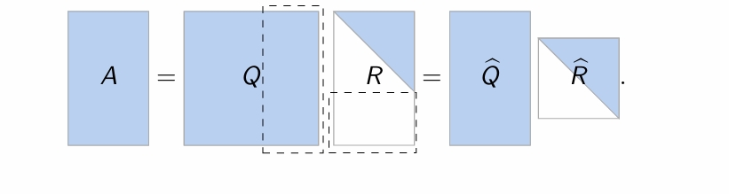
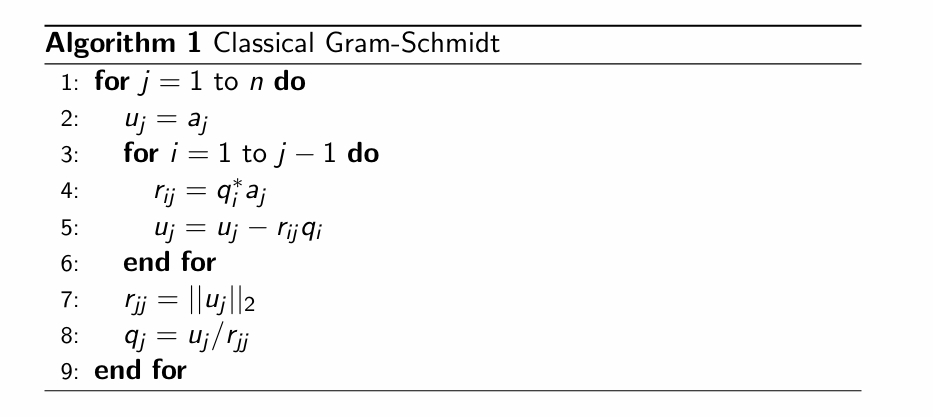
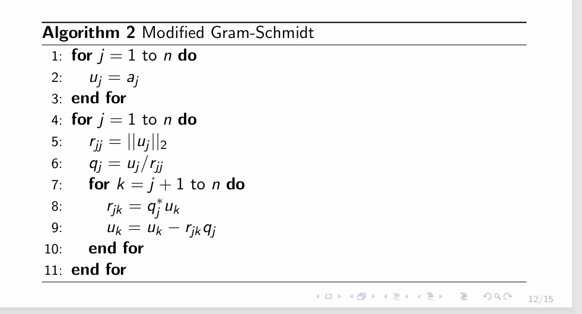

---
encrypt_content:
  level: Imperial
  password: Raymond#1234
  username: hg1523
level: Imperial
---

# Notations and definitions:

Recall that for $c = c_i + ic_2\in\mathbb{C}$ the complex conjugate is defined by $\bar{c} = c_1 - ic_2$

For a matrix $A \in\mathbb{C}^{m\times n}$, the hermitian conjugate or adjoint is denoted as $A^*$

$A = \begin{bmatrix}a_{11} & a_{12}\\a_{21} & a_{22}\\a_{31} & a_{32}\end{bmatrix}\Rightarrow A^* = \begin{bmatrix}\bar{a_{11}} & \bar{a_{21}} & \bar{a_{31}}\\\bar{a_{12}} & \bar{a_{22}} & \bar{a_{32}}\end{bmatrix}$

It is similar to transpose, except we turn all the elements to conjugates

A matrix is hermitian if $A = A^*$, if A is real then this is the same as $A = A^T$

# Review: Projections:

For $u,v\in\mathbb{R}^m$, we defined the projection of v onto $u\neq 0$ as :

$$proj_u(v) = \frac{u\bullet v}{u\bullet u}u$$

There if a square matrix P such that $Pv = proj_u(v)$

note this square

The matrix P must satisfy $P = P^2$, since projection of $proj_u(v)$ is itself

The matrix $(I-P)$ is also a projector, (consider the relation of sin and cos in a right triangle)

Projector P defines complementary subspaces:

$$\begin{aligned}
range(P) &=null(I-P)\Rightarrow S_1\\
range(1-P) &= null(P)\Rightarrow S_2\\
\end{aligned}$$

actually, this is the same as $y = Py$ which again, $Py = P^2y$ and $P = P^2$

If $S_1$ and $S_2$ are orthogonal, we call P an orthogonal projector (orthogonal projector is not necessarily a orthogonal matrix)

# Orthogonal projectors

P is an orthogonal projector if and only if $P = P^*$

>$Pv = proj_u(v) = \frac{u\bullet v}{u\bullet u}u$
>
>so $Pv = \frac{uu^T}{u\bullet u}v$
>
>P = $\frac{uu^T}{u\bullet u}$
>
>so $P^* = (\frac{uu^T}{u\bullet u})^*$
>
>notice that $u\bullet u$ is a scalar, so
>
>$P^* = \frac{(uu^T)^*}{u\bullet u}$
>
>since u is a row vector, and $((a+bi)(a-bi))^* = (a^2 + b^2) = (a-bi)(a+bi) = (a+bi)^*(a-bi)^*$
>so $P^* = \frac{uu^T}{u\bullet u} = P$

Let $[q_1|...|q_n] = \hat{Q}$ be an orthonormal basis for $range(P)$ 

$$P = \hat{Q}\hat{Q^*}$$

> $Pv = Q(Q^*v)\Rightarrow P = QQ^*$

The Key concept is $P = \hat{Q}\hat{Q}^*$ is orthogonal projector onto column space of $\hat{Q}$, regardless of how $\hat{Q}$ is obtained (as long as columns are orthonormal).

There is a square matrix P such that $Pv = proj_u(v)$

$$P_u = uu^*,P_{\perp u} = I-uu^*$$
if $u^*u = 1$

> so in the expression of $Pv = proj_u(v) = \frac{u\bullet v}{u\bullet u}u$, we can see the denometer $u\bullet u$ as the normalising term, and this is demanded by $u^*u = 1$
> 
> in other words, we denote $u = \frac{v}{|v|}$
> 
> then $proj_v(u) = (u\bullet v)u$
> 
> or $Pv = (u\bullet v)u$
> 
> therefore $Pv = (u^*v)u$
> 
> and the inner product is a scalar, so we can do
> 
> $Pv = u(u^*v)$ and $P = uu^*$

What about projector for non-orthogonal basis
 $[a_1|\dots|a_n] = \hat{A}$?

then $P = V(V^*V)^{-1}V^*$, the rest is similar

## review: QR decomposition:

$A\in \mathbb{C}^{m\times n},m\ge n$, can be factorized into $A = QR, where

$Q\in\mathbb{C}^{m\times m}$ has orthogonal columns $R = \begin{bmatrix}\hat{R}\\0\end{bmatrix}\in\mathbb{C}^{m\times n}$ with

$\hat{R}\in\mathbb{C}^{n\times n}$

## Classical Gram Schmidt orthogonalisation

We seek $[q_1|\dots|q_n] = \hat{Q}$ that is an orthonormal basis for A:

$$\begin{aligned}
q_j &= \frac{u_j}{||u_j||}\\
u_j &= a_j -\sum_{i=1}^{j-1}(u_1^*a_j)u_i
\end{aligned}$$

see lecture 8 for more details

## Revisiting Gram-Schmidt using orthogonal projectors:

We seek $[q_1|\dots|q_n] = \hat{Q}$ that is an orthonormal basis for A:

Each column $q_j$ is constructed by projecting column $a_j$:

$q_j = \frac{P_ja_j}{||P_ja_j||}$

The column q_j must be orthogonal to $q_i$, $i<j$ (as per definition)

$$\begin{aligned}
P_j &= I-\hat{Q}_{j-1}\hat{Q}_{j-1}^*\\
\hat{Q}_{j-1} &= [q_1|\dots|q_{j-1}]
\end{aligned}$$

The Gram Schmidt algorithm iteratively computes projections $u_j = P_ja_j$ which is numerically unstable

## Modified Gram-Schmidt orthogonlisation

We seek $[q_1|\dots |q_n] = \hat{Q}$ that is a orthogonal basis for A

$$\begin{aligned}
q_j &= \frac{P_ja_j}{||P_ja_j||}\\
P_j &= I - \hat{Q}_{j-1}\hat{Q}_{j-1}^*\\
\hat{Q}_{j-1} &= [q_1|\dots|q_{j-1}]
\end{aligned}$$

This gives an alternative way to construct projectors $P_j$

$$\begin{aligned}
P_j &= P_{\perp q_{j-1}}\dots P_{\perp q_2}P_{\perp q_1},j\ge 2\\
P_1 &= I
\end{aligned}$$
## Modified Gram-Schmidt algorithm

$P_j = P_{\perp q_2}P_{\perp q_1},j\ge 2 = I$

- $q_j$ is a normalised version of $u_j$

### Classical vs modified Gram-Schmidt:

- Modified GS computes at the jth step: the jth column of Q and the jth row of R
- Classical GS computes at the jth step: the jth column of Q and the jth column of R.
- Flop (floating-point operation count for both algorithms) is $O(2mn^2)$
## Loss of orthogonality?(covered in the next lecture)

Assume we are given $q_1$ with $||q_1||_2 = 1$
- $q_2 = a_2 - r_{12}q_1$ with $r_{12} = q_1^* a_2$
We can check the loss of orthogonality $\hat{Q}^*\hat{Q}$
- For classical GS: $||I - \hat{Q}^*\hat{Q}||\approx \mu Cond(A)^2$
- For modified GS: $||I - \hat{Q}^*\hat{Q}||\approx \mu Cond(A)$
- For Householder method: $||I-\hat{Q}^*\hat{Q}||\approx \mu$
For QR factorisation of $5\times5$ Hilbert matrix, this corresponds to errors $|I - \hat{Q}^*\hat{Q}|_2 = \{O(10^{-7}),O(10^{-12}),O(10^{-16})\}$

Note 1: can use re-orthogonalisation (expensive)
Note 2: conditional number may be improved by pivoting

see lecture 11 for conditional number (revisit)

Lauchli matrix:

$$A = \begin{bmatrix}1 & 1 & 1\\\ell & 0 & 0\\0 & \ell & 0\\0 & 0 & \ell\end{bmatrix}$$

What happens if $\ell$ is small

$$\begin{aligned}
1 + \ell &= 1\\
1 + \ell^2 &= 1
\end{aligned}$$