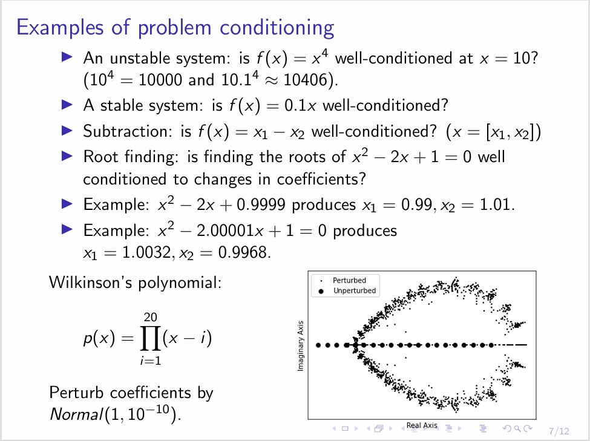
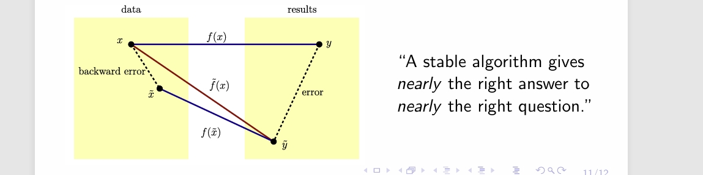

---
encrypt_content:
  level: Imperial
  password: Raymond#1234
  username: hg1523
level: Imperial
---

# Outline:

- Condition numbers
- Review: floating point
- Stability

so in the last lecture

## Loss of orthogonality?(covered in the next lecture)

Assume we are given $q_1$ with $||q_1||_2 = 1$
- $q_2 = a_2 - r_{12}q_1$ with $r_{12} = q_1^* a_2$
We can check the loss of orthogonality $\hat{Q}^*\hat{Q}$
- For classical GS: $||I - \hat{Q}^*\hat{Q}||\approx \mu Cond(A)^2$
- For modified GS: $||I - \hat{Q}^*\hat{Q}||\approx \mu Cond(A)$
- For Householder method: $||I-\hat{Q}^*\hat{Q}||\approx \mu$
For QR factorisation of $5\times5$ Hilbert matrix, this corresponds to errors $|I - \hat{Q}^*\hat{Q}|_2 = \{O(10^{-7}),O(10^{-12}),O(10^{-16})\}$

Note 1: can use re-orthogonalisation (expensive)
Note 2: conditional number may be improved by pivoting

# Generalisation:

Define a problem as a function $f: \mathcal{X}\to\mathcal{Y}$

f is a (non-linear) from normed vector space $\mathcal{X}$ to $\mathcal{Y}$

Given input data x, we can say the problem instance $f(x)$ is:
- Well conditioned if all small perturbations in x produce small changes in f(x)
- ill-conditioned if any small perturbations in x produce large changes in f(x)
Perturbations can be from disturbances, noise, and/or numerical errors

## Formalising the condition number

For data x and perturbation $\delta$, $cond(x)$ (also written as $\hat{\kappa}(x)$

$$cond(x) = \max_{\delta}\frac{||f(x) - f(x +\delta)||}{||\delta||}$$

More precisely

$$cond(x) = \lim_{\delta\to 0}\max_{||\delta x||\le \delta}\frac{||f(x) - f(x+\delta x)||}{||\delta x||}$$

we sort of just changed $\delta$ to $||\delta x||$

If f is differentiable, then $cond(x) = ||J(x)||$

since f is a matrix and x is a vector $\frac{df}{dx} = J(x)$

reminder: J is the Jacobin matrix where $J_{ij} = \frac{\partial f_i}{\partial x_j}$

cond(x) depends on the norm chosen

cond(x) also depends on the problem instance

## More common, relative condition number:

Defining the change in output as $||\delta f|| = ||f(x) - f(x + \delta x)||$, we may care about the relative perturbation $\frac{||\delta x||}{||x||}$ and relative output change $\frac{||\delta f||}{||f(x)||}$

$$\kappa(x) = \max_{\delta x}(\frac{\frac{||\delta f||}{||f(x)||}}{\frac{||\delta x||}{||x||}})$$
and again, if f is differentiable:

$$\kappa(x) = \frac{||J(x)||}{\frac{||f(x)||}{||x||}}$$

## Matrix-vector multiplication

Consider computing $Ax$ for a matrix $A\in\mathbb{C}^{m\times n}$

$$\kappa(x) = ||A||\frac{||x||}{||Ax||}\le ||A||\text{ }||A^{-1}||$$

assume $Ax = b$, then $x = A^{-1}b$

and $||x|| = ||A^{-1}b||\le ||A^{-1}||\text{ }||b||$ by the triangle inequality

so $||x||\le ||A^{-1}||\text{ }||Ax||$

therefore $\frac{||x||}{||Ax||}\le ||A^{-1}||$

because it shows up often, so we define the term $\kappa(A) = ||A||\text{ }||A^{-1}||$ 

This gives a bound on the relative change in $A^{-1}$ given a perturbation on A

Usually computed using induced norms: $||A|| = \max_{||x|| = 1}||Ax||$

Condition number of $A^{-1}$ is equal to that of A (since the condition number is symmetric for $A$ and $A^{-1}$)

Condition number of $\gamma A$ is equal to that of $A$

since $(\gamma A)^{-1} = \frac{1}{\gamma}A^{-1}$

if $A\in\mathbb{C}^{m\times n}$ and $m\neq n$

then $A^{-1}$ should be generalised to $A^{+}$ or $AA^+A = A$, $A^+AA^+ = A^+$

If $||\bullet|| = ||\bullet||_2$, then $||A|| = \sigma_1$ and $||A^{-1}|| = \frac{1}{\sigma_m}$

## Floating point:

### Review:

IEEE double precision arithmetic ranges from number from $2.33\times 10^{-308}$ to $1.79\times 10^{308}$

Representation of floating point numbers is $(-1)^d\times M\times \beta^e$

- M is the mantissa, t-digit fraction where $M = \frac{m}{\beta^t}$
- t is the precision, (23 bits for single, 52 for double)
- e is the exponent (8 bit for single, 11 for double)
	- underflow: exponent is too small $\to 0$
	- overflow: exponent is too large $\to\pm \infty$
- 1 bit to encode the sign
- Machine epsilon $\epsilon_{\text{machine}} = \frac{1}{2}\beta^{1-t}$
	- Half the distance between 1 and the next larger floating point number (size of relative gap)
	- $2^{-24}\approx5.96\times 10^{-8}$ and $2^{-53}\approx 10^{-16}$ for single and double
	- For any x, there exists $f1(x)$ s.t $|x-f1(x)|\le \epsilon_{\text{machine}}$
### Fundamental axiom of floating point arithmetic

For any x there exists $f1(x)$ s.t. $|x-f1(x)|\le \epsilon_{\text{machine}}|x|$

We can restate this as $f1(x) = x(1+\delta), |\delta|\le \epsilon_{\text{machine}}$

Denote floating point operations $\oplus, \ominus, \otimes,\oslash$, Given two floating point numbers x and y:
	- $(x\oplus y) = f1(x+y) = (x+y)(1+\delta), |\delta|\le \epsilon_{\text{machine}}$
	- $(x\ominus y) = f1(x-y) = (x-y)(1+\delta),|\delta|\le \epsilon_{\text{machine}}$
	- $(x\otimes y) = f1(xy) = (xy)(1+\delta),|\delta|\le \epsilon_{\text{machine}}$
	- $(x\oslash y) = f1(x/y) = (x/y)(1+\delta),|\delta|\le \epsilon_{\text{machine}}$

In other words, every operations of floating point arthmetic is exact up to a relative error of at most $\epsilon_{\text{machine}}$

$(x_1\oplus \dots\oplus x_n)\approx(x_1 + \dots + x_n) + \sum_{i=1}^nx_i(\sum_{j=i}^n\delta_j), |\delta_j|\le \epsilon_{\text{machine}}$
$(x_1\otimes \dots\otimes x_n)\approx(x_1 \times \dots \times x_n)(1+\epsilon),\epsilon<1.06(n-1)\epsilon_{\text{machine}}$
$|f1(x^Ty)-(x^Ty)|\le\phi(n)\epsilon_{\text{machine}}|x|^T|y|$

## From conditioning to stability:

We previously defined a problem as a function $f:\mathcal{X}\to\mathcal{Y}$

f is a (nonlinear) function from normed vector space $\mathcal{X}$ to $\mathcal{Y}$

we now define an algorithm as a function $\tilde{f}: \mathcal{X}\to\mathcal{Y}$

Relative error of the computation is $\frac{||\tilde{f(x)}-f(x)||}{||f(x)||}$

an algorithm is stable if:

 $\frac{||\tilde{f(x)}-f(x)||}{||f(x)||} = \mathcal{O}(\epsilon_{\text{machine}})$ and $\frac{||\tilde{x}-x||}{||x||} = \mathcal{O}(\epsilon_{\text{machine}})$ 

## Backward stability:

An algorithm $\tilde{f}$ for problem f is backward stable if 

$\tilde{f}(x) = f(\tilde{x});\frac{||\tilde{x}-x||}{||x||} = \mathcal{O}(\epsilon_{\text{machine}})$

In words, an algorithm is backward stable if ti produces an exact answer to nearly the right question

An algorithm can be forward stable but not backward stable

Numerical computation mostly analysed using backward error analysis

Many books use stability to imply backward stability

Review $\phi(t) = \mathcal O(\psi(t))\to |\phi(t)|\le C\psi(t)$

So these definition are norm-independent (for finite dimensional vector space)

- $C_1||c||\le ||x||'\le C_2||x||$
