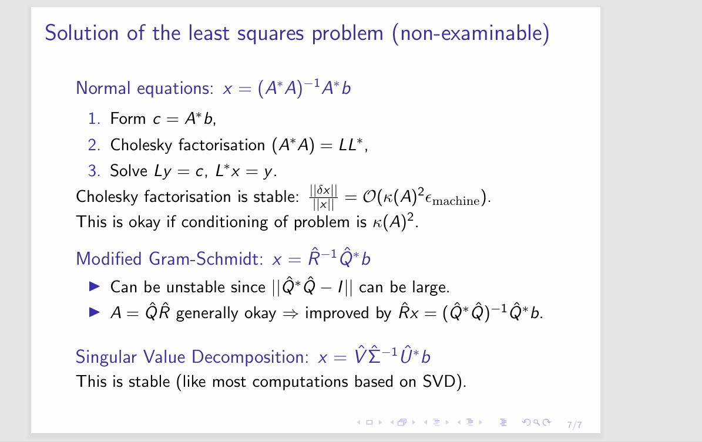

---
encrypt_content:
  level: Imperial
  password: Raymond#1234
  username: hg1523
level: Imperial
---

# Connecting conditioning and stability

Suppose a backward stable algorithm $\tilde{f}$ of problem $f:\mathcal{X}\to\mathcal{Y}$ is implemented on a computer with floating point numbers and arithmetic as we have discussed

$\frac{||\tilde{f}(x) - f(x)||}{||f(x)||} = \mathcal{O}(\kappa(x)\epsilon_{\text{machine}})$

By the definition of conditional number 

$\kappa(x) = \lim_{\delta\to 0}\sup_{||\delta x||\le\delta}\Big(\frac{\delta f}{f(x)}\frac{||x||}{||\delta x||}\Big)$

therefore $\frac{||f(\tilde{x}) - f(x)||}{||f(x)||}\le (\kappa(x) + o(1))\frac{||\tilde{x} - x||}{||x||}$

where $o(1)$ is some higher-order terms that converges to 0 as $\epsilon_{\text{machine}}\to 0$

Backward stability: $\tilde{f}(x) = f(\tilde{x})$ for some $\frac{||\tilde{x} - x||}{||x||} = \mathcal{O}(\epsilon_{\text{machine}})$

## Examples:

Floating point operations ($\oplus, \ominus, \otimes, \oslash$) are backward stable.

>use $\oplus$ as an example
>
>$z = x + y$
>
>$\tilde{z} = \tilde{x} +\tilde{y} =x \oplus y$
>
>$\tilde{z} = z+\delta_z = x + y + \delta_x + \delta_y$
>
>we treat all y terms as a constant
>
>then $\tilde{z} = f(\tilde{x})$ so $\tilde{f}(x) = f(\tilde{x})$
>
>and $\frac{||\tilde{x}-x||}{||x||} = \frac{||\delta_x||}{||x||} = O(\epsilon_{\text{machine}})$

Inner Product is backward stable
- $f1(x^Ty) = \sum_{i=1}^nx_iy_i(1+\epsilon_i)$

Outer product is stable but nor backward stable

solving a triangular system (Cholesky or QR factorisation) by back substitution is backward stable

# Revisiting the least square problem (non-examinable)

Given $A\in\mathbb{C}^{m\times n}$ of full rank, $m\ge n, b\in\mathbb{C}^m$, Find $x\in\mathbb{C}^n$ such that $||b - Ax||_2$ is minimised

- A: input data
- b: output data
- x: coefficient
- y: prediction
Solution $x = (A^*A)^{-1}A^*b = A^{+}b$, $y = AA^{+}b = Pb$

(following $\kappa(x) = \max_{\delta x}(\frac{\frac{||\delta f||}{||f(x)||}}{\frac{||\delta x||}{||x||}})$)
- Sensitivity to perturbations in b: $\frac{||\delta x||}{||x||}\le \kappa(A)\frac{||\delta b_R||}{||b_R||}$
- Sensitivity to perturbations in A: $\frac{||\delta x||}{||x||}\le 2\kappa(A)\frac{\delta A_R}{||A||} + 4\kappa(A)^2\frac{||\deltaA_N||}{||A||}\frac{||b_N||}{||b_R||} + \mathcal{O}(\frac{||\delta A_N||}{||A||})^2$
assuming $rank(A+\delta A) = rank(A)$ and $b_R\neq 0$

