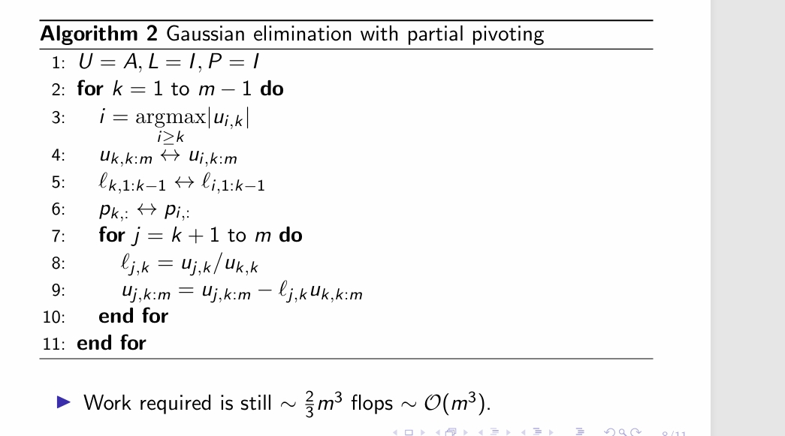
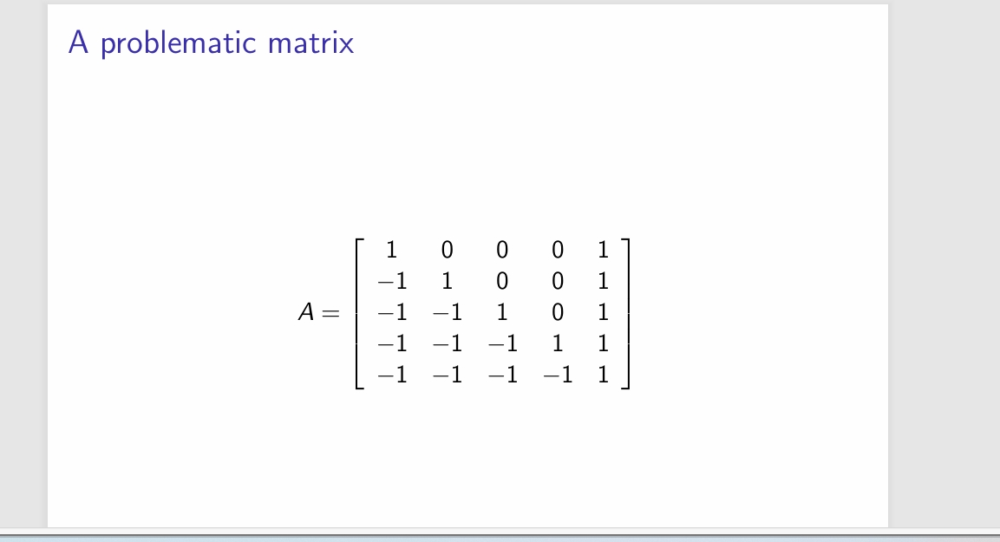

---
encrypt_content:
  level: Imperial
  password: Raymond#1234
  username: hg1523
level: Imperial
---

# Review of Gaussian elimination

We wish to solve $Ax = b$ for $A\in\mathbb{C}^{m\times m}, b\in\mathbb{C}^m$

We transform the system into upper triangular form that can be solved by back substitution

$$L_{m-1}\dots L_2L_1A = U$$
Setting $L = L_1^{-1}L_2^{-1}\dots L_{m-1}^{-1}$ gives $A = LU$

$$\underset{A}{\begin{bmatrix}\times & \times & \times\\\times &\times &\times\\\times &\times &\times\end{bmatrix}}\overset{L_1}{\to}\underset{L_1A}{\begin{bmatrix}\times & \times & \times\\\times &\times &\times\\\times &\times &\times\end{bmatrix}}\overset{L_2}{\to}\underset{L_2L_1A}{\begin{bmatrix}\times & \times & \times\\\times &\times &\times\\\times &\times &\times\end{bmatrix}}$$
# Standard Gaussian elimination

We seek L and U such that $A = LU$

```pseudo
\begin{algorithm}
\caption{CGS}
	\begin{algorithmic}
		\For{j = 1 \TO n}
			\State $u_j = a_j$
			\For{i = 1 \TO j - 1}
				\State $r_{ij} = q_i^*a_j$
				\State $u_j = u_j - r_{ij}q_i$
            \EndFor
            \State $r_{jj} = ||u_j||_2$
            \State $q_j = u_j/r_{jj}$
        \EndFor
	\end{algorithmic}
\end{algorithm}
```

for example, following the algorithm, we would do

$$\begin{array}{c}\begin{bmatrix}1 & 2 & 3\\4 & 5 & 6\\7 & 8 & 9\end{bmatrix}\to\begin{bmatrix}1 & 2 & 3\\0 & -3 & -6\\7 & 8 & 9\end{bmatrix}\to\begin{bmatrix}1 & 2 & 3\\0 & -3 & -6\\0 & -6 & -12\end{bmatrix}\to\\
\begin{bmatrix}1 & 2 & 3\\0 & -3 & -6\\0 & 0 & 0\end{bmatrix}
\end{array}
$$

the work required $\sim\frac{2}{3}m^3$flops$\sim\mathcal{O}(m^3)$

Solving $A = LU$ is $\sim\frac{2}{3}m^3$flops, back substitution is $\mathcal{O}(m^2)$

Householder triangularisation requires $\sim\frac{4}{3}m^3$ flops

# Instability of Gaussian elimination

This Gaussian elimination algorithm fails if diagonal elements are close to zero

$$A = \begin{bmatrix}0 & 1\\ 1 & 1\end{bmatrix}\text{ or }A = \begin{bmatrix}10^{-20} & 1\\ 1 & 1\end{bmatrix}$$

LU factorisation is not backward stable.

Key idea: the ordering of the rows (and columns) in A is arbitrary, so we can pivot the matrix
- At iteration k, Gaussian elimination selects pivot element $a_{k,k}$ and zeros rest of column in $A_{k+1:m, k:m}$
- We can choose any element in $A_{k:m,k:m}$ instead of $a_{k,k}$
- Common convention is to use the largest number as pivot

# Permutation matrices

A square matrix $P\in\mathbb{R}^{m\times m}$ is a permutation matrix if there is exactly one nonzero entry in each row/column equal to one

For a permutation $[\alpha_1, \dots,\alpha_m]$ of $[1,\dots, m]$

$$P = [e_{\alpha_1},\dots, e_{\alpha_m}]$$

Pre-multiplication PA permutes rows of A

Post multiplication AP permutes columns of A

P is orthonormal $PP^T = I$

Product of two permutation matrices P and P' is another permutation matrix

Permutation can change condition number

# Gaussian elimination with partial pivoting

Search over $(m-k)^2$ possible pivots is expensive
- Full pivoting requires $\mathcal{O}(m^3)$ operations (m iterations)
- Easier to only consider the $(m-k)$ row pivots possible
- Partial pivoting requires $\mathcal{O}(m^2)$ performs well in practice
$$L_{m-1}P_{m-1}\dots L_2P_2L_1P_1A = U$$
We can pivot the $L_k$ matrices:

$$L_{m-1}P_{m-1}\dots L_2P_2L_1P_1 = L_{m-1}'\dots L_1'P_{m-1}\dots P_1$$

Setting $L = (L_{m-1}'\dots L_1')^{-1};P=P_{m-1}\dots P_1$ gives $PA=LU$

Now entries of L are $\le 1$

$$\underset{A}{\begin{bmatrix}\times & \times & \times\\\times &\times &\times\\\times &\times &\times\end{bmatrix}}\overset{P_1}{\to}\underset{P_1A}{\begin{bmatrix}a_{i,j} & \times & \times\\\times &\times &\times\\\times &\times &\times\end{bmatrix}}\overset{L_1}{\to}\underset{L_1P_1A}{\begin{bmatrix}a_{i,j} & \times & \times\\0 &\times &\times\\0 &\times &\times\end{bmatrix}}$$

so the algorithm become this

We seek P, L, U such that PA = LU



# Stability of Gaussian elimination 

For $A = LU$ from Gaussian elimination without pivoting:

$\tilde{L}\tilde{U} = A +\delta A;\frac{||\delta A||}{||L||\bullet||U||} = \mathcal{O}(epsilon_{\text{machine}})$

where $\tilde{L}$ and $\tilde{U}$ are compute via floating-point arithmetic

Gaussian elimination is backwards stable if $||L||\bullet||U||\approx A$

Partial pivoting result in $\ell_{i,j}\in L\le 1$, so $||L|| = \mathcal{O}(1)$

Therefore, stability depends on the growth factor $\rho$

$\rho = \frac{\max_{i,j}|u_{i,j}|}{\max_{i,j}|a_{i,j}|}$

We can rewrite the backward error bound for PA = LU

$\tilde{L}\tilde{U} = \tilde{P}A + \delta A;\frac{||\delta A||}{||A||} = \mathcal{O}(\rho\epsilon_{\text{machine}})$

Gaussian elimination is backward stable if $\rho = \mathcal{O}(1)$

Gaussian elimination with partial pivoting has $\rho\le 2^{m-1}$

despite contrive examples of $\rho = 2^{m-1}$, Gaussian elimination with partial pivoting is very stable in practice

