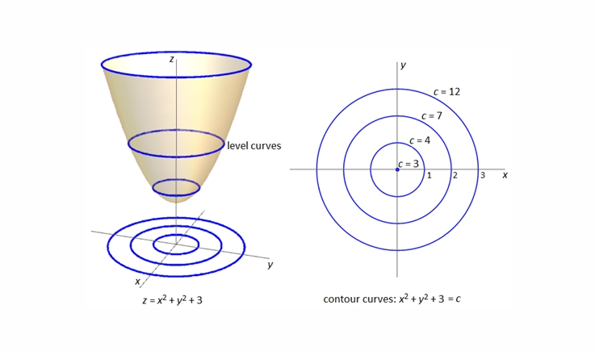
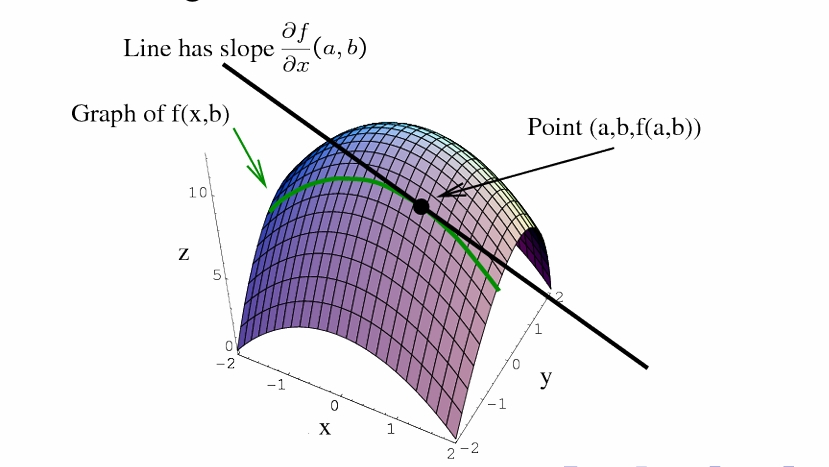

---
level: Imperial
---
---

level: Imperial

---

---


level: Imperial


---


---



encrypt_content:



  level: Imperial



  password: Raymond#1234



  username: hg1523



level: Imperial



---







# Review: iterative methods for linear systems:







we wish to solve $Ax = b$ for $A\in\mathbb{C}^{m\times m}, b\in\mathbb{C}^m$







Gaussian elimination w / partial pivoting and back substitution provide a direct methods in $\sim\mathcal{O}(m^3)$







Iterative methods can give approximate solutions much faster







Some take advantage of structure (sparsity, symmetry)







# Detour and review: nonlinear functions







In solving $A\vec{x} = b$, we solve the system of equations $\vec{a}_i^T\vec{x}, i = 1,\dots,m$







We can generalise linear function $\vec{a}_i^T\vec{x}$ to$f(\vec{x}):\mathbb{R}^m\to\mathbb{R}$







A function of m variables assign a value $z = f(\vec{x})$. For example the linear function $\vec{a}_i^T\vec{x}$ assigns a value







$$z = a_1x_1 + a_2x_2 + \dots + a_mx_m$$







Function $f:\mathcal{X} \to \mathcal{Z}$ has domain $\mathcal{X}\subseteq \mathbb{R}^m$ and a range $\mathcal{Z} = [\underset{\vec{x}}{\min}f(\vec{x}), \underset{\vec{x}}{\max}f(\vec{x})]$







# Level curves and contour maps







For a function $f:\mathcal{X}\to\mathcal{Z}$, a level curve is the set of all points in $\mathcal{X}$ that satisfies $f(\vec{x}) = c$, where $c\in\mathcal{Z}$ is a constant.







We can project the level curves onto domain $\mathcal{X}$ to produce a contour map of $f(\vec{x})$















# Review: partial derviatives:







Function $f(\vec{x})$ has partial derivatives (multiple notations)







$f_{x_i}(\vec{x}) = f_{x_i} = \frac{\partial}{\partial x_i}f(\vec{x}) = \frac{\partial f}{\partial x_i} = D_{x_i}f = \lim_{\delta\to 0}\frac{f(\vec{x} + \delta e_i) - f(\vec{x})}{\delta}$











# Review: higher-order dervatives







If f is twice differentiable, the partial derivatives $f_{x_i}(\vec{x})$ are also differentiable functions







Function $f(\vec{x})$ thus has second-order derivatives:







$$(f_{x_i})_{x_j} = \frac{\partial}{\partial x_j}\Big(\frac{\partial f}{\partial x_i}\Big) = f_{x_ix_j} = \lim_{\delta\to 0}\frac{f_{x_i}(\vec{x} + \delta e_j) - f_{x_i}(\vec{x})}{\delta}$$







Clairaut's theorem: suppose f is defined over $\mathcal{D}$ and that $f_{x_ix_j}$ and $f_{x_jx_i}$ are both continuous on $\mathcal{D}$. Then for $\vec{x}\in\mathcal{D}$:







$$f_{x_ix_j}(\vec{x}) = f_{x_jx_i}(\vec{x})$$







In general, we can write the higher-order derivatives for $f(\vec{x})$







$$f_{x_ix_j\dots x_k}(\vec{x}) = \frac{\partial}{\partial x_k}\dots \Big(\frac{\partial^2 f}{\partial x_j\partial x_i}\Big)$$







# Directional derivative and gradients







$f_{x_i}$ gives the rate of change in the direction of $x_i$. We express how f changes in the direction of arbitrary unit vector $\vec{u}$







$$\begin{aligned}



D_uf(\vec{x}) &= \lim_{\delta\to 0}\frac{f(\vec{x} + \delta\vec{u})}{\delta} \\&= \lim_{\delta\to 0}\frac{f(\vec{x} + \sum_{i=1}^mu_i\delta e_i)}{\delta}\\



&= f_{x_1}(\vec{x})u_1 + \dots + f_{x_m}(\vec{x})u_m\\



&= [f_{x_1};\dots;f_{x_m}]^T\vec{u}



\end{aligned}$$







We call this gradient of f, denoted as grad f or $\nabla f$







Key concept: applying $\nabla f$ to a direction u gives the rate of change in that direction $D_uf(\vec{x}) = \nabla f(\vec{x})\bullet u$







Applying the gradient operator $\nabla$ again gives the Hessian







$\nabla f =\begin{bmatrix}f_{x_1}\\\vdots\\f_{x_m}\end{bmatrix};\nabla^2f = H = \begin{bmatrix}f_{x_1x_1} & \dots & f_{x_1x_m}\\\vdots & \ddots &\vdots\\f_{x_mx_1} & \dots & f_{x_mx_m}\end{bmatrix}$















# Maximising the directional derivative







Suppose we want to know, given a point $\vec{x}$, in which direction does $f(\vec{x})$ change the fastest, i.e. $\max_{u}D_uf(\vec{x})$











$$D_uf(\vec{x}) = \nabla f(\vec{x})\bullet u = |\nabla f(\vec{x})|\text{ }|u|\cos\theta$$







This is maximised when the angle between the vectors $\theta = 0$ and $\cos\theta = 1$. Therefore, u has the same direction of $\nabla f(\vec{x})$







Intuitively, it can be shown that $\nabla f(\vec{x})$ is perpendicular to the level curve that passes through $\vec{x}$







# Gradient-based optimisation







An optimisation problem seeks $\vec{x_*} = {\arg\max}_{\vec{x}\in\mathcal{X}} f(\vec{x})$







A function has local minimum at $\vec{x_*}$ if $f(\vec{x_*})\le f(\vec{x})$ for some radius around $\vec{x_*}$ i.e. $\{f(\vec{x_*});||\vec{x}-\vec{x_*}_2\le r,r>0||\}$







Stronger: global minimum at $\vec{x_*}$ of $\{f(\vec{x_*})\le f(\vec{x});\vec{x}\in\mathcal{X}\}$







A local minimum satisfies the following optimality conditions:







$$\begin{array}{c|c|c}



 & \text{single variable} & \text{multi-variate}\\



 \hline



\text{first-order/stationarity} & f_x = 0 & \nabla f(\vec{x}) = 0\\



\text{second-order test} & f_{xx} > 0 & \nabla^2 f(\vec{x})\text{ is PD}



\end{array}$$







We can search for a stationary point by gradient descent (steepest descent)







$$x^{(k+1)} = x^{(k)} - \alpha\nabla f(x^{(k)}), k = 0,1,2$$







Many iterative optimisation methods avaliable







# Solving $Ax = b$ with gradient-based optimisation







If A is positive definite, solving $Ax = b$ is equivalent to solving $\min_{x} f(x) = \frac{1}{2}b x^TAx - x^Tb$







$$\begin{aligned}



\nabla f(x)& = \frac{1}{2} 2Ax - b = Ax - b = 0\\



\nabla^2 f(x) &= A (\text{PD by definition})



\end{aligned}$$







We get iterative methods w/ directions p and step lengths $\alpha$ :







$\vec{x}^{(k+1)} = \vec{x}^{(k)} - \alpha^{(k)}\vec{p}^{(k)},k = 0,1,2,\dots$







If A is symmetric a positive definite, we can use the conjugate gradient algorithm







# Conjugate gradient (CG) method







CG chooses directions $p^{(k)}$ such that they are conjugate:







$<p^{(k)}, p^{(j)}>_A = p^{(k)T}Ap^{(j)} = 0; j\neq k$ and steps $\alpha^{(k)}$ s.t. residuals $r^{(k)} = \nabla f = b - Ax^{(k)}$ are orthogonal:







$$k = 0: p^{(0)} = -\nabla f(x^{(0)}) = b - Ax^{(0)} = r^{(0)}$$







This is similar to Gram-Schmidt (conjugate instead of orthogonal). $\{p_1,\dots,p_m\}$ forms a basis for $\mathbb{R}^m$







Step length is chosen to minimise function in direction $p^{(k)}$







$$a^{(k)} = \arg\min_{\alpha} f\Big(x^{k} +\alpha^{(k)}p^{(k)}\Big) = \frac{p^{(k)T}r^{(k)}}{p^{(k)T}Ap^{(k)}}$$











without rounding errors, CG converges in $\le m$ iterations.







Residual vectors $r^{(0)},\dots,r^{(m-1)}$ are orthogonal and form a basis for $\mathbb{R}^m$, there the next residual $r^{(m)} = 0$



