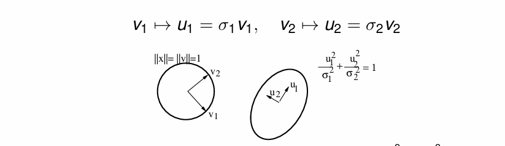
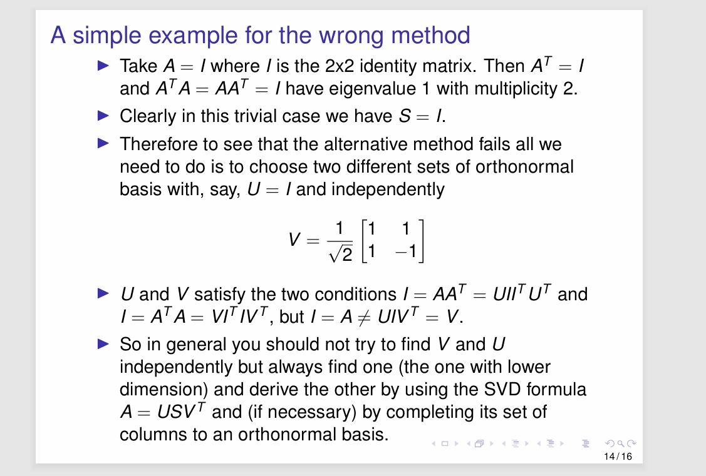

---
encrypt_content:
  level: Imperial
  password: Raymond#1234
  username: hg1523
level: Imperial
---

# Positive (semi-definite) symmetric matrices

- A symmetric matrix is positive (semi-)definite if all its eigenvalues are positive (non-negative)
equivalently
- A symmetric matrix $A\in\mathbb{R}^{n\times n}$ is positive definite iff
$$\forall x\in\mathbb{R}^n\setminus\{0\}. x^TAx>0$$
- A symmetric matrix A is positive semi-definite iff
$$\forall x\in\mathbb{R}^n. x^TAx\ge 0$$
The negative ones are similarly defined

## Example

suppose $A = \begin{bmatrix}a & b\\ b & c\end{bmatrix}$

then $x^TAx = ax_1^2 + 2bx_1x_2 + cx_2^2$ where $x = (x_1, x_2)^T$

so A is positive definite when $b^2 - ac < 0$ and $a< 0$

A is positive semi-definite if $b^2 - ac \le 0$ and $a< 0$

A is negative semi-definite if $b^2 - ac\le 0$ and $a > 0$

# Spectral decomposition and +ve definiteness

- Recall that for a symmetric matrix $Q^TAQ = \Delta$ where Q is an orthogonal matrix with $Q^T = Q^{-1}$ and $\Delta$ is the diagonal matrix of eigenvalues of A
- since orthogonal matrices preserve the $l_2$ norm (see lecture 1 l2 norms): $x\neq 0\iff y:=Q^Tx\neq 0$
- We have 
$$\begin{aligned}
x^TAx &= x^T(QQ^T)A(QQ^T)x& (QQ^T = QQ^{-1} = 0)\\
&= (x^TQ)(Q^TAQ)(Q^Tx) \\
&= (Q^Tx)^T(Q^TA)(Q^Tx)& (XY)^T = Y^TX^T\\
&= (Q^Tx)^T\Delta (Q^T x)\\
&= y^T\Delta y
\end{aligned}$$

thus $A^TAx>0$ for all $x\neq 0$ iff $y^T\Delta y > 0$ for all $y\neq 0$

so A is +ve(positive) definite iff $\Delta$ is +ve definite

$y^T\Delta y = \sum_{i = 1}^n\lambda_iy_i^2$ and it is positive definte iff $\forall i.\lambda_i> 0$

Thus A is +ve(positive) definte iff its eigenvalues are positive

and A is +ve semi-definite iff its eigenvalues are non-negative

# Singular Value decomposition (SVD)

- Let $A\in\mathbb{R}^{m\times n}$ be an arbitrary matrix
- Then $A^TA\in\mathbb{R}^{n\times n}$ and $AA^T\in\mathbb{R}^{m\times m}$ are symmetric
- They are also positive semi-definite since for example $x^TA^TAx = (Ax)^T(Ax) = (||Ax||_1)^2\ge 0$
- later we will show that $A = USV^T$ the SVD of A where $V\in\mathbb{R}^{n\times n}$ and $U\in\mathbb{R}^{m\times m}$ is diagonal with $S = diag(\sigma_1, \sigma_2, \dots, \sigma_p)$ and $p = \min(m,n)$ and $\sigma_1\ge\sigma_2\ge\dots\ge \sigma_p\ge 0$ this is the singular values of A
- If r is the rank of A then A has exactly r positive singular values $\sigma_1\ge \sigma_2\ge\sigma_3\ge\dots \ge \sigma_p> 0$
- If $U = [u_1,\dots, u_m]$ and $V = [v_1,\dots, v_n]$ then $A = \sigma_1u_2v_1^T + \sigma_2u_2v_2^T + \dots + \sigma_ru_rv_r^T$

# Geometric interpretation of SVD:

- Suppose $A\in\mathbb{R}^{2\times 2}$ and $A = USV^T$, with $U,V\in\mathbb{R}^{2\times 2}$ orthogonal matrixes, $S = diag(\sigma_1,\sigma_2)$ with $\sigma_1\ge \sigma_2> 0$
- Let $x = (x_1, x_2)^T$ be stnadard coordinates of a point. With respect to the basis $u_1, u_2$ for the output and basis $v_1, v_2$ for the input, we have 

The circle $||x|| = ||v|| = 1$ goes to the ellipse $\frac{u_1^2}{\sigma_1^2} + \frac{u^2_2}{\sigma_2^2} = 1$

The can be used in Datacompression, PCS, Dimension Reduction: When $\sigma_2 <<\sigma_1$ let $A\approx \sigma_1 u_1 v_1^T$

# Finding SVD:

- Suppose the SVD for A as above exists:
- Since $U^TU = I_{m\times m}$ (for a orhtogonal matrix the inverse is the transpose) we have
$$A^TA = VS^TU^TUSV^T(A = USV^T) = VS^TSV^T$$
- where $S^TS = diag(\sigma_1^2, \sigma_2^2, \dots, \sigma_1^2)\in\mathbb{R}^{n\times n}$ is a diagonal matrix, then we conduct spectral decomposition of the positive semi-definite matrix $A^TA$
therefore

## SVD algorithm:

- (i) let $n\ge m$ i.e. $A^TA\in\mathbb{R}^{n\times n}$ smaller than $AA^T\in\mathbb{R}^{m\times m}$
- (ii) Obtain the eigenvalues $\sigma_1^2\ge\sigma_2^2\ge\dots\ge\sigma_n^0\ge 0$ and the orthogonal eigenvectors $v_1,\dots, v_n$ of $A^TA$ 
- (iii) construct the orthogonal matrix $V = [v_1, \dots, v_n]$
- (iv) Put $r:=rank(A)$
- (v) Let $u_i:=\frac{1}{\sigma_i}Av_i$ for $1\ge i\ge r$ (Check using $US = AV!$)
- (vi) We have $||u_i||_2 = 1,u_i^Tu_j = 0$ and $AA^T u_i = \sigma_i^2u_i$ for $q\le i,j\le r$ with $i\neq j$ (Check)
- (vii) Extend the set $u_1,\dots, u_r$ to an orhtonormal basis $u_1,\dots, u_r,u_{r+1}\dots, u_m$ 
- (viii) If $p = m < n$ use $AA^T$ in (ii) find U in (iii) find v_i $1\le i\le r$ in (v) using $VS^T = A^TU$ and extend it to V in (vi)
### (vii) Extension to a basis
- we need to extend a set of mutually orthogonal unit vectors $u_1,\dots, u_r$ to an orthonormal basis $u_1\dots, u_r,u_{r+1}\dots, u_m$ of $\mathbb{R}^n$ as follows
- The subspace generated by $u_{r+1},\dots, u_m$ is the orthogonal complement of the subspace generated by $u_1,\dots, u_r$
- Thus $u_{r+1},\dots, u_m$ can be found iteratively by:
- FInd $u_{r+1}$ so that it is a unit vector orthogonal to each vector $u_1, \dots, u_2$
- Then find $u_{r+2}$ with the same method

### numpy SVD (assuming symmetric or hermitian)

we assume full_matres is true and compute uv is true by default

```python
import numpy as _nx
    a, wrap = _makearray(a)

    if hermitian:
        # note: lapack svd returns eigenvalues with s ** 2 sorted descending,
        # but eig returns s sorted ascending, so we re-order the eigenvalues
        # and related arrays to have the correct order
        if compute_uv:
            s, u = eigh(a)
            sgn = sign(s)
            s = abs(s)
            sidx = argsort(s)[..., ::-1]
            sgn = _nx.take_along_axis(sgn, sidx, axis=-1)
            s = _nx.take_along_axis(s, sidx, axis=-1)
            u = _nx.take_along_axis(u, sidx[..., None, :], axis=-1)
            # singular values are unsigned, move the sign into v
            vt = transpose(u * sgn[..., None, :]).conjugate()
            return SVDResult(wrap(u), s, wrap(vt))
        else:
            s = eigvalsh(a)
            s = abs(s)
            return sort(s)[..., ::-1]

    _assert_stacked_2d(a)
    t, result_t = _commonType(a)

    m, n = a.shape[-2:]
    if compute_uv:
        if full_matrices:
            gufunc = _umath_linalg.svd_f
        else:
            gufunc = _umath_linalg.svd_s

        signature = 'D->DdD' if isComplexType(t) else 'd->ddd'
        with errstate(call=_raise_linalgerror_svd_nonconvergence,
                      invalid='call', over='ignore', divide='ignore',
                      under='ignore'):
            u, s, vh = gufunc(a, signature=signature)
        u = u.astype(result_t, copy=False)
        s = s.astype(_realType(result_t), copy=False)
        vh = vh.astype(result_t, copy=False)
        return SVDResult(wrap(u), s, wrap(vh))
    else:
        signature = 'D->d' if isComplexType(t) else 'd->d'
        with errstate(call=_raise_linalgerror_svd_nonconvergence,
                      invalid='call', over='ignore', divide='ignore',
                      under='ignore'):
            s = _umath_linalg.svd(a, signature=signature)
        s = s.astype(_realType(result_t), copy=False)
        return s
```
deleting the branches we do not analyse

```python
a, wrap = _makearray(a) # a is a matrix with n * n, in this case, the line does nothing
s, u = eigh(a) # s is the eigen values, u is the eigenvectors, step(ii) and step(iii)
# see properties 1
sgn = sign(s) # the sign of the array
s = abs(s) # absolute value
sidx = argsort(s)[..., ::-1] # give out a sorted array by row (sidx only contain the indexs)
sgn = _nx.take_along_axis(sgn, sidx, axis=-1) # order the sgn
s = _nx.take_along_axis(s, sidx, axis=-1) # order s
u = _nx.take_along_axis(u, sidx[..., None, :], axis=-1) # order u
# singular values are unsigned, move the sign into v
vt = transpose(u * sgn[..., None, :]).conjugate() # transpose u
return SVDResult(wrap(u), s, wrap(vt))
```


for non-hermitian is goes into cpp and c files for optimisation, but the idea should be the same

## properties:

- For $1\le i\le r$ the vector $u_i$ is an eigenvector of $AA^T$ with eigenvalue $\sigma_i^2$
- $AA^T$ is similar to $SS^T$ (with identical eigenvalues) and $A^TA$ is similar to $S^TS$ (with identical eigenvalues)
- The diagonal elements of the diagonal matrices $S^TS\in\mathbb{R}^{n\times n}$ and $SS^T\in\mathbb{R}^{m\times m}$ are $\sigma_1^2,\dots,\sigma_p^2$
- The sigular values of A are the postive square roots of the eigenvalues of $AA^T$ or $A^TA$
- $||A||_2 = \sigma_1$ the largest singular value of A
## SVD example:

Consider the matrix $A = \begin{bmatrix}1 & -1\\-1 & 1 \\1 & -1\end{bmatrix}$

then $A^TA =\begin{bmatrix}3 & -3 \\-3 & 3\end{bmatrix}$

and eigenvalue 6 with normalised eigenvector $v_1 = \frac{1}{\sqrt{2}}(1,-1)^T$ and eigenvalue 0 with normalised eigenvector $v_2 = \frac{1}{\sqrt{2}}(1,1)^T$

Thus, $V = [v_1, v_2]$ is the orthogonal matrix that disgonalies $A^TA$

so now we put $u_1 = \frac{1}{\sqrt{6}}Av_1 = \frac{1}{\sqrt{3}}\begin{bmatrix}1\\-1\\1\end{bmatrix}$
We find $u_2$ and $u_3$ that together with $u_1 give an orthonormal basis for $\mathbb{R}^3$ (Note that $Av_2 = 0$)

therefore we can choose for $u_2$ any unit vector, say, $u_2 = \frac{1}{\sqrt{2}}(1,1,0)^T$, that is orthogonal to $u_1$

Then let $u_3 = u_1\times u_2 = \frac{1}{\sqrt{6}}(1,-1,2)^T$

$U = [u_1, u_2, u_3]$ and S is the diagonal matrix with $S = diag(\sqrt{6},0)$

$A= USV^T$

$||A||_2 = \sqrt{6}$

## $AA^T$ instead of $A^TA$

in the SVD algorithm step(ii) replace $A^TA$ with $AA^T$

but this can produce incorrect result for V (recall the assumption $n\lt m$ so that $A^TA$ is bigger in size)

If $AA^T$ and $A^TA$ have (necessatily common) non-zero eigenvalue with multiplicity more than one, then we would have choices in taking their corresponding eigenvector to build U and V

in this case the proposed solution of finding V and U independently can lead to the wrong answer $A = USV^T$ may not hold



# PCA:

Assumme $A\in\mathbb{R}^{m\times n}$ with SVD $A = USV^T$, represents m samples of n dimensional data: each row corresponds to a sample and each column to one dimension of the data

let $X_j$ for $1\le j\le n$ represent the random variable of the column of A

the we subtract the mean of each column from its elements assume each column now have mean 0

The covariance matrix is given be $\frac{1}{n-1}A^TA$ with $(A^TA)_{ij} = (A^TA)_{ji} = Cov(X_i, X_j)$

Define the principal axes as columns of V. First principal axis $v_1$ i.e. the direction of greatest variation

Define the principal components of the columns of US

$A = \sum\sigma_iu_iv_i^T$ with the approximation of the only first term (depending on how much we need)

```python
def pca_svd(data, num_components):
    # Step 1: Standardize the data (mean centering)
    data_meaned = data - np.mean(data, axis=0)
    
    # Step 2: Compute SVD
    U, S, Vt = np.linalg.svd(data_meaned, full_matrices=False)
    
    # Step 3: Select the top 'num_components' principal components
    U_reduced = U[:, :num_components]
    S_reduced = S[:num_components]
    
    # Step 4: Transform the data
    transformed_data = U_reduced * S_reduced
    
    return transformed_data, U_reduced, S_reduced, Vt[:num_components]
```