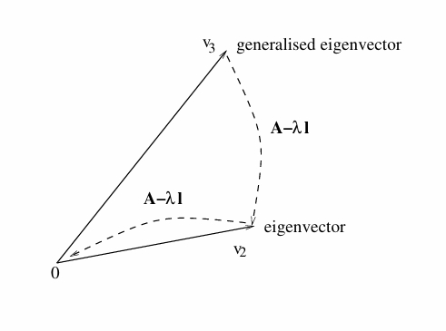
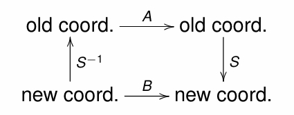

---
level: Imperial
---
---

level: Imperial

---

---


level: Imperial


---


---



encrypt_content:



  level: Imperial



  password: Raymond#1234



  username: hg1523



level: Imperial



---











# Singular and Non-Singular Matrices:







- A square matrix $A\in\mathbb{R}^{m\times m}$ is non-singular if its columns are linearly independent or if this rank is m



- Otherwise A is said to be singular



- If $A\in\mathbb{R}^{m\times m}$ is non-singular, then A is invertible, u.e. there exists $B\in\mathbb{R}^{m\times m}$ such that $AB = BA = I$ and we write $B = A^{-1}$



- If $A,B\in\mathbb{R}^{m\times m}$ are invertible, then so is $AB$ and $(AB)^{-1} = B^{-1}A^{-1}$



- Note that similarity with the formula $(AB)^T = B^T A^T$



as a review, check the equivalent conditions on https://math.stackexchange.com/a/79384



# Orthogonal matrices



- If the columns of $A\in\mathbb{R}m\times m$ form a orthonormal set then $A^{-1} = A^T$ and A is called an orthogonal matrix.



- Example: $A = \frac{1}{\sqrt{2}}\begin{bmatrix}1 & -1 \\ 1 & 1\end{bmatrix}$



- Clearly $a_1\bullet a_2 = 0$ and $||a_1||_2 = ||a_2||_2 = 1$



- we have $A^{-1} = \frac{1}{\sqrt{2}}\begin{bmatrix}1 & 1 \\ -1 & 1\end{bmatrix}$



- If $A\in\mathbb{R}^{m\times m}$ is an orthogonal matrix then the vectors $A_{ij}$ for $j = 1,\dots, m$ where $i_j$ is the jth column of identity matrix $I\in\mathbb{R}^{m\times m}$ form an orthonormal basis



- In the above example, we have the orthonormal basis:



$$\Big\{\frac{1}{\sqrt{2}}\begin{bmatrix}1\\1\end{bmatrix}, \frac{1}{\sqrt{2}}\begin{bmatrix}-1\\1\end{bmatrix}\Big\}$$







## Review: The eigenvalue problem







- Given a square matrix $A\in\mathbb{C}^{m\times m}$, a non-xero vector $v\in\mathbb{C}^m$ is an eigenvector with eigenvalue $\lambda\in\mathbb{C}$ for A if $Av = \lambda v$



- Clearly for any $k\neq 0$, the vector kv will then be an eigenvector with the same eigenvalue $\lambda$



- Example, the matrix $A =\begin{bmatrix}1 & 2\\2 & 1\end{bmatrix}$ has (up to scaling) an eigenvector $(1,1)^T$ with eigenvalue 3 and an eigenvector $(1,-1)^T$ with eigenvalue $-1$



- If $v\in\mathbb{R}^m$ is an eigenvector for A with eigenvalue $\lambda\in\mathbb{R}$, then we have $(A-\lambda I)v = 0$ and thus $A-\lambda I$ is singular matrix with $det(A - \lambda I) = 0$ refer to the conditions in https://math.stackexchange.com/a/79384







## Method to find eigenvalue:







- In general we have to solve $det(A - \lambda I) = 0$



- There are two formulas which are often useful in practice



- $trace(A) = \sum_{i = 1}^{m}A_{ii}$ (this is the definition, only defined for square matrix)



- The product of the eigenvalues is equal to $det(A)$ (easy to prove)



- These two formula follow from the properties of roots of polynomials 



- For example, for $A\in\mathbb{R}^{3\times 3}$, if we know one root $\lambda_1\neq 0$ say then the quadratic equation $\lambda^2 - (trace(A) - \lambda_1)\lambda + (\frac{det(A)}{\lambda_1}) = 0$ gives the two other roots







## Solution of eigenvalue problem



- To solve $Av = \lambda v$ , rewrite the equation as $(A - \lambda I) = 0$ For this to hold for $v\neq 0$ we need to solve $det(A - \lambda I) = 0$, the characteristic equation, which has m (real or complex) roots (including multiplicity)



- Suppose there are n eigenvalue $\lambda_i$ with $i = 1,\dots, n$ such that $\lambda _i$ has algebraic multiplicity $m_i$ where $\sum_{i = 1}^n m_i = m$ (say there are m roots in total, then $m_i$ of them are all $\lambda_i$)



- For each $\lambda_i$, with $i = 1,\dots, n$ find a set of linearly independent vectors $v_{i1},\dots, v_{il_i}$ with $l_i\le m$ such that $null(A - \lambda_i I) = span\{v_{i1},\dots, v_{il_i}\}$ Then $l_i = null(A - \lambda_i I)$ is the geometric multiplicity of $\lambda_i$ (the number of the vectors in the span of eigenvectors)



- If $l_i = m_i$ then the eigenvalue problem is solved for $\lambda_i$



- If $l_i = m_i$ for $1\le i\le n$ then A is diagonalisable: Put $B = [v_{11}, \dots, v_{1m_1};v_{21}, \dots, v_{2m_2};\dots;v_{n1}, \dots, v_{nm_1}]$ then $B^{-1}AB = diag(\underbrace{\lambda_1\dots\lambda_1}_{m_1\text{ times}};\underbrace{\lambda_2\dots\lambda_2}_{m_2\text{times}};\dots;\underbrace{\lambda_n\dots\lambda_n}_{m_n\text{ times}})$



### example:







Consider $A = \begin{bmatrix}4 & 0 & 1\\2 & 3 & 2\\1 & 0 & 4\end{bmatrix}$







Then $det(A - \lambda I) = (\lambda -3)^2 (\lambda - 5)$ so $\lambda _1 = 3$ with $m_1 = 2$ and $\lambda_2 = 5$ with $m_2 = 1$. Note $m_1 + m_2 = 2 + 1 = 3$







$$\begin{aligned}



null(A - 3I) &= span\{(0,1,0)^T, (-1,0,1)^T\}\\



null(A - 5I) &= span\{(1,2,1)^T\}\\



\end{aligned}$$







Let 



$$B = \begin{bmatrix}0 & -1 & 1\\1 & 0 & 2\\ 0 & 1 & 1\end{bmatrix}, B^{-1} = \frac{1}{2}\begin{bmatrix}-2 & 2 & -2\\-1 & 0 & 1\\1 & 0 & 1\end{bmatrix}$$







Then







$$B^{-1}AB = diag(3,3,5)$$







## A Non-diagonalisable Matrix:







Consider a example with $l_1\lt m_i$ for some i.







$A = \begin{bmatrix}1 & 1 & 1\\ 0 & 1 & 0\\ 0 & 0 & 1\end{bmatrix}$







$det(A - \lambda I) = (1-\lambda)^3 = 0$ gives $\lambda_1 = 1$ with $m_1 = 3$







$null(A-I) = span \{v_1, v_2\}; v_1 = (0,1,-1)^T, v_2 = (1,0,0)^T$







- A is not diagonalisable, but is reducible to a simple form



- Note $Av_i = v_i$ and thus $v_i$ is an eigenvector for $i = 1,2$



- There is also a generalisaed eigenvector $v_3$ with $(A-I)v_3 = v_2$



- given $v_2$ we find that $v_3 = (0,0,1)^T$



- If we take $B = [v_1, v_2, v_3]$ then the Jordan Normal Form of A is $B^{-1}AB = \begin{bmatrix}1 & 0 & 0\\0 & 1 & 1\\0 & 0 & 1\end{bmatrix}$ where $B^{-1} = \begin{bmatrix}0 & 1 & 0\\ 1 & 0 & 0\\ 0 & 1 & 1\end{bmatrix}$



## Generalised Eigenvector



this is a bit long, so



### example



- Note that $v_3$ is mapped by $A - \lambda I$ to $v_2$ which is an eigenvector of A for eigenvalue $\lambda = 1$



- $v_3$ is called a generalised eigenvector of A for eigenvalue $\lambda = 1$















$v_2= (1,0,0)^T, A-\lambda I = \begin{bmatrix}0 & 1 & 1\\ 0 & 0 & 0\\ 0 & 0 & 0\end{bmatrix}, v_3 = (0,0,1)^T$











### problem



we cannot obtain a generalised eigenvector from the equation $(A-\lambda I)v_3 = v_1$ in the example







actually if we have an eigenvalue $\lambda$  with algebraic multiplicity 3 but geometric multiplicity 2, and if we have two linearly independent vectors $u_1, u_2$ corresponding to the eigenvalue, $\lambda$, it is NOT the case that either $u_1$ using $(A-\lambda I)u_3 = u_1$ or $u_2$ using $(A-\lambda I) u_3 = u_2$ would necessarily provide a generalise eigenvector $u_3$ (let $u_1 = v_1 + v_2$ and $u_2 = v_1- v_2$ in the previous example)







$u_1 = (1,1,-1)^T$ and $u_2 = (1, -1, 1)^T$, $\lambda = 1$ and $m = 3$







then $u_2= (1,1,-1)^T, A-\lambda I = \begin{bmatrix}0 & 1 & 1\\ 0 & 0 & 0\\ 0 & 0 & 0\end{bmatrix}, u_3 = \text{not possible}$







But a general eigenvector $u_3$ can always be found by using a suitable linear combination $au_1 + bu_2$ by $u_1$ and $u_2$, i.e., we need to find the generalised eigenvectorfrom the subspace (also called the eigen space) generated by the eigenvectors for the eigenvalue$\lambda$







### solution:



In general, to obtain a generalised eigenvector for an eigenvalue $\lambda$ we need to use a suitable eigenvector in the subspace of the eigenvectors for $\lambda$







In general if an eigenvalue $\lambda$ of a $A\in\mathbb{C}^{m\times m}$ has algebraic multiplicity k then $k = nullity(A - \lambda I)^k$ (obviously)







Whenever the geometric multiplicity is less than the algebraic multiplicity of an eigenvalue $\lambda$ of $A\in\mathbb{C}^{m\times m}$ then we will have generalised eigenvectors for $\lambda$







so we define, A vector $v\neq 0$ is a generalised eigenvector for eigenvalue $\lambda$ with algebraic multiplicity k if $(A-\lambda I)^k v =0$







Any eigenvector for $\lambda$ is clearly is a generalised eigenvector for $\lambda$, but a generlised eigenvector may not be an eigenvector(shown in the problem section)







The generalised eigenvector can be chosen so that matrix is reduced to Jordan Normal Form







# Jordan Normal Form(JNF)







Any $A\in\mathbb{C}^{m\times m}$ matrix can be reduced to a JNF of type 







$$\begin{bmatrix}



J_1 & & &\\



& J_2 & &\\



& & \ddots & \\



& & & J_n\\



\end{bmatrix}$$







where each $J_t$ is a Jordan block in the form of







$$J_t = \begin{bmatrix}



\lambda_t & 1 & 0 & 0 & 0 & 0\\



0 & \lambda_t & 1 & 0 & 0 & 0\\



0 & 0 & \lambda_t & 1 & 0 & 0\\



\vdots & \vdots & \vdots & \ddots & 1 & 0\\



0 & 0 & 0 & \dots & \lambda_t & 1\\



0 & 0 & 0 & \dots & 0 & \lambda_t\\



\end{bmatrix}$$







where $\lambda_t$ is an eigenvalue of A and the only non-zero elemetns off the diagonals are the 1's on the super diagonal.







Different Jordan blocks can have the same eigenvalue on the diagonal: The algebraic multiplity of an eigenvalue $\lambda$ is the sum of sizes of blocks with $\lambda$ on the diagonal. The geometric multiplicity of $\lambda$ is the number of blocks with $\lambda$ on the diagonal







## Number of blocks of each size (not -examible)







For eigenvalue $\lambda$ of $A\in \mathbb{C}^{m\times m}$ with algebraic multiplicity $m_i$ compute the following finte strictly increasin sequence of integers $0 = d_0 < d_1 < d_2 <\dots d_{k_i} = m_i$ with $d_j = Nullity(A - \lambda I)^j$







- Since $m_i = Nullity(A - \lambda I)^{m_i}$ we have $k_1\le m_i$



- From $d_j$'s compute the number of Jordan blocks for $\lambda_i$



- $d_1 - d_0 = d_1$ is the number of Jordan blocks



- $d_2 - d_1$ is the number of Jordan blocks with size at least two.



- $d_j - d_{j-1}$ is the number of Jordan blocks with size at least j.



- Thus the number of J blocks size 1 is $(d_1 - d_0) - (d_2 - d_1)$



- The number of Jordan block of size j is $(d_j - d_{j-1}) - (d_{j+1} - d_j)$







# Similar Matrices







- Suppose $A,S\in\mathbb{R}^{m\times m}$ with S non-singular



- Then we check that 



$$Av = \lambda v\iff SAS^{-1}Sv = \lambda Sv$$



(this is just multipling the two side with $S$ then add $S^{-1}S$ to the left side, and since $\lambda$ is a scalar, we can put it in the front)







Thus A and $SAS^{-1}$ have the same set of eigenvalues and anyeigenvector v for A given Sv as an eigenvector for $SAS^{-1}$ with the same eigenvalue.







We say A and $SAS^{-1}$ are similar matrices.







In fact if A represents a linear map $f:\mathbb{R}^m\to\mathbb{R}^m$ then S transforms coordinates so that f is represented in the new coordinates by $B = SAS^{-1}$



















