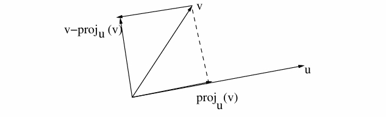

---
encrypt_content:
  level: Imperial
  password: Raymond#1234
  username: hg1523
level: Imperial
---

# Idea of QR decomposition:

- Suppose we have a system of linear equations $Ax = b$ where $A\in\mathbb{m\times n}$ with $m\ge n$
- Suppose we find a orthogonal matrix $Q \in\mathbb{R}^{m\times n}$ (i.e, whose columns form an orthogonal set of vectors or $Q^TQ = I_{n\times n}$) and an upper triangular matrix $R\in\mathbb{R}^{n\times n}$ such that $A= QR$
- so by changing the basis using $Q$ we get $R$ which is a triangular matrix an easier to solve
- $Ax= b$ is reduced to $QRx = b$ or $Rx = Q^Tb$ or $Rx = b$ with $b':Q^Tb$

# Gram-Schmidt process with a bit generealisation

- For $u,v\in\mathbb{R^m}$, define $proj_u(v) = \frac{u\bullet v}{u\bullet u}u$ if $u\neq 0$
- then for $u\neq 0$ we have $u\bullet(v-proj_u(v)) = u\bullet v-\frac{(u\bullet v)(u\bullet u)}{(u\bullet u)} = 0$

- Let $v_j\in\mathbb{R}^m$ for $1\le j\le n$ be linearly independent
- then recall the Gram-Schmidt method produce an othonormal basis with the $(e_1, e_2, \dots, e_n)$ for the n-dimensional subspace generated by $v_j\in\mathbb{R}^m$ for $1\le j\le n$
1. Let $u_1:=v_1$ and $e_1 =\frac{u_1}{||u_1||}$
2. Next let $u_2 = v_2 - proj_{u_1}(v_2) = v_2 - (e_1\bullet v_2)e_1$ and
3. put $e_2 = \frac{u_2}{||u_2||}$
4. Then $e_1$ and $e_2$ are unit vectors orthogonal to each other
5. To find $e_3$ we write $u_3 = v_3 - (e_1\bullet v_3)e_1 - (e_2\bullet v_3)e_2$ put $e_3 = \frac{u_3}{||u_3||}$
6. for the general term put 
$$\begin{aligned}
u_j &:=v_j - proj_{u_1}(v_j) - proj_{u_2}(v_j)-\dots-proj_{u_{j-1}}(v_i), (1\le j\le n)\\
&=v_j- (e_1\bullet v_j)e_1 - (e_2\bullet v_j)e_2 - \dots-(e_{j-1}\bullet v_j)e_{j-1}\\
\end{aligned}$$

- Then $\{e_j:=\frac{u_j}{||u_j||}:j=1,2,\dots, n\}$
- Note $e_1\bullet v_j = u_j\bullet v_j = 0$ for $i>j$

# QR-decomposition using GS process

Assume first that the column of $A\in\mathbb{R}^{m\times n}$ are linearly independent and apply GS to them

$u_1 := a_1$ with $e_1 = \frac{u_1}{||u_1||}$ Put $e_j = \frac{u_j}{||u_j||}$ where 

$$\begin{aligned}
u_j &:=q_j -proj_{u_1}a_j -proj_{u_2}a_j-\dots-proj_{u_{j-1}}a_j\\
&=a-j - (e_1\bullet a_j)e_1-\dots-(e_{j-1})\bullet a_j
)e_{j-1}\end{aligned}$$

Thus $a_j = \sum_{i=1}^j(e_ia_j)e_i$ for $1\le j]le n$ and hence $e_i\bullet a_j = 0$ for $i> j$

Put $Q:=[e_1,\dots, e_n]\in\mathbb{R}^{m\times n}$ an orthogonal matrix with $Q^TQ = I_n$

Then $E = (e_1, \dots, e_n)$ is a new basis of range(A)

## Verification
### Proof 1:

Let $R\in\mathbb{R}^{n\times n}$ with $R_{ij} = e_ia_j$ and hence $R_{ij} = 0$ for $i>j$

We check that $A = QR$ by verifying $a_j = Qr_j$ for $1\le j\le n$

$$\begin{aligned}
Qr_j &= [e_1,\dots, e_n](e_1\bullet a_j,e_2\bullet a_j,\dots, e_n\bullet a_j)^T\\& = (e_1\bullet a_j)e_1 + (e_2\bullet a_j)e_2 + \dots + (e_n\bullet a_j)a_n\\& = a_j
\end{aligned}$$

### Proof 2:

The linear map f of type $\mathbb{R}^{n}\to range(A)$, represented by A in the standard bases $E_n$ and $E_m$ respectively of $\mathbb{R}^n$ and $\mathbb{R}^m$ will have in the new basis E of range(A) the matrix representation $R = f_{EE_n}\in\mathbb{R}^{n\times n}$

The matrix $I_{E_mE}$ for the change of any basis in $range(A)$ from the basis $E$ to the standard basis $E_m$ is given by $Q$

Then $A= f_{E_mE_n} = I_{E_mE}f_{EE_n} = QR$

### properties of the matrix:

$A= QR$ with Q orthogonal, then R is upper triangular

If $a_j$'s are linearly independent, then whatever $u_j = 0$ skip $a_j$ and use $a_{j+1}$ instead for finding new $u_j\neq 0$

## Examples

Let $A =\begin{bmatrix}1 & 1& 0\\ 1 & 0 & 1\\0 & 1 & 1\end{bmatrix}$

first step is to get $q_i$

$$\begin{cases}
a_1 = (1,1,0)^T\\
a_2 = (1,0,1)^T\\
a_3 = (0,1,1)^T
\end{cases}$$
$u_1 := a_1$

then we normalise $u_1$ to get $e_1$

$$e_1 = \frac{1}{\sqrt{2}}(1,1,0)^T$$

then we get $e_1a_i$

$$\begin{cases}
e_1a_1 = \sqrt{2}\\
e_1a_2 = \frac{1}{\sqrt{2}}\\
e_1a_3 = \frac{1}{\sqrt{2}}
\end{cases}$$

therefore $u_2 = a_2 - (e_1\bullet a_2)e_1 = (\frac{1}{2},-\frac{1}{2},1)^T$

same normalising give 
$$e_1 = \frac{1}{\sqrt{6}}(1,-1,2)^T$$

then we get $e_2a_i$

$$\begin{cases}
e_2a_2 = \frac{3}{\sqrt{6}}\\
e_2a_3 = \frac{1}{\sqrt{6}}
\end{cases}$$

the same for $u_3$

$u_2 = a_3 - (e_1\bullet a_3)e_1 - (a_2\bullet a_3) e_2 = \frac{1}{\sqrt{3}}(-1,1,1)^T$

therefore 

$$Q = [e_1, e_2, e_2] = \begin{bmatrix}-\frac{1}{\sqrt{2}} & \frac{1}{\sqrt{6}} & -\frac{1}{\sqrt{3}}\\\frac{1}{\sqrt{2}} & \frac{-1}{\sqrt{6}} &\frac{1}{\sqrt{3}}\\ 0 & \frac{2}{\sqrt{6}} & \frac{1}{\sqrt{3}}{}\end{bmatrix}$$

and

$$R = \begin{bmatrix}e_1\bullet a_1 & e_1\bullet a_2 & e_2\bullet a_3\\0 & e_2\bullet a_2 & e_2\bullet a_3\\0 & 0 & e_3\bullet a_3\end{bmatrix} = \begin{bmatrix}\sqrt{2} & \frac{1}{\sqrt{2}} & \frac{1}{\sqrt{2}}\\0 & \frac{3}{\sqrt{6}} & \frac{1}{\sqrt{6}}\\0 & 0 & \frac{2}{\sqrt{3}}\end{bmatrix}$$

# Householder map

orthogonal $m\times m$ matrix preserves Euclidean length and angles

rotations and reflection are orthogonal transformations.

Suppose we have a hyper-plane P going through the origin with unit normal $u\in\mathbb{R}^m$ i.e. $P = \{x\in\mathbb{R}^m: u\bullet x = 0\}$

The Householder matrix defined by $H_u = I - 2uu^T$ induces reflection wrt $P$:

Check that $H_u^T = H_u = H_u^{-1}$

$(u\bullet x)$ is the length of the projection of x on u, and therefore the vector of the height is $-(u,x)u$ as in the graph

therefore the mirrored point of x is $x - 2(u\bullet x)u$

we assume some transformation matrix $H$ satisfy $Hx = x-2(u\bullet x)u = x - 2u(u\bullet x)  = x - 2uu^Tx$

then $H = I - 2uu^T$

and since we can prove $uu^T$ is symmetric anyway, so $H$ is symmetric, and therefore $H^T = H = H^{-1}$

in comparison, the orthogonal project $Q$ on the plane is given by $Q= I - uu^T$ with $Q^2 = Q$ and $Q = Q^T$

# QR-decomposition with Householder: non-examinable

Suppose $A\in\mathbb{R}^{m\times n}$ with $m\ge n$

FInd Householder $H_{u_1}\in\mathbb{R}^{m\times m}$ with $H_{u_1}A = [\lambda_1e_2, *,\dots, *]$, i.e., $H_uA-1 = \lambda e_1$ where $e_1 = (1,0,0.\dots, 0)$

From $||a_1|| = |\lambda_1|||e_1|| = |\lambda_1|$ we get $\lambda_1 = \pm||a_1||$ E.g.:

$u_1 = \frac{(a_1-||a_1||e_1)}{||(a_1 - ||a_1||e_1)||}$ Put $A_1 = A$, $Q_1 = H_u$

then $Q_1A_1 = \begin{array}\end{array}$

