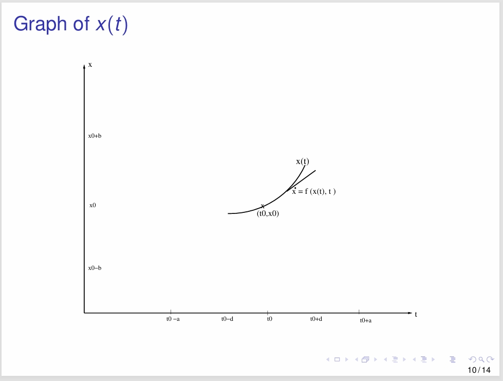

---
encrypt_content:
  level: Imperial
  password: Raymond#1234
  username: hg1523
level: Imperial
---

# Metric Space:

A metric space is a tuple (S,d) where Sis a non-empty set and d is a metric over S meaning:

- $\forall x,y\in S, d(x,y)\ge 0$
- $\forall x,y\in S, d(x,y)= 0\iff x = y$
- $\forall x,y\in S, d(x,y) = d(y,x)$
- $\forall x,y\in S, d(x,y) \le d(x,z) + d(x,y)$

## Examples:

$(\mathbb{R}^n,||\bullet||_1),(\mathbb{R}^n,||\bullet||_2),(\mathbb{R}^n,||\bullet||_{\infty}),$ and more generally $(\mathbb{R}^n,||\bullet||_p)$ for $0<p<\infty$ are some examples of metric spaces with $d(x,y) = ||x - y||$

## Exercise:

**If $C[a,b]$ is the space of continuous functions $f:[a,b]\to\mathbb{R}$, then $||f||_{\infty} := \sup_{x\in[a,b]}|f(x)|$ for $f\in C[a,b]$ is a norm on $C[a,b]$ and $(C[a,b],||\bullet||_{\infty})$ is a metric space**

- $||f||_{\infty} = \sup_{x\in[a,b]}|f(x)| \ge 0$
- if $f([a,b]) = 0$, then $\sup_{x\in[a,b]}|f(x)| = 0$, so a = 0 and b = 0
- $f([a,b]) = f([b,a]) = \sup [a,b]$
- $f([a,b]) + f([b,c]) = \sup[a,b,c] \ge \sup[a,c] = f(a,c)$

## Exercise:
**Generalise the notion of a convergent sequence on a metric space and that a continuous function between metric spaces**

(see below)

# Cauchy Sequences in metric space:

Let $(S,d)$ be a metric space and $(a_n)$ a sequence in S. Then $(a_n)$ is said to be a Cauchy sequence if

$$\forall \epsilon>0,\exists N\in\mathbb{N}\text{ s.t. }\forall m,n>N, d(a_n, a_m)\le \epsilon$$
(convergence is just making $a_m$ a constant $L$)
## Exercise:
**If (S,d) is a metric space and $(a_n)$ a convergent sequence in S then $(a_n)$ is a Cauchy sequence**

since the sequence is convergent so if the limit is L

$$d(a_n, L)\le \epsilon$$
and also $d(a_m, L)\le \epsilon$

for $\epsilon > 0$

actually, we can find $d(a_m,L)\le \frac{\epsilon}{2}$ and $d(a_n,L)\le\frac{\epsilon}{2}$

then $d(a_n, a_m)$ follows that $\epsilon \ge d(a_n, L) + d(a_m, L)\ge d(a_n, a_m)$

therefore 

$$\forall \epsilon>0,\exists N\in\mathbb{N}\text{ s.t. }\forall m,n>N, d(a_n, a_m)\le \epsilon$$
## abs
Consider $\mathbb{Q}$ the space of rational numbers with the metric d defined by the absolute value of the difference, then $(\mathbb{Q},d)$ is a metric space.

obviously, follow the four conditions

## Exercise:

Define $(x_n)$ inductively in $\mathbb{Q}$: let $x_1 = 1$ and put

$$x_{n+1}:=\frac{x_n}{2} + \frac{1}{x_n}$$
Then $(x_n)$ is a Cauchy sequence but not convergent in $\mathbb{Q}$

# Complete metric spaces

- A metric space is complete if every Cauchy sequence in the space is convergent
## Proposition:
$(R^n,||\bullet||_p)$ is complete for $0\le p\le \infty$

### Proof(outline):

Let $(x^k)_{k\in\mathbb{N}}$ be a Cauchy sequence 

then $(x_i^k)_{k\in\mathbb{N}}$ is a cauchy sequence for $1\le i\le n$.

Because $(\mathbb{R},||\bullet||)$ is complete, it follows that $(x^k_i)_{k\in\mathbb{N}}$ converges to some $x_i$. 

Then we have $x^k\to x$ with $x = (x_1,\dots, x_n)^T$

## Proposition (non-examinable)

The space $(C[a,b],||\bullet||_{\infty})$ is complete.

### Proof (outline). 

Let $(f_k)$ be Cauchy in $C[a,b]$. Then for each $x\in[a,b]$, the sequence $(f_k(x))$ is Cauchy in $\mathbb{R}$ and has a thus limit $f(x)$

Then we show that $f\in C[a,b]$ or it is continuous and finally prove that $f_k\to f$ ad $k\to\infty$

# Contracting maps on metric spaces

A map $f: X_1\to X_2$ of metric spaces $(X_1, d_1)$ and $(X_2, d_2)$ is contracting if there exists $0\le\alpha<1$ with $d_2(f(x),f(y))\le\alpha d_1(x,y)$ for all $x,y\in X_1$

The real number $\alpha$ is said to be a contracting factor for f

Thus a contracting map with contractiivity $\alpha$ contract distance by at least a factor $\alpha < 1$

## Exercise
**A contracting map is continuous**

consider $f(x)$ and $f(x +\Delta)$

then $d_2(f(x), f(x+\Delta))\le\alpha d_1(x, x+\Delta)$

if $\Delta\to 0$ $x +\Delta\to 0$

then $d_1(x,x+\Delta)\to 0$

and since $d_2(f(x),f(x +\Delta))\ge 0$

so $d_2(f(x),f(x+\Delta))\to 0$

therefore $\lim_{\Delta\to 0}f(x+\Delta)\to f(x)$ since $d_2(a,b) = 0\iff a = b$

and since we can get $d_2(f(x), f(x+\Delta))$

so $f(x)$ exists, therefore $f(x)$ is continuous

## Example:
Suppose $f:\mathbb{R}\to\mathbb{R}$ is a differentiable map with $|f'(x)|\le\alpha<1$ for all $x\in\mathbb{R}$, where $0\le \alpha<1$ is a constant

then by the Mean value theorem, for each pair $x,y\in\mathbb{R}$, with $x<y$, there exists a point z with $x<z<y$ such that

$$\frac{f(y) - f(x)}{y-x} = f'(z)$$
and thus $|f(y) - f(x)| = |f(z)||y-x|\le \alpha|y-x|$

therefore f is contracting with a contractivity factor $\alpha$

#  Banach fixed poitn theorem
## Theorem:

A contracting map $f: X\to X$ on a complete metric space X has a unique fixed point given by $\lim_{k\to\infty}f^k(x_0)$

## Existence

Suppose $\alpha$ is a contracting factor for f.

We have for $k\in\mathbb{N}$: $d(x_{k+1},x_k) = d(f(x_k),f(x_{k-1}))\le\alpha d(x_k,x_{k-1})\le\dots\le \alpha^kd(x_1, x_0)$ with $x_{k+1}:=f(x_k), k\in\mathbb{N}$

which means using a specially defined contracting map we can eventually convert all metrics to a fixed point

Now for $m>n$: $d(x_m, x_n)<\sum_{k=n}^{m-1}d(x_{k+1},x_k)\le\sum_{k=n}^{m-1}\alpha^k d(x_1,x_0)$

So for $\epsilon>0$ if we take $N$ large enough, for $m,n>N$ we have $d(x_m,x_n)<\epsilon$

So $(x_n)$ is a Cauchy sequence and, thus $x_n\to x^*$ say,

Since f is continuous (see the exercise above)

$\lim_{n\to\infty}f(x_n) = f(\lim_{n\to\infty}x_n)$

But $f(\lim_{n\to\infty}x_n) =f(x^*)$ and $\lim_{n\to\infty}f(x_n) = \lim_{n\to\infty}x_{n+1} = x^*$

So $f(x^*) = x^*$ and $f$ has a fixed point

## Second proof and uniqueness:

Second proof of existence (outline)

Take any $x_0\in X$. We find $R>0$ such that all points in the disc $D_R(x_0)$ with center $x_0$ and radius $R$ are mapped to this disk

Let $x\in D_R(x_0)$ then by triangular inequality: 

$$\begin{aligned}&d(x_0,f(x)) \\
\le& d(x_0,f(x_0))+d(f(x_0),f(x)) & \text{triangular inequality}\\
\le& d(x_0,f(x_0))+\alpha d(x_0,x) & \text{contracting map}\\\le& d(x_0,f(x_0)) +\alpha R &x\text{ in on the disk}\\\le &R &\text{if }R \ge R_0 = \frac{d(x_0, f(x_0))}{(1-\alpha)}
\end{aligned}$$

So $D_{R_0}(x_0)$ is mapped into itself with the diameter of the image contracted by $\alpha$

Diameter of $f^n[D_{R_0}(x_0)]$ is at most $2\alpha^nR_0\to 0$ as $n\to\infty$.

therefore $x_0, f(x_0), f^2(x_0),\dots, f^n(x_0),\dots$ is a Cauchy sequence and thus converges to a fixed point of $f$

### Uniqueness:

Let $p_1, p_2\in X$ be two fixed points of f, then:

$$d(p_1,p_2) = d(f(p_1),f(p_2))$$
Since $0<\alpha< 1$ we obtain: $d(p_1,p_2) = 0$ i.e. $p_1 = p_2$

## Application Newton's method:

### Theorem:

Suppose $f\in C[a,b]$ has a continuous second derivative and a root $f(p) = 0$ with $p\in[a,b]$ with $f'(p)\neq 0$

Then there exists $\delta > 0$ such that for $p_0\in(p-\delta, p+\delta)$, we have $g^k(p_0)\to p$ as $k\to\infty$ where $g(x) = \frac{x-f(x)}{f'(x)}$

### Proof: 

We have 

$$g'(x) = 1 - \frac{(f'(x))^2 - f(x)f''(x)}{f'(x)^2} = \frac{f(x)f''(x)}{(f'(x))^2}$$

$f(p) = 0\Rightarrow g'(p) = 0$, so by continuity of $g'$ there exists $\delta > 0$ such that $|g'(x)|<\alpha$ for some $\alpha < 1$ for $x\in(p-\delta, p+\delta)$

By Banach theorem $g^k(p_0)\to p$ for $p_0\in(p-\delta,p+\delta)$

## Another application of the Banach Theorem (Non-examiable)

A celebrated theorem on existence and uniqueness of solutions of differential equation (initial value problem)

Suppose $f:(x_0-b, x_0 +b)\times (t_0-a,t_0+a)\to\mathbb{R}$ with $x-0, t_0\in\mathbb{R}$ and $a,b > 0$ is continuous and there exists $c > 0$ with $|f(x_1,t) - f(x_2,t)|\le c|x_1 - x_2|$ for $x_1, x_2\in[x_0-b,x_0+b]$ and $t\in(t_0 - a, t_0+a)$

Then the differential equation

$$\begin{cases}\begin{aligned}
\frac{dx}{dt} = d(t) \quad&= &f(x,t)\\
x(t_0) \quad&=&x_0\\
\end{aligned}\end{cases}$$

has a unique solution: there exists a unique function

$x:(t_0-d,t_0+d)\to\mathbb{R}$ satisfying

$$\frac{dx}{dt} = f(x(t),t)\text{ with }x(t_0) = x_0$$

where $d = \min\Big(a, \frac{b}{B + (bc)}\Big)$ with 

$B = \sup\{|f(x,t)|: |x - x_0|<b,|t-t_0|<a\}>0$

### Proof (outline)

We find $d>0$ and define a functional $T_f: C[t_0 - d, t_0 + d]\to C[t_0-d, t_0 + d]$ as follows.

For $x\in C[t_0-d,t_0+s]$ i.e. $x: [t_0-d, t_0 + d]\to \mathbb{R}$ define:

$$(T_f(x))(t) = x_0 + \int_{t_0}^tf(x(s),s)ds$$

Ensure $(T_f(x))(t)\in(x_0-b,x_0+b)$ by estimating:

$$|T_f(x(t)) - x_0| = |\int_{0}^tf(x(s),s)ds|\le d\sup_{x,t}|f(x,t)| = dB<b$$

if $d<\frac{b}{B}$. So take $d:=\min(a,\frac{b}{B + bc})$

then we check if $T_f$ is contracting:

$||T_f(x) - T_f(y)||_{\infty}\le\int_0^t\sup|f(x(s),s)-f(y(s),s)|ds \le cd||x-y||_{\infty}$
where $cd \le \frac{bc}{(B + bc)}<1$

Thus by Banach fixed point theorem, $T_f$ has unique fixed point $x\in C[t_0-d,t_0+d]$, i.e.

$$x(t) = (T_f(x))(t) = x_0 + \int_{t_0}^tf(x(s),s)ds$$

Differentiating both sides with respect to t, we obtain:

$$x(t) = f(x(t),t)$$

since the derivative of the integral is equal to the integrand

Thus x is the unique solution of the initial value problem (1)

### Extension to higher orders:

- The proof can be extended to the case where x is vector function of type $x:R\to\mathbb{R}$ where $R\subseteq \mathbb{R}^n$ is a hyper-rectangle in $\mathbb{R}^n$ and $f: R\times (t_0 - a, t_0+a)\to\mathbb{R}^n$ is a vector functions.
- Then we obtain the existence and uniqueness of solutions of differential equations of higher order such as
$$\frac{d^2x}{dt^2}+f(x,t)\frac{dx}{dt} + g(x,t) = 0$$

which can be written as $x_1 = x$ and $x_2 = \frac{dx_1}{dt}$ with $\frac{dx_2}{dt} = -f(x,t)-g(x,t)$ In other words

$$\frac{d}{dt}\Big(\begin{matrix}x_1\\x_2\end{matrix}\Big) = \Big(\begin{matrix}x_2\\-f(x_1, t) - g(x_1, t)\end{matrix}\Big)$$

