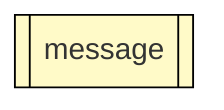
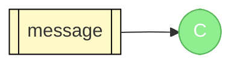
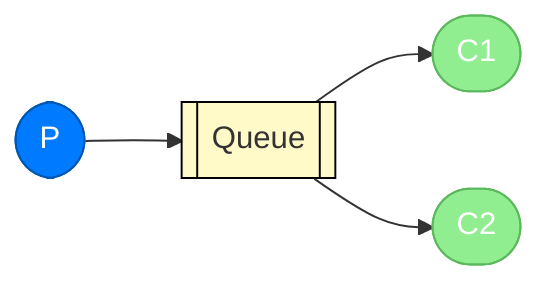
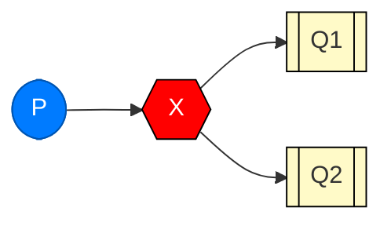
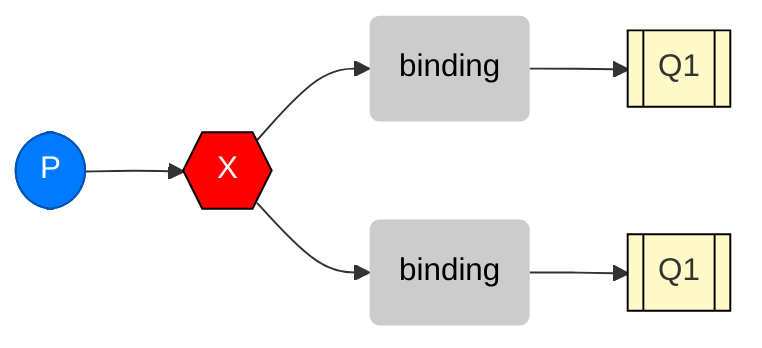
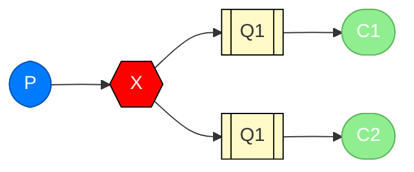
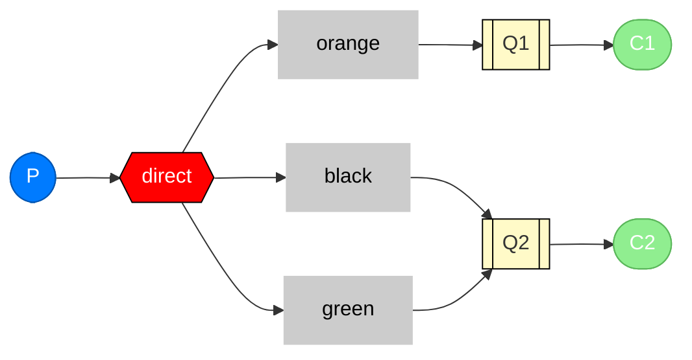
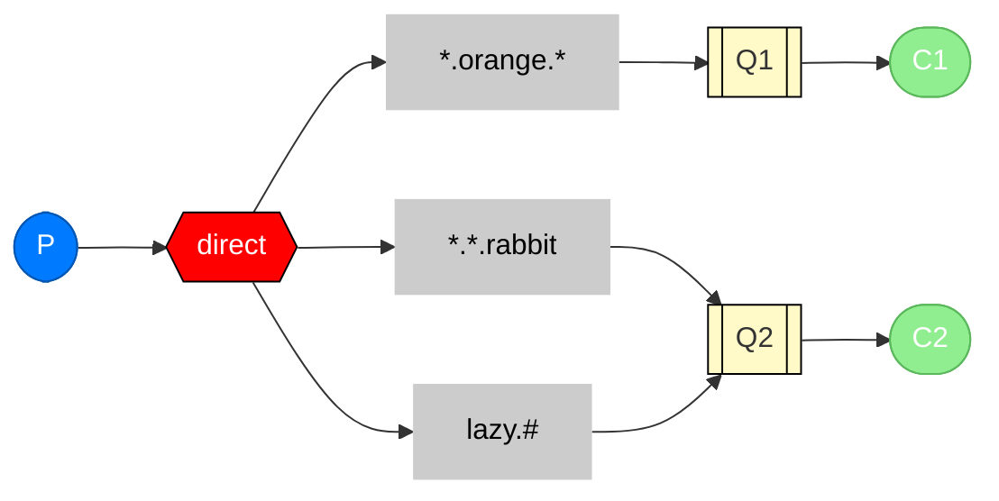

(只关注java及spring相关的内容,别的不管)

# Hello world
rabbitmq使用AMQP协议
## 图例:

- producer: 发送一个消息

- consumer:接受一个消息

- queue:


## application.yml:

```yaml
// application.yml

spring:  
	profiles:  
		active: usage_message  
  
logging:  
	level:  
		org: ERROR  
  
tutorial:  
	client:  
		duration: 10000
```


## config
```java
// Tut1Config.java
package com.rabbitmq.tut1.config;

import org.springframework.amqp.core.Queue;
import org.springframework.context.annotation.Bean;
import org.springframework.context.annotation.Configuration;
import org.springframework.context.annotation.Profile;

@Profile({"tut1","hello-world"})
@Configuration
public class Tut1Config {

    @Bean
    // registers a queue to be a bean
    public Queue hello() {
        return new Queue("hello");
    }

    @Profile("receiver")
    @Bean
    // registers a receiver and enforce it to only run under receiver env
    public Tut1Receiver receiver() {
        return new Tut1Receiver();
    }

    @Profile("sender")
    @Bean
    // registers a sender and enforce it to only run under sender env
    public Tut1Sender sender() {
        return new Tut1Sender();
    }
}
```

为了控制运行环境,使用以下主程序:

```java
import org.springframework.boot.CommandLineRunner;
import org.springframework.boot.SpringApplication;
import org.springframework.boot.autoconfigure.SpringBootApplication;
import org.springframework.context.annotation.Bean;
import org.springframework.context.annotation.Profile;
import org.springframework.scheduling.annotation.EnableScheduling;

@SpringBootApplication
@EnableScheduling
public class RabbitAmqpTutorialsApplication {

    @Profile("usage_message")
    @Bean
    // 仅仅作为命令行的帮助说明
    public CommandLineRunner usage() {
        return args -> {
            System.out.println("This app uses Spring Profiles to
                control its behavior.\n");
            System.out.println("Sample usage: java -jar
                rabbit-tutorials.jar
                --spring.profiles.active=hello-world,sender");
        };
    }

    @Profile("!usage_message")
    @Bean
    // 命令行跑tutuorial,或按照设定的时长结束
    public CommandLineRunner tutorial() {
        return new RabbitAmqpTutorialsRunner();
    }

	// 会永久的跑下去
    public static void main(String[] args) throws Exception {
        SpringApplication.run(RabbitAmqpTutorialsApplication.class, args);
    }
}
```

如果要制定运行profile和运行身份,同时把两个环境写入spring.profiles.active

以及运行Runner

```java
package org.springframework.amqp.tutorials.tut1;

import org.springframework.beans.factory.annotation.Autowired;
import org.springframework.beans.factory.annotation.Value;
import org.springframework.boot.CommandLineRunner;
import org.springframework.context.ConfigurableApplicationContext;

public class RabbitAmqpTutorialsRunner implements CommandLineRunner {

    @Value("${tutorial.client.duration:0}")
    private int duration;

    @Autowired
    // 用来关掉程序
    private ConfigurableApplicationContext ctx;

    @Override
    public void run(String... arg0) throws Exception {
        System.out.println("Ready ... running for " + duration + "ms");
        Thread.sleep(duration);
        ctx.close();
    }
}
```


## 发送:

```java
// Sender
package org.springframework.amqp.tutorials.tut1;

import org.springframework.amqp.core.Queue;
import org.springframework.amqp.rabbit.core.RabbitTemplate;
import org.springframework.beans.factory.annotation.Autowired;
import org.springframework.scheduling.annotation.Scheduled;

public class Tut1Sender {

    @Autowired
    // main class to help send the messages to rabbitmq
    private RabbitTemplate template;

    @Autowired
    private Queue queue;

    @Scheduled(fixedDelay = 1000, initialDelay = 500)
    // 初始等待500ms,然后没1s执行一次
    public void send() {
        String message = "Hello World!";
        this.template.convertAndSend(queue.getName(), message);
        System.out.println(" [x] Sent '" + message + "'");
    }
}
```

## 接收:

```java
package org.springframework.amqp.tutorials.tut1;

import org.springframework.amqp.rabbit.annotation.RabbitHandler;
import org.springframework.amqp.rabbit.annotation.RabbitListener;

// 接收队列hello的消息
@RabbitListener(queues = "hello")
public class Tut1Receiver {

	// 注册方法
    @RabbitHandler
    public void receive(String in) {
        System.out.println(" [x] Received '" + in + "'");
    }
}
```

## 运行:
- 打包: ./mvnw clean package
- consumer: java -jar target/rabbitmq-tutorials.jar --spring.profiles.active=hello-world,receiver
- sender: java -jar target/rabbitmq-tutorials.jar --spring.profiles.active=hello-world,sender
注: 这个程序只发送或接收一次,所以逻辑上会和实际有很大区别

# 创建队列:

## config:
这次在tut2环境下

```java
import org.springframework.amqp.core.Queue;
import org.springframework.context.annotation.Bean;
import org.springframework.context.annotation.Configuration;
import org.springframework.context.annotation.Profile;

@Profile({"tut2", "work-queues"})
@Configuration
public class Tut2Config {

    @Bean
    public Queue hello() {
        return new Queue("hello");
    }

    @Profile("receiver")
    private static class ReceiverConfig {

        @Bean
        public Tut2Receiver receiver1() {
            return new Tut2Receiver(1);
        }

        @Bean
        public Tut2Receiver receiver2() {
            return new Tut2Receiver(2);
        }
    }

    @Profile("sender")
    @Bean
    public Tut2Sender sender() {
        return new Tut2Sender();
    }
}
```

## 发送:
```java
package org.springframework.amqp.tutorials.tut2;

import org.springframework.amqp.core.Queue;
import org.springframework.amqp.rabbit.core.RabbitTemplate;
import org.springframework.beans.factory.annotation.Autowired;
import org.springframework.scheduling.annotation.Scheduled;
import java.util.concurrent.atomic.AtomicInteger;

public class Tut2Sender {

	@Autowired
	private RabbitTemplate template;

	@Autowired
	private Queue queue;

	// thread safe ints
	AtomicInteger dots = new AtomicInteger(0);

	AtomicInteger count = new AtomicInteger(0);

	@Scheduled(fixedDelay = 1000, initialDelay = 500)
	public void send() {
		StringBuilder builder = new StringBuilder("Hello");
		if (dots.incrementAndGet() == 4) {
			dots.set(1);
		}
		for (int i = 0; i < dots.get(); i++) {
			builder.append('.');
		}
		builder.append(count.incrementAndGet());
		String message = builder.toString();
		template.convertAndSend(queue.getName(), message);
		System.out.println(" [x] Sent '" + message + "'");
	}
}
```

## 接收:
```java
package com.rabbitmq.tut2.receiver;

import org.springframework.amqp.rabbit.annotation.RabbitHandler;
import org.springframework.amqp.rabbit.annotation.RabbitListener;
import org.springframework.util.StopWatch;

@RabbitListener(queues = "hello")
public class Tut2Receiver {

	private final int instance;

    public Tut2Receiver(int i) {
        this.instance = i;
    }

    @RabbitHandler
    public void receive(String in) throws InterruptedException {
        StopWatch watch = new StopWatch();
        watch.start();
        System.out.println("instance " + this.instance +
            " [x] Received '" + in + "'");
        doWork(in);
        watch.stop();
        System.out.println("instance " + this.instance +
            " [x] Done in " + watch.getTotalTimeSeconds() + "s");
    }

	// simulate doing some work that takes 500ms
    private void doWork(String in) throws InterruptedException {
        for (char ch : in.toCharArray()) {
            if (ch == '.') {
                Thread.sleep(500);
            }
        }
    }
}
```

## 确认消息:
可以使用channel人为接收消息

channel是一个被注入的变量

可以使用basicReject和basicAck去实现人为的确认或者驳回信息

## 消息分发:
正常来说是rr类型,每个接收方轮一遍,但是某些情况由于多线程的不确定性所以顺序可能会变,而且rabbitmq无法了解到接收方的状态

所以可以用fair dispatch, 每个用户有一个prefetch数量,表示同时可以有多少个没处理的消息,prefetch等于1就是rr,默认值250,通过`AbstractMessageListenerContainer.setPrefetchCount(int prefetchCount)`.设置

# pub-sub

引入一个新的组件: exchange


exchange 可以分成几种: direct, topic, headers, fanout, 这个教程只关注最后一个,其他的之后补

## config

```java
import org.springframework.amqp.core.*;
import org.springframework.context.annotation.Bean;
import org.springframework.context.annotation.Configuration;
import org.springframework.context.annotation.Profile;


@Profile({"tut3", "pub-sub", "publish-subscribe"})
@Configuration
public class Tut3Config {

	// 会之后定义
	@Bean
	public FanoutExchange fanout() {
		return new FanoutExchange("tut.fanout");
	}

	@Profile("receiver")
	private static class ReceiverConfig {

		@Bean
		public Queue autoDeleteQueue1() {
			return new AnonymousQueue();
		}

		@Bean
		public Queue autoDeleteQueue2() {
			return new AnonymousQueue();
		}

		@Bean
		public Binding binding1(FanoutExchange fanout,
		    Queue autoDeleteQueue1) {
			return BindingBuilder.bind(autoDeleteQueue1).to(fanout);
		}

		@Bean
		public Binding binding2(FanoutExchange fanout,
		    Queue autoDeleteQueue2) {
			return BindingBuilder.bind(autoDeleteQueue2).to(fanout);
		}

		@Bean
		public Tut3Receiver receiver() {
			return new Tut3Receiver();
		}
	}

	@Profile("sender")
	@Bean
	public Tut3Sender sender() {
		return new Tut3Sender();
	}
}
```

我们一共新创建了3个profile,tut3,pub-sub, publish-subscribe

The fanout exchange is very simple. As you can probably guess from the name, it just broadcasts all the messages it receives to all the queues it knows. And that's exactly what we need for fanning out our messages.

于是现在可以发送到exchange而不是用户

```java
@Autowired
private RabbitTemplate template;

@Autowired
private FanoutExchange fanout;   // configured in Tut3Config above

template.convertAndSend(fanout.getName(), "", message);
```

### 临时队列:

我们需要监听所有的消息或者说见天所有的队列,所以像之前那个样子给队列加一个名字的方式这里就不适用了

我们可以选用AnonymousQueue, 服务器端会自动给队列一个编号,类似`spring.gen-1Rx9HOqvTAaHeeZrQWu8Pg`.

```java
@Bean
public Queue autoDeleteQueue1() {
	return new AnonymousQueue();
}

@Bean
public Queue autoDeleteQueue2() {
	return new AnonymousQueue();
}
```

### bindings:

我们需要告诉exchange发消息到哪个队列



```java
@Bean
public Binding binding1(FanoutExchange fanout,
        Queue autoDeleteQueue1) {
	return BindingBuilder.bind(autoDeleteQueue1).to(fanout);
}
```

## 整合




```java
package org.springframework.amqp.tutorials.tut3;

import org.springframework.amqp.core.FanoutExchange;
import org.springframework.amqp.rabbit.core.RabbitTemplate;
import org.springframework.beans.factory.annotation.Autowired;
import org.springframework.scheduling.annotation.Scheduled;
import java.util.concurrent.atomic.AtomicInteger;

public class Tut3Sender {

	@Autowired
	private RabbitTemplate template;

	@Autowired
	private FanoutExchange fanout;

	AtomicInteger dots = new AtomicInteger(0);

	AtomicInteger count = new AtomicInteger(0);

	@Scheduled(fixedDelay = 1000, initialDelay = 500)
	public void send() {
		StringBuilder builder = new StringBuilder("Hello");
		if (dots.getAndIncrement() == 3) {
			dots.set(1);
		}
		for (int i = 0; i < dots.get(); i++) {
			builder.append('.');
		}
		builder.append(count.incrementAndGet());
		String message = builder.toString();
		template.convertAndSend(fanout.getName(), "", message);
		System.out.println(" [x] Sent '" + message + "'");
	}

}
```

# 路由:
之前是

```java
@Bean
public Binding binding1(FanoutExchange fanout,
    Queue autoDeleteQueue1) {
    return BindingBuilder.bind(autoDeleteQueue1).to(fanout);
}
```

现在加上一个额外的key

```java
@Bean
public Binding binding1a(DirectExchange direct,
    Queue autoDeleteQueue1) {
    return BindingBuilder.bind(autoDeleteQueue1)
        .to(direct)
        .with("orange");
}
```

fanout只会broadcast,但是direct就只会听对应队列的消息


这样的话发送到orange的会自动会发送到Q1, black和green的到Q2

注意,可以给多个队列绑定相同的key,这个时候他会发送到所有和这个相连的队列

## config
```java
import org.springframework.amqp.core.AnonymousQueue;
import org.springframework.amqp.core.Binding;
import org.springframework.amqp.core.BindingBuilder;
import org.springframework.amqp.core.DirectExchange;
import org.springframework.amqp.core.Queue;
import org.springframework.context.annotation.Bean;
import org.springframework.context.annotation.Configuration;
import org.springframework.context.annotation.Profile;

@Profile({"tut4","routing"})
@Configuration
public class Tut4Config {

	@Bean
	public DirectExchange direct() {
		return new DirectExchange("tut.direct");
	}

	@Profile("receiver")
	private static class ReceiverConfig {

		@Bean
		public Queue autoDeleteQueue1() {
			return new AnonymousQueue();
		}

		@Bean
		public Queue autoDeleteQueue2() {
			return new AnonymousQueue();
		}

		@Bean
		public Binding binding1a(DirectExchange direct, Queue autoDeleteQueue1) {
			return BindingBuilder.bind(autoDeleteQueue1).to(direct).with("orange");
		}

		@Bean
		public Binding binding1b(DirectExchange direct, Queue autoDeleteQueue1) {
			return BindingBuilder.bind(autoDeleteQueue1).to(direct).with("black");
		}

		@Bean
		public Binding binding2a(DirectExchange direct, Queue autoDeleteQueue2) {
			return BindingBuilder.bind(autoDeleteQueue2).to(direct).with("green");
		}

		@Bean
		public Binding binding2b(DirectExchange direct, Queue autoDeleteQueue2) {
			return BindingBuilder.bind(autoDeleteQueue2).to(direct).with("black");
		}

		@Bean
		public Tut4Receiver receiver() {
	 	 	return new Tut4Receiver();
		}

	}

	@Profile("sender")
	@Bean
	public Tut4Sender sender() {
		return new Tut4Sender();
	}

}
```

# Topic:
不仅通过路由key去监听消息,同时通过消息源监听

送往topic的消息key不能任意选,必须是点分割的词组,像java的包那个样子,上限255字节

原理和direct差不多,但是可以使用两种通配符
-  * 匹配一个单词
-  # 匹配0+单词

例:



## config:

```java
import org.springframework.amqp.core.*;
import org.springframework.context.annotation.Bean;
import org.springframework.context.annotation.Configuration;
import org.springframework.context.annotation.Profile;

@Profile({"tut5","topics"})
@Configuration
public class Tut5Config {

	@Bean
	public TopicExchange topic() {
		return new TopicExchange("tut.topic");
	}

	@Profile("receiver")
	private static class ReceiverConfig {

		@Bean
		public Tut5Receiver receiver() {
	 	 	return new Tut5Receiver();
		}

		@Bean
		public Queue autoDeleteQueue1() {
			return new AnonymousQueue();
		}

		@Bean
		public Queue autoDeleteQueue2() {
			return new AnonymousQueue();
		}

		@Bean
		public Binding binding1a(TopicExchange topic,
		    Queue autoDeleteQueue1) {
			return BindingBuilder.bind(autoDeleteQueue1)
			    .to(topic)
			    .with("*.orange.*");
		}

		@Bean
		public Binding binding1b(TopicExchange topic,
		    Queue autoDeleteQueue1) {
			return BindingBuilder.bind(autoDeleteQueue1)
			    .to(topic)
			    .with("*.*.rabbit");
		}

		@Bean
		public Binding binding2a(TopicExchange topic,
		    Queue autoDeleteQueue2) {
			return BindingBuilder.bind(autoDeleteQueue2)
			    .to(topic)
			    .with("lazy.#");
		}

	}

	@Profile("sender")
	@Bean
	public Tut5Sender sender() {
		return new Tut5Sender();
	}

}
```

剩下的一样

# RPC

我们需要在发完消息之后执行某种神秘函数,函数执行需要时间,于是有了rpc

假设有这么个东西

```java
Integer response = (Integer) template.convertSendAndReceive
    (exchange.getName(), "rpc", start++);
System.out.println(" [.] Got '" + response + "'");
```

Bearing that in mind, consider the following advice:

- Make sure it's obvious which function call is local and which is remote.
- Document your system. Make the dependencies between components clear.
- Handle error cases. How should the client react when the RPC server is down for a long time?

When in doubt avoid RPC. If you can, you should use an asynchronous pipeline - instead of RPC-like blocking, results are asynchronously pushed to a next computation stage.

## Callback queue

客户端发送请求,服务端返回回复,可以用RabbitTemplate的自带函数

回复带有correlation id以确认回复的是那个请求

client -> rpc -> server -> queue -> reply

